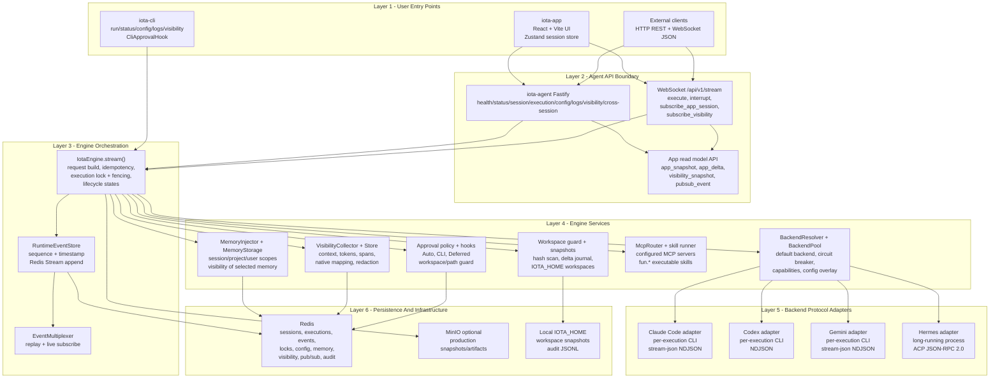

# Layered Architecture

Source paths: `iota-app/src`, `iota-agent/src`, `iota-cli/src`, `iota-engine/src`.

```mermaid
flowchart TB
  subgraph L1["Layer 1 - User Entry Points"]
    App["iota-app<br/>React + Vite UI<br/>Zustand session store"]
    CLI["iota-cli<br/>run/status/config/logs/visibility<br/>CliApprovalHook"]
    Client["External clients<br/>HTTP REST + WebSocket JSON"]
  end

  subgraph L2["Layer 2 - Agent API Boundary"]
    Agent["iota-agent Fastify<br/>health/status/session/execution/config/logs/visibility/cross-session"]
    WS["WebSocket /api/v1/stream<br/>execute, interrupt,<br/>subscribe_app_session,<br/>subscribe_visibility"]
    AppModel["App read model API<br/>app_snapshot, app_delta,<br/>visibility_snapshot, pubsub_event"]
  end

  subgraph L3["Layer 3 - Engine Orchestration"]
    Engine["IotaEngine.stream()<br/>request build, idempotency,<br/>execution lock + fencing,<br/>lifecycle states"]
    EventStore["RuntimeEventStore<br/>sequence + timestamp<br/>Redis Stream append"]
    Mux["EventMultiplexer<br/>replay + live subscribe"]
  end

  subgraph L4["Layer 4 - Engine Services"]
    Resolver["BackendResolver + BackendPool<br/>default backend, circuit breaker,<br/>capabilities, config overlay"]
    Memory["MemoryInjector + MemoryStorage<br/>session/project/user scopes<br/>visibility of selected memory"]
    Approval["Approval policy + hooks<br/>Auto, CLI, Deferred<br/>workspace/path guard"]
    Visibility["VisibilityCollector + Store<br/>context, tokens, spans,<br/>native mapping, redaction"]
    MCP["McpRouter + skill runner<br/>configured MCP servers<br/>fun.* executable skills"]
    Workspace["Workspace guard + snapshots<br/>hash scan, delta journal,<br/>IOTA_HOME workspaces"]
  end

  subgraph L5["Layer 5 - Backend Protocol Adapters"]
    Claude["Claude Code adapter<br/>per-execution CLI<br/>stream-json NDJSON"]
    Codex["Codex adapter<br/>per-execution CLI<br/>NDJSON"]
    Gemini["Gemini adapter<br/>per-execution CLI<br/>stream-json NDJSON"]
    Hermes["Hermes adapter<br/>long-running process<br/>ACP JSON-RPC 2.0"]
  end

  subgraph L6["Layer 6 - Persistence And Infrastructure"]
    Redis["Redis<br/>sessions, executions, events,<br/>locks, config, memory,<br/>visibility, pub/sub, audit"]
    MinIO["MinIO optional<br/>production snapshots/artifacts"]
    Local["Local IOTA_HOME<br/>workspace snapshots<br/>audit JSONL"]
  end

  App --> Agent
  App --> WS
  Client --> Agent
  Client --> WS
  CLI --> Engine
  Agent --> Engine
  WS --> Engine
  Agent --> AppModel
  WS --> AppModel
  Engine --> EventStore --> Mux
  Engine --> Resolver
  Engine --> Memory
  Engine --> Approval
  Engine --> Visibility
  Engine --> MCP
  Engine --> Workspace
  Resolver --> Claude
  Resolver --> Codex
  Resolver --> Gemini
  Resolver --> Hermes
  EventStore --> Redis
  Memory --> Redis
  Visibility --> Redis
  Approval --> Redis
  Workspace --> Local
  Engine --> MinIO
```
