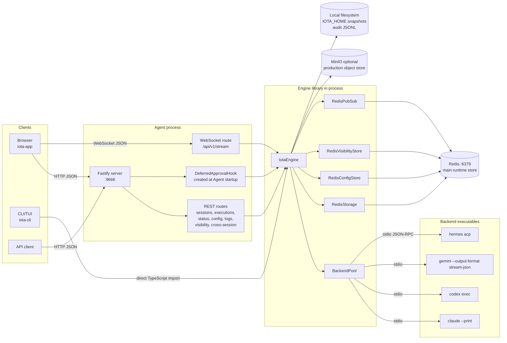

# System Topology

Source paths: `iota-agent/src/index.ts`, `iota-cli/src/commands/run.ts`, `iota-engine/src/engine.ts`.

```mermaid
flowchart LR
  subgraph Clients["Clients"]
    Browser["Browser<br/>iota-app"]
    CLI["CLI/TUI<br/>iota-cli"]
    APIClient["API client"]
  end

  subgraph AgentProc["Agent process"]
    Fastify["Fastify server<br/>:9666"]
    Rest["REST routes<br/>sessions, executions,<br/>status, config, logs,<br/>visibility, cross-session"]
    WsRoute["WebSocket route<br/>/api/v1/stream"]
    Deferred["DeferredApprovalHook<br/>created at Agent startup"]
  end

  subgraph EngineLib["Engine library in process"]
    Engine["IotaEngine"]
    Pool["BackendPool"]
    Store["RedisStorage"]
    Config["RedisConfigStore"]
    Vis["RedisVisibilityStore"]
    PubSub["RedisPubSub"]
  end

  subgraph Backends["Backend executables"]
    Claude["claude --print"]
    Codex["codex exec"]
    Gemini["gemini --output-format stream-json"]
    Hermes["hermes acp"]
  end

  Redis[("Redis :6379<br/>main runtime store")]
  MinIO[("MinIO optional<br/>production object store")]
  Local[("Local filesystem<br/>IOTA_HOME snapshots<br/>audit JSONL")]

  Browser -->|HTTP JSON| Fastify
  Browser -->|WebSocket JSON| WsRoute
  APIClient -->|HTTP JSON| Fastify
  CLI -->|direct TypeScript import| Engine
  Fastify --> Rest --> Engine
  WsRoute --> Engine
  Fastify --> Deferred
  Deferred --> Engine
  Engine --> Pool
  Engine --> Store
  Engine --> Config
  Engine --> Vis
  Engine --> PubSub
  Pool -->|stdio| Claude
  Pool -->|stdio| Codex
  Pool -->|stdio| Gemini
  Pool -->|stdio JSON-RPC| Hermes
  Store --> Redis
  Config --> Redis
  Vis --> Redis
  PubSub --> Redis
  Engine --> MinIO
  Engine --> Local
```
