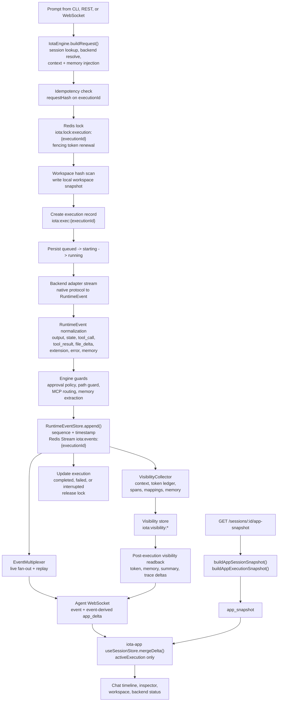

# Execution And Read Model Flow

Source paths: `iota-engine/src/engine.ts`, `iota-agent/src/routes/websocket.ts`, `iota-engine/src/visibility/app-read-model.ts`, `iota-app/src/store/useSessionStore.ts`.

