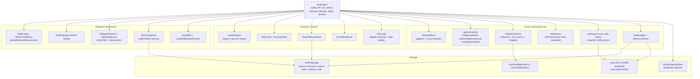

# Engine Internals

Source path: `iota-engine/src`.

```mermaid
flowchart TB
  Engine["IotaEngine<br/>public API: init, stream,<br/>execute, interrupt, status, destroy"]

  subgraph Request["Request Construction"]
    ConfigLoad["loadConfig + RedisConfigStore<br/>global/backend/session/user"]
    Session["RedisStorage session lookup"]
    Context["DialogueMemory + WorkingMemory<br/>active files + conversation"]
    MemoryInject["MemoryInjector<br/>unified Redis memory"]
    SkillPrompt["loadSkills + buildSkillSystemPrompt"]
  end

  subgraph Execution["Execution Control"]
    Idem["hashRequest<br/>replay or join live stream"]
    Lock["Redis lock + fencing token"]
    EventStore["RuntimeEventStore"]
    Mux["EventMultiplexer"]
    Interrupt["interrupt()<br/>adapter interrupt + state update"]
  end

  subgraph Services["Cross-Cutting Services"]
    Pool["BackendPool<br/>adapters + circuit breakers"]
    Approval["approval policy<br/>CliApprovalHook, DeferredApprovalHook,<br/>AutoApprovalHook"]
    Visibility["VisibilityCollector<br/>redaction + trace spans + mapping"]
    MCP["McpRouter<br/>MCP tool proxy when supported"]
    Workspace["workspace scan, path guard,<br/>snapshot, delta journal"]
    Audit["AuditLogger + MetricsCollector"]
  end

  subgraph Storage["Storage"]
    Redis["RedisStorage<br/>session, execution, events,<br/>locks, memory, audit"]
    VisStore["RedisVisibilityStore or LocalVisibilityStore"]
    MinIO["MinioSnapshotStore<br/>production optional"]
    Local["Local IOTA_HOME snapshots<br/>local audit JSONL"]
  end

  Engine --> ConfigLoad
  Engine --> Session
  Engine --> Context
  Engine --> MemoryInject
  Engine --> SkillPrompt
  Engine --> Idem
  Engine --> Lock
  Engine --> EventStore
  Engine --> Mux
  Engine --> Interrupt
  Engine --> Pool
  Engine --> Approval
  Engine --> Visibility
  Engine --> MCP
  Engine --> Workspace
  Engine --> Audit
  EventStore --> Redis
  MemoryInject --> Redis
  Visibility --> VisStore
  Workspace --> Local
  Audit --> Redis
  Audit --> Local
  Engine --> MinIO
```
