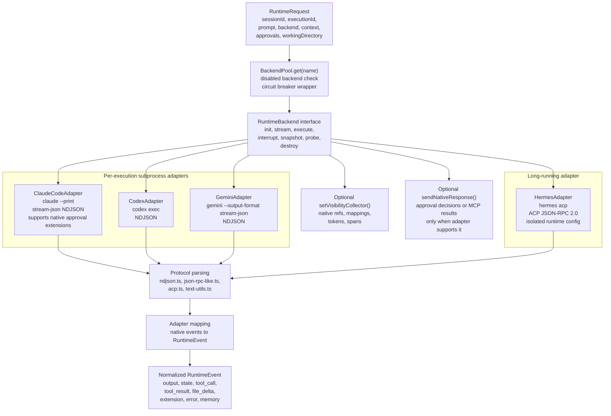

# Backend Adapters

Source paths: `iota-engine/src/backend/*.ts`, `iota-engine/src/backend/interface.ts`.

```mermaid
flowchart TB
  Request["RuntimeRequest<br/>sessionId, executionId,<br/>prompt, backend, context,<br/>approvals, workingDirectory"]
  Pool["BackendPool.get(name)<br/>disabled backend check<br/>circuit breaker wrapper"]
  Interface["RuntimeBackend interface<br/>init, stream, execute,<br/>interrupt, snapshot, probe,<br/>destroy"]

  subgraph PerExec["Per-execution subprocess adapters"]
    Claude["ClaudeCodeAdapter<br/>claude --print<br/>stream-json NDJSON<br/>supports native approval extensions"]
    Codex["CodexAdapter<br/>codex exec<br/>NDJSON"]
    Gemini["GeminiAdapter<br/>gemini --output-format stream-json<br/>NDJSON"]
  end

  subgraph LongRun["Long-running adapter"]
    Hermes["HermesAdapter<br/>hermes acp<br/>ACP JSON-RPC 2.0<br/>isolated runtime config"]
  end

  Parser["Protocol parsing<br/>ndjson.ts, json-rpc-like.ts,<br/>acp.ts, text-utils.ts"]
  Map["Adapter mapping<br/>native events to RuntimeEvent"]
  RuntimeEvents["Normalized RuntimeEvent<br/>output, state, tool_call,<br/>tool_result, file_delta,<br/>extension, error, memory"]
  Visibility["Optional setVisibilityCollector()<br/>native refs, mappings,<br/>tokens, spans"]
  NativeResponse["Optional sendNativeResponse()<br/>approval decisions or MCP results<br/>only when adapter supports it"]

  Request --> Pool --> Interface
  Interface --> Claude
  Interface --> Codex
  Interface --> Gemini
  Interface --> Hermes
  Claude --> Parser
  Codex --> Parser
  Gemini --> Parser
  Hermes --> Parser
  Parser --> Map --> RuntimeEvents
  Interface --> Visibility
  Interface --> NativeResponse
```
