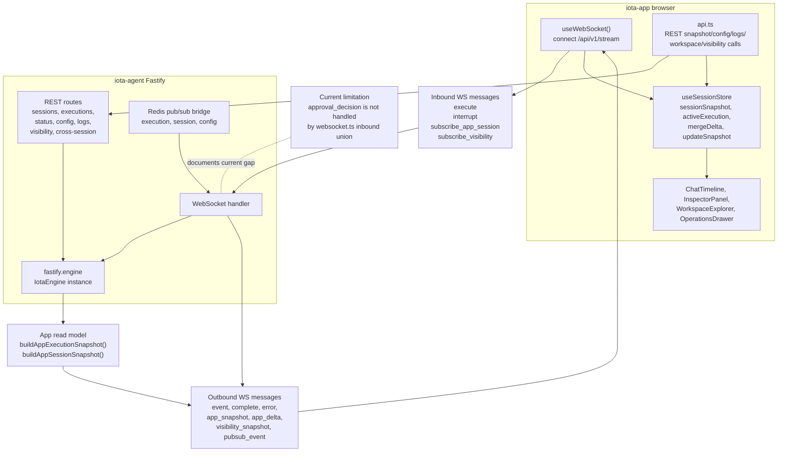

# Agent And App WebSocket

Source paths: `iota-agent/src/routes/websocket.ts`, `iota-agent/src/routes/*.ts`, `iota-app/src/hooks/useWebSocket.ts`, `iota-app/src/store/useSessionStore.ts`.

```mermaid
flowchart TB
  subgraph App["iota-app browser"]
    Hook["useWebSocket()<br/>connect /api/v1/stream"]
    Api["api.ts<br/>REST snapshot/config/logs/<br/>workspace/visibility calls"]
    Store["useSessionStore<br/>sessionSnapshot, activeExecution,<br/>mergeDelta, updateSnapshot"]
    UI["ChatTimeline, InspectorPanel,<br/>WorkspaceExplorer, OperationsDrawer"]
  end

  subgraph Agent["iota-agent Fastify"]
    Rest["REST routes<br/>sessions, executions,<br/>status, config, logs,<br/>visibility, cross-session"]
    WS["WebSocket handler"]
    Inject["fastify.engine<br/>IotaEngine instance"]
    PubSub["Redis pub/sub bridge<br/>execution, session, config"]
  end

  Inbound["Inbound WS messages<br/>execute<br/>interrupt<br/>subscribe_app_session<br/>subscribe_visibility"]
  Outbound["Outbound WS messages<br/>event, complete, error,<br/>app_snapshot, app_delta,<br/>visibility_snapshot, pubsub_event"]
  ReadModel["App read model<br/>buildAppExecutionSnapshot()<br/>buildAppSessionSnapshot()"]
  NotApi["Current limitation<br/>approval_decision is not handled<br/>by websocket.ts inbound union"]

  Hook --> Inbound --> WS
  Api --> Rest
  Rest --> Inject
  WS --> Inject
  Inject --> ReadModel
  ReadModel --> Outbound
  WS --> Outbound --> Hook
  Hook --> Store
  Api --> Store
  Store --> UI
  PubSub --> WS
  NotApi -. documents current gap .- WS
```
