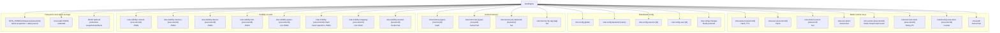

# Storage, Visibility, And Memory

Source paths: `iota-engine/src/storage`, `iota-engine/src/visibility`, `iota-engine/src/memory`, `iota-engine/src/config`.

```mermaid
flowchart TB
  Engine["IotaEngine"]

  subgraph RedisCore["Redis runtime keys"]
    Session["iota:session:{sessionId}<br/>Hash, TTL"]
    Exec["iota:exec:{executionId}<br/>Hash"]
    SessionExecs["iota:session-execs:{sessionId}<br/>Set"]
    AllExecs["iota:executions<br/>Sorted Set"]
    Events["iota:events:{executionId}<br/>Redis Stream field event"]
    Locks["iota:lock:execution:{executionId}<br/>String PX"]
    Fencing["iota:fencing:execution:{executionId}<br/>counter"]
    Audit["iota:audit<br/>Sorted Set"]
  end

  subgraph Config["Distributed config"]
    Global["iota:config:global"]
    Backend["iota:config:backend:{name}"]
    SessionCfg["iota:config:session:{id}"]
    UserCfg["iota:config:user:{id}"]
    ConfigPub["iota:config:changes<br/>Redis pub/sub"]
  end

  subgraph Memory["Unified memory"]
    MemoryHash["iota:memory:{type}:{memoryId}<br/>Hash"]
    MemoryScope["iota:memories:{type}:{scopeId}<br/>Sorted Set"]
    MemoryBackend["iota:memory:by-backend:{backend}<br/>Set"]
    MemoryTag["iota:memory:by-tag:{tag}<br/>Set"]
  end

  subgraph Visibility["Visibility records"]
    Context["iota:visibility:context:{executionId}<br/>JSON"]
    MemVis["iota:visibility:memory:{executionId}<br/>JSON"]
    Tokens["iota:visibility:tokens:{executionId}<br/>JSON"]
    Link["iota:visibility:link:{executionId}<br/>JSON"]
    Spans["iota:visibility:spans:{executionId}<br/>List JSON"]
    Chain["iota:visibility:{executionId}:chain<br/>Hash spanId to JSON"]
    Mapping["iota:visibility:mapping:{executionId}<br/>List JSON"]
    SessionVis["iota:visibility:session:{sessionId}<br/>Sorted Set"]
  end

  subgraph Files["Filesystem and object storage"]
    Workspace["IOTA_HOME/workspaces/{sessionId}<br/>latest snapshots + delta journal"]
    AuditJsonl["local audit JSONL<br/>redacted"]
    MinIO["MinIO optional<br/>production snapshots/artifacts"]
  end

  Engine --> Session
  Engine --> Exec
  Engine --> SessionExecs
  Engine --> AllExecs
  Engine --> Events
  Engine --> Locks
  Engine --> Fencing
  Engine --> Audit
  Engine --> Global
  Engine --> Backend
  Engine --> SessionCfg
  Engine --> UserCfg
  Engine --> ConfigPub
  Engine --> MemoryHash
  Engine --> MemoryScope
  Engine --> MemoryBackend
  Engine --> MemoryTag
  Engine --> Context
  Engine --> MemVis
  Engine --> Tokens
  Engine --> Link
  Engine --> Spans
  Engine --> Chain
  Engine --> Mapping
  Engine --> SessionVis
  Engine --> Workspace
  Engine --> AuditJsonl
  Engine --> MinIO
```
