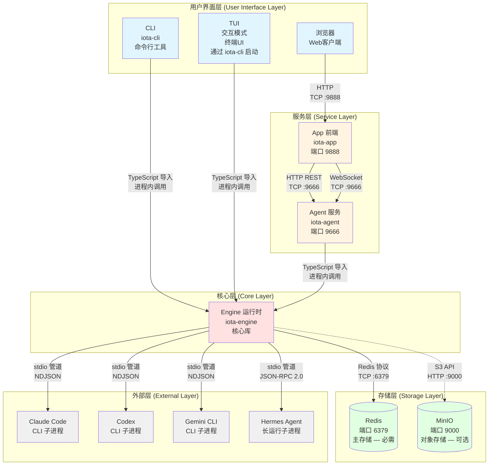
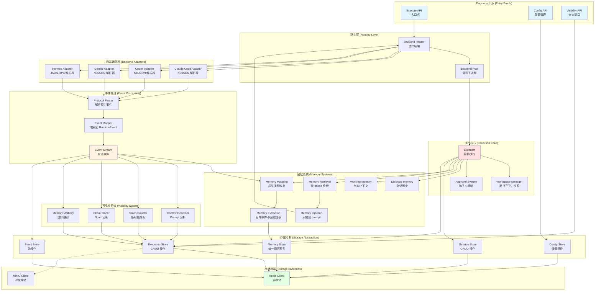
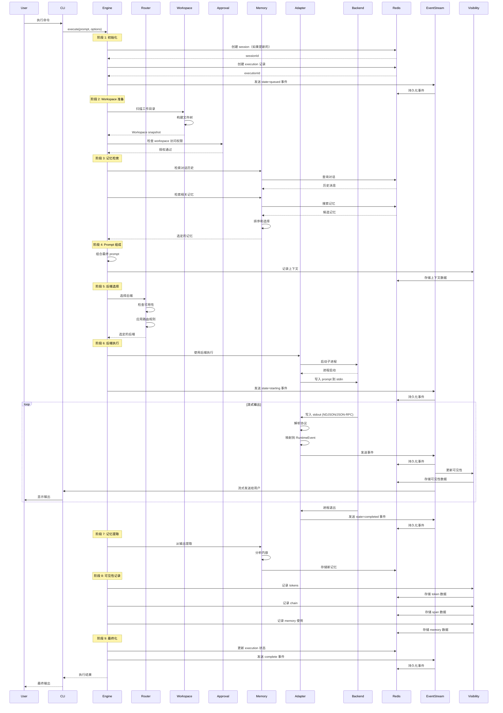
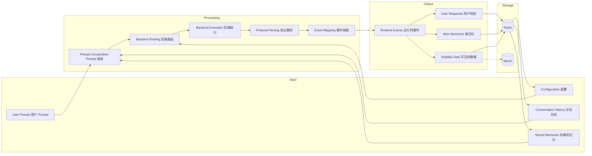
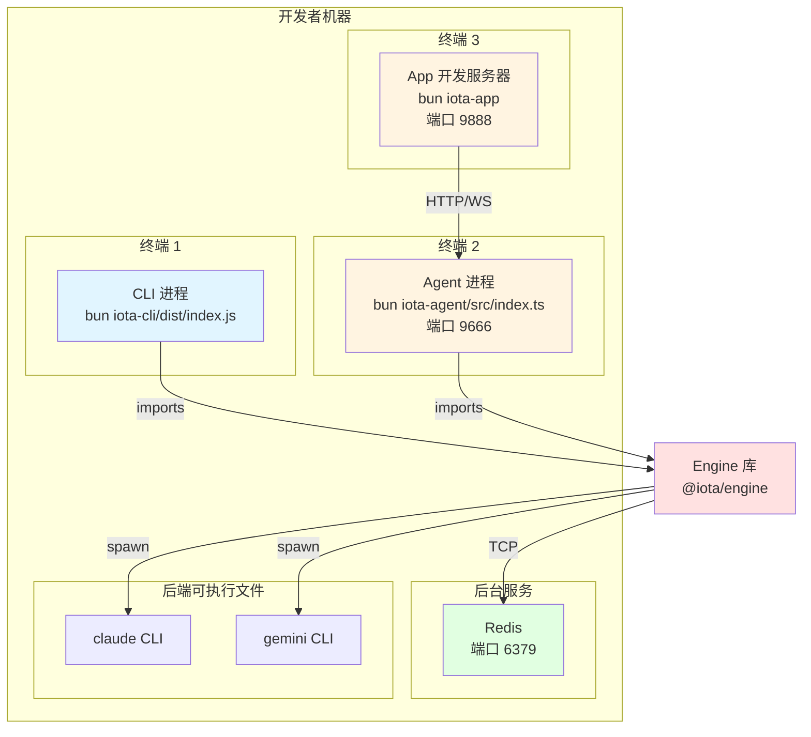
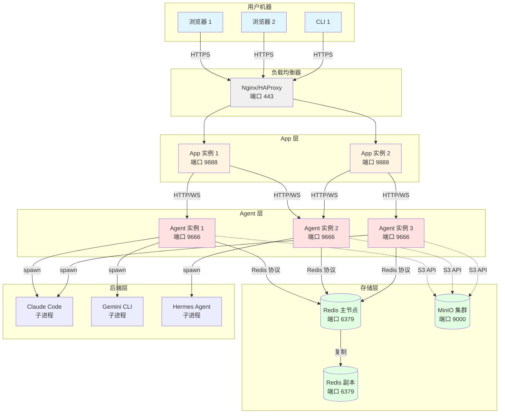

# Iota 架构概览

**版本：** 1.0
**最后更新：** 2026年4月

## 目录

1. [引言](#引言)
2. [系统架构图](#系统架构图)
3. [组件概述](#组件概述)
4. [Engine 内部架构](#engine-内部架构)
5. [执行流程](#执行流程)
6. [通信协议](#通信协议)
7. [数据流](#数据流)
8. [部署架构](#部署架构)

---

## 引言

本文档提供 Iota 系统的全面架构概览，包括：

- **系统级架构**：CLI、TUI、Agent、App、Engine 如何交互
- **Engine 内部架构**：Engine 组件及其关系的详细视图
- **执行流程**：请求处理的逐步可视化
- **通信协议**：组件间如何通信
- **数据流**：数据如何在系统中流动
- **部署架构**：组件如何部署和扩展

本概览作为所有其他指南文档的参考，帮助开发者在深入特定组件前理解完整的系统结构。

---

## 系统架构图

### 高层系统架构



### 图例

- **实线箭头 (→)**：直接依赖（TypeScript 导入、进程内调用）
- **虚线箭头 (-.->)**：可选网络依赖
- **线条标签**：通信协议和端口信息

---

## 组件概述

### 第 1 层：用户界面层 (User Interface Layer)

| 组件 | 类型 | 端口 | 描述 |
|-----------|------|------|-------------|
| **CLI** | 命令行工具 | N/A | 直接执行命令，导入 Engine 库 |
| **TUI** | 交互式终端 | N/A | 通过 `iota-cli` 启动的本地交互模式，和 CLI 一样直接导入 Engine 库，不经过 Agent |
| **Browser** | Web 客户端 | N/A | 用户访问 App 前端的 Web 浏览器 |

### 第 2 层：服务层 (Service Layer)

| 组件 | 类型 | 端口 | 描述 |
|-----------|------|------|-------------|
| **Agent** | Fastify HTTP/WebSocket 服务 | 9666 | 暴露 REST API 和 WebSocket 用于远程访问，导入 Engine 库 |
| **App** | Vite React 前端 | 9888 | 可视化的 Web UI，与 Agent 通信 |

### 第 3 层：核心层 (Core Layer)

| 组件 | 类型 | 端口 | 描述 |
|-----------|------|------|-------------|
| **Engine** | TypeScript 库 | N/A | 核心运行时，协调执行、记忆、可见性、存储 |

### 第 4 层：存储层 (Storage Layer)

| 组件 | 类型 | 端口 | 描述 |
|-----------|------|------|-------------|
| **Redis** | 内存数据库 | 6379 | **必需** — sessions、executions、events、visibility、config 的主存储 |
| **MinIO** | 对象存储 | 9000 | **可选** — 大型制品的对象存储；缺失时系统优雅降级 |

### 第 5 层：外部层 (External Layer)

| 组件 | 类型 | 协议 | 描述 |
|-----------|------|----------|-------------|
| **Claude Code** | CLI 子进程 | NDJSON over stdio | Anthropic 的 Claude Code CLI |
| **Codex** | CLI 子进程 | NDJSON over stdio | OpenAI Codex CLI |
| **Gemini CLI** | CLI 子进程 | NDJSON over stdio | Google 的 Gemini CLI |
| **Hermes Agent** | 长运行子进程 | JSON-RPC 2.0 over stdio | 带 ACP 协议的 Hermes Agent |

---

## Engine 内部架构

### Engine 组件图



### Engine 组件职责

#### 入口点 (Entry Points)
- **Execute API**：执行 prompt 的主入口点
- **Config API**：加载、获取、设置、持久化配置
- **Visibility API**：查询执行可见性数据

#### 路由层 (Routing Layer)
- **Backend Router**：基于配置和可用性选择合适的后端
- **Backend Pool**：管理后端子进程生命周期（spawn、reuse、terminate）

#### 执行核心 (Execution Core)
- **Executor**：编排完整执行流程
- **Workspace Manager**：守卫文件访问、创建快照、跟踪 delta
- **Approval System**：拦截需要审批的操作，应用策略

#### 后端适配器 (Backend Adapters)
- **Claude Code Adapter**：解析 Claude Code NDJSON 输出，映射到 RuntimeEvents
- **Codex Adapter**：解析 Codex NDJSON 输出，映射到 RuntimeEvents
- **Gemini Adapter**：解析 Gemini NDJSON 输出，映射到 RuntimeEvents
- **Hermes Adapter**：处理 JSON-RPC 2.0 协议，映射到 RuntimeEvents

#### 事件处理 (Event Processing)
- **Protocol Parser**：解析后端特定协议（NDJSON、JSON-RPC）
- **Event Mapper**：将原生后端事件映射到标准化的 RuntimeEvents
- **Event Stream**：向消费者发送 RuntimeEvents（存储、可见性、记忆）

#### 记忆系统 (Memory System)
- **Dialogue Memory**：存储对话历史以供上下文使用
- **Working Memory**：维护当前执行上下文
- **Memory Mapping**：将后端原生记忆类型映射到统一四类记忆
- **Memory Retrieval**：按 session / project / user scope 检索和排序相关记忆
- **Memory Injection**：将选定记忆添加到 prompt
- **Memory Extraction**：优先消费后端原生 memory 事件，必要时从执行结果回退提取

#### 可见性系统 (Visibility System)
- **Context Recorder**：分析 prompt 组成和 token 预算
- **Token Counter**：跟踪输入/输出 token 使用量
- **Chain Tracer**：记录带时间的执行 span
- **Memory Visibility**：跟踪记忆选择和修剪

#### 存储抽象 (Storage Abstraction)
- **Session Store**：sessions 的 CRUD 操作
- **Execution Store**：executions 的 CRUD 操作
- **Event Store**：events 的流操作
- **Memory Store**：统一记忆对象的存取、索引与跨 scope 查询
- **Config Store**：配置的键值操作

#### 存储后端 (Storage Backends)
- **Redis Client**：所有数据结构的 主存储
- **MinIO Client**：大型制品的可选对象存储

---

## 执行流程

### 完整执行流程图



### 执行阶段详解

#### 阶段 1：初始化 (0-10ms)
1. 从 Redis 创建或加载 session
2. 生成 execution ID
3. 在 Redis 中创建 execution 记录
4. 发送 `state=queued` 事件
5. 获取分布式执行锁

#### 阶段 2：Workspace 准备 (10-100ms)
1. 扫描工作目录
2. 构建文件树快照
3. 检查 workspace 访问权限
4. 如需要应用审批策略

#### 阶段 3：记忆检索 (50-200ms)
1. 从进程内存加载对话历史（`DialogueMemory`，非持久化——进程重启后丢失）
2. 从 Redis 搜索统一记忆（episodic/procedural/factual/strategic）
3. 按相关性排序记忆
4. 在 token 预算内选择顶部记忆
5. 准备注入的记忆

#### 阶段 4：Prompt 组成 (10-50ms)
1. 组合 system prompt、user prompt、memories
2. 计算 token 预算
3. 记录上下文可见性数据
4. 准备发给后端的最终 prompt

#### 阶段 5：后端选择 (5-20ms)
1. 检查后端可用性
2. 应用路由规则（配置、负载均衡）
3. 从池中选择后端
4. 准备后端特定选项

#### 阶段 6：后端执行 (1000-30000ms)
1. 启动后端子进程（或复用 Hermes）
2. 写入 prompt 到 stdin
3. 发送 `state=starting` 事件
4. 以流式模式读取 stdout
5. 解析协议（NDJSON 或 JSON-RPC）
6. 将原生事件映射到 RuntimeEvents
7. 向流发送事件
8. 持久化事件到 Redis
9. 更新可见性数据
10. 流式输出给用户
11. 等待进程退出
12. 发送 `state=completed` 事件

#### 阶段 7：记忆提取 (50-200ms)
1. 分析输出内容
2. 识别有价值的信息
3. 提取程序性/情节性记忆
4. 存储记忆到 Redis 统一记忆索引

#### 阶段 8：可见性记录 (20-100ms)
1. 记录 token 使用量（输入/输出）
2. 记录执行链（带时间的 spans）
3. 记录记忆选择元数据
4. 存储所有可见性数据到 Redis

#### 阶段 9：最终化 (10-50ms)
1. 更新 execution 状态为 completed
2. 释放分布式执行锁
3. 发送最终 complete 事件
4. 返回结果给调用方

### 总执行时间
- **最短**：约 1.2 秒（快速后端响应）
- **典型**：约 5-10 秒（正常后端响应）
- **最长**：约 30+ 秒（复杂请求或慢后端）

---

## 通信协议

### 协议汇总表

| 源 | 目标 | 协议 | 端口 | 数据格式 | 连接类型 |
|--------|--------|----------|------|-------------|-----------------|
| CLI | Engine | TypeScript 导入 | N/A | 函数调用 | 进程内 |
| TUI | Engine | TypeScript 导入 | N/A | 函数调用 | 进程内 |
| Browser | App | HTTP | 9888 | HTML/CSS/JS | 请求-响应 |
| App | Agent | HTTP REST | 9666 | JSON | 请求-响应 |
| App | Agent | WebSocket | 9666 | JSON 消息 | 持久连接 |
| Agent | Engine | TypeScript 导入 | N/A | 函数调用 | 进程内 |
| Engine | Redis | Redis 协议 | 6379 | Redis 命令 | 连接池 |
| Engine | MinIO | S3 API | 9000 | HTTP/XML | 请求-响应 |
| Engine | Claude Code | stdio | N/A | NDJSON | 子进程管道 |
| Engine | Codex | stdio | N/A | NDJSON | 子进程管道 |
| Engine | Gemini CLI | stdio | N/A | NDJSON | 子进程管道 |
| Engine | Hermes | stdio | N/A | JSON-RPC 2.0 | 子进程管道 |

### 协议详解

#### 1. TypeScript 导入（进程内）

**使用者**：CLI → Engine、TUI → Engine、Agent → Engine

**特性**：
- 在同一 Node.js/Bun 进程内的直接函数调用
- 无序列化开销
- 共享内存空间
- 支持同步和异步调用

**示例**：
```typescript
import { execute } from '@iota/engine';

const result = await execute({
  sessionId: 'session_123',
  prompt: 'What is 2+2?',
  backend: 'claude-code'
});
```

#### 2. HTTP REST（请求-响应）

**使用者**：App → Agent、Engine → MinIO

**特性**：
- 无状态请求-响应模式
- JSON 负载用于结构化数据
- 标准 HTTP 方法（GET、POST、PUT、DELETE）
- 浏览器客户端的 CORS 支持

**示例**：
```bash
curl -X POST http://localhost:9666/api/v1/execute \
  -H "Content-Type: application/json" \
  -d '{
    "sessionId": "session_123",
    "prompt": "What is 2+2?",
    "backend": "claude-code"
  }'
```

**响应**：
```json
{
  "executionId": "exec_456",
  "status": "queued"
}
```

#### 3. WebSocket（持久连接）

**使用者**：App → Agent

**特性**：
- 双向通信
- 实时事件流
- JSON 消息格式
- 基于订阅的更新

**消息类型**：

**客户端 → 服务器**：
```json
{
  "type": "execute",
  "sessionId": "session_123",
  "prompt": "What is 2+2?",
  "backend": "claude-code"
}
```

```json
{
  "type": "subscribe_app_session",
  "sessionId": "session_123"
}
```

**服务器 → 客户端**：
```json
{
  "type": "event",
  "executionId": "exec_456",
  "event": {
    "type": "output",
    "content": "The answer is 4."
  }
}
```

```json
{
  "type": "complete",
  "executionId": "exec_456"
}
```

#### 4. Redis 协议（TCP）

**使用者**：Engine → Redis

**特性**：
- 二进制安全协议
- 命令-响应模式
- 流水线支持
- Pub/sub 用于实时更新

**使用的命令**：
- `SET`、`GET`：简单键值
- `HSET`、`HGET`、`HGETALL`：哈希操作
- `XADD`、`XRANGE`：流操作
- `ZADD`、`ZRANGE`、`ZCARD`：有序集合操作
- `PUBLISH`、`SUBSCRIBE`：发布/订阅消息

**示例**：
```bash
# 存储 session
HSET iota:session:session_123 workingDirectory /tmp activeBackend claude-code

# 存储 execution
HSET iota:exec:exec_456 prompt "What is 2+2?" status completed

# 存储事件
XADD iota:events:exec_456 * event '{"type":"output","content":"4"}'
```

#### 5. S3 API（HTTP/XML）

**使用者**：Engine → MinIO

**特性**：
- RESTful API
- XML 或 JSON 负载
- 分片上传支持
- 预签名 URL 用于安全访问

**操作**：
- `PutObject`：上传制品
- `GetObject`：下载制品
- `ListObjects`：列出 bucket 内容
- `DeleteObject`：删除制品

#### 6. NDJSON over stdio（子进程）

**使用者**：Engine → Claude Code、Codex、 Gemini CLI

**特性**：
- 换行分隔的 JSON
- 每行一个 JSON 对象
- 适合流式处理
- 单向（子进程 → Engine）

**输出示例**：
```json
{"type":"extension","content":"Let me think about this..."}
{"type":"output","content":"The answer is 4."}
{"type":"state","status":"completed"}
```

**解析**：
```typescript
subprocess.stdout.on('data', (chunk) => {
  const lines = chunk.toString().split('\n');
  for (const line of lines) {
    if (line.trim()) {
      const event = JSON.parse(line);
      handleEvent(event);
    }
  }
});
```

#### 7. JSON-RPC 2.0 over stdio（子进程）

**使用者**：Engine → Hermes Agent

**特性**：
- 请求-响应对
- 双向通信
- 基于 ID 的关联
- 内置错误处理

**请求**：
```json
{
  "jsonrpc": "2.0",
  "method": "execute",
  "params": {
    "prompt": "What is 2+2?",
    "sessionId": "session_123"
  },
  "id": 1
}
```

**响应**：
```json
{
  "jsonrpc": "2.0",
  "result": {
    "output": "The answer is 4.",
    "status": "completed"
  },
  "id": 1
}
```

**错误响应**：
```json
{
  "jsonrpc": "2.0",
  "error": {
    "code": -32600,
    "message": "Invalid request"
  },
  "id": 1
}
```

---

## 数据流

### 数据流图



### 数据类型和存储

#### Session 数据
**存储**：Redis Hash
**键模式**：`iota:session:{sessionId}`
**字段**：
- `id`：Session UUID
- `workingDirectory`：绝对路径
- `activeBackend`：当前后端名称
- `createdAt`：时间戳（ms）
- `updatedAt`：时间戳（ms）

**生命周期**：首次执行时创建，显式删除前持久化

> **⚠️ 持久化边界**：Session 记录和统一记忆（episodic/procedural/factual/strategic）持久化在 Redis 中，跨进程重启存活。但对话历史（`DialogueMemory`）和工作文件集（`WorkingMemory`）仅存在于进程内存——Agent/CLI 重启后丢失。后端切换在同一进程生命周期内保留完整对话上下文，但跨进程重启后只能通过统一记忆恢复部分语境。

#### Execution 数据
**存储**：Redis Hash
**键模式**：`iota:exec:{executionId}`
**字段**：
- `id`：Execution UUID
- `sessionId`：父 Session UUID
- `prompt`：用户 prompt 文本
- `backend`：使用的前端
- `status`：queued | starting | running | completed | failed
- `output`：最终输出文本
- `startedAt`：时间戳（ms）
- `finishedAt`：时间戳（ms）

**生命周期**：执行开始时创建，执行期间更新，永久持久化

#### Event 数据
**存储**：Redis Stream
**键模式**：`iota:events:{executionId}`
**格式**：Stream field `event` 中存储 RuntimeEvent JSON
**事件类型**：
- `state`：状态变化（queued、starting、running、completed）
- `output`：响应文本块
- `extension`：后端特定数据（thinking、tool use）
- `error`：错误消息

**生命周期**：执行期间追加，永久持久化

#### Memory 数据
**存储**：Redis Hash + Sorted Set + Set 索引
**键模式**：
- `iota:memory:{type}:{memoryId}`
- `iota:memories:{type}:{scopeId}`
- `iota:memory:by-backend:{backend}`
- `iota:memory:by-tag:{tag}`
**格式**：统一记忆对象，按记忆类型和 scope 建立索引
**字段**：
- `id`：Memory UUID
- `type`：episodic | procedural | factual | strategic
- `scope`：session | project | user
- `scopeId`：对应 scope 的唯一标识
- `content`：记忆文本
- `confidence`：置信度
- `createdAt`：时间戳（ms）

**生命周期**：执行后提取，永久持久化，按相关性排序

#### Visibility 数据
**存储**：Redis Hashes
**键模式**：
- `iota:visibility:context:{executionId}`：Prompt 组成分析
- `iota:visibility:tokens:{executionId}`：Token 使用跟踪
- `iota:visibility:{executionId}:chain`：执行 span 哈希索引（spanId -> TraceSpan）
- `iota:visibility:memory:{executionId}`：记忆选择元数据

**生命周期**：执行期间记录，永久持久化

#### Configuration 数据
**存储**：Redis Hashes
**键模式**：
- `iota:config:global`：系统范围设置
- `iota:config:backend:{backendName}`：后端特定设置
- `iota:config:session:{sessionId}`：Session 特定覆盖

**生命周期**：启动时加载，通过 API 更新，永久持久化

#### Audit 数据
**存储**：双写——本地 JSONL 文件 + Redis Sorted Set
- **文件路径**：`${IOTA_HOME}/logs/audit.jsonl`（JSONL 格式，每行一个 JSON 对象，首次写入时懒创建目录）
- **Redis 键**：`iota:audit`（Sorted Set，时间戳为分数）
**事件类型**：
- `execution_start`：执行启动
- `execution_finish`：执行完成
- `config_change`：配置更新
- `approval_request`：需要审批
- `approval_decision`：审批通过/拒绝
- `tool_call`：工具调用
- `backend_switch`：Backend 切换
- `error`：错误

**生命周期**：事件时追加，永久持久化，可被 GC 清理

---

## 部署架构

### 单机开发部署



**设置步骤**：
1. 启动 Redis：`cd deployment/scripts && bash start-storage.sh`
2. 构建包：`cd iota-engine && bun run build && cd ../iota-cli && bun run build`
3. 启动 Agent（仅 App / 远程 API 需要）：`cd iota-agent && bun run dev`
4. 启动 App（可选）：`cd iota-app && bun run dev`
5. 使用 CLI：`bun iota-cli/dist/index.js run "test prompt"`
6. 使用 TUI：`bun iota-cli/dist/index.js interactive`

**特性**：
- 所有组件在同一台机器上
- 共享文件系统
- 低延迟
- 易于调试
- 无网络安全顾虑

### 分布式生产部署



**部署特性**：

#### App 层
- **扩展**：水平扩展（添加更多实例）
- **状态**：无状态（无本地状态）
- **负载均衡**：轮询或最少连接
- **健康检查**：`GET /health`

#### Agent 层
- **扩展**：水平扩展（添加更多实例）
- **状态**：无状态（所有状态在 Redis 中）
- **负载均衡**：轮询或最少连接
- **健康检查**：`GET /health`
- **后端子进程**：每个 agent 启动自己的后端子进程

#### 存储层
- **Redis**：主-副本复制，Redis Sentinel 故障转移
- **MinIO**：带纠删码的分布式模式

#### 网络安全
- **TLS/SSL**：所有外部流量加密
- **内部网络**：agent-存储通信的私网
- **防火墙**：只暴露必要端口
- **认证**：Agent API 的 API keys 或 JWT tokens

### Docker Compose 部署

```yaml
# deployment/docker/docker-compose.yml
version: '3.8'

services:
  redis:
    image: redis:7-alpine
    ports:
      - "6379:6379"
    volumes:
      - redis-data:/data
    command: redis-server --appendonly yes

  minio:
    image: minio/minio:latest
    ports:
      - "9000:9000"
      - "9001:9001"
    volumes:
      - minio-data:/data
    environment:
      - MINIO_ROOT_USER=minioadmin
      - MINIO_ROOT_PASSWORD=minioadmin
    command: server /data --console-address ":9001"

  agent:
    build:
      context: ../../
      dockerfile: deployment/docker/Dockerfile.agent
    ports:
      - "9666:9666"
    environment:
      - REDIS_HOST=redis
      - REDIS_PORT=6379
      - MINIO_ENDPOINT=minio:9000
    depends_on:
      - redis
      - minio

volumes:
  redis-data:
  minio-data:
```

**使用**：
```bash
cd deployment/docker
docker-compose up -d
```

### Kubernetes 部署（未来）

对于大规模生产部署，可以创建 Kubernetes manifests 用于：
- 带自动扩展的 Agent Deployment
- 带持久化的 Redis StatefulSet
- 带持久化的 MinIO StatefulSet
- 用于外部访问的 Ingress
- 用于配置的 ConfigMaps
- 用于敏感数据的 Secrets

---

## 实现成熟度矩阵

下表跟踪每个主要能力的当前实现和测试成熟度。这防止文档在功能仍处于早期集成阶段时暗示"生产就绪"。

| 能力 | 成熟度 | 说明 |
|------------|----------|-------|
| **Backend Adapters** (Claude Code、Codex、Gemini) | ✅ 稳定 | 每次执行子进程，经过良好测试 |
| **Backend Adapter** (Hermes) | ⚠️ 集成中 | 长运行 ACP；需要本地 Hermes gateway |
| **Session CRUD** | ✅ 稳定 | Redis 支持，Agent + CLI 已验证 |
| **Execution Pipeline** | ✅ 稳定 | 流、中断、事件持久化 |
| **Memory System** | ✅ 稳定 | 统一四类记忆，按 session/project/user scope 检索和跨 scope 搜索 |
| **Visibility Plane** | ✅ 稳定 | Token/memory/chain/summary 可见性 |
| **Config (global/backend/session)** | ✅ 稳定 | Redis 支持，作用域解析 |
| **Config (user scope)** | ⚠️ 集成中 | 代码完成；缺乏端到端测试覆盖 |
| **Approval — CLI** | ✅ 稳定 | CliApprovalHook，交互式终端提示 |
| **Approval — App/WebSocket** | ⚠️ 集成中 | DeferredApprovalHook 已连接；App UI 发送决策，需要 e2e 测试 |
| **MCP Support** | ⚠️ 集成中 | StdioMcpClient + McpRouter；无专用 REST endpoints，仅 engine 层面 |
| **Metrics Collection** | ✅ 稳定 | 进程内，P50/P95/P99 |
| **Audit Logging** | ✅ 稳定 | JSONL 文件 + 可选 sink |
| **Workspace Snapshots** | ✅ 稳定 | 剪枝、delta journals |
| **WebSocket Streaming** | ✅ 稳定 | 单实例事件流 + 订阅 |
| **WebSocket Multi-Instance** | ⚠️ 实验中 | Redis pub/sub bridge 存在；App 尚未完全消费 `pubsub_event` 除快照同步外 |
| **Replay** | ⚠️ 集成中 | REST 查询端点仅，非实时 WS 流 |
| **Cross-Session Queries** | ✅ 稳定 | 日志、sessions、memories、后端隔离 |
| **MinIO (对象存储)** | 🔧 可选 | 缺失时优雅降级 |

**图例**：✅ 稳定（已测试、生产就绪）· ⚠️ 集成中（代码完成、需要更多测试）· 🔧 可选（增强、非必需）

---

## 总结

本架构概览提供：

1. **系统级架构**：所有组件如何交互的清晰理解
2. **Engine 内部架构**：Engine 组件及其关系的详细视图
3. **执行流程**：带时间的请求处理逐步可视化
4. **通信协议**：所有组件间通信的完整协议规范
5. **数据流**：数据如何在系统中流动以及存储在哪里
6. **部署架构**：开发和生产部署选项

阅读特定组件指南时使用本文档作为参考：
- [CLI 指南](./01-cli-guide.md)
- [TUI 指南](./02-tui-guide.md)
- [Agent 指南](./03-agent-guide.md)
- [App 指南](./04-app-guide.md)
- [Engine 指南](./05-engine-guide.md)

---

**版本历史**：
- v1.2 (2026年4月)：澄清 TUI 通过 `iota-cli` 直接调用 Engine，不经过 Agent
- v1.1 (2026年4月)：添加实现成熟度矩阵；修正 approval_response→approval_decision 术语；澄清存储层必需/可选状态
- v1.0 (2026年4月)：初始架构概览，包含完整图表和流程描述
