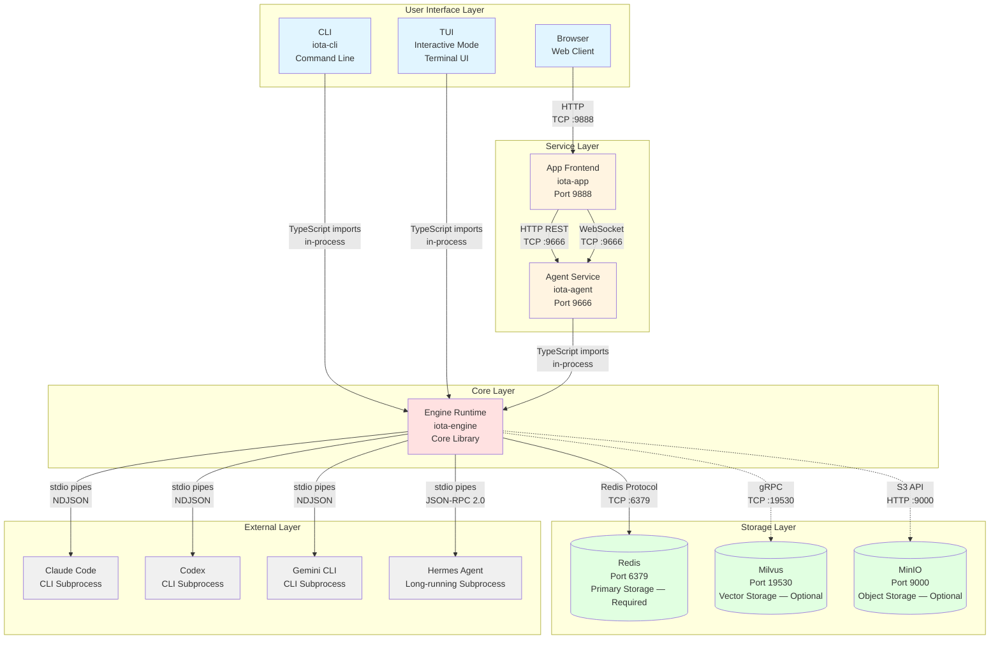
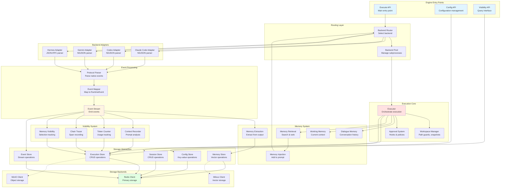
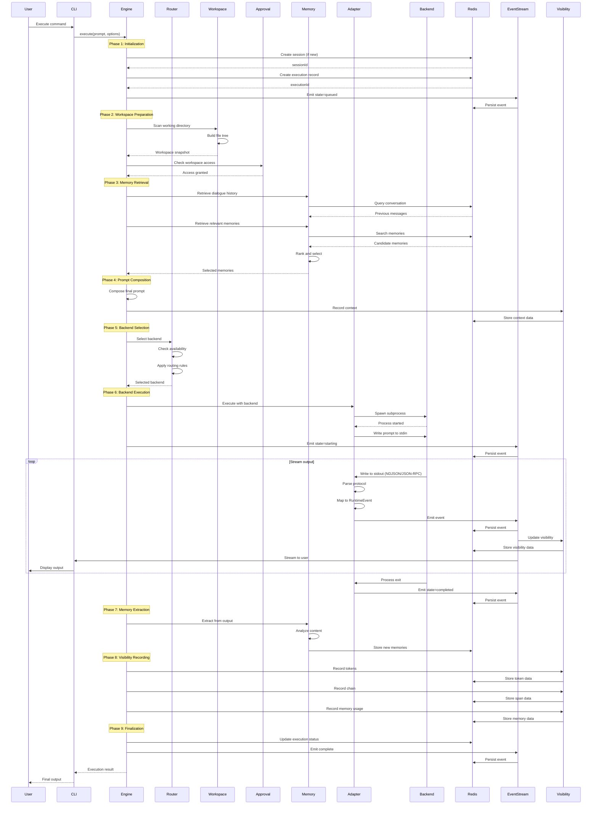
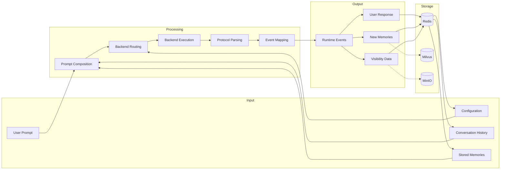
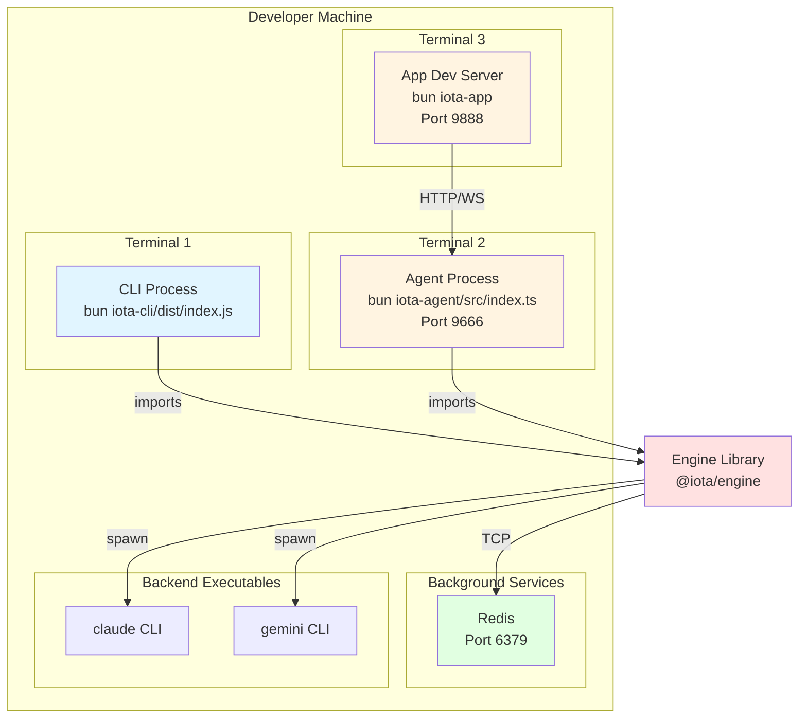
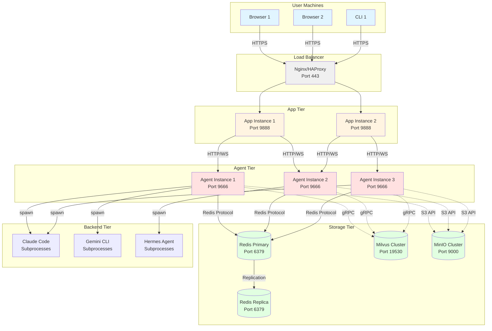

# Iota Architecture Overview

**Version:** 1.0  
**Last Updated:** April 2026

## Table of Contents

1. [Introduction](#introduction)
2. [System Architecture Diagram](#system-architecture-diagram)
3. [Component Overview](#component-overview)
4. [Engine Internal Architecture](#engine-internal-architecture)
5. [Execution Flow](#execution-flow)
6. [Communication Protocols](#communication-protocols)
7. [Data Flow](#data-flow)
8. [Deployment Architecture](#deployment-architecture)

---

## Introduction

This document provides a comprehensive architectural overview of the Iota system, including:

- **System-level architecture**: How CLI, TUI, Agent, App, and Engine interact
- **Engine internal architecture**: Detailed view of Engine components and their relationships
- **Execution flow**: Step-by-step visualization of request processing
- **Communication protocols**: How components communicate with each other
- **Data flow**: How data moves through the system
- **Deployment architecture**: How components are deployed and scaled

This overview serves as a reference for all other guide documents and helps developers understand the complete system structure before diving into specific components.

---

## System Architecture Diagram

### High-Level System Architecture



### Legend

- **Solid arrows (→)**: Direct dependencies (TypeScript imports, in-process calls)
- **Dashed arrows (-.->)**: Optional network dependencies
- **Line labels**: Communication protocol and port information


---

## Component Overview

### Layer 1: User Interface Layer

| Component | Type | Port | Description |
|-----------|------|------|-------------|
| **CLI** | Command-line tool | N/A | Direct command execution, imports Engine library |
| **TUI** | Interactive terminal | N/A | Interactive mode launched via CLI, imports Engine library |
| **Browser** | Web client | N/A | User's web browser accessing App frontend |

### Layer 2: Service Layer

| Component | Type | Port | Description |
|-----------|------|------|-------------|
| **Agent** | Fastify HTTP/WebSocket service | 9666 | Exposes REST API and WebSocket for remote access, imports Engine library |
| **App** | Vite React frontend | 9888 | Web UI for visualization, communicates with Agent |

### Layer 3: Core Layer

| Component | Type | Port | Description |
|-----------|------|------|-------------|
| **Engine** | TypeScript library | N/A | Core runtime orchestrating execution, memory, visibility, storage |

### Layer 4: Storage Layer

| Component | Type | Port | Description |
|-----------|------|------|-------------|
| **Redis** | In-memory database | 6379 | **Required** — primary storage for sessions, executions, events, visibility, config |
| **Milvus** | Vector database | 19530 | **Optional** — vector storage for memory embeddings; system degrades gracefully without it |
| **MinIO** | Object storage | 9000 | **Optional** — object storage for large artifacts; system degrades gracefully without it |

### Layer 5: External Layer

| Component | Type | Protocol | Description |
|-----------|------|----------|-------------|
| **Claude Code** | CLI subprocess | NDJSON over stdio | Anthropic's Claude Code CLI |
| **Codex** | CLI subprocess | NDJSON over stdio | Codex CLI |
| **Gemini CLI** | CLI subprocess | NDJSON over stdio | Google's Gemini CLI |
| **Hermes Agent** | Long-running subprocess | JSON-RPC 2.0 over stdio | Hermes Agent with ACP protocol |


---

## Engine Internal Architecture

### Engine Component Diagram



### Engine Component Responsibilities

#### Entry Points
- **Execute API**: Main entry point for executing prompts
- **Config API**: Load, get, set, and persist configuration
- **Visibility API**: Query execution visibility data

#### Routing Layer
- **Backend Router**: Select appropriate backend based on config and availability
- **Backend Pool**: Manage backend subprocess lifecycle (spawn, reuse, terminate)

#### Execution Core
- **Executor**: Orchestrate the complete execution flow
- **Workspace Manager**: Guard file access, create snapshots, track deltas
- **Approval System**: Intercept operations requiring approval, apply policies

#### Backend Adapters
- **Claude Code Adapter**: Parse Claude Code NDJSON output, map to RuntimeEvents
- **Codex Adapter**: Parse Codex NDJSON output, map to RuntimeEvents
- **Gemini Adapter**: Parse Gemini NDJSON output, map to RuntimeEvents
- **Hermes Adapter**: Handle JSON-RPC 2.0 protocol, map to RuntimeEvents

#### Event Processing
- **Protocol Parser**: Parse backend-specific protocol (NDJSON, JSON-RPC)
- **Event Mapper**: Map native backend events to normalized RuntimeEvents
- **Event Stream**: Emit RuntimeEvents to consumers (storage, visibility, memory)

#### Memory System
- **Dialogue Memory**: Store conversation history for context
- **Working Memory**: Maintain current execution context
- **Memory Retrieval**: Search and rank relevant memories
- **Memory Injection**: Add selected memories to prompt
- **Memory Extraction**: Extract valuable information from output

#### Visibility System
- **Context Recorder**: Analyze prompt composition and token budget
- **Token Counter**: Track input/output token usage
- **Chain Tracer**: Record execution spans with timing
- **Memory Visibility**: Track memory selection and trimming

#### Storage Abstraction
- **Session Store**: CRUD operations for sessions
- **Execution Store**: CRUD operations for executions
- **Event Store**: Stream operations for events
- **Memory Store**: Vector operations for memories
- **Config Store**: Key-value operations for configuration

#### Storage Backends
- **Redis Client**: Primary storage for all data structures
- **Milvus Client**: Optional vector storage for memory embeddings
- **MinIO Client**: Optional object storage for large artifacts


---

## Execution Flow

### Complete Execution Flow Diagram



### Execution Phases Explained

#### Phase 1: Initialization (0-10ms)
1. Create or load session from Redis
2. Generate execution ID
3. Create execution record in Redis
4. Emit `state=queued` event
5. Acquire distributed execution lock

#### Phase 2: Workspace Preparation (10-100ms)
1. Scan working directory
2. Build file tree snapshot
3. Check workspace access permissions
4. Apply approval policies if needed

#### Phase 3: Memory Retrieval (50-200ms)
1. Load dialogue history from Redis
2. Search for relevant memories
3. Rank memories by relevance
4. Select top memories within token budget
5. Prepare memories for injection

#### Phase 4: Prompt Composition (10-50ms)
1. Combine system prompt, user prompt, memories
2. Calculate token budget
3. Record context visibility data
4. Prepare final prompt for backend

#### Phase 5: Backend Selection (5-20ms)
1. Check backend availability
2. Apply routing rules (config, load balancing)
3. Select backend from pool
4. Prepare backend-specific options

#### Phase 6: Backend Execution (1000-30000ms)
1. Spawn backend subprocess (or reuse for Hermes)
2. Write prompt to stdin
3. Emit `state=starting` event
4. Read stdout in streaming mode
5. Parse protocol (NDJSON or JSON-RPC)
6. Map native events to RuntimeEvents
7. Emit events to stream
8. Persist events to Redis
9. Update visibility data
10. Stream output to user
11. Wait for process exit
12. Emit `state=completed` event

#### Phase 7: Memory Extraction (50-200ms)
1. Analyze output content
2. Identify valuable information
3. Extract procedural/episodic memories
4. Store memories in Redis (and optionally Milvus)

#### Phase 8: Visibility Recording (20-100ms)
1. Record token usage (input/output)
2. Record execution chain (spans with timing)
3. Record memory selection metadata
4. Store all visibility data in Redis

#### Phase 9: Finalization (10-50ms)
1. Update execution status to completed
2. Release distributed execution lock
3. Emit final complete event
4. Return result to caller

### Total Execution Time
- **Minimum**: ~1.2 seconds (fast backend response)
- **Typical**: ~5-10 seconds (normal backend response)
- **Maximum**: ~30+ seconds (complex requests or slow backend)


---

## Communication Protocols

### Protocol Summary Table

| Source | Target | Protocol | Port | Data Format | Connection Type |
|--------|--------|----------|------|-------------|-----------------|
| CLI | Engine | TypeScript imports | N/A | Function calls | In-process |
| TUI | Engine | TypeScript imports | N/A | Function calls | In-process |
| Browser | App | HTTP | 9888 | HTML/CSS/JS | Request-response |
| App | Agent | HTTP REST | 9666 | JSON | Request-response |
| App | Agent | WebSocket | 9666 | JSON messages | Persistent connection |
| Agent | Engine | TypeScript imports | N/A | Function calls | In-process |
| Engine | Redis | Redis protocol | 6379 | Redis commands | Connection pool |
| Engine | Milvus | gRPC | 19530 | Protobuf | Connection pool |
| Engine | MinIO | S3 API | 9000 | HTTP/XML | Request-response |
| Engine | Claude Code | stdio | N/A | NDJSON | Subprocess pipes |
| Engine | Codex | stdio | N/A | NDJSON | Subprocess pipes |
| Engine | Gemini CLI | stdio | N/A | NDJSON | Subprocess pipes |
| Engine | Hermes | stdio | N/A | JSON-RPC 2.0 | Subprocess pipes |

### Protocol Details

#### 1. TypeScript Imports (In-Process)

**Used by**: CLI → Engine, TUI → Engine, Agent → Engine

**Characteristics**:
- Direct function calls within same Node.js/Bun process
- No serialization overhead
- Shared memory space
- Synchronous and asynchronous calls supported

**Example**:
```typescript
import { execute } from '@iota/engine';

const result = await execute({
  sessionId: 'session_123',
  prompt: 'What is 2+2?',
  backend: 'claude-code'
});
```

#### 2. HTTP REST (Request-Response)

**Used by**: App → Agent, Engine → MinIO

**Characteristics**:
- Stateless request-response pattern
- JSON payload for structured data
- Standard HTTP methods (GET, POST, PUT, DELETE)
- CORS support for browser clients

**Example**:
```bash
curl -X POST http://localhost:9666/api/v1/execute \
  -H "Content-Type: application/json" \
  -d '{
    "sessionId": "session_123",
    "prompt": "What is 2+2?",
    "backend": "claude-code"
  }'
```

**Response**:
```json
{
  "executionId": "exec_456",
  "status": "queued"
}
```

#### 3. WebSocket (Persistent Connection)

**Used by**: App → Agent

**Characteristics**:
- Bidirectional communication
- Real-time event streaming
- JSON message format
- Subscription-based updates

**Message Types**:

**Client → Server**:
```json
{
  "type": "execute",
  "sessionId": "session_123",
  "prompt": "What is 2+2?",
  "backend": "claude-code"
}
```

```json
{
  "type": "subscribe_app_session",
  "sessionId": "session_123"
}
```

**Server → Client**:
```json
{
  "type": "event",
  "executionId": "exec_456",
  "event": {
    "type": "output",
    "content": "The answer is 4."
  }
}
```

```json
{
  "type": "complete",
  "executionId": "exec_456"
}
```

#### 4. Redis Protocol (TCP)

**Used by**: Engine → Redis

**Characteristics**:
- Binary-safe protocol
- Command-response pattern
- Pipelining support
- Pub/sub for real-time updates

**Commands Used**:
- `SET`, `GET`: Simple key-value
- `HSET`, `HGET`, `HGETALL`: Hash operations
- `LPUSH`, `LRANGE`: List operations
- `ZADD`, `ZRANGE`, `ZCARD`: Sorted set operations
- `PUBLISH`, `SUBSCRIBE`: Pub/sub messaging

**Example**:
```bash
# Store session
HSET iota:session:session_123 workingDirectory /tmp activeBackend claude-code

# Store execution
HSET iota:exec:exec_456 prompt "What is 2+2?" status completed

# Store event
LPUSH iota:events:exec_456 '{"type":"output","content":"4"}'
```

#### 5. gRPC (Protobuf over HTTP/2)

**Used by**: Engine → Milvus

**Characteristics**:
- Binary protocol (Protobuf)
- Efficient serialization
- Streaming support
- Type-safe schema

**Operations**:
- `Insert`: Add vector embeddings
- `Search`: Query similar vectors
- `Delete`: Remove vectors
- `CreateCollection`: Initialize collection

#### 6. S3 API (HTTP/XML)

**Used by**: Engine → MinIO

**Characteristics**:
- RESTful API
- XML or JSON payloads
- Multipart upload support
- Presigned URLs for secure access

**Operations**:
- `PutObject`: Upload artifact
- `GetObject`: Download artifact
- `ListObjects`: List bucket contents
- `DeleteObject`: Remove artifact

#### 7. NDJSON over stdio (Subprocess)

**Used by**: Engine → Claude Code, Codex, Gemini CLI

**Characteristics**:
- Newline-delimited JSON
- One JSON object per line
- Streaming-friendly
- Unidirectional (subprocess → Engine)

**Example Output**:
```json
{"type":"extension","content":"Let me think about this..."}
{"type":"output","content":"The answer is 4."}
{"type":"state","status":"completed"}
```

**Parsing**:
```typescript
subprocess.stdout.on('data', (chunk) => {
  const lines = chunk.toString().split('\n');
  for (const line of lines) {
    if (line.trim()) {
      const event = JSON.parse(line);
      handleEvent(event);
    }
  }
});
```

#### 8. JSON-RPC 2.0 over stdio (Subprocess)

**Used by**: Engine → Hermes Agent

**Characteristics**:
- Request-response pairs
- Bidirectional communication
- ID-based correlation
- Error handling built-in

**Request**:
```json
{
  "jsonrpc": "2.0",
  "method": "execute",
  "params": {
    "prompt": "What is 2+2?",
    "sessionId": "session_123"
  },
  "id": 1
}
```

**Response**:
```json
{
  "jsonrpc": "2.0",
  "result": {
    "output": "The answer is 4.",
    "status": "completed"
  },
  "id": 1
}
```

**Error Response**:
```json
{
  "jsonrpc": "2.0",
  "error": {
    "code": -32600,
    "message": "Invalid request"
  },
  "id": 1
}
```


---

## Data Flow

### Data Flow Diagram



### Data Types and Storage

#### Session Data
**Storage**: Redis Hash  
**Key Pattern**: `iota:session:{sessionId}`  
**Fields**:
- `id`: Session UUID
- `workingDirectory`: Absolute path
- `activeBackend`: Current backend name
- `createdAt`: Timestamp (ms)
- `updatedAt`: Timestamp (ms)

**Lifecycle**: Created on first execution, persists until explicitly deleted

#### Execution Data
**Storage**: Redis Hash  
**Key Pattern**: `iota:exec:{executionId}`  
**Fields**:
- `id`: Execution UUID
- `sessionId`: Parent session UUID
- `prompt`: User prompt text
- `backend`: Backend used
- `status`: queued | starting | running | completed | failed
- `output`: Final output text
- `startedAt`: Timestamp (ms)
- `finishedAt`: Timestamp (ms)

**Lifecycle**: Created at execution start, updated during execution, persists indefinitely

#### Event Data
**Storage**: Redis List  
**Key Pattern**: `iota:events:{executionId}`  
**Format**: JSON array of RuntimeEvent objects  
**Event Types**:
- `state`: Status changes (queued, starting, running, completed)
- `output`: Response text chunks
- `extension`: Backend-specific data (thinking, tool use)
- `error`: Error messages

**Lifecycle**: Appended during execution, persists indefinitely

#### Memory Data
**Storage**: Redis Sorted Set + Optional Milvus Collection  
**Key Pattern**: `iota:memories:{sessionId}`  
**Format**: JSON objects with score-based ranking  
**Fields**:
- `id`: Memory UUID
- `type`: procedural | episodic
- `content`: Memory text
- `embedding`: Vector (if using Milvus)
- `score`: Relevance score
- `createdAt`: Timestamp (ms)

**Lifecycle**: Extracted after execution, persists indefinitely, ranked by relevance

#### Visibility Data
**Storage**: Redis Hashes  
**Key Patterns**:
- `iota:visibility:context:{executionId}`: Prompt composition analysis
- `iota:visibility:tokens:{executionId}`: Token usage tracking
- `iota:visibility:{executionId}:chain`: Execution span timing
- `iota:visibility:memory:{executionId}`: Memory selection metadata

**Lifecycle**: Recorded during execution, persists indefinitely

#### Configuration Data
**Storage**: Redis Hashes  
**Key Patterns**:
- `iota:config:global`: System-wide settings
- `iota:config:backend:{backendName}`: Backend-specific settings
- `iota:config:session:{sessionId}`: Session-specific overrides

**Lifecycle**: Loaded on startup, updated via API, persists indefinitely

#### Audit Data
**Storage**: Redis Sorted Set  
**Key Pattern**: `iota:audit`  
**Format**: JSON objects with timestamp scores  
**Event Types**:
- `execution_start`: Execution initiated
- `execution_finish`: Execution completed
- `config_change`: Configuration updated
- `approval_request`: Approval required
- `approval_decision`: Approval granted/denied

**Lifecycle**: Appended on events, persists indefinitely, can be pruned by GC


---

## Deployment Architecture

### Single-Machine Development Deployment



**Setup Steps**:
1. Start Redis: `cd deployment/scripts && bash start-storage.sh`
2. Build packages: `cd iota-engine && bun run build && cd ../iota-cli && bun run build`
3. Start Agent (optional): `cd iota-agent && bun run dev`
4. Start App (optional): `cd iota-app && bun run dev`
5. Use CLI: `bun iota-cli/dist/index.js run "test prompt"`

**Characteristics**:
- All components on same machine
- Shared file system
- Low latency
- Easy debugging
- No network security concerns

### Distributed Production Deployment



**Deployment Characteristics**:

#### App Tier
- **Scaling**: Horizontal (add more instances)
- **State**: Stateless (no local state)
- **Load Balancing**: Round-robin or least-connections
- **Health Check**: `GET /health`

#### Agent Tier
- **Scaling**: Horizontal (add more instances)
- **State**: Stateless (all state in Redis)
- **Load Balancing**: Round-robin or least-connections
- **Health Check**: `GET /health`
- **Backend Subprocesses**: Each agent spawns its own backend subprocesses

#### Storage Tier
- **Redis**: Primary-replica replication, Redis Sentinel for failover
- **Milvus**: Clustered deployment with multiple nodes
- **MinIO**: Distributed mode with erasure coding

#### Network Security
- **TLS/SSL**: All external traffic encrypted
- **Internal Network**: Private network for agent-storage communication
- **Firewall**: Only necessary ports exposed
- **Authentication**: API keys or JWT tokens for Agent API

### Docker Compose Deployment

```yaml
# deployment/docker/docker-compose.yml
version: '3.8'

services:
  redis:
    image: redis:7-alpine
    ports:
      - "6379:6379"
    volumes:
      - redis-data:/data
    command: redis-server --appendonly yes

  milvus:
    image: milvusdb/milvus:latest
    ports:
      - "19530:19530"
      - "9091:9091"
    volumes:
      - milvus-data:/var/lib/milvus
    environment:
      - ETCD_ENDPOINTS=etcd:2379

  minio:
    image: minio/minio:latest
    ports:
      - "9000:9000"
      - "9001:9001"
    volumes:
      - minio-data:/data
    environment:
      - MINIO_ROOT_USER=minioadmin
      - MINIO_ROOT_PASSWORD=minioadmin
    command: server /data --console-address ":9001"

  agent:
    build:
      context: ../../
      dockerfile: deployment/docker/Dockerfile.agent
    ports:
      - "9666:9666"
    environment:
      - REDIS_HOST=redis
      - REDIS_PORT=6379
      - MILVUS_HOST=milvus
      - MILVUS_PORT=19530
      - MINIO_ENDPOINT=minio:9000
    depends_on:
      - redis
      - milvus
      - minio

volumes:
  redis-data:
  milvus-data:
  minio-data:
```

**Usage**:
```bash
cd deployment/docker
docker-compose up -d
```

### Kubernetes Deployment (Future)

For large-scale production deployments, Kubernetes manifests can be created for:
- Agent deployment with auto-scaling
- Redis StatefulSet with persistence
- Milvus StatefulSet with persistence
- MinIO StatefulSet with persistence
- Ingress for external access
- ConfigMaps for configuration
- Secrets for sensitive data

---

## Implementation Maturity Matrix

The table below tracks each major capability's current implementation and testing maturity. This prevents documentation from implying "production-ready" when a feature is still in early integration.

| Capability | Maturity | Notes |
|------------|----------|-------|
| **Backend Adapters** (Claude Code, Codex, Gemini) | ✅ Stable | Per-execution subprocess, well-tested |
| **Backend Adapter** (Hermes) | ⚠️ Integration | Long-running ACP; requires local Hermes gateway |
| **Session CRUD** | ✅ Stable | Redis-backed, Agent + CLI verified |
| **Execution Pipeline** | ✅ Stable | Stream, interrupt, event persistence |
| **Memory System** | ✅ Stable | Session memories, cross-session search (Milvus optional) |
| **Visibility Plane** | ✅ Stable | Token/memory/chain/summary visibility |
| **Config (global/backend/session)** | ✅ Stable | Redis-backed, scoped resolution |
| **Config (user scope)** | ⚠️ Integration | Code complete; lacks end-to-end test coverage |
| **Approval — CLI** | ✅ Stable | CliApprovalHook, interactive terminal prompt |
| **Approval — App/WebSocket** | ⚠️ Integration | DeferredApprovalHook wired; App UI sends decision, needs e2e test |
| **MCP Support** | ⚠️ Integration | StdioMcpClient + McpRouter; no dedicated REST endpoints, engine-level only |
| **Metrics Collection** | ✅ Stable | In-process, P50/P95/P99 |
| **Audit Logging** | ✅ Stable | JSONL file + optional sink |
| **Workspace Snapshots** | ✅ Stable | Pruning, delta journals |
| **WebSocket Streaming** | ✅ Stable | Single-instance event flow + subscriptions |
| **WebSocket Multi-Instance** | ⚠️ Experimental | Redis pub/sub bridge exists; App does not yet fully consume `pubsub_event` beyond snapshot sync |
| **Replay** | ⚠️ Integration | REST query endpoint only, not a real-time WS stream |
| **Cross-Session Queries** | ✅ Stable | Logs, sessions, memories, backend isolation |
| **Milvus (Vector Storage)** | 🔧 Optional | Graceful degradation when absent |
| **MinIO (Object Storage)** | 🔧 Optional | Graceful degradation when absent |

**Legend**: ✅ Stable (tested, production-ready) · ⚠️ Integration (code complete, needs more testing) · 🔧 Optional (enhancement, not required)

---

## Summary

This architecture overview provides:

1. **System-level architecture**: Clear understanding of how all components interact
2. **Engine internal architecture**: Detailed view of Engine components and their relationships
3. **Execution flow**: Step-by-step visualization of request processing with timing
4. **Communication protocols**: Complete protocol specifications for all inter-component communication
5. **Data flow**: How data moves through the system and where it's stored
6. **Deployment architecture**: Options for development and production deployments

Use this document as a reference when reading the component-specific guides:
- [CLI Guide](./01-cli-guide.md)
- [TUI Guide](./02-tui-guide.md)
- [Agent Guide](./03-agent-guide.md)
- [App Guide](./04-app-guide.md)
- [Engine Guide](./05-engine-guide.md)

---

**Version History**:
- v1.1 (April 2026): Add Implementation Maturity Matrix; fix approval_response→approval_decision terminology; clarify storage layer required/optional status
- v1.0 (April 2026): Initial architecture overview with complete diagrams and flow descriptions
