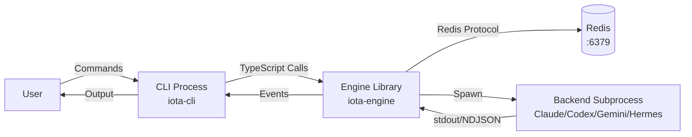

# CLI Guide

**Version:** 1.0
**Last Updated:** April 2026

## Table of Contents

1. [Introduction](#1-introduction)
2. [Architecture Overview](#2-architecture-overview)
3. [Prerequisites](#3-prerequisites)
4. [Installation and Setup](#4-installation-and-setup)
   - [Step 1: Start Redis](#step-1-start-redis)
   - [Step 2: Build Packages](#step-2-build-packages)
   - [Step 3: Make `iota` Available (PATH Setup)](#step-3-make-iota-available-path-setup)
   - [Step 4: Configure Backend](#step-4-configure-backend)
   - [Step 5: Verify Backend Health](#step-5-verify-backend-health)
5. [Core Functionality](#5-core-functionality)
   - [`iota run` — Execute a Prompt](#feature-iota-run--execute-a-prompt)
   - [`iota status` — Backend Health Check](#feature-iota-status--backend-health-check)
   - [`iota switch` — Backend Switching](#feature-iota-switch--backend-switching)
   - [`iota config` — Configuration Management](#feature-iota-config--configuration-management)
   - [`iota gc` — Garbage Collection](#feature-iota-gc--garbage-collection)
   - [`iota logs` — Distributed Log Query](#feature-iota-logs--distributed-log-query)
   - [`iota trace` — Distributed Trace Query](#feature-iota-trace--distributed-trace-query)
   - [`iota visibility` — Visibility Data Inspection](#feature-iota-visibility--visibility-data-inspection)
6. [Distributed Features](#6-distributed-features)
7. [Manual Verification Methods](#7-manual-verification-methods)
8. [Troubleshooting](#8-troubleshooting)
9. [Cleanup](#9-cleanup)
10. [References](#10-references)

---

## 1. Introduction

### Purpose and Scope

This guide covers all `iota` CLI commands and how to manually verify their behavior. The CLI is the primary user-facing interface to the Iota Engine, enabling prompt execution, session management, backend configuration, and distributed observability.

### Target Audience

- Developers verifying CLI functionality
- Users testing backend configurations
- Contributors debugging CLI-Engine interactions

### Prerequisites Overview

- Redis running on port 6379
- Iota Engine and CLI packages built
- At least one backend (Claude Code, Codex, Gemini CLI, or Hermes Agent) installed and accessible

---

## 2. Architecture Overview

### Component Diagram



### Dependencies

| Dependency | Version | Purpose | Connection Method |
|------------|---------|---------|-------------------|
| `@iota/engine` | built from source | Core runtime library | TypeScript imports |
| Redis | running on :6379 | Session, execution, visibility storage | Redis protocol/TCP |
| Backend executables | latest | AI coding assistant | Subprocess stdio |

### Communication Protocols

- **CLI → Engine**: Direct TypeScript function calls via `@iota/engine`
- **Engine → Redis**: Redis protocol over TCP (SET, GET, HSET, LPUSH, ZADD, etc.)
- **Engine → Backend**: Subprocess stdio pipes — NDJSON (Claude/Codex/Gemini) or JSON-RPC 2.0 (Hermes)
- **Backend → Engine**: stdout/stderr pipes emitting NDJSON events or JSON-RPC responses

**Reference**: See [00-architecture-overview.md](./00-architecture-overview.md) for system-wide architecture.

---

## 3. Prerequisites

### Required Software

| Software | Verification Command |
|----------|---------------------|
| Redis | `redis-cli ping` → `PONG` |
| Bun | `bun --version` |
| Backend CLI | See below |

**Backend executable discovery**:
```bash
which claude    # Claude Code
which codex     # Codex
which gemini    # Gemini CLI
which hermes    # Hermes Agent
```

### Environment Variables

```bash
# Redis connection bootstrap (defaults shown)
export REDIS_HOST="127.0.0.1"
export REDIS_PORT="6379"
```

Backend credentials and model settings are not read from `iota-engine/claude.env`, `codex.env`, `gemini.env`, or `hermes.env`. Store backend configuration in Redis through `iota config set`.

### Infrastructure Requirements

- **Redis**: Must be running before executing any `iota` command
- **Working directory**: Any directory — the CLI creates a session context automatically

---

## 4. Installation and Setup

### Step 1: Start Redis

```bash
cd deployment/scripts
bash start-storage.sh
redis-cli ping
# Expected: PONG
```

### Step 2: Build Packages

```bash
# Build Engine
cd iota-engine && bun install && bun run build

# Build CLI
cd ../iota-cli && bun install && bun run build
```

**Verification**:
```bash
ls iota-engine/dist/index.js    # Engine bundle exists
ls iota-cli/dist/index.js        # CLI bundle exists
```

### Step 3: Make `iota` Available (PATH Setup)

> **Note**: The `iota` command may not be automatically available in your PATH after building. Use one of these approaches before proceeding:

**Option A — Use `bun` with the built bundle** (recommended for development):
```bash
bun iota-cli/dist/index.js <command...>
# Example: bun iota-cli/dist/index.js status
```

**Option B — Install globally with npm link**:
```bash
cd iota-cli && npm link
# Now `iota` is globally available
iota status
```

**Option C — Add to PATH**:
```bash
export PATH="/path/to/iota/iota-cli/dist:$PATH"
```

> All examples below use bare `iota` for brevity. Replace with `bun iota-cli/dist/index.js` if you chose Option A.

### Step 4: Configure Backends in Redis

Backend config is stored in Redis hashes under `iota:config:backend:<backend>`. Use backend-scoped keys relative to the backend section. The current verified development Redis state is:

| Backend | Redis hash | Verified Redis fields | Auth source used in verification |
|---|---|---|---|
| Claude Code | `iota:config:backend:claude-code` | `env.ANTHROPIC_AUTH_TOKEN`, `env.ANTHROPIC_BASE_URL=https://api.minimaxi.com/anthropic`, `env.ANTHROPIC_MODEL=MiniMax-M2.7` | Redis distributed config |
| Codex | `iota:config:backend:codex` | `env.OPENAI_MODEL=gpt-5.5` | Codex ChatGPT auth in the local Codex profile; no Redis API key required for this verified setup |
| Gemini CLI | `iota:config:backend:gemini` | `env.GEMINI_MODEL=auto-gemini-3` | Gemini OAuth (`oauth-personal`) in local Gemini settings; no Redis API key required for this verified setup |
| Hermes Agent | `iota:config:backend:hermes` | `env.HERMES_API_KEY`, `env.HERMES_BASE_URL=https://api.minimaxi.com/anthropic`, `env.HERMES_MODEL=MiniMax-M2.7`, `env.HERMES_PROVIDER=minimax-cn` | Redis distributed config; Iota translates these into an isolated Hermes runtime config |

Recreate the verified Redis configuration with these commands. Replace secret values with real credentials only in Redis; do not commit them to files or docs.

**Claude Code**:
```bash
iota config set env.ANTHROPIC_AUTH_TOKEN "<redacted>" --scope backend --scope-id claude-code
iota config set env.ANTHROPIC_BASE_URL "https://api.minimaxi.com/anthropic" --scope backend --scope-id claude-code
iota config set env.ANTHROPIC_MODEL "MiniMax-M2.7" --scope backend --scope-id claude-code
```

**Codex**:
```bash
iota config set env.OPENAI_MODEL "gpt-5.5" --scope backend --scope-id codex
```

Codex can also use `env.OPENAI_API_KEY`, `env.OPENAI_BASE_URL`, or `env.CODEX_MODEL_PROVIDER` when the chosen Codex provider requires them. In the verified ChatGPT-auth setup, `gpt-5-mini` is not supported; `gpt-5.5` completed successfully.

**Gemini CLI**:
```bash
iota config set env.GEMINI_MODEL "auto-gemini-3" --scope backend --scope-id gemini
```

Gemini can also use `env.GEMINI_API_KEY`, `env.GEMINI_BASE_URL`, `env.GOOGLE_GEMINI_API_KEY`, `env.GOOGLE_GEMINI_BASE_URL`, or `env.GOOGLE_GEMINI_MODEL` when using API-key based auth. Do not store a local gateway such as `http://127.0.0.1:8045` unless that gateway is running.

**Hermes Agent**:
```bash
iota config set env.HERMES_API_KEY "<redacted>" --scope backend --scope-id hermes
iota config set env.HERMES_BASE_URL "https://api.minimaxi.com/anthropic" --scope backend --scope-id hermes
iota config set env.HERMES_MODEL "MiniMax-M2.7" --scope backend --scope-id hermes
iota config set env.HERMES_PROVIDER "minimax-cn" --scope backend --scope-id hermes
```

Hermes uses the same verified provider values as Claude Code, but with Hermes-specific Redis keys. At startup, Iota creates an isolated `HERMES_HOME` for the subprocess and translates these fields to Hermes-native `config.yaml` and provider env such as `MINIMAX_CN_API_KEY` / `MINIMAX_CN_BASE_URL`, so backend auth and model selection still come from Redis rather than the user's global Hermes config.

You can inspect any backend scope directly:

```bash
iota config get --scope backend --scope-id claude-code
redis-cli HGETALL iota:config:backend:claude-code
```

### Step 5: Verify Backend Health

```bash
iota status
# Expected: JSON showing backend health status
```

---

## 5. Core Functionality

### Feature: `iota run` — Execute a Prompt

**Purpose**: Execute a single prompt through the Engine and selected backend.

**Command Syntax**:
```bash
iota run [options] <prompt...>
iota [options] <prompt...>     # shorthand (iota with no subcommand)
```

**Options**:
- `--backend <backend>` — Backend to use (`claude-code`, `codex`, `gemini`, `hermes`)
- `--cwd <cwd>` — Working directory (default: current directory)
- `--trace` — Show full trace details after the run
- `--trace-json` — Show trace data as JSON

**Example**:
```bash
iota run --backend claude-code "What is 2+2?"
```

**Expected Output**: Streaming response from the backend, ending with exit code 0.

**Side Effects**:
- Creates Redis keys: `iota:session:{id}`, `iota:exec:{executionId}`, `iota:events:{executionId}`
- Creates visibility keys: `iota:visibility:tokens:{executionId}`, `iota:visibility:spans:{executionId}`, `iota:visibility:link:{executionId}`, `iota:visibility:context:{executionId}`, `iota:visibility:memory:{executionId}`, `iota:visibility:{executionId}:chain`, `iota:visibility:mapping:{executionId}`
- Creates session-exec mapping: `iota:session-execs:{sessionId}` (Set)
- Creates distributed lock: `iota:fencing:execution:{executionId}`

---

### Feature: `iota interactive` — Interactive TUI Mode

**Purpose**: Start an interactive REPL session with streaming output.

**Command Syntax**:
```bash
iota interactive
iota i              # shorthand
```

**In-session commands**:
- `switch <backend>` — Switch active backend
- `status` — Show backend health
- `metrics` — Show engine metrics
- `exit` / `quit` — End session

**Example**:
```bash
iota interactive
# iota> What is the capital of France?
# iota> switch gemini
# iota> status
# iota> exit
```

---

### Feature: `iota status` — Backend Health Check

**Purpose**: Show health status of all configured backends.

**Command Syntax**:
```bash
iota status
```

**Expected Output**:
```json
{
  "claude-code": { "healthy": true, "status": "ready", "uptimeMs": 3 },
  "codex": { "healthy": false, "status": "degraded", "lastError": "Executable not found" },
  "gemini": { "healthy": true, "status": "ready", "uptimeMs": 1 },
  "hermes": { "healthy": true, "status": "ready", "uptimeMs": 2 }
}
```

---

### Feature: `iota switch` — Backend Switching

**Purpose**: Change the default backend for the current working directory's session.

**Command Syntax**:
```bash
iota switch <backend>
```

**Example**:
```bash
iota switch gemini
redis-cli HGETALL "iota:session:{id}" | grep activeBackend
# Expected: activeBackend: gemini
```

---

### Feature: `iota config` — Configuration Management

**Purpose**: Read and write distributed configuration from Redis.

#### `iota config get` — Read Configuration

**Command Syntax**:
```bash
iota config get [path]
iota config get [path] --scope <scope> --scope-id <id>
```

**Examples**:
```bash
# Read resolved config (all sources merged)
iota config get

# Read specific key
iota config get approval.shell

# Read from specific Redis scope
iota config get env.ANTHROPIC_MODEL --scope backend --scope-id claude-code
iota config get --scope global
```

**Output**: JSON object or single value.

#### `iota config set` — Write Configuration

**Command Syntax**:
```bash
iota config set <path> <value>
iota config set <path> <value> --scope <scope> --scope-id <id>
```

**Examples**:
```bash
# Write to Redis global scope (default)
iota config set approval.shell "ask"

# Write to backend-specific scope
iota config set timeoutMs 60000 --scope backend --scope-id claude-code
iota config set env.ANTHROPIC_MODEL "claude-opus-4.6" --scope backend --scope-id claude-code
```

**Scope types**: `global`, `backend`, `session`, `user`

#### `iota config delete` — Delete Configuration Key

**Command Syntax**:
```bash
iota config delete <path> --scope <scope> --scope-id <id>
```

**Example**:
```bash
iota config delete approval.shell --scope global
```

#### `iota config export` — Export Configuration

**Command Syntax**:
```bash
iota config export <file>
```

**Example**:
```bash
iota config export config-backup.yaml
```

#### `iota config import` — Import Configuration

**Command Syntax**:
```bash
iota config import <file>
```

**Example**:
```bash
iota config import config-backup.yaml
```

#### `iota config list-scopes` — List Scope IDs

**Command Syntax**:
```bash
iota config list-scopes <scope>
```

**Example**:
```bash
iota config list-scopes backend
# claude-code
# codex
# gemini
# hermes
```

---

### Feature: `iota gc` — Garbage Collection

**Purpose**: Clean up expired sessions, executions, and visibility data from Redis.

**Command Syntax**:
```bash
iota gc
```

**Expected Output**: Summary of cleaned keys.

---

### Feature: `iota logs` — Distributed Log Query

**Purpose**: Query execution event logs from Redis with filtering.

**Command Syntax**:
```bash
iota logs [options]
```

**Options**:
- `--session <sessionId>` — Filter by session ID
- `--execution <executionId>` — Filter by execution ID
- `--backend <backend>` — Filter by backend name
- `--event-type <type>` — Filter by event type (`output`, `state`, `tool_call`, `tool_result`, `file_delta`, `error`, `extension`)
- `--since <time>` — Events after ISO time or Unix ms
- `--until <time>` — Events before ISO time or Unix ms
- `--offset <n>` — Offset for pagination (default: 0)
- `--limit <n>` — Maximum events (default: 100)
- `--aggregate` — Show aggregate counts instead of raw events
- `--json` — Output raw JSON events

**Examples**:
```bash
# Get all recent logs
iota logs --limit 50

# Get logs for specific session
iota logs --session a1b2c3d4-5678-90ab-cdef-1234567890ab --limit 20

# Get logs for specific execution
iota logs --execution e1f2g3h4-5678-90ab-cdef-345678901234

# Filter by backend
iota logs --backend claude-code --limit 20

# Filter by event type
iota logs --event-type output --limit 20

# Time range
iota logs --since 2026-04-01T00:00:00Z --until 2026-04-26T23:59:59Z

# Aggregate counts
iota logs --backend claude-code --aggregate
```

---

### Feature: `iota trace` — Distributed Trace Query

**Purpose**: Query execution trace/visibility data with filtering.

**Command Syntax**:
```bash
iota trace [options]
```

**Options**:
- `--execution <executionId>` — Show one execution trace
- `--session <sessionId>` — Aggregate traces for a session
- `--backend <backend>` — Filter by backend
- `--since <time>` — Traces after ISO time or Unix ms
- `--until <time>` — Traces before ISO time or Unix ms
- `--offset <n>` — Offset (default: 0)
- `--limit <n>` — Maximum executions (default: 100)
- `--aggregate` — Aggregate even when `--execution` is provided
- `--json` — Output raw JSON

**Examples**:
```bash
# Show one execution trace
iota trace --execution e1f2g3h4-5678-90ab-cdef-345678901234

# Aggregate traces for a session
iota trace --session a1b2c3d4-5678-90ab-cdef-1234567890ab
```

---

### Feature: `iota visibility` — Visibility Data Inspection

**Purpose**: Inspect execution visibility data (tokens, spans, memory, context, chain).

**Command Syntax**:
```bash
iota visibility [options]
iota vis [options]           # shorthand
```

**Options**:
- `--execution <executionId>` — Execution ID to inspect
- `--summary` — Show summary output for a session
- `--memory` — Show memory visibility only
- `--tokens` — Show token visibility only
- `--chain` — Show chain visibility only
- `--trace` — Show full tracing details with spans
- `--backend <backend>` — Filter by backend
- `--export <file>` — Export visibility data to file
- `--format <format>` — Export format: `json`, `yaml`, or `csv`
- `--limit <n>` — Maximum records for session queries
- `--offset <n>` — Offset for session queries
- `--json` — Output as JSON

**Examples**:
```bash
# Show full visibility for execution
iota visibility --execution e1f2g3h4-5678-90ab-cdef-345678901234

# List session visibility records
iota visibility list --session a1b2c3d4-5678-90ab-cdef-1234567890ab

# Export to JSON
iota visibility --execution e1f2g3h4 --export visibility.json --format json

# Memory visibility only
iota visibility --execution e1f2g3h4 --memory

# Tokens visibility only
iota visibility --execution e1f2g3h4 --tokens

# Chain (spans) visibility only
iota visibility --execution e1f2g3h4 --chain
```

#### `iota visibility list` — List Visibility Records

```bash
iota visibility list --session <sessionId> [options]
```

#### `iota visibility search` — Search by Prompt Preview

```bash
iota visibility search --session <sessionId> --prompt "binary search"
```

#### `iota visibility interactive` — Live Polling View

```bash
iota visibility interactive --session <sessionId> --interval 1000
```

---

## 6. Distributed Features

### Distributed Feature: Cross-Session Log Queries

**Purpose**: Query logs across all sessions without specifying a session ID.

**Procedure**:

1. **Create multiple sessions with different backends**:
   ```bash
   # Execute with Claude Code
   iota run --backend claude-code "test"
   
   # Execute with Gemini
   iota run --backend gemini "test"
   ```

2. **Query logs by backend**:
   ```bash
   iota logs --backend claude-code --limit 50
   iota logs --backend gemini --limit 50
   ```

3. **Verify**: Logs from different sessions appear with correct backend labels.

---

### Distributed Feature: Distributed Configuration Management

**Purpose**: Configuration is stored in Redis with scope-based isolation and resolution priority.

**Configuration Resolution Order** (highest to lowest priority):
1. `user` scope
2. `session` scope
3. `backend` scope
4. `global` scope
5. Default values

**Procedure**:

1. **Set global config**:
   ```bash
   iota config set approval.shell "ask"
   redis-cli HGET "iota:config:global" "approval.shell"
   # Expected: "ask"
   ```

2. **Set backend-specific config**:
   ```bash
   iota config set timeout 60000 --scope backend --scope-id claude-code
   redis-cli HGET "iota:config:backend:claude-code" "timeout"
   # Expected: "60000"
   ```

3. **Verify resolution**:
   ```bash
   iota config get approval.shell
   # Expected: "ask" (from global)
   ```

---

### Distributed Feature: Backend Switching with State Preservation

**Purpose**: Switching backends preserves session state (working directory, memory, conversation history).

**Procedure**:

1. **Create session and execute**:
   ```bash
   SESSION_ID=$(iota run --backend claude-code "test" 2>&1 | grep -oP 'sessionId:\s*\K[a-f0-9-]+' || echo "")
   # Or create via Agent API and pass session
   ```

2. **Switch backend**:
   ```bash
   iota switch gemini
   ```

3. **Verify session preserved**:
   ```bash
   redis-cli HGET "iota:session:{sessionId}" "workingDirectory"
   # Expected: Same directory as before switch
   ```

4. **Execute with new backend**:
   ```bash
   iota run --backend gemini "test 2"
   ```

5. **Verify execution records**:
   ```bash
   redis-cli HGET "iota:exec:{executionId1}" "backend"
   # Expected: "claude-code"
   redis-cli HGET "iota:exec:{executionId2}" "backend"
   # Expected: "gemini"
   ```

---

### Distributed Feature: Backend Isolation Verification

**Purpose**: Data is properly partitioned by backend.

**Procedure**:

1. **Query isolation report via Agent API**:
   ```bash
   curl http://localhost:9666/api/v1/backend-isolation
   ```

2. **Expected behavior**: Shows session and execution counts per backend with no cross-backend data leakage.

---

## 7. Manual Verification Methods

### Verification Checklist: `iota run` Command

**Objective**: Verify `iota run` creates correct Redis data structures.

- [ ] **Setup**: Redis running, packages built
  ```bash
  redis-cli ping
  # Expected: PONG
  ```

- [ ] **Execute**: Run a prompt
  ```bash
  redis-cli FLUSHALL   # Clean slate
  iota run --backend claude-code "What is 2+2?"
  # Expected: Streaming output, exit code 0
  ```

- [ ] **Observe**: Check Redis keys created
  ```bash
  redis-cli KEYS "iota:session:*"
  # Expected: 1 session key
  
  redis-cli KEYS "iota:exec:*"
  # Expected: 1 execution key
  
  redis-cli KEYS "iota:events:*"
  # Expected: 1 events key
  
  redis-cli KEYS "iota:visibility:*"
  # Expected: Multiple visibility keys (tokens, spans, link, context, memory)
  ```

- [ ] **Validate**: Inspect execution record
  ```bash
  EXEC_ID=$(redis-cli KEYS "iota:exec:*" | head -1 | cut -d: -f3)
  redis-cli HGET "iota:exec:$EXEC_ID" "status"
  # Expected: "completed" (or "failed" if backend unavailable)
  redis-cli HGET "iota:exec:$EXEC_ID" "backend"
  # Expected: "claude-code"
  ```

- [ ] **Cleanup**:
  ```bash
  redis-cli FLUSHALL
  ```

**Success Criteria**:
- ✅ Exit code 0
- ✅ Streaming output appears
- ✅ Session, execution, events, and visibility keys created in Redis
- ✅ Execution record shows correct backend and status

**Failure Indicators**:
- ❌ Non-zero exit code
- ❌ No Redis keys created
- ❌ Wrong backend in execution record

---

### Verification Checklist: Backend Switching

**Objective**: Verify backend switching preserves session state.

- [ ] **Setup**: Redis running, existing session with data
  ```bash
  redis-cli ping
  ```

- [ ] **Execute (Backend A)**: Run with initial backend
  ```bash
  iota run --backend claude-code "test with Claude"
  ```

- [ ] **Observe (Backend A)**: Record session ID and backend
  ```bash
  SESSION_ID=$(redis-cli KEYS "iota:session:*" | head -1 | cut -d: -f3)
  redis-cli HGET "iota:session:$SESSION_ID" "activeBackend"
  # Expected: "claude-code"
  redis-cli HGET "iota:session:$SESSION_ID" "workingDirectory"
  # Note this value
  ```

- [ ] **Execute (Switch)**: Switch to different backend
  ```bash
  iota switch gemini --cwd $(redis-cli HGET "iota:session:$SESSION_ID" "workingDirectory")
  redis-cli HGET "iota:session:$SESSION_ID" "activeBackend"
  # Expected: "gemini"
  ```

- [ ] **Execute (Backend B)**: Run with new backend
  ```bash
  iota run --backend gemini "test with Gemini"
  ```

- [ ] **Validate**: Verify execution records and state preservation
  ```bash
  # Check both executions have correct backends
  # Check workingDirectory preserved
  ```

- [ ] **Cleanup**:
  ```bash
  redis-cli FLUSHALL
  ```

**Success Criteria**:
- ✅ Backend field updated in Redis session
- ✅ New executions use selected backend
- ✅ Session workingDirectory preserved
- ✅ No data loss during switch

---

### Redis Inspection Commands

```bash
# List all Iota keys
redis-cli KEYS "iota:*"

# Inspect session hash
redis-cli HGETALL "iota:session:{sessionId}"

# Inspect execution hash
redis-cli HGETALL "iota:exec:{executionId}"

# View event stream
redis-cli LRANGE "iota:events:{execId}" 0 -1

# Check memory count
redis-cli ZCARD "iota:memories:{sessionId}"

# View visibility tokens
redis-cli GET "iota:visibility:tokens:{execId}"

# View visibility spans
redis-cli LRANGE "iota:visibility:spans:{execId}" 0 -1

# View visibility chain (TraceSpan list)
redis-cli LRANGE "iota:visibility:{executionId}:chain" 0 -1

# View visibility mapping (native → runtime event mappings)
redis-cli LRANGE "iota:visibility:mapping:{executionId}" 0 -1

# View session-exec mapping (Set of executionIds)
redis-cli SMEMBERS "iota:session-execs:{sessionId}"

# View global execution index (Sorted Set)
redis-cli ZRANGE "iota:executions" 0 -1

# View distributed lock (fencing)
redis-cli GET "iota:fencing:execution:{executionId}"

# View audit log
redis-cli LRANGE "iota:audit" 0 -1

# View session visibility index
redis-cli ZRANGE "iota:visibility:session:{sessionId}" 0 -1

# View visibility memory
redis-cli GET "iota:visibility:memory:{execId}"

# View visibility context
redis-cli GET "iota:visibility:context:{execId}"

# View visibility link
redis-cli GET "iota:visibility:link:{execId}"

# Check config keys
redis-cli HGETALL "iota:config:global"
redis-cli HGETALL "iota:config:backend:{backendName}"

# List backend scope IDs
redis-cli KEYS "iota:config:backend:*"
```

---

## 8. Troubleshooting

### Issue: Redis Connection Failed

**Symptoms**:
- `ECONNREFUSED 127.0.0.1:6379`
- Commands fail with connection errors

**Diagnosis**:
```bash
redis-cli ping
# If fails: Redis not running
```

**Solution**:
```bash
cd deployment/scripts
bash start-storage.sh
redis-cli ping
# Expected: PONG
```

**Prevention**: Always start Redis before running Iota commands.

---

### Issue: Backend Not Found

**Symptoms**:
- `Backend 'claude-code' not found`
- `iota status` shows backend as unhealthy

**Diagnosis**:
```bash
which claude
# If empty: Claude CLI not in PATH

iota status
# Check "healthy" field for backend
```

**Solution**:
```bash
# Install Claude CLI and add to PATH
export PATH="/path/to/claude:$PATH"

# Verify
which claude
iota status
```

---

### Issue: Config Not Persisting

**Symptoms**:
- `iota config set` succeeds but value not found in Redis
- Config reverts after restart

**Diagnosis**:
```bash
redis-cli HGET "iota:config:global" "approval.shell"
# If empty: Config not written to Redis
```

**Solution**:
```bash
# Write to Redis distributed config
iota config set approval.shell "ask"
redis-cli HGET "iota:config:global" "approval.shell"
```

---

### Issue: No Streaming Output

**Symptoms**:
- Command runs but output appears all at once, not streamed

**Diagnosis**:
```bash
# Check backend is functioning
iota status

# Check execution completed
redis-cli HGETALL "iota:exec:{executionId}" | grep status
```

**Solution**:
- Check backend CLI is properly installed
- Try with `--trace` to see internal flow
- Verify backend supports streaming

---

## 9. Cleanup

### Reset CLI State

```bash
# Flush all Redis data (clean slate)
redis-cli FLUSHALL

# Or selectively delete test session
SESSION_ID="test-session-id"
redis-cli DEL "iota:session:$SESSION_ID"
redis-cli KEYS "iota:exec:*" | xargs redis-cli DEL
redis-cli KEYS "iota:events:*" | xargs redis-cli DEL
redis-cli KEYS "iota:visibility:*" | xargs redis-cli DEL
redis-cli DEL "iota:memories:$SESSION_ID" "iota:session-execs:$SESSION_ID"
```

### Environment Teardown

```bash
# Stop Redis
cd deployment/scripts
bash stop-storage.sh
```

---

## 10. References

### Related Guides

- [00-architecture-overview.md](./00-architecture-overview.md) — System architecture
- [02-tui-guide.md](./02-tui-guide.md) — Interactive TUI mode
- [03-agent-guide.md](./03-agent-guide.md) — Agent API verification
- [04-app-guide.md](./04-app-guide.md) — App UI verification
- [05-engine-guide.md](./05-engine-guide.md) — Engine internals

### External Documentation

- [CLI README](../../iota-cli/README.md)
- [Engine README](../../iota-engine/README.md)
- [Deployment README](../../deployment/README.md)

---

## Version History

| Version | Date | Changes |
|---------|------|---------|
| 1.0 | April 2026 | Initial release |
