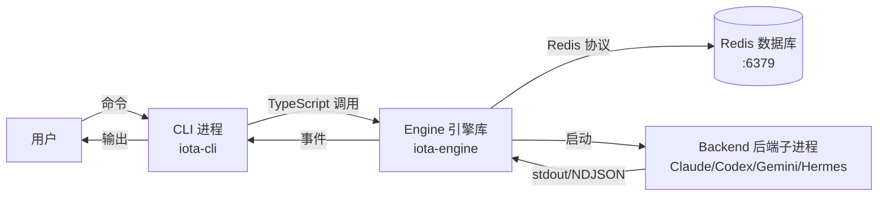

# CLI 命令行接口指南

**版本:** 1.1
**最后更新:** 2026 年 4 月

## 目录

1. [简介](#1-简介)
2. [架构概览](#2-架构概览)
3. [前置要求](#3-前置要求)
4. [安装与设置](#4-安装与设置)
   - [步骤 1: 启动 Redis](#步骤-1-启动-redis)
   - [步骤 2: 构建软件包](#步骤-2-构建软件包)
   - [步骤 3: 使 `iota` 可用（PATH 设置）](#步骤-3-使-iota-可用path-设置)
   - [步骤 4: 配置 Backend 后端](#步骤-4-配置-backend-后端)
   - [步骤 5: 验证 Backend 后端健康状态](#步骤-5-验证-backend-后端健康状态)
5. [核心功能](#5-核心功能)
   - [`iota run` — 执行提示词](#功能-iota-run--执行提示词)
   - [`iota status` — Backend 后端健康检查](#功能-iota-status--backend-后端健康检查)
   - [`iota switch` — Backend 后端切换](#功能-iota-switch--backend-后端切换)
   - [`iota config` — 配置管理](#功能-iota-config--配置管理)
   - [`iota gc` — 垃圾回收](#功能-iota-gc--垃圾回收)
   - [`iota logs` — 分布式日志查询](#功能-iota-logs--分布式日志查询)
   - [`iota trace` — 分布式 Trace 追踪查询](#功能-iota-trace--分布式-trace-追踪查询)
   - [`iota visibility` — Visibility 可见性数据检查](#功能-iota-visibility--visibility-可见性数据检查)
6. [分布式特性](#6-分布式特性)
7. [手动验证方法](#7-手动验证方法)
8. [故障排查](#8-故障排查)
9. [清理](#9-清理)
10. [参考资料](#10-参考资料)

---

## 1. 简介

### 目的与范围

本指南涵盖所有 `iota` CLI 命令行接口命令及其手动验证方法。CLI 是 Iota Engine 引擎的主要用户界面，支持提示词执行、Session 会话管理、Backend 后端配置和分布式可观测性。

### 目标读者

- 验证 CLI 功能的开发者
- 测试 Backend 后端配置的用户
- 调试 CLI-Engine 交互的贡献者

### 前置要求概览

- Redis 数据库运行在 6379 端口
- Iota Engine 引擎和 CLI 软件包已构建
- 至少安装并可访问一个 Backend 后端（Claude Code、Codex、Gemini CLI 或 Hermes Agent）

---

## 2. 架构概览

### 组件图



### 依赖项

| 依赖项 | 版本 | 用途 | 连接方式 |
|------------|---------|---------|-------------------|
| `@iota/engine` | 从源码构建 | 核心运行时库 | TypeScript 导入 |
| Redis | 运行在 :6379 | Session 会话、Execution 执行、Visibility 可见性存储 | Redis 协议/TCP |
| Backend 后端可执行文件 | 最新版 | AI 编码助手 | 子进程 stdio |

### 通信协议

- **CLI → Engine 引擎**: 通过 `@iota/engine` 直接调用 TypeScript 函数
- **Engine 引擎 → Redis 数据库**: 通过 TCP 的 Redis 协议（SET、GET、HSET、XADD、XRANGE、ZADD 等）
- **Engine 引擎 → Backend 后端**: 子进程 stdio 管道 — NDJSON（Claude/Codex/Gemini）或 JSON-RPC 2.0（Hermes）
- **Backend 后端 → Engine 引擎**: stdout/stderr 管道发出 NDJSON 事件或 JSON-RPC 响应

**参考**: 查看 [00-architecture-overview.md](./00-architecture-overview.md) 了解系统级架构。

---

## 3. 前置要求

### 必需软件

| 软件 | 验证命令 |
|----------|---------------------|
| Redis | `redis-cli ping` → `PONG` |
| Bun | `bun --version` |
| Backend 后端 CLI | 见下文 |

**Backend 后端可执行文件发现**:
```bash
which claude    # Claude Code
which codex     # Codex
which gemini    # Gemini CLI
which hermes    # Hermes Agent
```

### 环境变量

```bash
# Redis 连接引导（显示默认值）
export REDIS_HOST="127.0.0.1"
export REDIS_PORT="6379"
```

Backend 后端凭证和模型设置不从 `iota-engine/claude.env`、`codex.env`、`gemini.env` 或 `hermes.env` 读取。通过 `iota config set` 将 Backend 后端配置存储在 Redis 数据库中。

### 基础设施要求

- **Redis 数据库**: 执行任何 `iota` 命令前必须运行
- **工作目录**: 任意目录 — CLI 自动创建 Session 会话上下文

---

## 4. 安装与设置

### 步骤 1: 启动 Redis

```bash
cd deployment/scripts
bash start-storage.sh
redis-cli ping
# 预期: PONG
```

### 步骤 2: 构建软件包

```bash
# 构建 Engine 引擎
cd iota-engine && bun install && bun run build

# 构建 CLI
cd ../iota-cli && bun install && bun run build
```

**验证**:
```bash
ls iota-engine/dist/index.js    # Engine 引擎包存在
ls iota-cli/dist/index.js        # CLI 包存在
```

### 步骤 3: 使 `iota` 可用（PATH 设置）

> **注意**: 构建后 `iota` 命令可能不会自动添加到 PATH。继续之前使用以下方法之一:

**选项 A — 使用 `bun` 运行构建包**（推荐用于开发）:
```bash
bun iota-cli/dist/index.js <command...>
# 示例: bun iota-cli/dist/index.js status
```

**选项 B — 使用 npm link 全局安装**:
```bash
cd iota-cli && npm link
# 现在 `iota` 全局可用
iota status
```

**选项 C — 添加到 PATH**:
```bash
export PATH="/path/to/iota/iota-cli/dist:$PATH"
```

> 下面所有示例为简洁起见使用 `iota`。如果选择选项 A，请替换为 `bun iota-cli/dist/index.js`。

### 步骤 4: 在 Redis 中配置 Backend 后端

Backend 后端配置存储在 Redis 哈希 `iota:config:backend:<backend>` 中。使用相对于 Backend 后端部分的作用域键。当前已验证的开发 Redis 状态为:

| Backend 后端 | Redis 哈希 | 已验证的 Redis 字段 | 验证中使用的认证源 |
|---|---|---|---|
| Claude Code | `iota:config:backend:claude-code` | `env.ANTHROPIC_AUTH_TOKEN`, `env.ANTHROPIC_BASE_URL=https://api.minimaxi.com/anthropic`, `env.ANTHROPIC_MODEL=MiniMax-M2.7` | Redis 分布式配置 |
| Codex | `iota:config:backend:codex` | `env.OPENAI_MODEL=gpt-5.5` | 本地 Codex 配置文件中的 Codex ChatGPT 认证；此已验证设置不需要 Redis API 密钥 |
| Gemini CLI | `iota:config:backend:gemini` | `env.GEMINI_MODEL=auto-gemini-3` | 本地 Gemini 设置中的 Gemini OAuth（`oauth-personal`）；此已验证设置不需要 Redis API 密钥 |
| Hermes Agent | `iota:config:backend:hermes` | `env.HERMES_API_KEY`, `env.HERMES_BASE_URL=https://api.minimaxi.com/anthropic`, `env.HERMES_MODEL=MiniMax-M2.7`, `env.HERMES_PROVIDER=minimax-cn` | Redis 分布式配置；Iota 将这些转换为隔离的 Hermes 运行时配置 |

使用以下命令重建已验证的 Redis 配置。仅在 Redis 中用真实凭证替换密钥值；不要将它们提交到文件或文档。

**Claude Code**:
```bash
iota config set env.ANTHROPIC_AUTH_TOKEN "<redacted>" --scope backend --scope-id claude-code
iota config set env.ANTHROPIC_BASE_URL "https://api.minimaxi.com/anthropic" --scope backend --scope-id claude-code
iota config set env.ANTHROPIC_MODEL "MiniMax-M2.7" --scope backend --scope-id claude-code
```

**Codex**:
```bash
iota config set env.OPENAI_MODEL "gpt-5.5" --scope backend --scope-id codex
```

Codex 也可以使用 `env.OPENAI_API_KEY`、`env.OPENAI_BASE_URL` 或 `env.CODEX_MODEL_PROVIDER`，当所选 Codex 提供商需要时。在已验证的 ChatGPT 认证设置中，不支持 `gpt-5-mini`；`gpt-5.5` 成功完成。

**Gemini CLI**:
```bash
iota config set env.GEMINI_MODEL "auto-gemini-3" --scope backend --scope-id gemini
```

Gemini 也可以使用 `env.GEMINI_API_KEY`、`env.GEMINI_BASE_URL`、`env.GOOGLE_GEMINI_API_KEY`、`env.GOOGLE_GEMINI_BASE_URL` 或 `env.GOOGLE_GEMINI_MODEL`，当使用基于 API 密钥的认证时。除非该网关正在运行，否则不要存储本地网关如 `http://127.0.0.1:8045`。

**Hermes Agent**:
```bash
iota config set env.HERMES_API_KEY "<redacted>" --scope backend --scope-id hermes
iota config set env.HERMES_BASE_URL "https://api.minimaxi.com/anthropic" --scope backend --scope-id hermes
iota config set env.HERMES_MODEL "MiniMax-M2.7" --scope backend --scope-id hermes
iota config set env.HERMES_PROVIDER "minimax-cn" --scope backend --scope-id hermes
```

Hermes 使用与 Claude Code 相同的已验证提供商值，但使用 Hermes 特定的 Redis 键。启动时，Iota 为子进程创建隔离的 `HERMES_HOME`，并将这些字段转换为 Hermes 原生的 `config.yaml` 和提供商环境变量如 `MINIMAX_CN_API_KEY` / `MINIMAX_CN_BASE_URL`，因此 Backend 后端认证和模型选择仍来自 Redis 而非用户的全局 Hermes 配置。

您可以直接检查任何 Backend 后端作用域:

```bash
iota config get --scope backend --scope-id claude-code
redis-cli HGETALL iota:config:backend:claude-code
```

### 步骤 5: 验证 Backend 后端健康状态

```bash
iota status
# 预期: 显示 Backend 后端健康状态的 JSON
```

---

## 5. 核心功能

### 功能: `iota run` — 执行提示词

**目的**: 通过 Engine 引擎和选定的 Backend 后端执行单个提示词。

**命令语法**:
```bash
iota run [options] <prompt...>
iota [options] <prompt...>     # 简写（iota 无子命令）
```

**选项**:
- `--backend <backend>` — 使用的 Backend 后端（`claude-code`、`codex`、`gemini`、`hermes`）
- `--cwd <cwd>` — 工作目录（默认: 当前目录）
- `--trace` — 运行后显示完整 Trace 追踪详情
- `--trace-json` — 以 JSON 格式显示 Trace 追踪数据

**示例**:
```bash
iota run --backend claude-code "What is 2+2?"
```

**预期输出**: Backend 后端的流式响应，以退出码 0 结束。

**副作用**:
- 创建 Redis 键: `iota:session:{id}`、`iota:exec:{executionId}`、`iota:events:{executionId}`
- 创建 Visibility 可见性键: `iota:visibility:tokens:{executionId}`、`iota:visibility:spans:{executionId}`、`iota:visibility:link:{executionId}`、`iota:visibility:context:{executionId}`、`iota:visibility:memory:{executionId}`、`iota:visibility:{executionId}:chain`、`iota:visibility:mapping:{executionId}`
- 创建 Session-Exec 会话-执行映射: `iota:session-execs:{sessionId}`（Set）
- 创建分布式锁: `iota:fencing:execution:{executionId}`

---

### 功能: `iota interactive` — 交互式 TUI 模式

**目的**: 启动带流式输出的交互式 REPL Session 会话。

**架构说明**: `iota interactive` 由 `iota-cli` 在本地进程内创建 `IotaEngine` 实例并直接调用 `engine.stream()`。它不通过 `iota-agent`，因此运行 TUI 不需要先启动 Agent，审批也使用 CLI 侧的 `CliApprovalHook` 而不是 Agent 的 WebSocket 流程。

**命令语法**:
```bash
iota interactive
iota i              # 简写
```

**会话内命令**:
- `switch <backend>` — 切换活动 Backend 后端
- `status` — 显示 Backend 后端健康状态
- `metrics` — 显示 Engine 引擎指标
- `exit` / `quit` — 结束 Session 会话

**示例**:
```bash
iota interactive
# iota> What is the capital of France?
# iota> switch gemini
# iota> status
# iota> exit
```

---

### 功能: `iota status` — Backend 后端健康检查

**目的**: 显示所有已配置 Backend 后端的健康状态。

**命令语法**:
```bash
iota status
```

**预期输出**:
```json
{
  "claude-code": { "healthy": true, "status": "ready", "uptimeMs": 3 },
  "codex": { "healthy": false, "status": "degraded", "lastError": "Executable not found" },
  "gemini": { "healthy": true, "status": "ready", "uptimeMs": 1 },
  "hermes": { "healthy": true, "status": "ready", "uptimeMs": 2 }
}
```

---

### 功能: `iota switch` — Backend 后端切换

**目的**: 更改当前工作目录 Session 会话的默认 Backend 后端。

**命令语法**:
```bash
iota switch <backend>
```

**示例**:
```bash
iota switch gemini
redis-cli HGETALL "iota:session:{id}" | grep activeBackend
# 预期: activeBackend: gemini
```

---

### 功能: `iota config` — 配置管理

**目的**: 从 Redis 数据库读写分布式配置。

#### `iota config get` — 读取配置

**命令语法**:
```bash
iota config get [path]
iota config get [path] --scope <scope> --scope-id <id>
```

**示例**:
```bash
# 读取解析后的配置（所有源合并）
iota config get

# 读取特定键
iota config get approval.shell

# 从特定 Redis 作用域读取
iota config get env.ANTHROPIC_MODEL --scope backend --scope-id claude-code
iota config get --scope global
```

**输出**: JSON 对象或单个值。

#### `iota config set` — 写入配置

**命令语法**:
```bash
iota config set <path> <value>
iota config set <path> <value> --scope <scope> --scope-id <id>
```

**示例**:
```bash
# 写入 Redis 全局作用域（默认）
iota config set approval.shell "ask"

# 写入 Backend 后端特定作用域
iota config set timeoutMs 60000 --scope backend --scope-id claude-code
iota config set env.ANTHROPIC_MODEL "claude-opus-4.6" --scope backend --scope-id claude-code
```

**作用域类型**: `global`、`backend`、`session`、`user`

#### `iota config delete` — 删除配置键

**命令语法**:
```bash
iota config delete <path> --scope <scope> --scope-id <id>
```

**示例**:
```bash
iota config delete approval.shell --scope global
```

#### `iota config export` — 导出配置

**命令语法**:
```bash
iota config export <file>
```

**示例**:
```bash
iota config export config-backup.yaml
```

#### `iota config import` — 导入配置

**命令语法**:
```bash
iota config import <file>
```

**示例**:
```bash
iota config import config-backup.yaml
```

#### `iota config list-scopes` — 列出作用域 ID

**命令语法**:
```bash
iota config list-scopes <scope>
```

**示例**:
```bash
iota config list-scopes backend
# claude-code
# codex
# gemini
# hermes
```

---

### 功能: `iota gc` — 垃圾回收

**目的**: 从 Redis 数据库清理过期的 Session 会话、Execution 执行和 Visibility 可见性数据。

**命令语法**:
```bash
iota gc
```

**预期输出**: 已清理键的摘要。

---

### 功能: `iota logs` — 分布式日志查询

**目的**: 从 Redis 数据库查询带过滤的 Execution 执行事件日志。

**命令语法**:
```bash
iota logs [options]
```

**选项**:
- `--session <sessionId>` — 按 Session 会话 ID 过滤
- `--execution <executionId>` — 按 Execution 执行 ID 过滤
- `--backend <backend>` — 按 Backend 后端名称过滤
- `--event-type <type>` — 按事件类型过滤（`output`、`state`、`tool_call`、`tool_result`、`file_delta`、`error`、`extension`）
- `--since <time>` — ISO 时间或 Unix 毫秒之后的事件
- `--until <time>` — ISO 时间或 Unix 毫秒之前的事件
- `--offset <n>` — 分页偏移量（默认: 0）
- `--limit <n>` — 最大事件数（默认: 100）
- `--aggregate` — 显示聚合计数而非原始事件
- `--json` — 输出原始 JSON 事件

**示例**:
```bash
# 获取所有最近日志
iota logs --limit 50

# 获取特定 Session 会话的日志
iota logs --session 4afe5990-d7be-4899-83ae-b2bb48a2c0dc --limit 20

# 获取特定 Execution 执行的日志
iota logs --execution exec_2278345f-7d23-4b91-8c43-06bea200718e

# 按 Backend 后端过滤
iota logs --backend claude-code --limit 20

# 按事件类型过滤
iota logs --event-type output --limit 20

# 时间范围
iota logs --since 2026-04-01T00:00:00Z --until 2026-04-26T23:59:59Z

# 聚合计数
iota logs --backend claude-code --aggregate
```

---

### 功能: `iota trace` — 分布式 Trace 追踪查询

**目的**: 查询带过滤的 Execution 执行 Trace 追踪/Visibility 可见性数据。

**命令语法**:
```bash
iota trace [options]
```

**选项**:
- `--execution <executionId>` — 显示单个 Execution 执行 Trace 追踪
- `--session <sessionId>` — 聚合 Session 会话的 Trace 追踪
- `--backend <backend>` — 按 Backend 后端过滤
- `--since <time>` — ISO 时间或 Unix 毫秒之后的 Trace 追踪
- `--until <time>` — ISO 时间或 Unix 毫秒之前的 Trace 追踪
- `--offset <n>` — 偏移量（默认: 0）
- `--limit <n>` — 最大 Execution 执行数（默认: 100）
- `--aggregate` — 即使提供 `--execution` 也聚合
- `--json` — 输出原始 JSON

**示例**:
```bash
# 显示单个 Execution 执行 Trace 追踪
iota trace --execution exec_2278345f-7d23-4b91-8c43-06bea200718e

# 聚合 Session 会话的 Trace 追踪
iota trace --session 4afe5990-d7be-4899-83ae-b2bb48a2c0dc
```

---

### 功能: `iota visibility` — Visibility 可见性数据检查

**目的**: 检查 Execution 执行 Visibility 可见性数据（tokens、spans、memory、context、chain）。

**命令语法**:
```bash
iota visibility [options]
iota vis [options]           # 简写
```

**选项**:
- `--execution <executionId>` — 要检查的 Execution 执行 ID
- `--summary` — 显示 Session 会话的摘要输出
- `--memory` — 仅显示 memory 可见性
- `--tokens` — 仅显示 token 可见性
- `--chain` — 仅显示 chain 可见性
- `--trace` — 显示带 span 的完整 Trace 追踪详情
- `--backend <backend>` — 按 Backend 后端过滤
- `--export <file>` — 导出 Visibility 可见性数据到文件
- `--format <format>` — 导出格式: `json`、`yaml` 或 `csv`
- `--limit <n>` — Session 会话查询的最大记录数
- `--offset <n>` — Session 会话查询的偏移量
- `--json` — 输出为 JSON

**示例**:
```bash
# 显示 Execution 执行的完整 Visibility 可见性
iota visibility --execution exec_2278345f-7d23-4b91-8c43-06bea200718e

# 列出 Session 会话 Visibility 可见性记录
iota visibility list --session 4afe5990-d7be-4899-83ae-b2bb48a2c0dc

# 导出为 JSON
iota visibility --execution exec_2278345f-7d23-4b91-8c43-06bea200718e --export visibility.json --format json

# 仅 Memory 可见性
iota visibility --execution exec_2278345f-7d23-4b91-8c43-06bea200718e --memory

# 仅 Token 可见性
iota visibility --execution exec_2278345f-7d23-4b91-8c43-06bea200718e --tokens

# 仅 Chain（spans）可见性
iota visibility --execution exec_2278345f-7d23-4b91-8c43-06bea200718e --chain
```

#### `iota visibility list` — 列出 Visibility 可见性记录

```bash
iota visibility list --session <sessionId> [options]
```

#### `iota visibility search` — 按提示词预览搜索

```bash
iota visibility search --session <sessionId> --prompt "binary search"
```

#### `iota visibility interactive` — 实时轮询视图

```bash
iota visibility interactive --session <sessionId> --interval 1000
```

---

## 6. 分布式特性

### 分布式特性: 跨 Session 会话日志查询

**目的**: 无需指定 Session 会话 ID 即可跨所有 Session 会话查询日志。

**步骤**:

1. **使用不同 Backend 后端创建多个 Session 会话**:
   ```bash
   # 使用 Claude Code 执行
   iota run --backend claude-code "test"
   
   # 使用 Gemini 执行
   iota run --backend gemini "test"
   ```

2. **按 Backend 后端查询日志**:
   ```bash
   iota logs --backend claude-code --limit 50
   iota logs --backend gemini --limit 50
   ```

3. **验证**: 来自不同 Session 会话的日志显示正确的 Backend 后端标签。

---

### 分布式特性: 分布式配置管理

**目的**: 配置存储在 Redis 数据库中，具有基于作用域的隔离和解析优先级。

**配置解析顺序**（从高到低优先级）:
1. `user` 用户作用域
2. `session` 会话作用域
3. `backend` 后端作用域
4. `global` 全局作用域
5. 默认值

**步骤**:

1. **设置全局配置**:
   ```bash
   iota config set approval.shell "ask"
   redis-cli HGET "iota:config:global" "approval.shell"
   # 预期: "ask"
   ```

2. **设置 Backend 后端特定配置**:
   ```bash
   iota config set timeout 60000 --scope backend --scope-id claude-code
   redis-cli HGET "iota:config:backend:claude-code" "timeout"
   # 预期: "60000"
   ```

3. **验证解析**:
   ```bash
   iota config get approval.shell
   # 预期: "ask"（来自全局）
   ```

---

### 分布式特性: Backend 后端切换与状态保留

**目的**: 切换 Backend 后端时保留 Session 会话状态（工作目录、memory、对话历史）。

**步骤**:

1. **创建 Session 会话并执行**:
   ```bash
   SESSION_ID=$(iota run --backend claude-code "test" 2>&1 | grep -oP 'sessionId:\s*\K[a-f0-9-]+' || echo "")
   # 或通过 Agent API 创建并传递 Session 会话
   ```

2. **切换 Backend 后端**:
   ```bash
   iota switch gemini
   ```

3. **验证 Session 会话保留**:
   ```bash
   redis-cli HGET "iota:session:{sessionId}" "workingDirectory"
   # 预期: 与切换前相同的目录
   ```

4. **使用新 Backend 后端执行**:
   ```bash
   iota run --backend gemini "test 2"
   ```

5. **验证 Execution 执行记录**:
   ```bash
   redis-cli HGET "iota:exec:{executionId1}" "backend"
   # 预期: "claude-code"
   redis-cli HGET "iota:exec:{executionId2}" "backend"
   # 预期: "gemini"
   ```

---

### 分布式特性: Backend 后端隔离验证

**目的**: 数据按 Backend 后端正确分区。

**步骤**:

1. **通过 Agent API 查询隔离报告**:
   ```bash
   curl http://localhost:9666/api/v1/backend-isolation
   ```

2. **预期行为**: 显示每个 Backend 后端的 Session 会话和 Execution 执行计数，无跨 Backend 后端数据泄漏。

---

## 7. 手动验证方法

### 验证清单: `iota run` 命令

**目标**: 验证 `iota run` 创建正确的 Redis 数据结构。

- [ ] **设置**: Redis 运行中，软件包已构建
  ```bash
  redis-cli ping
  # 预期: PONG
  ```

- [ ] **执行**: 运行提示词
  ```bash
  redis-cli FLUSHALL   # 清空状态
  iota run --backend claude-code "What is 2+2?"
  # 预期: 流式输出，退出码 0
  ```

- [ ] **观察**: 检查创建的 Redis 键
  ```bash
  redis-cli KEYS "iota:session:*"
  # 预期: 1 个 Session 会话键
  
  redis-cli KEYS "iota:exec:*"
  # 预期: 1 个 Execution 执行键
  
  redis-cli KEYS "iota:events:*"
  # 预期: 1 个事件键
  
  redis-cli KEYS "iota:visibility:*"
  # 预期: 多个 Visibility 可见性键（tokens、spans、link、context、memory）
  ```

- [ ] **验证**: 检查 Execution 执行记录
  ```bash
  EXEC_ID=$(redis-cli KEYS "iota:exec:*" | head -1 | cut -d: -f3)
  redis-cli HGET "iota:exec:$EXEC_ID" "status"
  # 预期: "completed"（或 "failed" 如果 Backend 后端不可用）
  redis-cli HGET "iota:exec:$EXEC_ID" "backend"
  # 预期: "claude-code"
  ```

- [ ] **清理**:
  ```bash
  redis-cli FLUSHALL
  ```

**成功标准**:
- ✅ 退出码 0
- ✅ 出现流式输出
- ✅ 在 Redis 中创建 Session 会话、Execution 执行、事件和 Visibility 可见性键
- ✅ Execution 执行记录显示正确的 Backend 后端和状态

**失败指标**:
- ❌ 非零退出码
- ❌ 未创建 Redis 键
- ❌ Execution 执行记录中 Backend 后端错误

---

### 验证清单: Backend 后端切换

**目标**: 验证 Backend 后端切换保留 Session 会话状态。

- [ ] **设置**: Redis 运行中，现有 Session 会话有数据
  ```bash
  redis-cli ping
  ```

- [ ] **执行（Backend 后端 A）**: 使用初始 Backend 后端运行
  ```bash
  iota run --backend claude-code "test with Claude"
  ```

- [ ] **观察（Backend 后端 A）**: 记录 Session 会话 ID 和 Backend 后端
  ```bash
  SESSION_ID=$(redis-cli KEYS "iota:session:*" | head -1 | cut -d: -f3)
  redis-cli HGET "iota:session:$SESSION_ID" "activeBackend"
  # 预期: "claude-code"
  redis-cli HGET "iota:session:$SESSION_ID" "workingDirectory"
  # 记录此值
  ```

- [ ] **执行（切换）**: 切换到不同 Backend 后端
  ```bash
  iota switch gemini --cwd $(redis-cli HGET "iota:session:$SESSION_ID" "workingDirectory")
  redis-cli HGET "iota:session:$SESSION_ID" "activeBackend"
  # 预期: "gemini"
  ```

- [ ] **执行（Backend 后端 B）**: 使用新 Backend 后端运行
  ```bash
  iota run --backend gemini "test with Gemini"
  ```

- [ ] **验证**: 验证 Execution 执行记录和状态保留
  ```bash
  # 检查两个 Execution 执行都有正确的 Backend 后端
  # 检查 workingDirectory 已保留
  ```

- [ ] **清理**:
  ```bash
  redis-cli FLUSHALL
  ```

**成功标准**:
- ✅ Redis Session 会话中的 Backend 后端字段已更新
- ✅ 新 Execution 执行使用选定的 Backend 后端
- ✅ Session 会话 workingDirectory 已保留
- ✅ 切换期间无数据丢失

---

### Redis 检查命令

```bash
# 列出所有 Iota 键
redis-cli KEYS "iota:*"

# 检查 Session 会话哈希
redis-cli HGETALL "iota:session:{sessionId}"

# 检查 Execution 执行哈希
redis-cli HGETALL "iota:exec:{executionId}"

# 查看事件流（Redis Stream，使用 XRANGE 而非 LRANGE）
redis-cli XRANGE "iota:events:{execId}" - +

# 检查 memory 计数
redis-cli ZCARD "iota:memories:{sessionId}"

# 查看 Visibility 可见性 token
redis-cli GET "iota:visibility:tokens:{execId}"

# 查看 Visibility 可见性 span（List）
redis-cli LRANGE "iota:visibility:spans:{execId}" 0 -1

# 查看 Visibility 可见性 chain（Hash: spanId → TraceSpan）
redis-cli HGETALL "iota:visibility:{executionId}:chain"

# 查看 Visibility 可见性映射（原生 → 运行时事件映射）
redis-cli LRANGE "iota:visibility:mapping:{executionId}" 0 -1

# 查看 Session-Exec 会话-执行映射（executionId 的 Set）
redis-cli SMEMBERS "iota:session-execs:{sessionId}"

# 查看全局 Execution 执行索引（Sorted Set）
redis-cli ZRANGE "iota:executions" 0 -1

# 查看分布式锁（fencing）
redis-cli GET "iota:fencing:execution:{executionId}"

# 查看审计日志
redis-cli LRANGE "iota:audit" 0 -1

# 查看 Session 会话 Visibility 可见性索引
redis-cli ZRANGE "iota:visibility:session:{sessionId}" 0 -1

# 查看 Visibility 可见性 memory
redis-cli GET "iota:visibility:memory:{execId}"

# 查看 Visibility 可见性 context
redis-cli GET "iota:visibility:context:{execId}"

# 查看 Visibility 可见性 link
redis-cli GET "iota:visibility:link:{execId}"

# 检查配置键
redis-cli HGETALL "iota:config:global"
redis-cli HGETALL "iota:config:backend:{backendName}"

# 列出 Backend 后端作用域 ID
redis-cli KEYS "iota:config:backend:*"
```

---

## 8. 故障排查

### 问题: Redis 连接失败

**症状**:
- `ECONNREFUSED 127.0.0.1:6379`
- 命令失败并显示连接错误

**诊断**:
```bash
redis-cli ping
# 如果失败: Redis 未运行
```

**解决方案**:
```bash
cd deployment/scripts
bash start-storage.sh
redis-cli ping
# 预期: PONG
```

**预防**: 运行 Iota 命令前始终启动 Redis。

---

### 问题: Backend 后端未找到

**症状**:
- `Backend 'claude-code' not found`
- `iota status` 显示 Backend 后端不健康

**诊断**:
```bash
which claude
# 如果为空: Claude CLI 不在 PATH 中

iota status
# 检查 Backend 后端的 "healthy" 字段
```

**解决方案**:
```bash
# 安装 Claude CLI 并添加到 PATH
export PATH="/path/to/claude:$PATH"

# 验证
which claude
iota status
```

---

### 问题: 配置未持久化

**症状**:
- `iota config set` 成功但在 Redis 中找不到值
- 重启后配置恢复

**诊断**:
```bash
redis-cli HGET "iota:config:global" "approval.shell"
# 如果为空: 配置未写入 Redis
```

**解决方案**:
```bash
# 写入 Redis 分布式配置
iota config set approval.shell "ask"
redis-cli HGET "iota:config:global" "approval.shell"
```

---

### 问题: 无流式输出

**症状**:
- 命令运行但输出一次性全部显示，而非流式

**诊断**:
```bash
# 检查 Backend 后端是否正常运行
iota status

# 检查 Execution 执行是否完成
redis-cli HGETALL "iota:exec:{executionId}" | grep status
```

**解决方案**:
- 检查 Backend 后端 CLI 是否正确安装
- 尝试使用 `--trace` 查看内部流程
- 验证 Backend 后端是否支持流式传输

---

## 9. 清理

### 重置 CLI 状态

```bash
# 清空所有 Redis 数据（清空状态）
redis-cli FLUSHALL

# 或选择性删除测试 Session 会话
SESSION_ID="test-session-id"
redis-cli DEL "iota:session:$SESSION_ID"
redis-cli KEYS "iota:exec:*" | xargs redis-cli DEL
redis-cli KEYS "iota:events:*" | xargs redis-cli DEL
redis-cli KEYS "iota:visibility:*" | xargs redis-cli DEL
redis-cli DEL "iota:memories:$SESSION_ID" "iota:session-execs:$SESSION_ID"
```

### 环境清理

```bash
# 停止 Redis
cd deployment/scripts
bash stop-storage.sh
```

---

## 10. 参考资料

### 相关指南

- [00-architecture-overview.md](./00-architecture-overview.md) — 系统架构
- [02-tui-guide.md](./02-tui-guide.md) — 交互式 TUI 模式
- [03-agent-guide.md](./03-agent-guide.md) — Agent API 验证
- [04-app-guide.md](./04-app-guide.md) — App UI 验证
- [05-engine-guide.md](./05-engine-guide.md) — Engine 引擎内部

### 外部文档

- [CLI README](../../iota-cli/README.md)
- [Engine README](../../iota-engine/README.md)
- [Deployment README](../../deployment/README.md)

---

## 版本历史

| 版本 | 日期 | 变更 |
|---------|------|---------|
| 1.1 | 2026 年 4 月 | 统一示例 ID 为实际 UUID 格式；增强命令交叉引用 |
| 1.0 | 2026 年 4 月 | 初始版本 |
