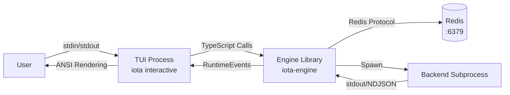

# TUI Guide

**Version:** 1.0
**Last Updated:** April 2026

## Table of Contents

1. [Introduction](#1-introduction)
2. [Architecture Overview](#2-architecture-overview)
3. [Prerequisites](#3-prerequisites)
4. [Installation and Setup](#4-installation-and-setup)
5. [Core Functionality](#5-core-functionality)
6. [Distributed Features](#6-distributed-features)
7. [Manual Verification Methods](#7-manual-verification-methods)
8. [Troubleshooting](#8-troubleshooting)
9. [Cleanup](#9-cleanup)
10. [References](#10-references)

---

## 1. Introduction

### Purpose and Scope

This guide covers the Iota interactive TUI (Terminal User Interface) mode, which provides a REPL-style interface for conversational AI interactions. The TUI launches via `iota interactive` and supports session continuity, backend switching, approval workflows, and streaming output.

### Target Audience

- Users preferring command-line conversational interaction
- Developers testing multi-turn conversation flows
- Anyone verifying approval workflow behavior

---

## 2. Architecture Overview

### Component Diagram



### Dependencies

| Dependency | Purpose | Connection Method |
|------------|---------|-------------------|
| CLI infrastructure | TUI launched via `iota interactive` | In-process TypeScript |
| Engine library | Execution and state management | TypeScript imports |
| Redis | Session persistence and event streaming | Redis protocol/TCP |
| Terminal | ANSI escape code rendering | stdin/stdout |

### Communication Protocols

- **TUI → Engine**: Direct TypeScript function calls via `engine.stream()` async iterator
- **TUI → Redis**: Via Engine's storage layer for session state
- **TUI → User**: Terminal stdio with ANSI formatting (chalk for colors)
- **Engine → Backend**: Subprocess stdio (NDJSON or JSON-RPC 2.0)
- **Backend → Engine**: stdout/stderr pipes emitting NDJSON events

---

## 3. Prerequisites

### Required Software

| Software | Purpose |
|----------|---------|
| Bun | Runtime for TypeScript execution |
| Redis | Session and event persistence |
| Backend CLI | AI backend (claude, codex, gemini, hermes) |

### Terminal Requirements

- **ANSI support**: Terminal must interpret ANSI escape codes
- **UTF-8 encoding**: Required for proper character display
- **256-color support**: Useful but not required

**Compatible terminals**:
- macOS Terminal.app
- iTerm2
- Windows Terminal
- Alacritty
- kitty
- VS Code integrated terminal

**Incompatible terminals**:
- Basic Command Prompt (Windows)
- Some older SSH clients

### Environment Variables

```bash
# Optional: Redis connection
export REDIS_HOST="127.0.0.1"
export REDIS_PORT="6379"
```

Backend authentication is read from Redis distributed config, for example `iota config set env.ANTHROPIC_AUTH_TOKEN "sk-ant-..." --scope backend --scope-id claude-code`.

---

## 4. Installation and Setup

### Step 1: Start Redis

```bash
cd deployment/scripts
bash start-storage.sh
redis-cli ping
# Expected: PONG
```

### Step 2: Build Packages

```bash
cd iota-engine && bun run build
cd ../iota-cli && bun run build
```

### Step 3: Launch Interactive Mode

```bash
iota interactive
```

**Expected output**:
```
iota interactive session started. Type "exit" to quit, "switch <backend>" to change backend.
iota>
```

### Step 4: Verify Streaming

From another terminal, verify the Engine process is handling the session:
```bash
redis-cli KEYS "iota:session:*"
# Expected: At least one session key
```

---

## 5. Core Functionality

### Feature: Prompt Entry and Execution

**Purpose**: Enter prompts and receive streaming responses.

**Usage**:
```
iota> What is 2+2?
iota> run "What is 2+2?"
```

The `run <prompt>` form is an explicit in-session command. Direct prompt entry remains supported for normal REPL use.

**Behavior**:
- User types prompt and presses Enter
- Engine streams response character-by-character
- Output appears in real-time via `process.stdout.write()`
- Each `output` type RuntimeEvent is printed directly

**Output event types**:
```typescript
if (event.type === "output") {
  process.stdout.write(event.data.content);  // Stream text
} else if (event.type === "error") {
  console.error(chalk.red(`\n${event.data.code}: ${event.data.message}`));
} else if (event.type === "state") {
  if (event.data.state === "waiting_approval") {
    console.log(chalk.yellow("\n⏳ Waiting for approval..."));
  } else if (event.data.state === "failed") {
    console.error(chalk.red(`\n❌ Execution failed...`));
  }
} else if (event.type === "tool_call") {
  console.log(chalk.dim(`\n🔧 ${event.data.toolName}(...)`));
} else if (event.type === "file_delta") {
  console.log(chalk.dim(`\n📁 ${event.data.operation}: ${event.data.path}`));
}
```

---

### Feature: Session Management

**Purpose**: Each interactive session creates a persistent session in Redis.

**Session lifecycle**:
1. `iota interactive` → creates new `IotaEngine` instance → creates new session via `engine.createSession()`
2. Session persists in Redis: `iota:session:{sessionId}`
3. Session survives TUI restarts (as long as Redis is running)

**Verification**:
```bash
# In another terminal during interactive session
redis-cli KEYS "iota:session:*"
redis-cli HGETALL "iota:session:$(redis-cli KEYS 'iota:session:*' | head -1 | cut -d: -f3)"
```

---

### Feature: Backend Switching

**Purpose**: Switch the active backend mid-session.

**In-session command**:
```
iota> switch <backend>
```

**Available backends**: `claude-code`, `codex`, `gemini`, `hermes`

**Example**:
```
iota> switch gemini
# System responds: "Switched to gemini"

iota> What can you do?
# Now uses Gemini backend
```

**Error handling**:
```
iota> switch invalid-backend
# Error: "Unknown backend: invalid-backend. Available: claude-code, codex, gemini, hermes"
```

---

### Feature: Status Command

**Purpose**: Show health status of all backends.

**In-session command**:
```
iota> status
```

**Expected output**: JSON with backend health information.

---

### Feature: Metrics Command

**Purpose**: Show engine metrics.

**In-session command**:
```
iota> metrics
```

**Expected output**: JSON with execution metrics.

---

### Feature: Approval Workflows

**Purpose**: When the backend requests approval (e.g., to execute a shell command), the TUI shows a waiting state.

**Flow**:
1. Backend emits `state: waiting_approval` event
2. TUI prints `⏳ Waiting for approval...`
3. In interactive mode, approval is handled automatically by `CliApprovalHook`

**Approval hook behavior** (`CliApprovalHook`):
- Automatically approves or denies based on configured policy
- `approval.shell = "auto"` → auto-approve shell commands
- `approval.shell = "ask"` → prompt user (not supported in non-interactive mode)

**Verification**:
```bash
iota config set approval.shell "ask"
iota interactive
iota> run "rm /tmp/test"  # May trigger approval prompt
```

---

### Feature: Keyboard Shortcuts and Navigation

**Purpose**: Standard terminal navigation within the TUI.

| Key | Action |
|-----|--------|
| Enter | Submit prompt |
| Ctrl+C | Interrupt current execution (sends SIGINT to backend subprocess) |
| Ctrl+D | Exit interactive mode |
| ↑ / ↓ | Command history (readline) |

**Command history**:
- Previous commands are available via readline's `history` mechanism
- Up arrow scrolls through history
- Down arrow scrolls forward

---

### Feature: Multi-Turn Conversations

**Purpose**: Conversation context is maintained within the session.

**Example flow**:
```
iota> My favorite color is blue.
# Response acknowledges

iota> What is my favorite color?
# Response: "Your favorite color is blue."
```

**Verification**:
```bash
# Check events contain conversation history
redis-cli LRANGE "iota:events:$(redis-cli KEYS 'iota:events:*' | head -1 | cut -d: -f3)" 0 -1 | jq '.[].type'
# Expected: Contains multiple user messages and outputs
```

---

## 6. Distributed Features

### Feature: Session Continuity Across Restarts

**Purpose**: Sessions persist in Redis and survive TUI restarts.

**Procedure**:

1. **Start interactive session**:
   ```bash
   iota interactive
   iota> run "First prompt"
   ```

2. **Note session ID** (from another terminal):
   ```bash
   SESSION_ID=$(redis-cli KEYS "iota:session:*" | head -1 | cut -d: -f3)
   echo "Session: $SESSION_ID"
   ```

3. **Exit and restart** (Ctrl+D):
   ```
   iota> exit
   ```

4. **Start new session** (session is different but previous data persists):
   ```bash
   iota interactive
   ```

5. **Query logs from previous session**:
   ```bash
   iota logs --session $SESSION_ID --limit 10
   ```

---

### Feature: Conversation History Persistence

**Purpose**: Event history for a session is stored in Redis and queryable.

**Procedure**:
```bash
# During or after interactive session
SESSION_ID=$(redis-cli KEYS "iota:session:*" | head -1 | cut -d: -f3)

# Query all events for the session
iota logs --session $SESSION_ID --limit 100
```

---

## 7. Manual Verification Methods

### Verification Checklist: Interactive Execution

**Objective**: Verify interactive mode launches and executes prompts with streaming output.

- [ ] **Setup**: Redis running, packages built
  ```bash
  redis-cli ping
  # Expected: PONG
  redis-cli FLUSHALL   # Clean slate
  ```

- [ ] **Launch**: Start interactive mode
  ```bash
  iota interactive
  # Expected: Shows prompt "iota>"
  ```

- [ ] **Execute**: Enter a prompt
  ```
  iota> What is 2+2?
  # Expected: Streaming output appears in real-time
  ```

- [ ] **Observe**: Check Redis created session
  ```bash
  redis-cli KEYS "iota:session:*"
  # Expected: 1 session key
  
  redis-cli KEYS "iota:events:*"
  # Expected: 1+ events keys
  ```

- [ ] **Validate**: Check execution completed
  ```bash
  EXEC_ID=$(redis-cli KEYS "iota:events:*" | head -1 | cut -d: -f3)
  # Event stream should contain state events ending in "completed"
  redis-cli LRANGE "iota:events:$EXEC_ID" 0 -1 | jq '.[-1].type'
  # Expected: "state"
  ```

- [ ] **Cleanup**:
  ```
  iota> exit
  redis-cli FLUSHALL
  ```

**Success Criteria**:
- ✅ Interactive prompt appears
- ✅ Streaming output renders character-by-character
- ✅ Session created in Redis
- ✅ Events stored in Redis
- ✅ `exit` command terminates cleanly

**Failure Indicators**:
- ❌ No streaming (output appears all at once)
- ❌ Session not created in Redis
- ❌ TUI crashes on prompt entry

---

### Verification Checklist: Backend Switching

**Objective**: Verify backend can be switched mid-session.

- [ ] **Setup**: Redis running, at least 2 backends available
  ```bash
  iota status
  # Expected: Shows multiple backends
  ```

- [ ] **Launch**:
  ```bash
  iota interactive
  ```

- [ ] **Check initial backend**:
  ```
  iota> status
  # Note the current backend
  ```

- [ ] **Switch**:
  ```
  iota> switch gemini
  # Expected: "Switched to gemini"
  ```

- [ ] **Execute with new backend**:
  ```
  iota> What model are you?
  # Expected: Response from Gemini
  ```

- [ ] **Verify in Redis**:
  ```bash
  SESSION_ID=$(redis-cli KEYS "iota:session:*" | head -1 | cut -d: -f3)
  redis-cli HGET "iota:session:$SESSION_ID" "activeBackend"
  # Expected: "gemini"
  ```

- [ ] **Cleanup**:
  ```
  iota> exit
  redis-cli FLUSHALL
  ```

**Success Criteria**:
- ✅ Switch command accepted
- ✅ Confirmation message printed
- ✅ Subsequent executions use new backend
- ✅ Redis session updated

---

### Verification Checklist: Approval Workflow

**Objective**: Verify approval waiting state is displayed.

- [ ] **Setup**: Configure approval policy
  ```bash
  iota config set approval.shell "ask"
  ```

- [ ] **Launch**:
  ```bash
  iota interactive
  ```

- [ ] **Trigger approval scenario**:
  ```
  iota> run "echo test"
  # May show: ⏳ Waiting for approval...
  # Or auto-approved if policy is "auto"
  ```

- [ ] **Validate**:
  ```bash
  # Check for waiting_approval state in events
  redis-cli LRANGE "iota:events:$(redis-cli KEYS 'iota:events:*' | head -1 | cut -d: -f3)" 0 -1 | jq '.[] | select(.type=="state")'
  ```

- [ ] **Cleanup**:
  ```
  iota> exit
  redis-cli FLUSHALL
  ```

---

### Verification Checklist: Command History

**Objective**: Verify previous commands are accessible.

- [ ] **Setup**: Launch interactive mode
  ```bash
  iota interactive
  ```

- [ ] **Execute multiple commands**:
  ```
  iota> command1
  iota> command2
  iota> command3
  ```

- [ ] **Navigate history**:
  ```
  # Press ↑ three times
  # Should see "command3" appear
  # Press ↑ once more
  # Should see "command2"
  ```

- [ ] **Cleanup**:
  ```
  iota> exit
  ```

---

## 8. Troubleshooting

### Issue: ANSI Rendering Broken

**Symptoms**:
- Escape codes printed literally (e.g., `^[[32m`)
- Colors not showing
- Cursor positioning incorrect

**Diagnosis**:
```bash
# Check terminal type
echo $TERM
# If dumb: ANSI not supported
```

**Solution**:
```bash
# Use a compatible terminal
# Examples: iTerm2, Windows Terminal, Alacritty
export TERM=xterm-256color
```

**Prevention**: Always use a terminal with ANSI support.

---

### Issue: Terminal Not Supported

**Symptoms**:
- `iota interactive` fails immediately
- Error about terminal capabilities

**Solution**:
```bash
# Install and use a supported terminal
# macOS: iTerm2 (free)
# Windows: Windows Terminal (Microsoft Store)
# Linux: kitty, Alacritty
```

---

### Issue: Stuck in Approval Wait

**Symptoms**:
- TUI hangs at `⏳ Waiting for approval...`

**Diagnosis**:
```bash
# Check approval policy
iota config get approval.shell
```

**Solution**:
```bash
# Set to auto-approve
iota config set approval.shell "auto"

# Or use Ctrl+C to interrupt
```

---

### Issue: Backend Not Found in TUI

**Symptoms**:
- `switch` command fails with unknown backend

**Diagnosis**:
```bash
iota status
# Check which backends show healthy
```

**Solution**:
```bash
# Install missing backend CLI
# Or ensure backend is in PATH
export PATH="/path/to/backend:$PATH"
```

---

## 9. Cleanup

### Exit Interactive Mode

```
iota> exit
# or press Ctrl+D
```

### Reset Redis Data

```bash
redis-cli FLUSHALL
```

### Stop Redis

```bash
cd deployment/scripts
bash stop-storage.sh
```

---

## 10. References

### Related Guides

- [01-cli-guide.md](./01-cli-guide.md) — CLI command reference
- [00-architecture-overview.md](./00-architecture-overview.md) — System architecture
- [03-agent-guide.md](./03-agent-guide.md) — Agent API verification
- [05-engine-guide.md](./05-engine-guide.md) — Engine internals

### External Documentation

- [CLI README](../../iota-cli/README.md)
- [chalk](https://www.npmjs.com/package/chalk) — Terminal string styling

---

## Version History

| Version | Date | Changes |
|---------|------|---------|
| 1.0 | April 2026 | Initial release |
