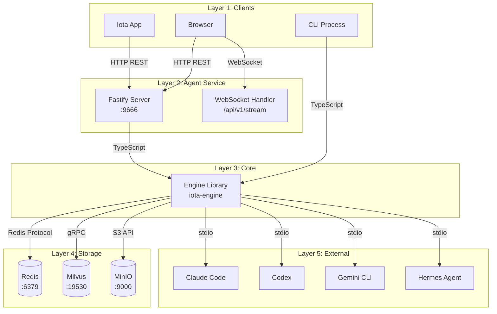

# Agent Guide

**Version:** 1.1
**Last Updated:** April 2026

## Table of Contents

1. [Introduction](#1-introduction)
2. [Architecture Overview](#2-architecture-overview)
3. [Prerequisites](#3-prerequisites)
4. [Installation and Setup](#4-installation-and-setup)
5. [Core Functionality — REST API](#5-core-functionality--rest-api)
6. [Core Functionality — WebSocket](#6-core-functionality--websocket)
7. [Distributed Features](#7-distributed-features)
8. [Manual Verification Methods](#8-manual-verification-methods)
9. [Troubleshooting](#9-troubleshooting)
10. [Cleanup](#10-cleanup)
11. [References](#11-references)

---

## 1. Introduction

### Purpose and Scope

This guide covers the Iota Agent HTTP/WebSocket service running on port 9666. The Agent exposes distributed APIs for session management, execution control, configuration, logging, visibility inspection, and real-time event streaming via WebSocket.

### Target Audience

- Developers verifying Agent API functionality
- Frontend developers integrating with the App
- Users testing distributed features via HTTP

### Implementation Status

- ✅ Core REST APIs: sessions, executions, config, logs, visibility, cross-session
- ✅ WebSocket streaming with subscriptions
- ✅ Distributed configuration with Redis scopes (global, backend, session, user)
- ✅ Cross-session log and memory queries
- ✅ Backend isolation reporting

---

## 2. Architecture Overview

### Component Diagram



### Dependencies

| Dependency | Version | Purpose | Connection |
|------------|---------|---------|------------|
| `@iota/engine` | built | Core runtime | TypeScript imports |
| Redis | running :6379 | Primary storage | Redis protocol/TCP |
| Fastify | latest | HTTP/WebSocket server | In-process |
| Milvus | optional :19530 | Vector storage | gRPC |
| MinIO | optional :9000 | Object storage | S3 API |

### Communication Protocols

- **Client → Agent**: HTTP REST JSON over TCP :9666
- **Client → Agent**: WebSocket over TCP :9666
- **Agent → Engine**: Direct TypeScript calls (in-process)
- **Agent → Redis**: Redis protocol over TCP :6379
- **Agent → Milvus**: gRPC over TCP :19530 (if configured)
- **Agent → MinIO**: S3 API over HTTP :9000 (if configured)

**Reference**: See [00-architecture-overview.md](./00-architecture-overview.md)

---

## 3. Prerequisites

### Required Software

| Software | Verification |
|----------|--------------|
| Redis | `redis-cli ping` → `PONG` |
| Bun | `bun --version` |
| Backend executables | `which claude`, `which codex`, `which gemini`, `which hermes` |

### Port Requirements

| Port | Service | Verification |
|------|---------|--------------|
| 9666 | Agent | `lsof -i :9666` |
| 6379 | Redis | `lsof -i :6379` |

### Optional Storage

**Milvus** (vector storage for memory embeddings):
```bash
# Health check
curl http://localhost:9091/healthz
```

**MinIO** (object storage for artifacts):
```bash
# Health check
curl http://localhost:9000/minio/health/live
```

---

## 4. Installation and Setup

### Step 1: Start Redis

```bash
cd deployment/scripts
bash start-storage.sh
redis-cli ping
# Expected: PONG
```

### Step 2: Build Agent

```bash
cd iota-agent
bun install
bun run build
```

### Step 3: Start Agent

```bash
cd iota-agent
bun run dev
# Listens on 0.0.0.0:9666 by default
```

**Verification**:
```bash
curl http://localhost:9666/health
# Expected: {"status":"ok","timestamp":"..."}

curl http://localhost:9666/healthz
# Expected: {"status":"healthy","timestamp":"...","backends":{...}}
```

---

## 5. Core Functionality — REST API

### Session Routes

#### `POST /api/v1/sessions` — Create Session

**Request**:
```bash
curl -X POST http://localhost:9666/api/v1/sessions \
  -H "Content-Type: application/json" \
  -d '{"workingDirectory":"/tmp","backend":"claude-code"}'
```

**Response** (201):
```json
{
  "sessionId": "a1b2c3d4-e5f6-7890-abcd-ef1234567890",
  "createdAt": 1714067200000
}
```

---

#### `GET /api/v1/sessions/:sessionId` — Get Session

**Request**:
```bash
curl http://localhost:9666/api/v1/sessions/a1b2c3d4-e5f6-7890-abcd-ef1234567890
```

**Response** (200):
```json
{
  "sessionId": "a1b2c3d4-e5f6-7890-abcd-ef1234567890",
  "workingDirectory": "/tmp",
  "createdAt": 1714067200000,
  "updatedAt": 1714067250000
}
```

---

#### `DELETE /api/v1/sessions/:sessionId` — Delete Session

**Request**:
```bash
curl -X DELETE http://localhost:9666/api/v1/sessions/a1b2c3d4-e5f6-7890-abcd-ef1234567890
```

**Response** (204): Empty

---

#### `PUT /api/v1/sessions/:sessionId/context` — Update Session Context

**Request**:
```bash
curl -X PUT http://localhost:9666/api/v1/sessions/a1b2c3d4-e5f6-7890-abcd-ef1234567890/context \
  -H "Content-Type: application/json" \
  -d '{"activeFiles":[{"path":"/tmp/test.txt","pinned":true}]}'
```

**Response** (200):
```json
{"success":true}
```

---

#### `GET /api/v1/sessions/:sessionId/workspace/file` — Read Workspace File

**Request**:
```bash
curl "http://localhost:9666/api/v1/sessions/a1b2c3d4-e5f6-7890-abcd-ef1234567890/workspace/file?path=src/index.ts"
```

**Response** (200):
```json
{
  "path": "src/index.ts",
  "absolutePath": "/tmp/src/index.ts",
  "content": "...",
  "size": 1234
}
```

---

#### `PUT /api/v1/sessions/:sessionId/workspace/file` — Write Workspace File

**Request**:
```bash
curl -X PUT http://localhost:9666/api/v1/sessions/a1b2c3d4-e5f6-7890-abcd-ef1234567890/workspace/file \
  -H "Content-Type: application/json" \
  -d '{"path":"src/index.ts","content":"console.log(\"hello\");"}'
```

**Response** (200):
```json
{
  "path": "src/index.ts",
  "absolutePath": "/tmp/src/index.ts",
  "size": 24
}
```

---

#### `GET /api/v1/sessions/:sessionId/memories` — List Session Memories

**Request**:
```bash
curl "http://localhost:9666/api/v1/sessions/a1b2c3d4-e5f6-7890-abcd-ef1234567890/memories?query=auth&limit=50"
```

**Query parameters**: `query` (optional search), `limit` (default 50)

**Response** (200):
```json
{
  "count": 2,
  "memories": [
    {"id": "mem_1", "content": "...", "type": "session", "createdAt": 1714067200000}
  ]
}
```

---

#### `POST /api/v1/sessions/:sessionId/memories` — Create Session Memory

**Request**:
```bash
curl -X POST http://localhost:9666/api/v1/sessions/a1b2c3d4-e5f6-7890-abcd-ef1234567890/memories \
  -H "Content-Type: application/json" \
  -d '{"content":"User prefers TypeScript","type":"session"}'
```

**Response** (201): Created memory object.

---

#### `DELETE /api/v1/sessions/:sessionId/memories/:memoryId` — Delete Session Memory

**Request**:
```bash
curl -X DELETE http://localhost:9666/api/v1/sessions/a1b2c3d4-e5f6-7890-abcd-ef1234567890/memories/mem_1
```

**Response** (204): Empty

---

#### `GET /api/v1/sessions/:sessionId/app-snapshot` — Session App Snapshot

**Request**:
```bash
curl http://localhost:9666/api/v1/sessions/a1b2c3d4-e5f6-7890-abcd-ef1234567890/app-snapshot
```

**Response** (200): Full session-level App Read Model snapshot including conversation history, memory, tokens, and tracing.

---

### Execution Routes

#### `POST /api/v1/execute` — Execute Prompt

**Request**:
```bash
curl -X POST http://localhost:9666/api/v1/execute \
  -H "Content-Type: application/json" \
  -d '{"sessionId":"a1b2c3d4-e5f6-7890-abcd-ef1234567890","prompt":"What is 2+2?","backend":"claude-code"}'
```

**Response** (202):
```json
{
  "executionId": "e1f2g3h4-5678-90ab-cdef-345678901234",
  "sessionId": "a1b2c3d4-e5f6-7890-abcd-ef1234567890",
  "status": "queued"
}
```

---

#### `GET /api/v1/executions/:executionId` — Get Execution

**Request**:
```bash
curl http://localhost:9666/api/v1/executions/e1f2g3h4-5678-90ab-cdef-345678901234
```

**Response** (200): Execution record object with `prompt`, `output`, `status`, `backend`, `createdAt`, `completedAt`.

---

#### `GET /api/v1/executions/:executionId/events` — Get Execution Events

**Request**:
```bash
curl "http://localhost:9666/api/v1/executions/e1f2g3h4-5678-90ab-cdef-345678901234/events?offset=0&limit=100"
```

**Response** (200):
```json
{
  "executionId": "e1f2g3h4-5678-90ab-cdef-345678901234",
  "offset": 0,
  "limit": 100,
  "count": 5,
  "events": [
    {"type":"state","data":{"state":"queued"}},
    {"type":"output","data":{"content":"2"}},
    ...
  ]
}
```

**Event types**: `output`, `state`, `tool_call`, `tool_result`, `file_delta`, `error`, `extension`

---

#### `POST /api/v1/executions/:executionId/interrupt` — Interrupt Execution

**Request**:
```bash
curl -X POST http://localhost:9666/api/v1/executions/e1f2g3h4-5678-90ab-cdef-345678901234/interrupt
```

**Response** (200):
```json
{"executionId":"e1f2g3h4-5678-90ab-cdef-345678901234","status":"interrupted"}
```

---

### Config Routes

#### `GET /api/v1/config` — Get Resolved Config

**Request**:
```bash
curl "http://localhost:9666/api/v1/config?backend=claude-code&sessionId=a1b2c3d4&userId=user_01"
```

**Query parameters**: `backend` (optional), `sessionId` (optional), `userId` (optional)

**Resolution order** (highest priority first): `user > session > backend > global`

**Response** (200): Merged configuration object from all scopes.

---

#### `GET /api/v1/config/:scope` — Get Scope Config or List Scope IDs

**Valid scopes**: `global`, `backend`, `session`, `user`

**Request**:
```bash
curl http://localhost:9666/api/v1/config/global
# Response: {"approval.shell":"ask",...} (config object for global)

curl http://localhost:9666/api/v1/config/backend
# Response: {"scope":"backend","ids":[...]} (only IDs with stored backend-scoped config)
```

---

#### `GET /api/v1/config/:scope/:scopeId` — Get Scoped Config

**Request**:
```bash
curl http://localhost:9666/api/v1/config/backend/claude-code
```

**Response** (200): Config object for that scope.

---

#### `POST /api/v1/config` — Set Global Config

**Request**:
```bash
curl -X POST http://localhost:9666/api/v1/config \
  -H "Content-Type: application/json" \
  -d '{"key":"approval.shell","value":"ask"}'
```

**Response** (200):
```json
{"ok":true,"scope":"global","key":"approval.shell","value":"ask"}
```

---

#### `POST /api/v1/config/:scope/:scopeId` — Set Scoped Config

**Request**:
```bash
curl -X POST http://localhost:9666/api/v1/config/backend/claude-code \
  -H "Content-Type: application/json" \
  -d '{"key":"timeout","value":"60000"}'
```

---

#### `DELETE /api/v1/config/:scope/:scopeId/:key` — Delete Config Key

For `global` scope, a dedicated shorter route is also available:

**Request**:
```bash
# Delete a global config key (dedicated route)
curl -X DELETE http://localhost:9666/api/v1/config/global/approval.shell

# Delete a backend-scoped config key
curl -X DELETE http://localhost:9666/api/v1/config/backend/claude-code/timeout

# Delete a user-scoped config key
curl -X DELETE http://localhost:9666/api/v1/config/user/user_01/theme
```

---

### Logs Routes

#### `GET /api/v1/logs` — Query Logs

**Request**:
```bash
curl "http://localhost:9666/api/v1/logs?sessionId=a1b2c3d4&backend=claude-code&limit=10"
```

**Query parameters**: `sessionId`, `executionId`, `backend`, `eventType`, `since`, `until`, `offset`, `limit`

**Response** (200):
```json
{
  "offset": 0,
  "limit": 10,
  "count": 5,
  "logs": [...]
}
```

---

#### `GET /api/v1/logs/aggregate` — Aggregate Log Counts

**Request**:
```bash
curl "http://localhost:9666/api/v1/logs/aggregate?backend=claude-code"
```

**Response** (200): Aggregate counts grouped by event type.

---

#### `GET /api/v1/memories/search` — Search Memories

**Request**:
```bash
curl "http://localhost:9666/api/v1/memories/search?query=binary+search&limit=10"
```

---

#### `GET /api/v1/backend-isolation` — Backend Isolation Report

**Request**:
```bash
curl http://localhost:9666/api/v1/backend-isolation
```

---

#### `GET /api/v1/sessions/all` — List All Sessions

**Request**:
```bash
curl "http://localhost:9666/api/v1/sessions/all?limit=100"
```

---

### Visibility Routes

#### `GET /api/v1/executions/:executionId/visibility` — Full Visibility Bundle

**Request**:
```bash
curl http://localhost:9666/api/v1/executions/e1f2g3h4-5678-90ab-cdef-345678901234/visibility
```

**Response** (200): Complete visibility bundle including tokens, memory, context, chain.

---

#### `GET /api/v1/executions/:executionId/visibility/tokens` — Token Visibility

**Request**:
```bash
curl http://localhost:9666/api/v1/executions/e1f2g3h4-5678-90ab-cdef-345678901234/visibility/tokens
```

---

#### `GET /api/v1/executions/:executionId/visibility/memory` — Memory Visibility

**Request**:
```bash
curl http://localhost:9666/api/v1/executions/e1f2g3h4-5678-90ab-cdef-345678901234/visibility/memory
```

---

#### `GET /api/v1/executions/:executionId/visibility/chain` — Trace Chain

**Request**:
```bash
curl http://localhost:9666/api/v1/executions/e1f2g3h4-5678-90ab-cdef-345678901234/visibility/chain
```

**Response** (200):
```json
{
  "link": {...},
  "spans": [...],
  "mappings": [...]
}
```

---

#### `GET /api/v1/executions/:executionId/trace` — Hierarchical Trace Tree

**Request**:
```bash
curl http://localhost:9666/api/v1/executions/e1f2g3h4-5678-90ab-cdef-345678901234/trace
```

---

#### `GET /api/v1/executions/:executionId/app-snapshot` — App Execution Snapshot

**Request**:
```bash
curl http://localhost:9666/api/v1/executions/e1f2g3h4-5678-90ab-cdef-345678901234/app-snapshot
```

---

#### `GET /api/v1/executions/:executionId/replay` — Execution Replay

**Request**:
```bash
curl http://localhost:9666/api/v1/executions/e1f2g3h4-5678-90ab-cdef-345678901234/replay
```

**Response** (200): Execution replay data including ordered events, visibility snapshots, and timing for playback reconstruction.

> **Note**: Replay is a **REST query endpoint** that returns a static snapshot of execution data. It is not a real-time WebSocket stream. The App fetches replay data on-demand via `api.getExecutionReplay()` and reconstructs the playback client-side from the returned events and visibility records.

---

#### `GET /api/v1/traces/aggregate` — Aggregate Traces

**Request**:
```bash
curl "http://localhost:9666/api/v1/traces/aggregate?sessionId=a1b2c3d4&backend=claude-code"
```

**Response** (200): Aggregated trace statistics across executions.

---

#### `GET /api/v1/sessions/:sessionId/visibility` — Session Visibility

**Request**:
```bash
curl "http://localhost:9666/api/v1/sessions/a1b2c3d4-e5f6-7890-abcd-ef1234567890/visibility?limit=50"
```

---

#### `GET /api/v1/sessions/:sessionId/visibility/summary` — Session Visibility Summary

**Request**:
```bash
curl http://localhost:9666/api/v1/sessions/a1b2c3d4-e5f6-7890-abcd-ef1234567890/visibility/summary
```

**Response** (200):
```json
{
  "sessionId": "a1b2c3d4-...",
  "executionCount": 5,
  "tokens": {
    "inputTokens": 10000,
    "outputTokens": 500,
    "totalTokens": 10500,
    "averageTokens": 2100
  },
  "memory": {
    "selectedBlocks": 3,
    "trimmedBlocks": 1
  },
  "byBackend": {
    "claude-code": 3,
    "gemini": 2
  }
}
```

---

### Status Routes

#### `GET /api/v1/status` — Backend Status

**Request**:
```bash
curl http://localhost:9666/api/v1/status
```

**Response** (200):
```json
{
  "backends": [
    {
      "backend": "claude-code",
      "label": "claude-code",
      "status": "online",
      "active": false,
      "capabilities": {
        "streaming": true,
        "mcp": false,
        "memoryVisibility": true,
        "tokenVisibility": true,
        "chainVisibility": true
      }
    }
  ]
}
```

---

#### `GET /api/v1/metrics` — Engine Metrics

**Request**:
```bash
curl http://localhost:9666/api/v1/metrics
```

---

### Cross-Session Routes

#### `GET /api/v1/cross-session/logs` — Cross-Session Log Query

**Request**:
```bash
curl "http://localhost:9666/api/v1/cross-session/logs?backend=claude-code&limit=50"
```

---

#### `GET /api/v1/cross-session/logs/aggregate` — Cross-Session Log Aggregation

**Request**:
```bash
curl "http://localhost:9666/api/v1/cross-session/logs/aggregate?backend=claude-code"
```

---

#### `GET /api/v1/cross-session/sessions` — List All Sessions Cross-Session

**Request**:
```bash
curl "http://localhost:9666/api/v1/cross-session/sessions?limit=100"
```

---

#### `GET /api/v1/cross-session/memories/search` — Cross-Session Memory Search

**Request**:
```bash
curl "http://localhost:9666/api/v1/cross-session/memories/search?query=binary+search&limit=10"
```

---

#### `GET /api/v1/cross-session/backend-isolation` — Cross-Session Backend Isolation

**Request**:
```bash
curl http://localhost:9666/api/v1/cross-session/backend-isolation
```

---

## 6. Core Functionality — WebSocket

### Connection Establishment

**URL**: `ws://localhost:9666/api/v1/stream`

**Protocol**: WebSocket over TCP

**Handshake**: HTTP Upgrade request (standard WebSocket protocol)

**Verification with wscat**:
```bash
npm install -g wscat
wscat -c ws://localhost:9666/api/v1/stream
# Connected (press Ctrl+C to exit)
```

**Verification with Browser DevTools**:
1. Open DevTools (F12) → Network tab
2. Filter by "WS" (WebSocket)
3. Navigate to `http://localhost:9888` (App) or connect directly
4. Click WebSocket connection to see frame list
5. Switch to "Messages" tab to inspect JSON frames

---

### Inbound Message Types (Client → Agent)

#### `execute` — Execute Prompt via WebSocket

**Message**:
```json
{
  "type": "execute",
  "sessionId": "a1b2c3d4-e5f6-7890-abcd-ef1234567890",
  "prompt": "What is 2+2?",
  "backend": "claude-code",
  "approvals": {}
}
```

**Behavior**: Agent streams `event` messages for each RuntimeEvent, then sends `complete` or `error`.

---

#### `subscribe_app_session` — Subscribe to Session Updates

**Message**:
```json
{
  "type": "subscribe_app_session",
  "sessionId": "a1b2c3d4-e5f6-7890-abcd-ef1234567890",
  "include": ["conversation", "tracing", "memory", "tokens", "summary"]
}
```

**Response** (immediate):
```json
{
  "type": "subscribed",
  "sessionId": "a1b2c3d4-e5f6-7890-abcd-ef1234567890",
  "include": ["conversation", "tracing", "memory", "tokens", "summary"]
}
```

**Then**: Agent sends `app_snapshot` followed by `app_delta` messages for any changes.

---

#### `subscribe_visibility` — Subscribe to Visibility Updates

**Message**:
```json
{
  "type": "subscribe_visibility",
  "executionId": "e1f2g3h4-5678-90ab-cdef-345678901234",
  "kinds": ["memory", "tokens", "chain", "summary"]
}
```

**Response** (immediate):
```json
{
  "type": "subscribed_visibility",
  "executionId": "e1f2g3h4-5678-90ab-cdef-345678901234",
  "kinds": ["memory", "tokens", "chain", "summary"]
}
```

**Implementation detail**: Visibility updates are delivered through a **hybrid mechanism**, not a single continuous stream:

1. **Event-driven** (during execution): Runtime events from `engine.subscribeExecution()` are mapped to `app_delta` messages in real-time (conversation, trace steps, tool calls).
2. **Store-polling** (background): A 1-second interval poller (`pollVisibilityStoreDeltas`) reads from the Visibility Store and pushes `app_delta` messages for memory, tokens, chain, and summary when the data hash changes.
3. **Post-execution backfill**: After execution completes, remaining store-driven deltas (token totals, memory selections, summary) are pushed as a final batch.

This means visibility updates may arrive slightly after the execution events they relate to. The system is **eventually consistent**, not a pure event bus.

---

#### `interrupt` — Interrupt a Running Execution

**Message**:
```json
{
  "type": "interrupt",
  "executionId": "e1f2g3h4-5678-90ab-cdef-345678901234"
}
```

**Behavior**: Agent calls `engine.interrupt(executionId)` and sends `complete` after the interrupt request is processed. Session subscribers also receive the persisted `interrupted` state event.

---

#### `approval_decision` — Respond to Approval Request

**Message**:
```json
{
  "type": "approval_decision",
  "requestId": "exec_a1b2c3d4-1714067200000",
  "approved": true,
  "reason": "User approved shell access"
}
```

**Behavior**: Agent forwards the decision to the Engine's `DeferredApprovalHook`, which unblocks the waiting execution. Responds with `approval_ack` on success or `error` if the request has expired or is unknown.

**Response** (success):
```json
{
  "type": "approval_ack",
  "requestId": "exec_a1b2c3d4-1714067200000"
}
```

> **Prerequisite**: The Agent must be started with a `DeferredApprovalHook` (the default when running via `iota-agent`).

---

### Outbound Message Types (Agent → Client)

#### `event` — RuntimeEvent from Execution

```json
{
  "type": "event",
  "executionId": "e1f2g3h4-5678-90ab-cdef-345678901234",
  "event": {
    "type": "output",
    "data": {"content": "2"}
  }
}
```

**Event types**: Same as REST API — `output`, `state`, `tool_call`, `tool_result`, `file_delta`, `error`, `extension`

---

#### `complete` — Execution Finished

```json
{
  "type": "complete",
  "executionId": "e1f2g3h4-5678-90ab-cdef-345678901234"
}
```

---

#### `error` — Error Occurred

```json
{
  "type": "error",
  "executionId": "e1f2g3h4-5678-90ab-cdef-345678901234",
  "error": "Backend failed: ..."
}
```

---

#### `subscribed` — Subscription Confirmed

```json
{
  "type": "subscribed",
  "sessionId": "a1b2c3d4-e5f6-7890-abcd-ef1234567890",
  "include": ["conversation", "tracing"]
}
```

---

#### `subscribed_visibility` — Visibility Subscription Confirmed

```json
{
  "type": "subscribed_visibility",
  "executionId": "e1f2g3h4-5678-90ab-cdef-345678901234",
  "kinds": ["memory", "tokens"]
}
```

---

#### `app_delta` — App Read Model Update

```json
{
  "type": "app_delta",
  "sessionId": "a1b2c3d4-e5f6-7890-abcd-ef1234567890",
  "delta": {
    "type": "conversation_delta",
    "executionId": "e1f2g3h4-...",
    "item": {...}
  },
  "revision": 5
}
```

**Delta types**:
- `conversation_delta`: New conversation item
- `memory_delta`: Memory selection changed
- `token_delta`: Token counts updated
- `trace_step_delta`: New trace step
- `summary_delta`: Summary updated

---

#### `app_snapshot` — Full App State Snapshot

```json
{
  "type": "app_snapshot",
  "sessionId": "a1b2c3d4-e5f6-7890-abcd-ef1234567890",
  "snapshot": {...}
}
```

---

#### `visibility_snapshot` — Visibility Snapshot

```json
{
  "type": "visibility_snapshot",
  "executionId": "e1f2g3h4-5678-90ab-cdef-345678901234",
  "sessionId": "a1b2c3d4-...",
  "visibility": {...}
}
```

---

#### `pubsub_event` — Redis Pub/Sub Bridged Event

When Redis pub/sub is available (multi-instance deployments), the Agent bridges cross-instance events to WebSocket clients. These events are forwarded from three Redis channels:

- `iota:execution:events` — Execution events from other Agent instances
- `iota:session:updates` — Session state changes from other instances
- `iota:config:changes` — Configuration changes from other instances

**Message format**:
```json
{
  "type": "pubsub_event",
  "channel": "iota:execution:events",
  "message": {
    "type": "execution_event",
    "executionId": "...",
    "event": {...}
  }
}
```

**Behavior**: `pubsub_event` messages are only sent when:
- The WebSocket client has an active `subscribe_app_session` subscription (for execution/session channels)
- Always forwarded for `iota:config:changes`

---

### Subscription Lifecycle

1. **Connect**: WebSocket connection established to `/api/v1/stream`
2. **Subscribe**: Send `subscribe_app_session` or `subscribe_visibility`
3. **Receive Confirmation**: Immediate `subscribed` or `subscribed_visibility` response
4. **Receive Snapshot**: Full state via `app_snapshot` or `visibility_snapshot`
5. **Receive Deltas**: Ongoing updates via `app_delta` or event messages
6. **Unsubscribe**: Close WebSocket connection

### Subscription Type Comparison

The two subscription types serve distinct purposes and should not be confused:

| Aspect | `subscribe_app_session` | `subscribe_visibility` |
|--------|------------------------|----------------------|
| **Scope** | Session-level | Execution-level |
| **Keyed by** | `sessionId` | `executionId` |
| **Initial payload** | `app_snapshot` (full session state) | `visibility_snapshot` (execution visibility) |
| **Delta kinds** | `conversation`, `tracing`, `memory`, `tokens`, `summary` | `memory`, `tokens`, `chain`, `summary` |
| **Primary consumer** | App UI (ChatTimeline, Sidebar) | App UI (InspectorPanel) |
| **Data source** | Engine event stream (`engine.stream()`) | Hybrid: event stream + 1s store polling |
| **Typical usage** | One per session, lasts connection lifetime | One per active execution, may change as user navigates |

---

## 7. Distributed Features

### Distributed Feature: Distributed Configuration

**Purpose**: Config stored in Redis with scope-based isolation.

**Procedure**:

1. **Set backend-specific config**:
   ```bash
   curl -X POST http://localhost:9666/api/v1/config/backend/claude-code \
     -H "Content-Type: application/json" \
     -d '{"key":"timeout","value":"60000"}'
   ```

2. **Verify in Redis**:
   ```bash
   redis-cli HGET "iota:config:backend:claude-code" "timeout"
   # Expected: "60000"
   ```

3. **Verify resolution**:
   ```bash
   curl "http://localhost:9666/api/v1/config?backend=claude-code" | jq '.timeout'
   # Expected: "60000"
   ```

---

### Distributed Feature: Cross-Session Log Queries

**Purpose**: Query logs across all sessions.

**Procedure**:

1. **Create multiple sessions**:
   ```bash
   SESSION1=$(curl -s -X POST http://localhost:9666/api/v1/sessions \
     -H "Content-Type: application/json" \
     -d '{"workingDirectory":"/tmp"}' | jq -r '.sessionId')
   
   SESSION2=$(curl -s -X POST http://localhost:9666/api/v1/sessions \
     -H "Content-Type: application/json" \
     -d '{"workingDirectory":"/tmp"}' | jq -r '.sessionId')
   ```

2. **Execute in each session** (different backends):
   ```bash
   curl -X POST http://localhost:9666/api/v1/execute \
     -H "Content-Type: application/json" \
     -d '{"sessionId":"'$SESSION1'","prompt":"test","backend":"claude-code"}'
   
   curl -X POST http://localhost:9666/api/v1/execute \
     -H "Content-Type: application/json" \
     -d '{"sessionId":"'$SESSION2'","prompt":"test","backend":"gemini"}'
   ```

3. **Query cross-session logs**:
   ```bash
   curl "http://localhost:9666/api/v1/cross-session/logs?backend=claude-code&limit=10"
   ```

---

### Distributed Feature: Cross-Session Memory Search

**Purpose**: Search memories across all sessions.

**Procedure**:
```bash
curl "http://localhost:9666/api/v1/cross-session/memories/search?query=binary+search&limit=10"
```

---

### Distributed Feature: Backend Isolation Verification

**Purpose**: Verify data is properly partitioned by backend.

**Procedure**:

1. **Execute with different backends** (see above)

2. **Get isolation report**:
   ```bash
   curl http://localhost:9666/api/v1/backend-isolation
   ```

3. **Expected**: Shows session and execution counts per backend with proper isolation.

---

## 8. Manual Verification Methods

### Verification Checklist: Session CRUD

**Objective**: Verify session creation, reading, and deletion.

- [ ] **Setup**: Agent running
  ```bash
  curl http://localhost:9666/health
  # Expected: {"status":"ok",...}
  ```

- [ ] **Create session**:
  ```bash
  SESSION_ID=$(curl -s -X POST http://localhost:9666/api/v1/sessions \
    -H "Content-Type: application/json" \
    -d '{"workingDirectory":"/tmp"}' | jq -r '.sessionId')
  echo "Session: $SESSION_ID"
  # Expected: Valid UUID
  ```

- [ ] **Get session**:
  ```bash
  curl http://localhost:9666/api/v1/sessions/$SESSION_ID | jq '.sessionId'
  # Expected: Same UUID
  ```

- [ ] **Verify in Redis**:
  ```bash
  redis-cli HGET "iota:session:$SESSION_ID" "workingDirectory"
  # Expected: "/tmp"
  ```

- [ ] **Delete session**:
  ```bash
  curl -X DELETE http://localhost:9666/api/v1/sessions/$SESSION_ID
  # Expected: 204 No Content
  ```

- [ ] **Verify deleted**:
  ```bash
  curl http://localhost:9666/api/v1/sessions/$SESSION_ID
  # Expected: 404 Not Found
  ```

**Success Criteria**:
- ✅ Session created with correct ID
- ✅ Session persisted in Redis
- ✅ Session retrieved correctly
- ✅ Session deleted cleanly
- ✅ Redis keys cleaned up

---

### Verification Checklist: WebSocket Streaming

**Objective**: Verify WebSocket connection, subscription, and event streaming.

- [ ] **Setup**: Agent running
  ```bash
  curl http://localhost:9666/health
  ```

- [ ] **Create session**:
  ```bash
  SESSION_ID=$(curl -s -X POST http://localhost:9666/api/v1/sessions \
    -H "Content-Type: application/json" \
    -d '{"workingDirectory":"/tmp"}' | jq -r '.sessionId')
  ```

- [ ] **Connect via wscat** (in another terminal):
  ```bash
  wscat -c ws://localhost:9666/api/v1/stream
  # Connected
  ```

- [ ] **Send subscription**:
  ```json
  {"type":"subscribe_app_session","sessionId":"<SESSION_ID>","include":["conversation","tracing"]}
  ```

- [ ] **Verify response** (in wscat):
  ```json
  {"type":"subscribed","sessionId":"<SESSION_ID>","include":["conversation","tracing"]}
  ```

- [ ] **Send execute**:
  ```json
  {"type":"execute","sessionId":"<SESSION_ID>","prompt":"What is 2+2?","backend":"claude-code"}
  ```

- [ ] **Verify event stream** (in wscat):
  ```json
  {"type":"event","executionId":"...","event":{"type":"output",...}}
  {"type":"complete","executionId":"..."}
  ```

- [ ] **Close connection**: Ctrl+C in wscat terminal

**Success Criteria**:
- ✅ Connection established
- ✅ Subscription confirmed
- ✅ Events stream in real-time
- ✅ `complete` message received at end
- ✅ Connection closes cleanly

---

### Verification Checklist: Distributed Config

**Objective**: Verify config is stored in Redis and resolved correctly.

- [ ] **Setup**: Agent running, Redis available
  ```bash
  redis-cli FLUSHALL
  ```

- [ ] **Set global config**:
  ```bash
  curl -X POST http://localhost:9666/api/v1/config \
    -H "Content-Type: application/json" \
    -d '{"key":"approval.shell","value":"ask"}'
  ```

- [ ] **Verify in Redis**:
  ```bash
  redis-cli HGET "iota:config:global" "approval.shell"
  # Expected: ask
  ```

- [ ] **Set backend-specific config**:
  ```bash
  curl -X POST http://localhost:9666/api/v1/config/backend/claude-code \
    -H "Content-Type: application/json" \
    -d '{"key":"timeout","value":"60000"}'
  ```

- [ ] **Get resolved config**:
  ```bash
  curl "http://localhost:9666/api/v1/config?backend=claude-code" | jq '."approval.shell"'
  # Expected: ask (from global)
  ```

- [ ] **Cleanup**:
  ```bash
  redis-cli FLUSHALL
  ```

---

## 9. Troubleshooting

### Issue: Port 9666 Already in Use

**Symptoms**: `EADDRINUSE: address already in use :::9666`

**Diagnosis**:
```bash
lsof -i :9666
```

**Solution**:
```bash
lsof -i :9666 -t | xargs kill -9
cd iota-agent && bun run dev
```

---

### Issue: WebSocket Connection Failed

**Symptoms**: Browser or wscat cannot connect to WebSocket

**Diagnosis**:
```bash
# Check Agent is running
curl http://localhost:9666/health

# Check WebSocket endpoint
curl -I http://localhost:9666/api/v1/stream
```

**Solution**:
```bash
cd iota-agent
lsof -i :9666 -t | xargs kill -9
bun run dev
```

---

### Issue: API Returns 404

**Symptoms**: `{"statusCode":404,"error":"Not Found"}`

**Diagnosis**:
```bash
# Check route is correct
curl http://localhost:9666/api/v1/status
```

**Solution**:
- Verify session ID or execution ID is correct
- Check API endpoint path matches documentation

---

### Issue: API Returns 400

**Symptoms**: `{"statusCode":400,"error":"Bad Request"}`

**Diagnosis**: Usually validation error (missing required field, invalid enum value)

**Solution**:
- Check request body is valid JSON
- Verify required fields are present
- Verify enum values match allowed values (e.g., backend names)

---

### Issue: Config Returns 503

**Symptoms**: `{"statusCode":503,"error":"Service Unavailable"}`

**Diagnosis**: Redis config store not available

**Solution**:
```bash
redis-cli ping
# If fails: Start Redis
cd deployment/scripts && bash start-storage.sh
```

---

## 10. Cleanup

### Stop Agent

```bash
# Find Agent process
lsof -i :9666

# Kill
lsof -i :9666 -t | xargs kill -9
```

### Reset Redis Data

```bash
redis-cli FLUSHALL
```

### Full Environment Teardown

```bash
# Stop Agent
lsof -i :9666 -t | xargs kill -9

# Stop Redis
cd deployment/scripts && bash stop-storage.sh
```

---

## 11. References

### Related Guides

- [00-architecture-overview.md](./00-architecture-overview.md)
- [01-cli-guide.md](./01-cli-guide.md)
- [02-tui-guide.md](./02-tui-guide.md)
- [04-app-guide.md](./04-app-guide.md)
- [05-engine-guide.md](./05-engine-guide.md)

### External Documentation

- [Fastify](https://www.fastify.dev/) — HTTP framework
- [WebSocket](https://developer.mozilla.org/en-US/docs/Web/API/WebSocket) — Protocol spec
- [wscat](https://github.com/websockets/wscat) — WebSocket client CLI

---

## Version History

| Version | Date | Changes |
|---------|------|---------|
| 1.2 | April 2026 | Document approval_decision WS message; clarify visibility subscription hybrid mechanism; add subscription type comparison table; clarify replay as REST query; update version |
| 1.1 | April 2026 | Register cross-session plugin; document 8 missing routes (workspace, memories, replay, traces/aggregate, session app-snapshot); add user config scope; document pubsub_event WebSocket type |
| 1.0 | April 2026 | Initial release |
