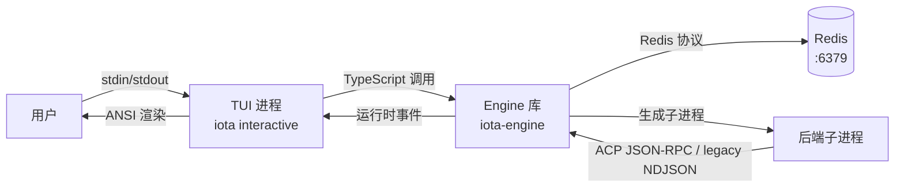

# TUI 指南（TUI Guide）

**版本：** 1.0
**最后更新：** 2026 年 4 月

## 目录

1. [简介](#1-简介)
2. [架构概览](#2-架构概览)
3. [前置要求](#3-前置要求)
4. [安装与设置](#4-安装与设置)
5. [核心功能](#5-核心功能)
6. [分布式特性](#6-分布式特性)
7. [手动验证方法](#7-手动验证方法)
8. [故障排查](#8-故障排查)
9. [清理](#9-清理)
10. [参考资料](#10-参考资料)

---

## 1. 简介

### 目的与范围

本指南介绍 Iota 交互式 TUI（Terminal User Interface，终端用户界面）模式，它提供了一个 REPL 风格的对话式 AI 交互界面。TUI 通过 `iota interactive` 启动，支持会话（Session）持续性、后端切换、审批工作流和流式输出。

当前实现中，TUI 是 `iota-cli` 的本地交互模式，不走 `iota-agent`。执行路径是 `iota-cli -> IotaEngine -> backend subprocess`，因此它和普通 CLI 命令一样直接进入 Engine。

### 目标受众

- 偏好命令行对话式交互的用户
- 测试多轮对话流程的开发者
- 验证审批工作流行为的任何人

---

## 2. 架构概览

### 组件图



### 依赖项

| 依赖项 | 用途 | 连接方式 |
|------------|---------|-------------------|
| CLI 基础设施 | TUI 通过 `iota interactive` 启动 | 进程内 TypeScript |
| Engine 库 | 执行和状态管理 | TypeScript 导入 |
| Redis | 会话持久化和事件流 | Redis 协议/TCP |
| 终端 | ANSI 转义码渲染 | stdin/stdout |

> 说明：Agent 的 HTTP / WebSocket 接口服务于 App 和远程客户端，不参与 `iota interactive` 的本地执行路径。

### 通信协议

- **TUI → Engine**：通过 `engine.stream()` 异步迭代器直接调用 TypeScript 函数
- **TUI → Redis**：通过 Engine 的存储层访问会话状态
- **TUI → 用户**：终端 stdio，使用 ANSI 格式化（chalk 用于颜色）
- **Engine → 后端**：子进程 stdio（首选 ACP JSON-RPC 2.0；Claude/Codex/Gemini 可降级 legacy NDJSON）
- **后端 → Engine**：stdout/stderr 管道发出 ACP JSON-RPC notification/response 或 legacy NDJSON 事件

---

## 3. 前置要求

### 必需软件

| 软件 | 用途 |
|----------|---------|
| Bun | TypeScript 执行运行时 |
| Redis | 会话和事件持久化 |
| 后端 CLI | AI 后端（claude、codex、gemini、hermes、opencode；Claude/Codex ACP adapter 可通过 npx shim 启动） |

### 终端要求

- **ANSI 支持**：终端必须能解释 ANSI 转义码
- **UTF-8 编码**：正确显示字符所必需
- **256 色支持**：有用但非必需

**兼容的终端**：
- macOS Terminal.app
- iTerm2
- Windows Terminal
- Alacritty
- kitty
- VS Code 集成终端

**不兼容的终端**：
- 基础命令提示符（Windows）
- 某些旧版 SSH 客户端

### 环境变量

```bash
# 可选：Redis 连接
export REDIS_HOST="127.0.0.1"
export REDIS_PORT="6379"
```

后端身份验证从 Redis 分布式配置中读取，例如 `iota config set env.ANTHROPIC_AUTH_TOKEN "sk-ant-..." --scope backend --scope-id claude-code`。

后端发现建议优先使用仓库根目录的 `deployment/scripts/ensure-backends.sh --check-only`。它比零散的 `which`、`where` 或 `Get-Command` 示例更适合作为跨平台检查入口。

---

## 4. 安装与设置

### 步骤 1：启动 Redis

```bash
cd deployment/scripts
bash start-storage.sh
redis-cli ping
# 预期输出：PONG
```

在 Windows 上，`bash` 和 `redis-cli` 可能默认不存在。文档中的命令是示例；实际操作应以你本机可用的 shell、Redis 客户端或仓库脚本为准。

### 步骤 2：构建包

```bash
cd iota-engine && bun run build
cd ../iota-cli && bun run build
```

### 步骤 3：启动交互模式

```bash
iota interactive
```

**预期输出**：
```
iota interactive session started. Type "exit" to quit, "switch <backend>" to change backend.
iota>
```

### 步骤 4：验证流式传输

从另一个终端验证 Engine 进程正在处理会话：
```bash
redis-cli KEYS "iota:session:*"
# 预期输出：至少一个会话键
```

---

## 5. 核心功能

### 功能：提示词输入与执行

**目的**：输入提示词并接收流式响应。

**用法**：
```
iota> What is 2+2?
iota> run "What is 2+2?"
```

`run <prompt>` 形式是显式的会话内命令。直接提示词输入仍然支持正常的 REPL 使用。

**行为**：
- 用户输入提示词并按 Enter
- Engine 按收到的 `output` 事件块实时写出响应
- 输出通过 `process.stdout.write()` 实时显示
- 每个 `output` 类型的 RuntimeEvent 直接打印

**输出事件类型**：
```typescript
if (event.type === "output") {
  process.stdout.write(event.data.content);  // 流式文本
} else if (event.type === "error") {
  console.error(chalk.red(`\n${event.data.code}: ${event.data.message}`));
} else if (event.type === "state") {
  if (event.data.state === "waiting_approval") {
    console.log(chalk.yellow("\n⏳ Waiting for approval..."));
  } else if (event.data.state === "failed") {
    console.error(chalk.red(`\n❌ Execution failed...`));
  }
} else if (event.type === "tool_call") {
  console.log(chalk.dim(`\n🔧 ${event.data.toolName}(...)`));
} else if (event.type === "file_delta") {
  console.log(chalk.dim(`\n📁 ${event.data.operation}: ${event.data.path}`));
}
```

---

### 功能：会话管理（Session Management）

**目的**：每个交互式会话在 Redis 中创建一个持久会话。

**会话生命周期**：
1. `iota interactive` → 创建新的 `IotaEngine` 实例 → 通过 `engine.createSession()` 创建新会话
2. 会话持久化在 Redis：`iota:session:{sessionId}`
3. 会话在 TUI 重启后仍然存在（只要 Redis 在运行）

**验证**：
```bash
# 在交互式会话期间从另一个终端执行
redis-cli KEYS "iota:session:*"
redis-cli HGETALL "iota:session:$(redis-cli KEYS 'iota:session:*' | head -1 | cut -d: -f3)"
```

---

### 功能：后端切换

**目的**：在会话中途切换活动后端。

**会话内命令**：
```
iota> switch <backend>
```

**可用后端**：`claude-code`、`codex`、`gemini`、`hermes`、`opencode`

**示例**：
```
iota> switch gemini
# 系统响应："Switched to gemini"

iota> What can you do?
# 现在使用 Gemini 后端
```

**错误处理**：
```
iota> switch invalid-backend
# 错误："Unknown backend: invalid-backend. Available: claude-code, codex, gemini, hermes, opencode"
```

---

### 功能：状态命令

**目的**：显示所有后端的健康状态。

**会话内命令**：
```
iota> status
```

**预期输出**：包含后端健康信息的 JSON。

---

### 功能：指标命令

**目的**：显示引擎指标。

**会话内命令**：
```
iota> metrics
```

**预期输出**：包含执行指标的 JSON。

---

### 功能：垃圾回收命令

**目的**：清理过期的执行记录和可见性数据。

**会话内命令**：
```
iota> gc
```

**作用**：
- 清理超过 `eventRetentionHours` 的过期事件
- 清理孤立的后端进程
- 清理过期的可见性数据

**CLI 等效命令**：
```bash
iota gc
```

**详细文档**：参见 [01-cli-guide.md](./01-cli-guide.md) 中的 `iota gc` 命令说明。

---

### 功能：审批工作流

**目的**：当后端请求审批时（例如执行 shell 命令），TUI 显示等待状态。

**流程**：
1. 后端发出 `state: waiting_approval` 事件
2. TUI 打印 `⏳ Waiting for approval...`
3. 在交互模式下，审批由 `CliApprovalHook` 自动处理

**审批钩子行为**（`CliApprovalHook`）：
- 根据配置的策略自动批准或拒绝
- `approval.shell = "auto"` → 自动批准 shell 命令
- `approval.shell = "ask"` → 在当前 CLI/TUI 中进行交互式确认

**验证**：
```bash
iota config set approval.shell "ask"
iota interactive
iota> run "rm /tmp/test"  # 可能触发审批提示
```

---

### 功能：键盘快捷键和导航

**目的**：TUI 内的标准终端导航。

| 按键 | 操作 |
|-----|--------|
| Enter | 提交提示词 |
| Ctrl+C | 中断当前输入或终止 TUI 进程；当前 `interactive.ts` 没有单独实现“只中断当前 execution 并继续留在 REPL”的处理 |
| Ctrl+D | 退出交互模式 |
| ↑ / ↓ | 命令历史（readline） |

**命令历史**：
- 通过 readline 的 `history` 机制提供先前的命令
- 上箭头滚动浏览历史
- 下箭头向前滚动

---

### 功能：多轮对话

**目的**：对话上下文在会话内保持。

**示例流程**：
```
iota> My favorite color is blue.
# 响应确认

iota> What is my favorite color?
# 响应："Your favorite color is blue."
```

**验证**：
```bash
# 检查事件包含对话历史
redis-cli XRANGE "iota:events:$(redis-cli KEYS 'iota:events:*' | head -1 | cut -d: -f3)" - + | jq '.[].type'
# 预期输出：包含多个用户消息和输出
```

---

### 功能：Trace 追踪和 Visibility 可见性查询

**目的**：在交互模式中检查执行追踪和可见性数据。

**会话内命令**（需在外部终端执行）：
```bash
# 查询执行追踪
iota trace --execution <executionId>

# 查询可见性数据
iota visibility --execution <executionId>
iota visibility --execution <executionId> --summary
iota visibility --execution <executionId> --memory
iota visibility --execution <executionId> --tokens

# 列出会话的可见性记录
iota visibility list --session <sessionId>
```

**详细文档**：完整的追踪和可见性数据结构说明参见 [06-visibility-trace-guide.md](./06-visibility-trace-guide.md)。

---

## 6. 分布式特性

### 功能：跨重启的会话持续性

**目的**：会话持久化在 Redis 中，在 TUI 重启后仍然存在。

**步骤**：

1. **启动交互式会话**：
   ```bash
   iota interactive
   iota> run "First prompt"
   ```

2. **记录会话 ID**（从另一个终端）：
   ```bash
   SESSION_ID=$(redis-cli KEYS "iota:session:*" | head -1 | cut -d: -f3)
   echo "Session: $SESSION_ID"
   ```

3. **退出并重启**（Ctrl+D）：
   ```
   iota> exit
   ```

4. **启动新会话**（会话不同但先前数据仍然存在）：
   ```bash
   iota interactive
   ```

5. **查询先前会话的日志**：
   ```bash
   iota logs --session $SESSION_ID --limit 10
   ```

---

### 功能：对话历史持久化

**目的**：会话的事件历史存储在 Redis 中并可查询。

**步骤**：
```bash
# 在交互式会话期间或之后
SESSION_ID=$(redis-cli KEYS "iota:session:*" | head -1 | cut -d: -f3)

# 查询会话的所有事件
iota logs --session $SESSION_ID --limit 100
```

---

## 7. 手动验证方法

### 验证清单：交互式执行

**目标**：验证交互模式启动并使用流式输出执行提示词。

- [ ] **设置**：Redis 运行中，包已构建
  ```bash
  redis-cli ping
  # 预期输出：PONG
  redis-cli FLUSHALL   # 清空数据
  ```

- [ ] **启动**：启动交互模式
  ```bash
  iota interactive
  # 预期输出：显示提示符 "iota>"
  ```

- [ ] **执行**：输入提示词
  ```
  iota> What is 2+2?
  # 预期输出：流式输出实时显示
  ```

- [ ] **观察**：检查 Redis 创建的会话
  ```bash
  redis-cli KEYS "iota:session:*"
  # 预期输出：1 个会话键
  
  redis-cli KEYS "iota:events:*"
  # 预期输出：1+ 个事件键
  ```

- [ ] **验证**：检查执行完成
  ```bash
  EXEC_ID=$(redis-cli KEYS "iota:events:*" | head -1 | cut -d: -f3)
  # 事件流应包含以 "completed" 结束的状态事件
  redis-cli XRANGE "iota:events:$EXEC_ID" - + | jq '.[-1].type'
  # 预期输出："state"
  ```

- [ ] **清理**：
  ```
  iota> exit
  redis-cli FLUSHALL
  ```

**成功标准**：
- ✅ 交互提示符出现
- ✅ 流式输出按事件块实时渲染
- ✅ 在 Redis 中创建会话
- ✅ 事件存储在 Redis 中
- ✅ `exit` 命令干净地终止

**失败指标**：
- ❌ 无流式传输（输出一次性全部显示）
- ❌ 未在 Redis 中创建会话
- ❌ TUI 在提示词输入时崩溃

---

### 验证清单：后端切换

**目标**：验证可以在会话中途切换后端。

- [ ] **设置**：Redis 运行中，至少 2 个后端可用
  ```bash
  iota status
  # 预期输出：显示多个后端
  ```

- [ ] **启动**：
  ```bash
  iota interactive
  ```

- [ ] **检查初始后端**：
  ```
  iota> status
  # 记录当前后端
  ```

- [ ] **切换**：
  ```
  iota> switch gemini
  # 预期输出："Switched to gemini"
  ```

- [ ] **使用新后端执行**：
  ```
  iota> What model are you?
  # 预期输出：来自 Gemini 的响应
  ```

- [ ] **在 Redis 中验证**：
  ```bash
  SESSION_ID=$(redis-cli KEYS "iota:session:*" | head -1 | cut -d: -f3)
  redis-cli HGET "iota:session:$SESSION_ID" "activeBackend"
  # 预期输出："gemini"
  ```

- [ ] **清理**：
  ```
  iota> exit
  redis-cli FLUSHALL
  ```

**成功标准**：
- ✅ 切换命令被接受
- ✅ 打印确认消息
- ✅ 后续执行使用新后端
- ✅ Redis 会话已更新

---

### 验证清单：审批工作流

**目标**：验证显示审批等待状态。

- [ ] **设置**：配置审批策略
  ```bash
  iota config set approval.shell "ask"
  ```

- [ ] **启动**：
  ```bash
  iota interactive
  ```

- [ ] **触发审批场景**：
  ```
  iota> run "echo test"
  # 可能显示：⏳ Waiting for approval...
  # 或者如果策略是 "auto" 则自动批准
  ```

- [ ] **验证**：
  ```bash
  # 检查事件中的 waiting_approval 状态
  redis-cli XRANGE "iota:events:$(redis-cli KEYS 'iota:events:*' | head -1 | cut -d: -f3)" - + | jq '.[] | select(.type=="state")'
  ```

- [ ] **清理**：
  ```
  iota> exit
  redis-cli FLUSHALL
  ```

---

### 验证清单：命令历史

**目标**：验证可以访问先前的命令。

- [ ] **设置**：启动交互模式
  ```bash
  iota interactive
  ```

- [ ] **执行多个命令**：
  ```
  iota> command1
  iota> command2
  iota> command3
  ```

- [ ] **导航历史**：
  ```
  # 按 ↑ 三次
  # 应该看到 "command3" 出现
  # 再按 ↑ 一次
  # 应该看到 "command2"
  ```

- [ ] **清理**：
  ```
  iota> exit
  ```

---

## 8. 故障排查

### 问题：ANSI 渲染损坏

**症状**：
- 转义码按字面打印（例如 `^[[32m`）
- 颜色不显示
- 光标定位不正确

**诊断**：
```bash
# 检查终端类型
echo $TERM
# 如果是 dumb：不支持 ANSI
```

**解决方案**：
```bash
# 使用兼容的终端
# 示例：iTerm2、Windows Terminal、Alacritty
export TERM=xterm-256color
```

**预防**：始终使用支持 ANSI 的终端。

---

### 问题：终端不支持

**症状**：
- `iota interactive` 立即失败
- 关于终端功能的错误

**解决方案**：
```bash
# 安装并使用支持的终端
# macOS：iTerm2（免费）
# Windows：Windows Terminal（Microsoft Store）
# Linux：kitty、Alacritty
```

---

### 问题：卡在审批等待

**症状**：
- TUI 挂在 `⏳ Waiting for approval...`

**诊断**：
```bash
# 检查审批策略
iota config get approval.shell
```

**解决方案**：
```bash
# 设置为自动批准
iota config set approval.shell "auto"

# 或结束当前 TUI 进程后重启
```

---

### 问题：TUI 中找不到后端

**症状**：
- `switch` 命令失败，提示未知后端

**诊断**：
```bash
iota status
# 检查哪些后端显示健康
```

**解决方案**：
```bash
# 安装缺失的后端 CLI
# 或确保后端在 PATH 中
export PATH="/path/to/backend:$PATH"
```

### 问题：运行时出现 `DEP0190` 警告

**症状**：
- 执行 `iota run`、`iota interactive` 或 `iota status` 时出现 Node 的 `DEP0190` 警告

**原因**：
- 旧实现为了兼容 Windows 使用了 `spawn(..., { shell: true })`，Node 会警告参数只是拼接而非安全转义

**当前状态**：
- 当前实现已改为直接执行已解析的可执行文件路径，不再依赖 `shell: true`

**如果仍看到该警告**：
```bash
cd iota-engine && bun run build
cd ../iota-cli && bun run build
```

然后重新运行 `iota` 命令，确认使用的是最新构建产物。

---

## 9. 清理

### 退出交互模式

```
iota> exit
# 或按 Ctrl+D
```

### 重置 Redis 数据

```bash
redis-cli FLUSHALL
```

### 停止 Redis

```bash
cd deployment/scripts
bash stop-storage.sh
```

---

## 10. 参考资料

### 相关指南

- [01-cli-guide.md](./01-cli-guide.md) — CLI 命令参考
- [00-architecture-overview.md](./00-architecture-overview.md) — 系统架构
- [03-agent-guide.md](./03-agent-guide.md) — Agent API 验证
- [05-engine-guide.md](./05-engine-guide.md) — Engine 内部机制

### 外部文档

- [CLI README](../../iota-cli/README.md)
- [chalk](https://www.npmjs.com/package/chalk) — 终端字符串样式

---

## 版本历史

| 版本 | 日期 | 变更 |
|---------|------|---------|
| 1.2 | 2026 年 4 月 | 添加 gc 命令说明；添加 trace/visibility 命令交叉引用；增强分布式特性章节 |
| 1.1 | 2026 年 4 月 | 澄清 TUI 不经过 Agent；修正流式输出、审批和 Ctrl+C 行为描述 |
| 1.0 | 2026 年 4 月 | 初始版本 |
