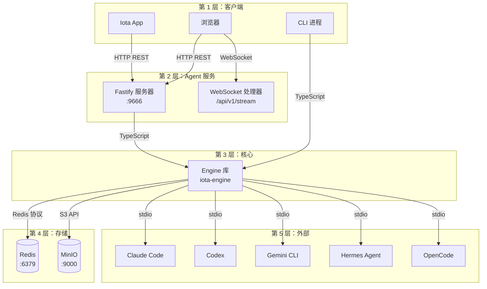

# Agent 服务指南

**版本:** 1.2
**最后更新:** 2026 年 4 月

## 目录

1. [简介](#1-简介)
2. [架构概览](#2-架构概览)
3. [前置要求](#3-前置要求)
4. [安装与设置](#4-安装与设置)
5. [核心功能 — REST API](#5-核心功能--rest-api)
6. [核心功能 — WebSocket](#6-核心功能--websocket)
7. [分布式特性](#7-分布式特性)
8. [手动验证方法](#8-手动验证方法)
9. [故障排查](#9-故障排查)
10. [清理](#10-清理)
11. [参考资料](#11-参考资料)

---

## 1. 简介

### 目的与范围

本指南涵盖运行在 9666 端口的 Iota Agent 服务（HTTP/WebSocket）。Agent 服务暴露分布式 API，用于 Session 会话管理、Execution 执行控制、配置、日志记录、Visibility 可见性检查，以及通过 WebSocket 进行实时事件流传输。

### 目标受众

- 验证 Agent 服务 API 功能的开发者
- 与 App 集成的前端开发者
- 通过 HTTP 测试分布式特性的用户

### 实现状态

- ✅ 核心 REST API：sessions、executions、config、logs、visibility、cross-session
- ✅ 带订阅功能的 WebSocket 流式传输
- ✅ 基于 Redis 作用域的分布式配置（global、backend、session、user）
- ✅ 跨 Session 会话的日志和内存查询
- ✅ Backend 后端隔离报告

---

## 2. 架构概览

### 组件图



### 依赖项

| 依赖项 | 版本 | 用途 | 连接方式 |
|------------|---------|---------|------------|
| `@iota/engine` | built | 核心运行时 | TypeScript 导入 |
| Redis | running :6379 | 主存储 | Redis 协议/TCP |
| Fastify | latest | HTTP/WebSocket 服务器 | 进程内 |
| MinIO | optional :9000 | 对象存储 | S3 API |

### 通信协议

- **客户端 → Agent 服务**: 通过 TCP :9666 的 HTTP REST JSON
- **客户端 → Agent 服务**: 通过 TCP :9666 的 WebSocket
- **Agent 服务 → Engine**: 直接 TypeScript 调用（进程内）；Engine 再通过 ACP JSON-RPC 2.0 或 legacy NDJSON fallback 对接后端
- **Agent 服务 → Redis**: 通过 TCP :6379 的 Redis 协议
- **Agent 服务 → MinIO**: 通过 HTTP :9000 的 S3 API（如果配置）

**参考**: 参见 [00-architecture-overview.md](./00-architecture-overview.md)

---

## 3. 前置要求

### 必需软件

| 软件 | 验证方式 |
|----------|--------------|
| Redis | `redis-cli ping` → `PONG` |
| Bun | `bun --version` |
| Backend 后端可执行文件 | `deployment/scripts/ensure-backends.sh --check-only`；覆盖 claude、codex、gemini、hermes、opencode |

### 端口要求

| 端口 | 服务 | 验证方式 |
|------|---------|--------------|
| 9666 | Agent 服务 | `lsof -i :9666` |
| 6379 | Redis | `lsof -i :6379` |

### 可选存储

**MinIO**（用于工件的对象存储）：
```bash
# 健康检查
curl http://localhost:9000/minio/health/live
```

---

## 4. 安装与设置

### 步骤 1：启动 Redis

```bash
cd deployment/scripts
bash start-storage.sh
redis-cli ping
# 预期输出: PONG
```

### 步骤 2：构建 Agent 服务

```bash
cd iota-agent
bun install
bun run build
```

### 步骤 3：启动 Agent 服务

```bash
cd iota-agent
bun run dev
# 默认监听 0.0.0.0:9666
```

**验证**：
```bash
curl http://localhost:9666/health
# 预期输出: {"status":"ok","timestamp":"..."}

curl http://localhost:9666/healthz
# 预期输出: {"status":"healthy","timestamp":"...","backends":{...}}
```

---

## 5. 核心功能 — REST API

### Session 会话路由

#### `POST /api/v1/sessions` — 创建 Session 会话

**请求**：
```bash
curl -X POST http://localhost:9666/api/v1/sessions \
  -H "Content-Type: application/json" \
  -d '{"workingDirectory":"/tmp","backend":"claude-code"}'
```

**响应** (201)：
```json
{
  "sessionId": "4afe5990-d7be-4899-83ae-b2bb48a2c0dc",
  "createdAt": 1777360839048
}
```

> **注意**：Session ID 为标准 UUID v4 格式。

---

#### `GET /api/v1/sessions/:sessionId` — 获取 Session 会话

**请求**：
```bash
curl http://localhost:9666/api/v1/sessions/4afe5990-d7be-4899-83ae-b2bb48a2c0dc
```

**响应** (200)：
```json
{
  "sessionId": "4afe5990-d7be-4899-83ae-b2bb48a2c0dc",
  "workingDirectory": "/tmp",
  "createdAt": 1714067200000,
  "updatedAt": 1714067250000
}
```

---

#### `DELETE /api/v1/sessions/:sessionId` — 删除 Session 会话

**请求**：
```bash
curl -X DELETE http://localhost:9666/api/v1/sessions/4afe5990-d7be-4899-83ae-b2bb48a2c0dc
```

**响应** (204)：空

> **注意**：重复删除已删除的 Session 会返回 404。

---

#### `PUT /api/v1/sessions/:sessionId/context` — 更新 Session 会话上下文

**请求**：
```bash
curl -X PUT http://localhost:9666/api/v1/sessions/4afe5990-d7be-4899-83ae-b2bb48a2c0dc/context \
  -H "Content-Type: application/json" \
  -d '{"activeFiles":[{"path":"/tmp/test.txt","pinned":true}]}'
```

**响应** (200)：
```json
{"success":true}
```

---

#### `GET /api/v1/sessions/:sessionId/workspace/file` — 读取工作区文件

**请求**：
```bash
curl "http://localhost:9666/api/v1/sessions/4afe5990-d7be-4899-83ae-b2bb48a2c0dc/workspace/file?path=src/index.ts"
```

**响应** (200)：
```json
{
  "path": "src/index.ts",
  "absolutePath": "/tmp/src/index.ts",
  "content": "...",
  "size": 1234
}
```

---

#### `PUT /api/v1/sessions/:sessionId/workspace/file` — 写入工作区文件

**请求**：
```bash
curl -X PUT http://localhost:9666/api/v1/sessions/4afe5990-d7be-4899-83ae-b2bb48a2c0dc/workspace/file \
  -H "Content-Type: application/json" \
  -d '{"path":"src/index.ts","content":"console.log(\"hello\");"}'
```

**响应** (200)：
```json
{
  "path": "src/index.ts",
  "absolutePath": "/tmp/src/index.ts",
  "size": 24
}
```

---

#### `GET /api/v1/sessions/:sessionId/memories` — 列出 Session 会话情景记忆

**请求**：
```bash
curl "http://localhost:9666/api/v1/sessions/4afe5990-d7be-4899-83ae-b2bb48a2c0dc/memories?limit=50"
```

**查询参数**：`limit`（默认 50）

**响应** (200)：
```json
{
  "count": 2,
  "memories": [
    {"id": "mem_1", "content": "...", "type": "episodic", "scope": "session", "scopeId": "a1b2...", "createdAt": 1714067200000}
  ]
}
```

---

#### `POST /api/v1/sessions/:sessionId/memories` — 创建 Session 会话情景记忆

**请求**：
```bash
curl -X POST http://localhost:9666/api/v1/sessions/4afe5990-d7be-4899-83ae-b2bb48a2c0dc/memories \
  -H "Content-Type: application/json" \
  -d '{"content":"User prefers TypeScript"}'
```

**响应** (201)：已创建的记忆对象。

---

#### `DELETE /api/v1/sessions/:sessionId/memories/:memoryId` — 删除 Session 会话记忆

**请求**：
```bash
curl -X DELETE http://localhost:9666/api/v1/sessions/4afe5990-d7be-4899-83ae-b2bb48a2c0dc/memories/mem_1
```

**响应** (204)：空

---

#### `GET /api/v1/sessions/:sessionId/app-snapshot` — Session 会话 App 快照

**请求**：
```bash
curl http://localhost:9666/api/v1/sessions/4afe5990-d7be-4899-83ae-b2bb48a2c0dc/app-snapshot
```

**响应** (200)：完整的 Session 会话级 App 读取模型快照，包括对话历史、内存、令牌和追踪。

---

### Execution 执行路由

#### `POST /api/v1/execute` — 执行提示

**请求**：
```bash
curl -X POST http://localhost:9666/api/v1/execute \
  -H "Content-Type: application/json" \
  -d '{"sessionId":"4afe5990-d7be-4899-83ae-b2bb48a2c0dc","prompt":"What is 2+2?","backend":"claude-code"}'
```

**响应** (202)：
```json
{
  "executionId": "exec_2278345f-7d23-4b91-8c43-06bea200718e",
  "sessionId": "4afe5990-d7be-4899-83ae-b2bb48a2c0dc",
  "status": "queued"
}
```

---

#### `GET /api/v1/executions/:executionId` — 获取 Execution 执行

**请求**：
```bash
curl http://localhost:9666/api/v1/executions/exec_2278345f-7d23-4b91-8c43-06bea200718e
```

**响应** (200)：Execution 执行记录对象，包含 `prompt`、`output`、`status`、`backend`、`createdAt`、`completedAt`。

---

#### `GET /api/v1/executions/:executionId/events` — 获取 Execution 执行事件

**请求**：
```bash
curl "http://localhost:9666/api/v1/executions/exec_2278345f-7d23-4b91-8c43-06bea200718e/events?offset=0&limit=100"
```

**响应** (200)：
```json
{
  "executionId": "exec_2278345f-7d23-4b91-8c43-06bea200718e",
  "offset": 0,
  "limit": 100,
  "count": 5,
  "events": [
    {"type":"state","data":{"state":"queued"}},
    {"type":"output","data":{"content":"2"}},
    ...
  ]
}
```

**事件类型**：`output`、`state`、`tool_call`、`tool_result`、`file_delta`、`error`、`extension`

---

#### `POST /api/v1/executions/:executionId/interrupt` — 中断 Execution 执行

**请求**：
```bash
curl -X POST http://localhost:9666/api/v1/executions/exec_2278345f-7d23-4b91-8c43-06bea200718e/interrupt
```

**响应** (200)：
```json
{"executionId":"exec_2278345f-7d23-4b91-8c43-06bea200718e","status":"interrupted"}
```

---

### Config 配置路由

#### `GET /api/v1/config` — 获取解析后的配置

**请求**：
```bash
curl "http://localhost:9666/api/v1/config?backend=claude-code&sessionId=4afe5990-d7be-4899-83ae-b2bb48a2c0dc&userId=user_01"
```

**查询参数**：`backend`、`sessionId`、`userId`（三选一，至少提供一个以获取有意义的合并结果）

**解析顺序**（优先级从高到低）：`user > session > backend > global`

**响应** (200)：从指定作用域链合并的配置对象。例如传入 `backend=claude-code` 会合并 global + backend.claude-code 的配置。

---

#### `GET /api/v1/config/:scope` — 获取作用域配置或列出作用域 ID

**有效作用域**：`global`、`backend`、`session`、`user`

**请求**：
```bash
curl http://localhost:9666/api/v1/config/global
# 响应: {"approval.shell":"ask",...} (global 的配置对象)

curl http://localhost:9666/api/v1/config/backend
# 响应: {"scope":"backend","ids":[...]} (仅包含存储了 backend 作用域配置的 ID)
```

---

#### `GET /api/v1/config/:scope/:scopeId` — 获取作用域配置

**请求**：
```bash
curl http://localhost:9666/api/v1/config/backend/claude-code
```

**响应** (200)：该作用域的配置对象。

---

#### `POST /api/v1/config` — 设置全局配置

**请求**：
```bash
curl -X POST http://localhost:9666/api/v1/config \
  -H "Content-Type: application/json" \
  -d '{"key":"approval.shell","value":"ask"}'
```

**响应** (200)：
```json
{"ok":true,"scope":"global","key":"approval.shell","value":"ask"}
```

---

#### `POST /api/v1/config/:scope/:scopeId` — 设置作用域配置

**请求**：
```bash
curl -X POST http://localhost:9666/api/v1/config/backend/claude-code \
  -H "Content-Type: application/json" \
  -d '{"key":"timeout","value":"60000"}'
```

---

#### `DELETE /api/v1/config/:scope/:scopeId/:key` — 删除配置键

对于 `global` 作用域，也提供了专用的较短路由：

**请求**：
```bash
# 删除全局配置键（专用路由）
curl -X DELETE http://localhost:9666/api/v1/config/global/approval.shell

# 删除 backend 作用域配置键
curl -X DELETE http://localhost:9666/api/v1/config/backend/claude-code/timeout

# 删除 user 作用域配置键
curl -X DELETE http://localhost:9666/api/v1/config/user/user_01/theme
```

---

### Logs 日志路由

#### `GET /api/v1/logs` — 查询日志

**请求**：
```bash
curl "http://localhost:9666/api/v1/logs?sessionId=4afe5990-d7be-4899-83ae-b2bb48a2c0dc&backend=claude-code&limit=10"
```

**查询参数**：`sessionId`、`executionId`、`backend`、`eventType`、`since`、`until`、`offset`、`limit`

**响应** (200)：
```json
{
  "offset": 0,
  "limit": 10,
  "count": 5,
  "logs": [...]
}
```

---

#### `GET /api/v1/logs/aggregate` — 聚合日志计数

**请求**：
```bash
curl "http://localhost:9666/api/v1/logs/aggregate?backend=claude-code"
```

**响应** (200)：按事件类型分组的聚合计数。

---

#### `GET /api/v1/memories/search` — 搜索记忆

**请求**：
```bash
curl "http://localhost:9666/api/v1/memories/search?query=binary+search&limit=10"
```

---

#### `GET /api/v1/backend-isolation` — Backend 后端隔离报告

**请求**：
```bash
curl http://localhost:9666/api/v1/backend-isolation
```

---

#### `GET /api/v1/sessions/all` — 列出所有 Session 会话

**请求**：
```bash
curl "http://localhost:9666/api/v1/sessions/all?limit=100"
```

---

### Visibility 可见性路由

#### `GET /api/v1/executions/:executionId/visibility` — 完整 Visibility 可见性包

**请求**：
```bash
curl http://localhost:9666/api/v1/executions/exec_2278345f-7d23-4b91-8c43-06bea200718e/visibility
```

**响应** (200)：完整的 Visibility 可见性包，包括令牌、内存、上下文、链。

---

#### `GET /api/v1/executions/:executionId/visibility/tokens` — 令牌 Visibility 可见性

**请求**：
```bash
curl http://localhost:9666/api/v1/executions/exec_2278345f-7d23-4b91-8c43-06bea200718e/visibility/tokens
```

---

#### `GET /api/v1/executions/:executionId/visibility/memory` — 内存 Visibility 可见性

**请求**：
```bash
curl http://localhost:9666/api/v1/executions/exec_2278345f-7d23-4b91-8c43-06bea200718e/visibility/memory
```

---

#### `GET /api/v1/executions/:executionId/visibility/chain` — 追踪链

**请求**：
```bash
curl http://localhost:9666/api/v1/executions/exec_2278345f-7d23-4b91-8c43-06bea200718e/visibility/chain
```

**响应** (200)：
```json
{
  "link": {...},
  "spans": [...],
  "mappings": [...]
}
```

---

#### `GET /api/v1/executions/:executionId/trace` — 分层追踪树

**请求**：
```bash
curl http://localhost:9666/api/v1/executions/exec_2278345f-7d23-4b91-8c43-06bea200718e/trace
```

---

#### `GET /api/v1/executions/:executionId/app-snapshot` — App Execution 执行快照

**请求**：
```bash
curl http://localhost:9666/api/v1/executions/exec_2278345f-7d23-4b91-8c43-06bea200718e/app-snapshot
```

---

#### `GET /api/v1/executions/:executionId/replay` — Execution 执行回放

**请求**：
```bash
curl http://localhost:9666/api/v1/executions/exec_2278345f-7d23-4b91-8c43-06bea200718e/replay
```

**响应** (200)：Execution 执行回放数据，包括有序事件、Visibility 可见性快照和用于回放重建的时间信息。

> **注意**：回放是一个 **REST 查询端点**，返回 Execution 执行数据的静态快照。它不是实时 WebSocket 流。App 通过 `api.getExecutionReplay()` 按需获取回放数据，并从返回的事件和 Visibility 可见性记录在客户端重建回放。

---

#### `GET /api/v1/traces/aggregate` — 聚合追踪

**请求**：
```bash
curl "http://localhost:9666/api/v1/traces/aggregate?sessionId=4afe5990-d7be-4899-83ae-b2bb48a2c0dc&backend=claude-code"
```

**响应** (200)：跨 Execution 执行的聚合追踪统计。

---

#### `GET /api/v1/sessions/:sessionId/visibility` — Session 会话 Visibility 可见性

**请求**：
```bash
curl "http://localhost:9666/api/v1/sessions/4afe5990-d7be-4899-83ae-b2bb48a2c0dc/visibility?limit=50"
```

---

#### `GET /api/v1/sessions/:sessionId/visibility/summary` — Session 会话 Visibility 可见性摘要

**请求**：
```bash
curl http://localhost:9666/api/v1/sessions/4afe5990-d7be-4899-83ae-b2bb48a2c0dc/visibility/summary
```

**响应** (200)：
```json
{
  "sessionId": "a1b2c3d4-...",
  "executionCount": 5,
  "tokens": {
    "inputTokens": 10000,
    "outputTokens": 500,
    "totalTokens": 10500,
    "averageTokens": 2100
  },
  "memory": {
    "selectedBlocks": 3,
    "trimmedBlocks": 1
  },
  "byBackend": {
    "claude-code": 3,
    "gemini": 2
  }
}
```

---

### Status 状态路由

#### `GET /api/v1/status` — Backend 后端状态

**请求**：
```bash
curl http://localhost:9666/api/v1/status
```

**响应** (200)：
```json
{
  "backends": [
    {
      "backend": "claude-code",
      "label": "claude-code",
      "status": "online",
      "active": false,
      "capabilities": {
        "streaming": true,
        "mcp": false,
        "memoryVisibility": true,
        "tokenVisibility": true,
        "chainVisibility": true
      }
    }
  ]
}
```

---

#### `GET /api/v1/metrics` — Engine 指标

**请求**：
```bash
curl http://localhost:9666/api/v1/metrics
```

---

### Cross-Session 跨会话路由

#### `GET /api/v1/cross-session/logs` — 跨 Session 会话日志查询

**请求**：
```bash
curl "http://localhost:9666/api/v1/cross-session/logs?backend=claude-code&limit=50"
```

---

#### `GET /api/v1/cross-session/logs/aggregate` — 跨 Session 会话日志聚合

**请求**：
```bash
curl "http://localhost:9666/api/v1/cross-session/logs/aggregate?backend=claude-code"
```

---

#### `GET /api/v1/cross-session/sessions` — 跨 Session 会话列出所有会话

**请求**：
```bash
curl "http://localhost:9666/api/v1/cross-session/sessions?limit=100"
```

---

#### `GET /api/v1/cross-session/memories/search` — 跨 Session 会话内存搜索

**请求**：
```bash
curl "http://localhost:9666/api/v1/cross-session/memories/search?query=binary+search&limit=10"
```

---

#### `GET /api/v1/cross-session/backend-isolation` — 跨 Session 会话 Backend 后端隔离

**请求**：
```bash
curl http://localhost:9666/api/v1/cross-session/backend-isolation
```

---

## 6. 核心功能 — WebSocket

### 连接建立

**URL**：`ws://localhost:9666/api/v1/stream`

**协议**：基于 TCP 的 WebSocket

**握手**：HTTP 升级请求（标准 WebSocket 协议）

**使用 wscat 验证**：
```bash
npm install -g wscat
wscat -c ws://localhost:9666/api/v1/stream
# 已连接（按 Ctrl+C 退出）
```

**使用 wscat 验证 WebSocket 连接**：
```bash
npm install -g wscat
wscat -c ws://localhost:9666/api/v1/stream
# 已连接（按 Ctrl+C 退出）
```

**注意**：不要用 `curl -I` 检测 WebSocket 端点，会返回 500（因为 WebSocket 需要升级协议，curl 的 HEAD 请求无法完成握手）。

---

### 入站消息类型（客户端 → Agent 服务）

#### `execute` — 通过 WebSocket 执行提示

**消息**：
```json
{
  "type": "execute",
  "sessionId": "4afe5990-d7be-4899-83ae-b2bb48a2c0dc",
  "prompt": "What is 2+2?",
  "backend": "claude-code",
  "approvals": {}
}
```

**行为**：Agent 服务为每个 RuntimeEvent 流式传输 `event` 消息，然后发送 `complete` 或 `error`。

---

#### `subscribe_app_session` — 订阅 Session 会话更新

**消息**：
```json
{
  "type": "subscribe_app_session",
  "sessionId": "4afe5990-d7be-4899-83ae-b2bb48a2c0dc",
  "include": ["conversation", "tracing", "memory", "tokens", "summary"]
}
```

**响应**（立即）：
```json
{
  "type": "subscribed",
  "sessionId": "4afe5990-d7be-4899-83ae-b2bb48a2c0dc",
  "include": ["conversation", "tracing", "memory", "tokens", "summary"]
}
```

**然后**：Agent 服务发送 `app_snapshot`，随后为任何更改发送 `app_delta` 消息。

---

#### `subscribe_visibility` — 订阅 Visibility 可见性更新

**消息**：
```json
{
  "type": "subscribe_visibility",
  "executionId": "exec_2278345f-7d23-4b91-8c43-06bea200718e",
  "kinds": ["memory", "tokens", "chain", "summary"]
}
```

**响应**（立即）：
```json
{
  "type": "subscribed_visibility",
  "executionId": "exec_2278345f-7d23-4b91-8c43-06bea200718e",
  "kinds": ["memory", "tokens", "chain", "summary"]
}
```

**实现细节**：Visibility 可见性更新通过**混合机制**传递，而不是单一连续流：

1. **事件驱动**（执行期间）：来自 `engine.subscribeExecution()` 的运行时事件实时映射到 `app_delta` 消息（对话、追踪步骤、工具调用）。
2. **存储轮询**（后台）：1 秒间隔轮询器（`pollVisibilityStoreDeltas`）从 Visibility Store 读取，并在数据哈希更改时推送 `app_delta` 消息，用于内存、令牌、链和摘要。
3. **执行后回填**：执行完成后，剩余的存储驱动增量（令牌总数、内存选择、摘要）作为最终批次推送。

这意味着 Visibility 可见性更新可能会在与之相关的执行事件之后稍微到达。系统是**最终一致的**，而不是纯事件总线。

---

#### `interrupt` — 中断正在运行的 Execution 执行

**消息**：
```json
{
  "type": "interrupt",
  "executionId": "exec_2278345f-7d23-4b91-8c43-06bea200718e"
}
```

**行为**：Agent 服务调用 `engine.interrupt(executionId)` 并在处理中断请求后发送 `complete`。Session 会话订阅者也会收到持久化的 `interrupted` 状态事件。

---

#### `approval_decision` — 响应审批请求

**消息**：
```json
{
  "type": "approval_decision",
  "requestId": "exec_a1b2c3d4-1714067200000",
  "approved": true,
  "reason": "User approved shell access"
}
```

**当前限制**：App UI 会发送 `approval_decision`，但 Agent WebSocket 入站 schema 当前没有把该消息路由到 `engine.resolveApproval()`。因此不要把 App approval decision 描述为完整的 WebSocket 闭环；CLI/TUI approval hook 和 Engine 内部 approval policy 是当前可靠路径。

> 后续若实现该入站路由，需要同步更新 `iota-agent/src/routes/websocket.ts`、App 指南和架构图。

---

### 出站消息类型（Agent 服务 → 客户端）

#### `event` — 来自 Execution 执行的 RuntimeEvent

```json
{
  "type": "event",
  "executionId": "exec_2278345f-7d23-4b91-8c43-06bea200718e",
  "event": {
    "type": "output",
    "data": {"content": "2"}
  }
}
```

**事件类型**：与 REST API 相同 — `output`、`state`、`tool_call`、`tool_result`、`file_delta`、`error`、`extension`、`memory`

---

#### `complete` — Execution 执行完成

```json
{
  "type": "complete",
  "executionId": "exec_2278345f-7d23-4b91-8c43-06bea200718e"
}
```

---

#### `error` — 发生错误

```json
{
  "type": "error",
  "executionId": "exec_2278345f-7d23-4b91-8c43-06bea200718e",
  "error": "Backend failed: ..."
}
```

---

#### `subscribed` — 订阅已确认

```json
{
  "type": "subscribed",
  "sessionId": "4afe5990-d7be-4899-83ae-b2bb48a2c0dc",
  "include": ["conversation", "tracing"]
}
```

---

#### `subscribed_visibility` — Visibility 可见性订阅已确认

```json
{
  "type": "subscribed_visibility",
  "executionId": "exec_2278345f-7d23-4b91-8c43-06bea200718e",
  "kinds": ["memory", "tokens"]
}
```

---

#### `app_delta` — App 读取模型更新

```json
{
  "type": "app_delta",
  "sessionId": "4afe5990-d7be-4899-83ae-b2bb48a2c0dc",
  "delta": {
    "type": "conversation_delta",
    "executionId": "e1f2g3h4-...",
    "item": {...}
  },
  "revision": 5
}
```

**增量类型**：
- `conversation_delta`：新对话项
- `memory_delta`：内存选择已更改
- `token_delta`：令牌计数已更新
- `trace_step_delta`：新追踪步骤
- `summary_delta`：摘要已更新

---

#### `app_snapshot` — 完整 App 状态快照

```json
{
  "type": "app_snapshot",
  "sessionId": "4afe5990-d7be-4899-83ae-b2bb48a2c0dc",
  "snapshot": {...}
}
```

---

#### `visibility_snapshot` — Visibility 可见性快照

```json
{
  "type": "visibility_snapshot",
  "executionId": "exec_2278345f-7d23-4b91-8c43-06bea200718e",
  "sessionId": "a1b2c3d4-...",
  "visibility": {...}
}
```

---

#### `pubsub_event` — Redis Pub/Sub 桥接事件

当 Redis pub/sub 可用时（多实例部署），Agent 服务将跨实例事件桥接到 WebSocket 客户端。这些事件从三个 Redis 频道转发：

- `iota:execution:events` — 来自其他 Agent 服务实例的 Execution 执行事件
- `iota:session:updates` — 来自其他实例的 Session 会话状态更改
- `iota:config:changes` — 来自其他实例的配置更改

**消息格式**：
```json
{
  "type": "pubsub_event",
  "channel": "iota:execution:events",
  "message": {
    "type": "execution_event",
    "executionId": "...",
    "event": {...}
  }
}
```

**行为**：`pubsub_event` 消息仅在以下情况下发送：
- WebSocket 客户端具有活动的 `subscribe_app_session` 订阅（用于 execution/session 频道）
- 始终转发 `iota:config:changes`

---

### 订阅生命周期

1. **连接**：建立到 `/api/v1/stream` 的 WebSocket 连接
2. **订阅**：发送 `subscribe_app_session` 或 `subscribe_visibility`
3. **接收确认**：立即收到 `subscribed` 或 `subscribed_visibility` 响应
4. **接收快照**：通过 `app_snapshot` 或 `visibility_snapshot` 获取完整状态
5. **接收增量**：通过 `app_delta` 或事件消息持续更新
6. **取消订阅**：关闭 WebSocket 连接

### 订阅类型比较

两种订阅类型服务于不同的目的，不应混淆：

| 方面 | `subscribe_app_session` | `subscribe_visibility` |
|--------|------------------------|----------------------|
| **范围** | Session 会话级 | Execution 执行级 |
| **键控依据** | `sessionId` | `executionId` |
| **初始负载** | `app_snapshot`（完整 Session 会话状态） | `visibility_snapshot`（Execution 执行 Visibility 可见性） |
| **增量类型** | `conversation`、`tracing`、`memory`、`tokens`、`summary` | `memory`、`tokens`、`chain`、`summary` |
| **主要消费者** | App UI（ChatTimeline、Sidebar） | App UI（InspectorPanel） |
| **数据源** | Engine 事件流（`engine.stream()`） | 混合：事件流 + 1 秒存储轮询 |
| **典型用法** | 每个 Session 会话一个，持续连接生命周期 | 每个活动 Execution 执行一个，可能随用户导航而更改 |

---

## 7. 分布式特性

### 分布式特性：分布式配置

**目的**：配置存储在 Redis 中，具有基于作用域的隔离。

**步骤**：

1. **设置 backend 后端特定配置**：
   ```bash
   curl -X POST http://localhost:9666/api/v1/config/backend/claude-code \
     -H "Content-Type: application/json" \
     -d '{"key":"timeout","value":"60000"}'
   ```

2. **在 Redis 中验证**：
   ```bash
   redis-cli HGET "iota:config:backend:claude-code" "timeout"
   # 预期输出: "60000"
   ```

3. **验证解析**：
   ```bash
   curl "http://localhost:9666/api/v1/config?backend=claude-code" | jq '.timeout'
   # 预期输出: "60000"
   ```

---

### 分布式特性：跨 Session 会话日志查询

**目的**：跨所有 Session 会话查询日志。

**步骤**：

1. **创建多个 Session 会话**：
   ```bash
   SESSION1=$(curl -s -X POST http://localhost:9666/api/v1/sessions \
     -H "Content-Type: application/json" \
     -d '{"workingDirectory":"/tmp"}' | jq -r '.sessionId')
   
   SESSION2=$(curl -s -X POST http://localhost:9666/api/v1/sessions \
     -H "Content-Type: application/json" \
     -d '{"workingDirectory":"/tmp"}' | jq -r '.sessionId')
   ```

2. **在每个 Session 会话中执行**（不同 Backend 后端）：
   ```bash
   curl -X POST http://localhost:9666/api/v1/execute \
     -H "Content-Type: application/json" \
     -d '{"sessionId":"'$SESSION1'","prompt":"test","backend":"claude-code"}'
   
   curl -X POST http://localhost:9666/api/v1/execute \
     -H "Content-Type: application/json" \
     -d '{"sessionId":"'$SESSION2'","prompt":"test","backend":"gemini"}'
   ```

3. **查询跨 Session 会话日志**：
   ```bash
   curl "http://localhost:9666/api/v1/cross-session/logs?backend=claude-code&limit=10"
   ```

---

### 分布式特性：统一内存搜索

**目的**：跨 Session 会话、项目和用户作用域搜索统一内存。

**步骤**：
```bash
curl "http://localhost:9666/api/v1/cross-session/memories/search?query=binary+search&limit=10"
```

---

### 分布式特性：Backend 后端隔离验证

**目的**：验证数据按 Backend 后端正确分区。

**步骤**：

1. **使用不同 Backend 后端执行**（见上文）

2. **获取隔离报告**：
   ```bash
   curl http://localhost:9666/api/v1/backend-isolation
   ```

3. **预期**：显示每个 Backend 后端的 Session 会话和 Execution 执行计数，具有适当的隔离。

---

## 8. 手动验证方法

### 验证清单：Session 会话 CRUD

**目标**：验证 Session 会话的创建、读取和删除。

- [ ] **设置**：Agent 服务运行中
  ```bash
  curl http://localhost:9666/health
  # 预期输出: {"status":"ok",...}
  ```

- [ ] **创建 Session 会话**：
  ```bash
  SESSION_ID=$(curl -s -X POST http://localhost:9666/api/v1/sessions \
    -H "Content-Type: application/json" \
    -d '{"workingDirectory":"/tmp"}' | jq -r '.sessionId')
  echo "Session: $SESSION_ID"
  # 预期输出: 有效的 UUID
  ```

- [ ] **获取 Session 会话**：
  ```bash
  curl http://localhost:9666/api/v1/sessions/$SESSION_ID | jq '.sessionId'
  # 预期输出: 相同的 UUID
  ```

- [ ] **在 Redis 中验证**：
  ```bash
  redis-cli HGET "iota:session:$SESSION_ID" "workingDirectory"
  # 预期输出: "/tmp"
  ```

- [ ] **删除 Session 会话**：
  ```bash
  curl -X DELETE http://localhost:9666/api/v1/sessions/$SESSION_ID
  # 预期输出: 204 No Content
  ```

- [ ] **验证已删除**：
  ```bash
  curl http://localhost:9666/api/v1/sessions/$SESSION_ID
  # 预期输出: 404 Not Found
  ```

**成功标准**：
- ✅ Session 会话以正确的 ID 创建
- ✅ Session 会话持久化到 Redis
- ✅ Session 会话正确检索
- ✅ Session 会话干净删除
- ✅ Redis 键已清理

---

### 验证清单：WebSocket 流式传输

**目标**：验证 WebSocket 连接、订阅和事件流式传输。

- [ ] **设置**：Agent 服务运行中
  ```bash
  curl http://localhost:9666/health
  ```

- [ ] **创建 Session 会话**：
  ```bash
  SESSION_ID=$(curl -s -X POST http://localhost:9666/api/v1/sessions \
    -H "Content-Type: application/json" \
    -d '{"workingDirectory":"/tmp"}' | jq -r '.sessionId')
  ```

- [ ] **通过 wscat 连接**（在另一个终端）：
  ```bash
  wscat -c ws://localhost:9666/api/v1/stream
  # 已连接
  ```

- [ ] **发送订阅**：
  ```json
  {"type":"subscribe_app_session","sessionId":"<SESSION_ID>","include":["conversation","tracing"]}
  ```

- [ ] **验证响应**（在 wscat 中）：
  ```json
  {"type":"subscribed","sessionId":"<SESSION_ID>","include":["conversation","tracing"]}
  ```

- [ ] **发送执行**：
  ```json
  {"type":"execute","sessionId":"<SESSION_ID>","prompt":"What is 2+2?","backend":"claude-code"}
  ```

- [ ] **验证事件流**（在 wscat 中）：
  ```json
  {"type":"event","executionId":"...","event":{"type":"output",...}}
  {"type":"complete","executionId":"..."}
  ```

- [ ] **关闭连接**：在 wscat 终端中按 Ctrl+C

**成功标准**：
- ✅ 连接已建立
- ✅ 订阅已确认
- ✅ 事件实时流式传输
- ✅ 结束时收到 `complete` 消息
- ✅ 连接干净关闭

---

### 验证清单：分布式配置

**目标**：验证配置存储在 Redis 中并正确解析。

- [ ] **设置**：Agent 服务运行中，Redis 可用
  ```bash
  redis-cli FLUSHALL
  ```

- [ ] **设置全局配置**：
  ```bash
  curl -X POST http://localhost:9666/api/v1/config \
    -H "Content-Type: application/json" \
    -d '{"key":"approval.shell","value":"ask"}'
  ```

- [ ] **在 Redis 中验证**：
  ```bash
  redis-cli HGET "iota:config:global" "approval.shell"
  # 预期输出: ask
  ```

- [ ] **设置 backend 后端特定配置**：
  ```bash
  curl -X POST http://localhost:9666/api/v1/config/backend/claude-code \
    -H "Content-Type: application/json" \
    -d '{"key":"timeout","value":"60000"}'
  ```

- [ ] **获取解析后的配置**：
  ```bash
  curl "http://localhost:9666/api/v1/config?backend=claude-code" | jq '."approval.shell"'
  # 预期输出: ask（来自 global）
  ```

- [ ] **清理**：
  ```bash
  redis-cli FLUSHALL
  ```

---

## 9. 故障排查

### 问题：端口 9666 已被占用

**症状**：`EADDRINUSE: address already in use :::9666`

**诊断**：
```bash
lsof -i :9666
```

**解决方案**：
```bash
lsof -i :9666 -t | xargs kill -9
cd iota-agent && bun run dev
```

---

### 问题：WebSocket 连接失败

**症状**：浏览器或 wscat 无法连接到 WebSocket

**诊断**：
```bash
# 检查 Agent 服务是否运行
curl http://localhost:9666/health

# 检查 WebSocket 端点
curl -I http://localhost:9666/api/v1/stream
```

**解决方案**：
```bash
cd iota-agent
lsof -i :9666 -t | xargs kill -9
bun run dev
```

---

### 问题：API 返回 404

**症状**：`{"statusCode":404,"error":"Not Found"}`

**诊断**：
```bash
# 检查路由是否正确
curl http://localhost:9666/api/v1/status
```

**解决方案**：
- 验证 Session 会话 ID 或 Execution 执行 ID 是否正确
- 检查 API 端点路径是否与文档匹配

---

### 问题：API 返回 400

**症状**：`{"statusCode":400,"error":"Bad Request"}`

**诊断**：通常是验证错误（缺少必需字段、无效枚举值）

**解决方案**：
- 检查请求体是否为有效 JSON
- 验证必需字段是否存在
- 验证枚举值是否与允许的值匹配（例如，Backend 后端名称：`claude-code`、`codex`、`gemini`、`hermes`、`opencode`）

---

### 问题：配置返回 503

**症状**：`{"statusCode":503,"error":"Service Unavailable"}`

**诊断**：Redis 配置存储不可用

**解决方案**：
```bash
redis-cli ping
# 如果失败：启动 Redis
cd deployment/scripts && bash start-storage.sh
```

---

## 10. 清理

### 停止 Agent 服务

```bash
# 查找 Agent 服务进程
lsof -i :9666

# 终止
lsof -i :9666 -t | xargs kill -9
```

### 重置 Redis 数据

```bash
redis-cli FLUSHALL
```

### 完整环境拆除

```bash
# 停止 Agent 服务
lsof -i :9666 -t | xargs kill -9

# 停止 Redis
cd deployment/scripts && bash stop-storage.sh
```

---

## 11. 参考资料

### 相关指南

- [00-architecture-overview.md](./00-architecture-overview.md)
- [01-cli-guide.md](./01-cli-guide.md)
- [02-tui-guide.md](./02-tui-guide.md)
- [04-app-guide.md](./04-app-guide.md)
- [05-engine-guide.md](./05-engine-guide.md)

### 外部文档

- [Fastify](https://www.fastify.dev/) — HTTP 框架
- [WebSocket](https://developer.mozilla.org/en-US/docs/Web/API/WebSocket) — 协议规范
- [wscat](https://github.com/websockets/wscat) — WebSocket 客户端 CLI

---

## 版本历史

| 版本 | 日期 | 变更 |
|---------|------|---------|
| 1.3 | 2026 年 4 月 | 修正 Session/Execution ID 示例为实际 UUID 格式；更正 Config 查询参数说明（需至少提供一个）；更新 WebSocket 验证说明（避免 curl -I）；添加删除 Session 幂等性说明；统一示例 ID |
| 1.2 | 2026 年 4 月 | 记录 approval_decision WS 消息；阐明 Visibility 可见性订阅混合机制；添加订阅类型比较表；阐明回放为 REST 查询；更新版本 |
| 1.1 | 2026 年 4 月 | 注册跨 Session 会话插件；记录 8 个缺失的路由（workspace、memories、replay、traces/aggregate、session app-snapshot）；添加 user 配置作用域；记录 pubsub_event WebSocket 类型 |
| 1.0 | 2026 年 4 月 | 初始版本 |
