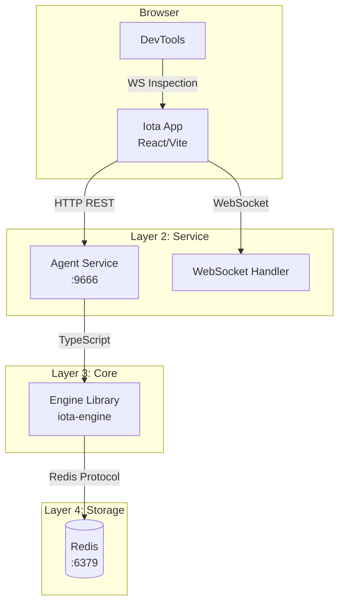

# App Guide

**Version:** 1.0
**Last Updated:** April 2026

## Table of Contents

1. [Introduction](#1-introduction)
2. [Architecture Overview](#2-architecture-overview)
3. [Prerequisites](#3-prerequisites)
4. [Installation and Setup](#4-installation-and-setup)
5. [Core Functionality — UI Components](#5-core-functionality--ui-components)
6. [Core Functionality — User Workflows](#6-core-functionality--user-workflows)
7. [Distributed Features](#7-distributed-features)
8. [Manual Verification Methods](#8-manual-verification-methods)
9. [Troubleshooting](#9-troubleshooting)
10. [Cleanup](#10-cleanup)
11. [Complete Reset Workflow](#11-complete-reset-workflow)
12. [References](#12-references)

---

## 1. Introduction

### Purpose and Scope

This guide covers the Iota App web interface running on port 9888. The App provides a visual interface for session management, real-time chat with streaming output, execution inspection with visibility data, and workspace exploration. It communicates with the Agent service on port 9666 via HTTP REST and WebSocket.

### Target Audience

- Users preferring visual interface over CLI
- Developers testing App-Engine integration
- Anyone inspecting execution traces visually

---

## 2. Architecture Overview

### Component Diagram



### Dependencies

| Dependency | Purpose | Connection |
|------------|---------|------------|
| Agent Service | HTTP/WebSocket backend | Must be running on :9666 |
| Vite | Dev server | Runs on :9888 |
| React | UI framework | In-browser |
| WebSocket | Real-time updates | Browser WebSocket API |

### Communication Protocols

- **Browser → App**: HTTP for static assets from Vite dev server :9888
- **App → Agent**: HTTP REST JSON over TCP :9666
- **App → Agent**: WebSocket JSON over TCP :9666
- **Agent → Engine**: Direct TypeScript calls (in-process)

**Reference**: See [00-architecture-overview.md](./00-architecture-overview.md)

---

## 3. Prerequisites

### Required Software

| Software | Purpose |
|----------|---------|
| Bun | Package manager and runtime |
| Redis | Must be running on :6379 |
| Agent Service | Must be running on :9666 |

### Browser Requirements

| Browser | Support |
|---------|---------|
| Chrome/Chromium | ✅ Full support |
| Firefox | ✅ Full support |
| Safari | ✅ Full support |
| Edge | ✅ Full support |

**Required browser features**:
- WebSocket support
- ES2020+ JavaScript
- CSS Grid/Flexbox

### Port Requirements

| Port | Service | Verification |
|------|---------|--------------|
| 9666 | Agent | `lsof -i :9666` |
| 9888 | App | `lsof -i :9888` |
| 6379 | Redis | `lsof -i :6379` |

---

## 4. Installation and Setup

### Step 1: Start Redis

```bash
cd deployment/scripts
bash start-storage.sh
redis-cli ping
# Expected: PONG
```

### Step 2: Start Agent (required for App)

```bash
cd iota-agent
lsof -i :9666 -t | xargs kill -9 2>/dev/null
bun install
bun run dev
# Listens on 0.0.0.0:9666
```

**Verification**:
```bash
curl http://localhost:9666/health
# Expected: {"status":"ok",...}
```

### Step 3: Build and Start App

```bash
cd iota-app
lsof -i :9888 -t | xargs kill -9 2>/dev/null
bun install
bun run dev
# Listens on 0.0.0.0:9888
```

### Step 4: Access App

Open browser to: `http://localhost:9888`

**Verification**:
- Page loads without errors
- "Create New Session" button visible (if no session in URL)

---

## 5. Core Functionality — UI Components

### Session Manager (Sidebar)

**Location**: `iota-app/src/components/layout/Sidebar.tsx`

**Purpose**: Displays list of sessions and allows session switching.

**State Management**: Uses `useSessionStore` for session state.

**Props/State**:
- `sessions`: List of session objects
- `sessionId`: Current session UUID
- `setSessionId()`: Switch session

**Verification**:
1. Open DevTools → Components tab (if React DevTools installed)
2. Find `Sidebar` component
3. Verify `sessions` array contains session objects

---

### Chat Timeline

**Location**: `iota-app/src/components/chat/ChatTimeline.tsx`

**Purpose**: Displays conversation history and streaming output.

**Props**:
- `sessionId`: Current session UUID
- `executions`: Array of execution objects
- `onExecutionClick`: Handler for execution selection

**State Management**:
- Uses `useSessionStore` for session state
- WebSocket updates trigger re-render
- Optimistic UI updates before server confirmation

**Verification**:
1. Execute a prompt
2. Verify response appears in timeline
3. Click execution in timeline
4. Verify Inspector panel opens

---

### Inspector Panel

**Location**: `iota-app/src/components/inspector/InspectorPanel.tsx`

**Purpose**: Shows detailed execution trace, tokens, memory, and context data.

**Tabs** (from App Read Model):
- **Overview**: Execution summary
- **Trace**: Span hierarchy with timing
- **Memory**: Memory candidates, selected, trimmed
- **Context**: Context manifest segments

**Verification**:
1. Click execution in Chat Timeline
2. Verify Inspector panel opens on right
3. Switch between tabs
4. Verify data loads correctly

---

### Workspace Explorer

**Location**: `iota-app/src/components/workspace/WorkspaceExplorer.tsx`

**Purpose**: Displays file tree of the working directory.

**Verification**:
1. Verify file tree loads on session creation
2. Verify files are displayed correctly
3. Verify directory expansion works

---

### Header

**Location**: `iota-app/src/components/layout/Header.tsx`

**Purpose**: Top bar with backend selector, session info, and controls.

**Verification**:
1. Verify backend selector visible
2. Verify session ID displayed
3. Verify controls are functional

---

## 6. Core Functionality — User Workflows

### Workflow: Create New Session

**Steps**:

1. Open `http://localhost:9888`
2. Click "Create New Session"
3. Enter working directory path (or use default)
4. Session appears in sidebar

**Verification**:
```bash
# After creating session
redis-cli KEYS "iota:session:*"
# Expected: New session key exists
```

---

### Workflow: Execute Prompt

**Steps**:

1. Type prompt in chat input at bottom
2. Click "Send" or press Enter
3. Streaming response appears in timeline
4. Execution appears in timeline

**Verification**:
```bash
# After execution
redis-cli KEYS "iota:exec:*"
# Expected: Execution key exists
```

---

### Workflow: Inspect Execution

**Steps**:

1. Click execution item in Chat Timeline
2. Inspector Panel opens on right
3. View tabs: Overview, Trace, Memory, Context
4. Click span in Trace to see details

**Verification**:
```bash
EXEC_ID=$(redis-cli KEYS "iota:exec:*" | head -1 | cut -d: -f3)
curl http://localhost:9666/api/v1/executions/$EXEC_ID/visibility
# Expected: Full visibility bundle
```

---

### Workflow: Backend Switching

**Steps**:

1. Click backend selector in Header
2. Select different backend (claude-code, gemini, hermes, codex)
3. New executions use selected backend

**Verification**:
```bash
# After switching backend
SESSION_ID=$(redis-cli KEYS "iota:session:*" | head -1 | cut -d: -f3)
redis-cli HGET "iota:session:$SESSION_ID" "activeBackend"
# Expected: New backend name
```

---

## 7. Distributed Features

### Distributed Feature: Multi-Session Visualization

**Purpose**: Open multiple browser tabs with different sessions.

**Procedure**:

1. **Tab 1**: Create session A at `http://localhost:9888?session=A`
2. **Tab 2**: Create session B at `http://localhost:9888?session=B`
3. **Tab 1**: Execute prompt with Claude Code
4. **Tab 2**: Execute prompt with Gemini
5. **Verify**: Each tab shows only its session's data

**Verification**:
```bash
# Query cross-session sessions
curl http://localhost:9666/api/v1/cross-session/sessions
# Expected: Both sessions A and B visible
```

---

### Distributed Feature: Cross-Session Log Visualization

**Procedure**:
```bash
# Create multiple sessions with different backends
# Execute in each

# Query via Agent API
curl "http://localhost:9666/api/v1/cross-session/logs?backend=claude-code&limit=10"
```

---

### Distributed Feature: Distributed Memory Inspection

**Procedure**:
```bash
# After executions with memory extraction
curl "http://localhost:9666/api/v1/cross-session/memories/search?query=binary+search"
```

---

### Distributed Feature: Backend Isolation in UI

**Procedure**:

1. Switch to backend A, execute
2. Switch to backend B, execute
3. Check isolation report:
   ```bash
   curl http://localhost:9666/api/v1/backend-isolation
   ```

---

## 8. Manual Verification Methods

### Verification Checklist: Page Load

**Objective**: Verify App loads correctly without errors.

- [ ] **Setup**: Agent running on :9666, App running on :9888
  ```bash
  curl http://localhost:9666/health
  lsof -i :9888
  ```

- [ ] **Open App**: Navigate to `http://localhost:9888`
  ```bash
  # Browser should load page
  # "Create New Session" button visible
  ```

- [ ] **Check DevTools Console**:
  - Open DevTools (F12)
  - Console tab: No red errors
  - Network tab: No failed requests

- [ ] **Check WebSocket**:
  - Network tab → WS filter
  - Connection to `ws://localhost:9666/api/v1/stream` established

**Success Criteria**:
- ✅ Page loads without errors
- ✅ No console errors
- ✅ WebSocket connected
- ✅ All assets loaded (no 404s)

---

### Verification Checklist: Session Creation

**Objective**: Verify session creation workflow.

- [ ] **Setup**: Clean Redis
  ```bash
  redis-cli FLUSHALL
  ```

- [ ] **Click Create New Session**:
  - Button at center of page when no sessionId in URL
  - Session created with working directory `/Users/han/codingx/iota` (default)

- [ ] **Verify in Redis**:
  ```bash
  redis-cli KEYS "iota:session:*"
  # Expected: 1 session key
  
  redis-cli HGETALL "iota:session:$(redis-cli KEYS 'iota:session:*' | head -1 | cut -d: -f3)"
  # Expected: Session fields present
  ```

- [ ] **Verify in UI**:
  - Session appears in sidebar
  - URL updates to include `?session=<id>`

- [ ] **Cleanup**:
  ```bash
  redis-cli FLUSHALL
  ```

**Success Criteria**:
- ✅ Session created in Redis
- ✅ Session appears in sidebar
- ✅ URL updated

---

### Verification Checklist: Prompt Execution

**Objective**: Verify prompt execution with streaming output.

- [ ] **Setup**: Session created
  ```bash
  SESSION_ID=$(redis-cli KEYS "iota:session:*" | head -1 | cut -d: -f3)
  # Navigate browser to: http://localhost:9888?session=$SESSION_ID
  ```

- [ ] **Execute Prompt**:
  - Type "What is 2+2?" in chat input
  - Press Enter or click Send
  - Streaming output appears in timeline

- [ ] **Verify Events in Redis**:
  ```bash
  redis-cli KEYS "iota:events:*"
  # Expected: Events key created
  
  redis-cli LRANGE "iota:events:$(redis-cli KEYS 'iota:events:*' | head -1 | cut -d: -f3)" 0 -1 | jq '.[].type'
  # Expected: Contains "output", "state" events
  ```

- [ ] **Verify Visibility**:
  ```bash
  EXEC_ID=$(redis-cli KEYS "iota:exec:*" | head -1 | cut -d: -f3)
  curl http://localhost:9666/api/v1/executions/$EXEC_ID/visibility/tokens
  # Expected: Token data
  ```

- [ ] **Cleanup**:
  ```bash
  redis-cli FLUSHALL
  ```

**Success Criteria**:
- ✅ Response streams in real-time
- ✅ Execution appears in timeline
- ✅ Events stored in Redis
- ✅ Visibility data recorded

---

### Verification Checklist: Inspector Panel

**Objective**: Verify Inspector panel shows correct data.

- [ ] **Setup**: Execute a prompt (see above)

- [ ] **Click Execution**:
  - Click execution item in Chat Timeline
  - Inspector Panel opens on right side

- [ ] **Verify Tabs**:
  - **Overview**: Shows execution summary
  - **Trace**: Shows span hierarchy
  - **Memory**: Shows memory selection
  - **Context**: Shows context segments

- [ ] **Verify API matches UI**:
  ```bash
  curl http://localhost:9666/api/v1/executions/$EXEC_ID/visibility
  # Compare with UI display
  ```

---

### Verification Checklist: WebSocket DevTools Inspection

**Objective**: Inspect WebSocket messages in browser DevTools.

- [ ] **Open DevTools**: F12

- [ ] **Navigate to Network tab**:
  - Filter by "WS" (WebSocket)
  - Click connection to `stream`

- [ ] **View Frames**:
  - Switch to "Messages" tab
  - Observe JSON message flow

- [ ] **Verify Message Types**:
  - `app_snapshot`: Full state on subscribe
  - `app_delta`: Incremental updates
  - `event`: RuntimeEvents during execution

- [ ] **Send Execute**:
  - Type prompt in App
  - Observe `event` messages appearing in real-time
  - Observe `complete` message at end

**Success Criteria**:
- ✅ Messages appear in correct order
- ✅ JSON schema matches documented format
- ✅ Real-time updates visible

---

### Verification Checklist: Multi-Session

**Objective**: Verify multi-session isolation.

- [ ] **Setup**: Open two browser tabs
  ```
  Tab 1: http://localhost:9888
  Tab 2: http://localhost:9888
  ```

- [ ] **Create Session A** in Tab 1:
  - Click "Create New Session"
  - Note session ID from URL

- [ ] **Create Session B** in Tab 2:
  - Click "Create New Session"
  - Note session ID

- [ ] **Execute in Tab 1** (Claude Code backend):
  - Type "I prefer blue"
  - Submit

- [ ] **Execute in Tab 2** (different backend):
  - Type "I prefer red"
  - Submit

- [ ] **Verify Isolation**:
  - Tab 1 shows only its executions
  - Tab 2 shows only its executions
  - No cross-contamination

- [ ] **Query Cross-Session**:
  ```bash
  curl "http://localhost:9666/api/v1/cross-session/sessions?limit=100"
  # Expected: Both sessions visible
  ```

- [ ] **Cleanup**:
  ```bash
  redis-cli FLUSHALL
  ```

---

## 9. Troubleshooting

### Issue: Page Load Shows Error

**Symptoms**:
- Red error displayed in browser
- Session sync failed message

**Diagnosis**:
```bash
# Check Agent is running
curl http://localhost:9666/health

# Check session exists
curl http://localhost:9666/api/v1/sessions/all
```

**Solution**:
1. Click "Reconnect" button
2. Or reload page
3. Or create new session

---

### Issue: WebSocket Connection Failed

**Symptoms**:
- No streaming output
- Console shows WebSocket error

**Diagnosis**:
```bash
# Check Agent running
curl http://localhost:9666/health

# Check WebSocket endpoint
curl -I http://localhost:9666/api/v1/stream
```

**Solution**:
```bash
cd iota-agent
lsof -i :9666 -t | xargs kill -9
bun run dev
# Reload browser page
```

---

### Issue: No Streaming / Output Appears All at Once

**Symptoms**:
- Response appears after long delay
- No real-time streaming

**Diagnosis**:
1. Open Network tab → WS filter
2. Check if `event` messages arrive in real-time

**Solution**:
- Check WebSocket connection is working
- Check browser console for errors
- Try refreshing page

---

### Issue: Inspector Panel Empty

**Symptoms**:
- Execution clicked but Inspector shows no data

**Diagnosis**:
```bash
EXEC_ID=$(redis-cli KEYS "iota:exec:*" | head -1 | cut -d: -f3)
curl http://localhost:9666/api/v1/executions/$EXEC_ID/visibility
# If empty: No visibility data recorded
```

**Solution**:
- Execution may have failed — check events
- Refresh page

---

## 10. Cleanup

### Close Browser Tabs

Simply close browser tabs/windows.

### Stop App (Vite dev server)

```bash
lsof -i :9888 -t | xargs kill -9
```

### Reset Redis

```bash
redis-cli FLUSHALL
```

### Stop Agent

```bash
lsof -i :9666 -t | xargs kill -9
```

### Full Teardown

```bash
# Stop App
lsof -i :9888 -t | xargs kill -9

# Stop Agent
lsof -i :9666 -t | xargs kill -9

# Stop Redis
cd deployment/scripts && bash stop-storage.sh
```

---

## 11. Complete Reset Workflow

When you modify `iota-engine` core logic or encounter state inconsistencies, follow this full reset procedure:

### 11.1 Overview

Iota App runs with two persistent layers:
- **Redis**: Session/execution data
- **In-process state**: Vite dev server and Agent memory

A full reset ensures clean state after core changes.

### 11.2 Full Reset Steps

**Step 1 — Stop all processes**:

- Ctrl+C to stop App (Vite dev server on :9888)
- Ctrl+C to stop Agent (Fastify on :9666)
- Or forcefully:

```bash
lsof -i :9888 -t | xargs kill -9 2>/dev/null
lsof -i :9666 -t | xargs kill -9 2>/dev/null
```

**Step 2 — Flush Redis cache**:

```bash
redis-cli FLUSHALL
```

**Step 3 — Rebuild Engine** (if core logic changed):

```bash
cd iota-engine && bun run build
```

**Step 4 — Sequential restart**:

```bash
# 1. Redis (if stopped)
cd deployment/scripts && bash start-storage.sh

# 2. Agent
cd iota-agent && bun run dev

# 3. App
cd iota-app && bun run dev
```

**Verification**:
```bash
redis-cli ping    # Expected: PONG
curl http://localhost:9666/health  # Expected: {"status":"ok"}
# Open http://localhost:9888 → App should load
```

## 12. References

### Related Guides

- [00-architecture-overview.md](./00-architecture-overview.md)
- [01-cli-guide.md](./01-cli-guide.md)
- [02-tui-guide.md](./02-tui-guide.md)
- [03-agent-guide.md](./03-agent-guide.md)
- [05-engine-guide.md](./05-engine-guide.md)

### External Documentation

- [Vite](https://vite.dev/) — Build tool
- [React](https://react.dev/) — UI framework
- [TanStack Query](https://tanstack.com/query/latest) — Data fetching
- [zustand](https://zustand-demo.pmnd.rs/) — State management

### Component Source Locations

| Component | File |
|-----------|------|
| App | `iota-app/src/App.tsx` |
| Sidebar | `iota-app/src/components/layout/Sidebar.tsx` |
| Header | `iota-app/src/components/layout/Header.tsx` |
| ChatTimeline | `iota-app/src/components/chat/ChatTimeline.tsx` |
| InspectorPanel | `iota-app/src/components/inspector/InspectorPanel.tsx` |
| WorkspaceExplorer | `iota-app/src/components/workspace/WorkspaceExplorer.tsx` |
| SessionStore | `iota-app/src/store/useSessionStore.ts` |
| WebSocket Hook | `iota-app/src/hooks/useWebSocket.ts` |
| API Client | `iota-app/src/lib/api.ts` |

---

## Known Limitations

### Single Active Execution Model

The App's state model (`useSessionStore`) maintains a single `activeExecution` at a time. When a `app_delta` arrives for an execution that is not the current `activeExecution`, the store creates a new `activeExecution` entry, potentially replacing the one the user is viewing. This means:

- **Multi-execution sessions** may cause the UI to jump between executions unexpectedly
- The snapshot/delta architecture is correct at the data level, but the **single-slot UI binding** makes concurrent execution viewing fragile
- **Workaround**: Users should wait for one execution to complete before starting another

### Approval UI Limitations

The `ApprovalCard` component in `ChatTimeline` sends `approval_decision` messages via WebSocket. This requires the Agent to be started with a `DeferredApprovalHook` (the default for Agent mode). The approval flow is functional but has not been extensively tested in multi-user or multi-instance scenarios.

### Multi-Instance Real-Time Consistency

The App consumes `app_snapshot`, `app_delta`, `event`, and `complete` WebSocket messages. Cross-instance `pubsub_event` messages (bridged via Redis pub/sub) trigger a snapshot resync but do not provide granular delta processing. In multi-Agent deployments, the real-time experience is **best-effort** — updates from other instances arrive via periodic snapshot refreshes rather than continuous streaming.

---

## Version History

| Version | Date | Changes |
|---------|------|---------|
| 1.1 | April 2026 | Add Known Limitations section (single execution model, approval UI, multi-instance consistency) |
| 1.0 | April 2026 | Initial release |
