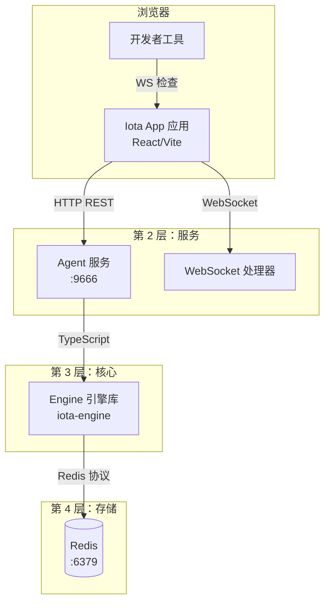

# App 应用指南

**版本:** 1.0
**最后更新:** 2026 年 4 月

## 目录

1. [简介](#1-简介)
2. [架构概览](#2-架构概览)
3. [前置要求](#3-前置要求)
4. [安装与设置](#4-安装与设置)
5. [核心功能 — UI 组件](#5-核心功能--ui-组件)
6. [核心功能 — 用户工作流](#6-核心功能--用户工作流)
7. [分布式特性](#7-分布式特性)
8. [手动验证方法](#8-手动验证方法)
9. [故障排查](#9-故障排查)
10. [清理](#10-清理)
11. [完整重置工作流](#11-完整重置工作流)
12. [参考资料](#12-参考资料)

---

## 1. 简介

### 目的与范围

本指南涵盖运行在 9888 端口的 Iota App 应用 Web 界面。App 应用提供了会话管理、实时流式输出聊天、执行检查（包含可见性数据）以及工作空间浏览的可视化界面。它通过 HTTP REST 和 WebSocket 与运行在 9666 端口的 Agent 服务通信。

### 目标受众

- 偏好可视化界面而非 CLI 的用户
- 测试 App-Engine 集成的开发者
- 需要可视化检查执行追踪的任何人

---

## 2. 架构概览

### 组件图



### 依赖项

| 依赖项 | 用途 | 连接 |
|------------|---------|------------|
| Agent Service 服务 | HTTP/WebSocket 后端 | 必须运行在 :9666 |
| Vite | 开发服务器 | 运行在 :9888 |
| React | UI 用户界面框架 | 浏览器内 |
| WebSocket | 实时更新 | 浏览器 WebSocket API |

### 通信协议

- **浏览器 → App 应用**: 从 Vite 开发服务器 :9888 获取静态资源的 HTTP
- **App 应用 → Agent 服务**: 通过 TCP :9666 的 HTTP REST JSON
- **App 应用 → Agent 服务**: 通过 TCP :9666 的 WebSocket JSON
- **Agent 服务 → Engine 引擎**: 直接 TypeScript 调用（进程内）

**参考**: 参见 [00-architecture-overview.md](./00-architecture-overview.md)

---

## 3. 前置要求

### 必需软件

| 软件 | 用途 |
|----------|---------|
| Bun | 包管理器和运行时 |
| Redis | 必须运行在 :6379 |
| Agent Service 服务 | 必须运行在 :9666 |

### 浏览器要求

| 浏览器 | 支持情况 |
|---------|---------|
| Chrome/Chromium | ✅ 完全支持 |
| Firefox | ✅ 完全支持 |
| Safari | ✅ 完全支持 |
| Edge | ✅ 完全支持 |

**必需的浏览器特性**:
- WebSocket 支持
- ES2020+ JavaScript
- CSS Grid/Flexbox

### 端口要求

| 端口 | 服务 | 验证命令 |
|------|---------|--------------|
| 9666 | Agent 服务 | `lsof -i :9666` |
| 9888 | App 应用 | `lsof -i :9888` |
| 6379 | Redis | `lsof -i :6379` |

---

## 4. 安装与设置

### 步骤 1: 启动 Redis

```bash
cd deployment/scripts
bash start-storage.sh
redis-cli ping
# 预期输出: PONG
```

### 步骤 2: 启动 Agent 服务（App 应用必需）

```bash
cd iota-agent
lsof -i :9666 -t | xargs kill -9 2>/dev/null
bun install
bun run dev
# 监听 0.0.0.0:9666
```

**验证**:
```bash
curl http://localhost:9666/health
# 预期输出: {"status":"ok",...}
```

### 步骤 3: 构建并启动 App 应用

```bash
cd iota-app
lsof -i :9888 -t | xargs kill -9 2>/dev/null
bun install
bun run dev
# 监听 0.0.0.0:9888
```

### 步骤 4: 访问 App 应用

在浏览器中打开: `http://localhost:9888`

**验证**:
- 页面加载无错误
- "Create New Session" 按钮可见（如果 URL 中没有 session 参数）

---

## 5. 核心功能 — UI 组件

### Session Manager 会话管理器（侧边栏）

**位置**: `iota-app/src/components/layout/Sidebar.tsx`

**用途**: 显示会话列表并允许切换会话。

**状态管理**: 使用 `useSessionStore` 管理会话状态。

**Props/State 属性/状态**:
- `sessions`: 会话对象列表
- `sessionId`: 当前会话 UUID
- `setSessionId()`: 切换会话

**验证**:
1. 打开 DevTools → Components 组件标签（如果已安装 React DevTools）
2. 找到 `Sidebar` 组件
3. 验证 `sessions` 数组包含会话对象

---

### Chat Timeline 聊天时间线

**位置**: `iota-app/src/components/chat/ChatTimeline.tsx`

**用途**: 显示对话历史和流式输出。

**Props 属性**:
- `sessionId`: 当前会话 UUID
- `executions`: 执行对象数组
- `onExecutionClick`: 执行选择处理器

**状态管理**:
- 使用 `useSessionStore` 管理会话状态
- WebSocket 更新触发重新渲染
- 服务器确认前的乐观 UI 更新

**验证**:
1. 执行一个提示
2. 验证响应出现在时间线中
3. 点击时间线中的执行
4. 验证 Inspector 检查器面板打开

---

### Inspector Panel 检查器面板

**位置**: `iota-app/src/components/inspector/InspectorPanel.tsx`

**用途**: 显示详细的执行追踪、令牌、内存和上下文数据。

**标签页**（来自 App Read Model 应用读取模型）:
- **Overview 概览**: 执行摘要
- **Trace 追踪**: 带时间的 Span 层次结构
- **Memory 内存**: 内存候选、已选择、已修剪
- **Context 上下文**: 上下文清单片段

**验证**:
1. 点击 Chat Timeline 聊天时间线中的执行
2. 验证 Inspector 检查器面板在右侧打开
3. 在标签页之间切换
4. 验证数据正确加载

---

### Workspace Explorer 工作空间浏览器

**位置**: `iota-app/src/components/workspace/WorkspaceExplorer.tsx`

**用途**: 显示工作目录的文件树。

**验证**:
1. 验证会话创建时文件树加载
2. 验证文件正确显示
3. 验证目录展开功能正常

---

### Header 头部

**位置**: `iota-app/src/components/layout/Header.tsx`

**用途**: 顶部栏，包含后端选择器、会话信息和控制按钮。

**验证**:
1. 验证后端选择器可见
2. 验证会话 ID 已显示
3. 验证控制按钮功能正常

---

## 6. 核心功能 — 用户工作流

### 工作流: 创建新会话

**步骤**:

1. 打开 `http://localhost:9888`
2. 点击 "Create New Session"
3. 输入工作目录路径（或使用默认值）
4. 会话出现在侧边栏中

**验证**:
```bash
# 创建会话后
redis-cli KEYS "iota:session:*"
# 预期输出: 新会话键存在
```

---

### 工作流: 执行提示

**步骤**:

1. 在底部的聊天输入框中输入提示
2. 点击 "Send" 或按 Enter
3. 流式响应出现在时间线中
4. 执行出现在时间线中

**验证**:
```bash
# 执行后
redis-cli KEYS "iota:exec:*"
# 预期输出: 执行键存在
```

---

### 工作流: 检查执行

**步骤**:

1. 点击 Chat Timeline 聊天时间线中的执行项
2. Inspector Panel 检查器面板在右侧打开
3. 查看标签页: Overview 概览、Trace 追踪、Memory 内存、Context 上下文
4. 点击 Trace 追踪中的 span 查看详情

**验证**:
```bash
EXEC_ID=$(redis-cli KEYS "iota:exec:*" | head -1 | cut -d: -f3)
curl http://localhost:9666/api/v1/executions/$EXEC_ID/visibility
# 预期输出: 完整的可见性数据包
```

---

### 工作流: 后端切换

**步骤**:

1. 点击 Header 头部中的后端选择器
2. 选择不同的后端（claude-code、codex、gemini、hermes、opencode）
3. 新执行使用选定的后端

**验证**:
```bash
# 切换后端后
SESSION_ID=$(redis-cli KEYS "iota:session:*" | head -1 | cut -d: -f3)
redis-cli HGET "iota:session:$SESSION_ID" "activeBackend"
# 预期输出: 新后端名称
```

---

## 7. 分布式特性

### 分布式特性: 多会话可视化

**用途**: 在不同会话中打开多个浏览器标签页。

**步骤**:

1. **标签页 1**: 在 `http://localhost:9888?session=A` 创建会话 A
2. **标签页 2**: 在 `http://localhost:9888?session=B` 创建会话 B
3. **标签页 1**: 使用 Claude Code 执行提示
4. **标签页 2**: 使用 Gemini 执行提示
5. **验证**: 每个标签页仅显示其自己会话的数据

**验证**:
```bash
# 查询跨会话的会话列表
curl http://localhost:9666/api/v1/cross-session/sessions
# 预期输出: 会话 A 和 B 都可见
```

---

### 分布式特性: 跨会话日志可视化

**步骤**:
```bash
# 使用不同后端创建多个会话
# 在每个会话中执行

# 通过 Agent API 查询
curl "http://localhost:9666/api/v1/cross-session/logs?backend=claude-code&limit=10"
```

---

### 分布式特性: 统一记忆检查

**步骤**:
```bash
# 执行带统一记忆提取的操作后
curl "http://localhost:9666/api/v1/cross-session/memories/search?query=binary+search"
```

---

### 分布式特性: UI 中的后端隔离

**步骤**:

1. 切换到后端 A，执行
2. 切换到后端 B，执行
3. 检查隔离报告:
   ```bash
   curl http://localhost:9666/api/v1/backend-isolation
   ```

---

## 8. 手动验证方法

### 验证清单: 页面加载

**目标**: 验证 App 应用正确加载且无错误。

- [ ] **设置**: Agent 服务运行在 :9666，App 应用运行在 :9888
  ```bash
  curl http://localhost:9666/health
  lsof -i :9888
  ```

- [ ] **打开 App 应用**: 导航到 `http://localhost:9888`
  ```bash
  # 浏览器应加载页面
  # "Create New Session" 按钮可见
  ```

- [ ] **检查 DevTools 开发者工具控制台**:
  - 打开 DevTools（F12）
  - Console 控制台标签: 无红色错误
  - Network 网络标签: 无失败请求

- [ ] **检查 WebSocket**:
  - Network 网络标签 → WS 过滤器
  - 连接到 `ws://localhost:9666/api/v1/stream` 已建立

**成功标准**:
- ✅ 页面加载无错误
- ✅ 无控制台错误
- ✅ WebSocket 已连接
- ✅ 所有资源已加载（无 404）

---

### 验证清单: 会话创建

**目标**: 验证会话创建工作流。

- [ ] **设置**: 清空 Redis
  ```bash
  redis-cli FLUSHALL
  ```

- [ ] **点击 Create New Session 创建新会话**:
  - URL 中无 sessionId 时页面中央的按钮
  - 使用工作目录 `/Users/han/codingx/iota`（默认）创建会话

- [ ] **在 Redis 中验证**:
  ```bash
  redis-cli KEYS "iota:session:*"
  # 预期输出: 1 个会话键
  
  redis-cli HGETALL "iota:session:$(redis-cli KEYS 'iota:session:*' | head -1 | cut -d: -f3)"
  # 预期输出: 会话字段存在
  ```

- [ ] **在 UI 中验证**:
  - 会话出现在侧边栏中
  - URL 更新为包含 `?session=<id>`

- [ ] **清理**:
  ```bash
  redis-cli FLUSHALL
  ```

**成功标准**:
- ✅ 会话在 Redis 中创建
- ✅ 会话出现在侧边栏
- ✅ URL 已更新

---

### 验证清单: 提示执行

**目标**: 验证带流式输出的提示执行。

- [ ] **设置**: 会话已创建
  ```bash
  SESSION_ID=$(redis-cli KEYS "iota:session:*" | head -1 | cut -d: -f3)
  # 在浏览器中导航到: http://localhost:9888?session=$SESSION_ID
  ```

- [ ] **执行提示**:
  - 在聊天输入框中输入 "What is 2+2?"
  - 按 Enter 或点击 Send
  - 流式输出出现在时间线中

- [ ] **在 Redis 中验证事件**:
  ```bash
  redis-cli KEYS "iota:events:*"
  # 预期输出: 事件键已创建
  
  redis-cli XRANGE "iota:events:$(redis-cli KEYS 'iota:events:*' | head -1 | cut -d: -f3)" - + | jq '.[].type'
  # 预期输出: 包含 "output"、"state" 事件
  ```

- [ ] **验证可见性**:
  ```bash
  EXEC_ID=$(redis-cli KEYS "iota:exec:*" | head -1 | cut -d: -f3)
  curl http://localhost:9666/api/v1/executions/$EXEC_ID/visibility/tokens
  # 预期输出: 令牌数据
  ```

- [ ] **清理**:
  ```bash
  redis-cli FLUSHALL
  ```

**成功标准**:
- ✅ 响应实时流式传输
- ✅ 执行出现在时间线中
- ✅ 事件存储在 Redis 中
- ✅ 可见性数据已记录

---

### 验证清单: Inspector 检查器面板

**目标**: 验证 Inspector 检查器面板显示正确数据。

- [ ] **设置**: 执行一个提示（见上文）

- [ ] **点击执行**:
  - 点击 Chat Timeline 聊天时间线中的执行项
  - Inspector Panel 检查器面板在右侧打开

- [ ] **验证标签页**:
  - **Overview 概览**: 显示执行摘要
  - **Trace 追踪**: 显示 span 层次结构
  - **Memory 内存**: 显示内存选择
  - **Context 上下文**: 显示上下文片段

- [ ] **验证 API 与 UI 匹配**:
  ```bash
  curl http://localhost:9666/api/v1/executions/$EXEC_ID/visibility
  # 与 UI 显示进行比较
  ```

---

### 验证清单: WebSocket DevTools 开发者工具检查

**目标**: 在浏览器 DevTools 开发者工具中检查 WebSocket 消息。

- [ ] **打开 DevTools 开发者工具**: F12

- [ ] **导航到 Network 网络标签**:
  - 按 "WS"（WebSocket）过滤
  - 点击到 `stream` 的连接

- [ ] **查看帧**:
  - 切换到 "Messages 消息" 标签
  - 观察 JSON 消息流

- [ ] **验证消息类型**:
  - `app_snapshot`: 订阅时的完整状态
  - `app_delta`: 增量更新
  - `event`: 执行期间的 RuntimeEvents

- [ ] **发送执行**:
  - 在 App 应用中输入提示
  - 观察实时出现的 `event` 消息
  - 观察结束时的 `complete` 消息

**成功标准**:
- ✅ 消息按正确顺序出现
- ✅ JSON 架构符合文档格式
- ✅ 实时更新可见

---

### 验证清单: 多会话

**目标**: 验证多会话隔离。

- [ ] **设置**: 打开两个浏览器标签页
  ```
  标签页 1: http://localhost:9888
  标签页 2: http://localhost:9888
  ```

- [ ] **在标签页 1 中创建会话 A**:
  - 点击 "Create New Session"
  - 从 URL 中记录会话 ID

- [ ] **在标签页 2 中创建会话 B**:
  - 点击 "Create New Session"
  - 记录会话 ID

- [ ] **在标签页 1 中执行**（Claude Code 后端）:
  - 输入 "I prefer blue"
  - 提交

- [ ] **在标签页 2 中执行**（不同后端）:
  - 输入 "I prefer red"
  - 提交

- [ ] **验证隔离**:
  - 标签页 1 仅显示其执行
  - 标签页 2 仅显示其执行
  - 无交叉污染

- [ ] **查询跨会话**:
  ```bash
  curl "http://localhost:9666/api/v1/cross-session/sessions?limit=100"
  # 预期输出: 两个会话都可见
  ```

- [ ] **清理**:
  ```bash
  redis-cli FLUSHALL
  ```

---

## 9. 故障排查

### 问题: 页面加载显示错误

**症状**:
- 浏览器中显示红色错误
- 会话同步失败消息

**诊断**:
```bash
# 检查 Agent 服务是否运行
curl http://localhost:9666/health

# 检查会话是否存在
curl http://localhost:9666/api/v1/sessions/all
```

**解决方案**:
1. 点击 "Reconnect 重新连接" 按钮
2. 或重新加载页面
3. 或创建新会话

---

### 问题: WebSocket 连接失败

**症状**:
- 无流式输出
- 控制台显示 WebSocket 错误

**诊断**:
```bash
# 检查 Agent 服务运行
curl http://localhost:9666/health

# 检查 WebSocket 端点
curl -I http://localhost:9666/api/v1/stream
```

**解决方案**:
```bash
cd iota-agent
lsof -i :9666 -t | xargs kill -9
bun run dev
# 重新加载浏览器页面
```

---

### 问题: 无流式传输 / 输出一次性全部出现

**症状**:
- 响应在长时间延迟后出现
- 无实时流式传输

**诊断**:
1. 打开 Network 网络标签 → WS 过滤器
2. 检查 `event` 消息是否实时到达

**解决方案**:
- 检查 WebSocket 连接是否正常工作
- 检查浏览器控制台是否有错误
- 尝试刷新页面

---

### 问题: Inspector 检查器面板为空

**症状**:
- 点击执行但 Inspector 检查器不显示数据

**诊断**:
```bash
EXEC_ID=$(redis-cli KEYS "iota:exec:*" | head -1 | cut -d: -f3)
curl http://localhost:9666/api/v1/executions/$EXEC_ID/visibility
# 如果为空: 未记录可见性数据
```

**解决方案**:
- 执行可能失败 — 检查事件
- 刷新页面

---

## 10. 清理

### 关闭浏览器标签页

直接关闭浏览器标签页/窗口。

### 停止 App 应用（Vite 开发服务器）

```bash
lsof -i :9888 -t | xargs kill -9
```

### 重置 Redis

```bash
redis-cli FLUSHALL
```

### 停止 Agent 服务

```bash
lsof -i :9666 -t | xargs kill -9
```

### 完全拆除

```bash
# 停止 App 应用
lsof -i :9888 -t | xargs kill -9

# 停止 Agent 服务
lsof -i :9666 -t | xargs kill -9

# 停止 Redis
cd deployment/scripts && bash stop-storage.sh
```

---

## 11. 完整重置工作流

当您修改 `iota-engine` 核心逻辑或遇到状态不一致时，请遵循此完整重置步骤：

### 11.1 概述

Iota App 应用运行时有两个持久层：
- **Redis**: 会话/执行数据
- **进程内状态**: Vite 开发服务器和 Agent 服务内存

完整重置确保核心更改后的干净状态。

### 11.2 完整重置步骤

**步骤 1 — 停止所有进程**:

- Ctrl+C 停止 App 应用（Vite 开发服务器在 :9888）
- Ctrl+C 停止 Agent 服务（Fastify 在 :9666）
- 或强制停止：

```bash
lsof -i :9888 -t | xargs kill -9 2>/dev/null
lsof -i :9666 -t | xargs kill -9 2>/dev/null
```

**步骤 2 — 清空 Redis 缓存**:

```bash
redis-cli FLUSHALL
```

**步骤 3 — 重新构建 Engine 引擎**（如果核心逻辑已更改）:

```bash
cd iota-engine && bun run build
```

**步骤 4 — 顺序重启**:

```bash
# 1. Redis（如果已停止）
cd deployment/scripts && bash start-storage.sh

# 2. Agent 服务
cd iota-agent && bun run dev

# 3. App 应用
cd iota-app && bun run dev
```

**验证**:
```bash
redis-cli ping    # 预期输出: PONG
curl http://localhost:9666/health  # 预期输出: {"status":"ok"}
# 打开 http://localhost:9888 → App 应用应加载
```

## 12. 参考资料

### 相关指南

- [00-architecture-overview.md](./00-architecture-overview.md)
- [01-cli-guide.md](./01-cli-guide.md)
- [02-tui-guide.md](./02-tui-guide.md)
- [03-agent-guide.md](./03-agent-guide.md)
- [05-engine-guide.md](./05-engine-guide.md)

### 外部文档

- [Vite](https://vite.dev/) — 构建工具
- [React](https://react.dev/) — UI 用户界面框架
- [TanStack Query](https://tanstack.com/query/latest) — 数据获取
- [zustand](https://zustand-demo.pmnd.rs/) — 状态管理

### 组件源码位置

| 组件 Component | 文件 |
|-----------|------|
| App 应用 | `iota-app/src/App.tsx` |
| Sidebar 侧边栏 | `iota-app/src/components/layout/Sidebar.tsx` |
| Header 头部 | `iota-app/src/components/layout/Header.tsx` |
| ChatTimeline 聊天时间线 | `iota-app/src/components/chat/ChatTimeline.tsx` |
| InspectorPanel 检查器面板 | `iota-app/src/components/inspector/InspectorPanel.tsx` |
| WorkspaceExplorer 工作空间浏览器 | `iota-app/src/components/workspace/WorkspaceExplorer.tsx` |
| SessionStore 会话存储 | `iota-app/src/store/useSessionStore.ts` |
| WebSocket Hook | `iota-app/src/hooks/useWebSocket.ts` |
| API Client 客户端 | `iota-app/src/lib/api.ts` |

---

## 已知限制

### 单活动执行模型

App 应用的状态模型（`useSessionStore`）一次维护一个 `activeExecution`。当 `app_delta` 到达的执行不是当前 `activeExecution` 时，存储会创建一个新的 `activeExecution` 条目，可能会替换用户正在查看的条目。这意味着：

- **多执行会话**可能导致 UI 在执行之间意外跳转
- 快照/增量架构在数据层面是正确的，但**单槽 UI 绑定**使并发执行查看变得脆弱
- **解决方法**: 用户应等待一个执行完成后再开始另一个

### 审批 UI 限制

`ChatTimeline` 中的 `ApprovalCard` 组件会发送 `approval_decision` 消息，但当前 Agent WebSocket 入站 schema 尚未把该消息路由到 `engine.resolveApproval()`。因此 App 审批 UI 只能视为前端展示/待接线能力，不能作为已完成的 App -> Agent -> Engine 审批闭环。

### 多实例实时一致性

App 应用消费 `app_snapshot`、`app_delta`、`event` 和 `complete` WebSocket 消息。跨实例的 `pubsub_event` 消息（通过 Redis pub/sub 桥接）会触发快照重新同步，但不提供细粒度的增量处理。在多 Agent 服务部署中，实时体验是**尽力而为** — 来自其他实例的更新通过定期快照刷新到达，而不是连续流式传输。

---

## 版本历史

| 版本 | 日期 | 变更 |
|---------|------|---------|
| 1.1 | 2026 年 4 月 | 添加已知限制部分（单执行模型、审批 UI、多实例一致性） |
| 1.0 | 2026 年 4 月 | 初始版本 |
