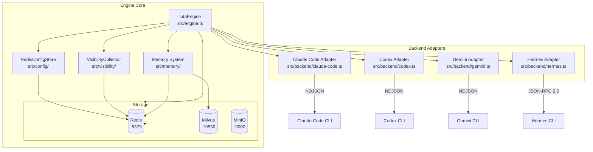
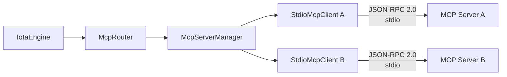

# Engine Guide

**Version:** 1.1
**Last Updated:** April 2026

## Table of Contents

1. [Introduction](#1-introduction)
2. [Architecture Overview](#2-architecture-overview)
3. [Prerequisites](#3-prerequisites)
4. [Installation and Setup](#4-installation-and-setup)
5. [Core Functionality — Backend Adapters](#5-core-functionality--backend-adapters)
6. [Core Functionality — Memory System](#6-core-functionality--memory-system)
7. [Core Functionality — Visibility Plane](#7-core-functionality--visibility-plane)
8. [Core Functionality — Configuration](#8-core-functionality--configuration)
9. [Core Functionality — Redis Data Structures](#9-core-functionality--redis-data-structures)
10. [Core Functionality — MCP Support](#10-core-functionality--mcp-support)
11. [Core Functionality — Metrics Collection](#11-core-functionality--metrics-collection)
12. [Core Functionality — Audit Logging](#12-core-functionality--audit-logging)
13. [Core Functionality — Workspace Snapshots](#13-core-functionality--workspace-snapshots)
14. [Core Functionality — Token Estimation](#14-core-functionality--token-estimation)
15. [Distributed Features](#15-distributed-features)
16. [Manual Verification Methods](#16-manual-verification-methods)
17. [Troubleshooting](#17-troubleshooting)
18. [Cleanup](#18-cleanup)
19. [End-to-End Verification: Memory & Session Flow](#19-end-to-end-verification-memory--session-flow)
20. [Observability Verification Reference](#20-observability-verification-reference)
21. [References](#21-references)

---

## 1. Introduction

### Purpose and Scope

This guide covers the Iota Engine (`@iota/engine`) — the core runtime library. It details backend adapter implementations, the memory system flow, the visibility plane data structures, the RedisConfigStore for distributed configuration, and comprehensive Redis data structure documentation.

### Target Audience

- Developers understanding Engine internals
- Contributors debugging backend adapters
- Anyone inspecting Redis data structures

---

## 2. Architecture Overview

### Component Diagram



### Dependencies

| Dependency | Purpose | Connection |
|------------|---------|------------|
| Redis | Primary storage | Redis protocol/TCP :6379 |
| Milvus | Vector storage (optional) | gRPC :19530 |
| MinIO | Object storage (optional) | S3 API :9000 |
| Backend executables | AI coding assistants | Subprocess stdio |

### Communication Protocols

- **Engine → Redis**: Redis protocol over TCP
- **Engine → Backend**: Subprocess stdio — NDJSON (Claude/Codex/Gemini) or JSON-RPC 2.0 (Hermes)
- **Engine → Milvus**: gRPC for vector insert/search
- **Engine → MinIO**: S3-compatible HTTP API

**Reference**: See [00-architecture-overview.md](./00-architecture-overview.md)

---

## 3. Prerequisites

### Required Software

| Software | Purpose |
|----------|---------|
| Bun | TypeScript runtime |
| Redis | Primary storage |
| Backend executables | AI coding assistants |

### Backend Executables

```bash
which claude    # Claude Code
which codex     # Codex
which gemini    # Gemini CLI
which hermes    # Hermes Agent
```

### Environment Variables

```bash
# Redis
export REDIS_HOST="127.0.0.1"
export REDIS_PORT="6379"

# Optional: Milvus
export MILVUS_HOST="127.0.0.1"
export MILVUS_PORT="19530"

# Optional: MinIO
export MINIO_ENDPOINT="127.0.0.1:9000"
export MINIO_ACCESS_KEY="..."
export MINIO_SECRET_KEY="..."
```

Backend authentication is read from Redis distributed config, for example `iota config set env.ANTHROPIC_AUTH_TOKEN "sk-ant-..." --scope backend --scope-id claude-code`.

---

## 4. Installation and Setup

### Step 1: Start Redis

```bash
cd deployment/scripts
bash start-storage.sh
redis-cli ping
# Expected: PONG
```

### Step 2: Build Engine and CLI

```bash
# Build Engine
cd iota-engine
bun install
bun run build

# Build CLI (engine tests invoke commands via CLI)
cd ../iota-cli
bun install
bun run build
```

**Verification**:
```bash
ls iota-engine/dist/index.js   # Engine bundle exists
ls iota-cli/dist/index.js       # CLI bundle exists
```

> **CLI PATH Setup**: The `iota` command may not be in your PATH yet. See [01-cli-guide.md](./01-cli-guide.md), Section 4, Step 3 for setup options (Option A: `bun iota-cli/dist/index.js`, Option B: `npm link`, Option C: export PATH). All examples below use bare `iota` for brevity.

### Step 3: Configure Backends

Backend credentials, model names, and endpoints are stored in Redis distributed config:

```bash
iota config set env.ANTHROPIC_AUTH_TOKEN "<redacted>" --scope backend --scope-id claude-code
iota config set env.ANTHROPIC_BASE_URL "https://api.minimaxi.com/anthropic" --scope backend --scope-id claude-code
iota config set env.ANTHROPIC_MODEL "MiniMax-M2.7" --scope backend --scope-id claude-code
iota config set env.OPENAI_MODEL "gpt-5.5" --scope backend --scope-id codex
iota config set env.GEMINI_MODEL "auto-gemini-3" --scope backend --scope-id gemini
iota config set env.HERMES_API_KEY "<redacted>" --scope backend --scope-id hermes
iota config set env.HERMES_BASE_URL "https://api.minimaxi.com/anthropic" --scope backend --scope-id hermes
iota config set env.HERMES_MODEL "MiniMax-M2.7" --scope backend --scope-id hermes
iota config set env.HERMES_PROVIDER "minimax-cn" --scope backend --scope-id hermes
```

The verified Hermes setup uses the same provider values as Claude Code, but with Hermes-specific Redis keys. Iota translates the Redis values into an isolated Hermes runtime home before spawning `hermes acp`.

**Hermes Agent**:
```bash
hermes config show
# Verify model provider is valid
```

---

## 5. Core Functionality — Backend Adapters

### Backend Adapter Overview

All backend adapters implement the `RuntimeBackend` interface (`src/backend/interface.ts`) and share common patterns:

1. **Subprocess spawn**: Adapter spawns backend CLI as subprocess
2. **Protocol parsing**: Parses stdout as NDJSON or JSON-RPC
3. **Event mapping**: Maps native events to `RuntimeEvent` types
4. **Visibility recording**: Records spans, tokens, and events

---

### Claude Code Adapter

**File**: `src/backend/claude-code.ts`

**Subprocess command**:
```
claude --print --output-format stream-json --verbose --permission-mode auto <prompt>
```

**Protocol**: NDJSON over stdout (one JSON object per line)

**Event types emitted**:
| Native Event | RuntimeEvent Type |
|-------------|-------------------|
| `extension` | `extension` (thinking/anthropicthink) |
| `output` | `output` (response text) |
| `state` | `state` (status updates) |

**Event mapping** (from `src/event/types.ts`):
```typescript
// Extension events map to 'extension' type
{ type: "extension", data: { ... } }

// Output events map to 'output' type
{ type: "output", data: { content: "..." } }

// State events map to 'state' type
{ type: "state", data: { state: "running" | "completed" | "waiting_approval" } }
```

**Configuration** (`iota:config:backend:claude-code`):
```bash
iota config set env.ANTHROPIC_AUTH_TOKEN "<redacted>" --scope backend --scope-id claude-code
iota config set env.ANTHROPIC_BASE_URL "https://api.minimaxi.com/anthropic" --scope backend --scope-id claude-code
iota config set env.ANTHROPIC_MODEL "MiniMax-M2.7" --scope backend --scope-id claude-code
```

**Verification Procedure**:

1. **Setup**:
   ```bash
   redis-cli FLUSHALL
   which claude
   ```

2. **Execute with trace**:
   ```bash
   iota run --backend claude-code --trace "What is 2+2?"
   ```

3. **Verify subprocess**:
   ```bash
   ps aux | grep claude
   # Expected: claude process running during execution
   ```

4. **Verify events**:
   ```bash
   EXEC_ID=$(redis-cli KEYS "iota:exec:*" | head -1 | cut -d: -f3)
   redis-cli LRANGE "iota:events:$EXEC_ID" 0 -1 | jq '.[].type'
   # Expected: Shows state, output, extension types
   ```

5. **Verify visibility**:
   ```bash
   redis-cli KEYS "iota:visibility:*"
   # Expected: tokens, spans, link, context, memory keys
   ```

---

### Codex Adapter

**File**: `src/backend/codex.ts`

**Subprocess command**:
```
codex exec <prompt>
```

**Protocol**: NDJSON over stdout

**Event types emitted**:
| Native Event | RuntimeEvent Type |
|-------------|-------------------|
| `output` | `output` |
| `state` | `state` |

**Configuration** (`iota:config:backend:codex`):
```bash
iota config set env.OPENAI_MODEL "gpt-5.5" --scope backend --scope-id codex
```

The verified setup uses local Codex ChatGPT auth, so no Redis API key is required. Add `env.OPENAI_API_KEY`, `env.OPENAI_BASE_URL`, or `env.CODEX_MODEL_PROVIDER` only when the selected Codex provider requires them.

**Verification Procedure**:

1. **Execute with trace**:
   ```bash
   iota run --backend codex --trace "Hello"
   ```

2. **Verify events**:
   ```bash
   EXEC_ID=$(redis-cli KEYS "iota:exec:*" | head -1 | cut -d: -f3)
   redis-cli LRANGE "iota:events:$EXEC_ID" 0 -1 | jq '.[].type'
   ```

---

### Gemini CLI Adapter

**File**: `src/backend/gemini.ts`

**Subprocess command**:
```
gemini --output-format stream-json --skip-trust --prompt <prompt>
```

**Protocol**: NDJSON over stdout

**Event types emitted**:
| Native Event | RuntimeEvent Type |
|-------------|-------------------|
| `extension` | `extension` |
| `output` | `output` |
| `state` | `state` |
| `multimodal` | `extension` |

**Configuration** (`iota:config:backend:gemini`):
```bash
iota config set env.GEMINI_MODEL "auto-gemini-3" --scope backend --scope-id gemini
```

The verified setup uses Gemini OAuth (`oauth-personal`). Add API-key or base-url fields only for a real Google-compatible endpoint; do not store a dead local gateway URL.

**Verification Procedure**:

1. **Execute with trace**:
   ```bash
   iota run --backend gemini --trace "Hello"
   ```

2. **Verify events**:
   ```bash
   EXEC_ID=$(redis-cli KEYS "iota:exec:*" | head -1 | cut -d: -f3)
   redis-cli LRANGE "iota:events:$EXEC_ID" 0 -1 | jq '.[].type'
   ```

3. **Test multimodal** (if supported):
   ```bash
   iota run --backend gemini "Describe this image" -- attachment
   ```

---

### Hermes Agent Adapter

**File**: `src/backend/hermes.ts`

**Subprocess command**:
```
hermes acp
```

**Protocol**: ACP JSON-RPC 2.0 over stdio

**Message format (request)**:
```json
{"jsonrpc":"2.0","method":"execute","params":{"prompt":"...","..."},"id":1}
```

**Message format (response)**:
```json
{"jsonrpc":"2.0","result":{"..."},"id":1}
```

**Key characteristics**:
- Long-running subprocess (stays alive across multiple executions)
- JSON-RPC 2.0 request/response pairs
- ID matching for request/response correlation

**Configuration** (`iota:config:backend:hermes`):
```bash
iota config set env.HERMES_API_KEY "<redacted>" --scope backend --scope-id hermes
iota config set env.HERMES_BASE_URL "https://api.minimaxi.com/anthropic" --scope backend --scope-id hermes
iota config set env.HERMES_MODEL "MiniMax-M2.7" --scope backend --scope-id hermes
iota config set env.HERMES_PROVIDER "minimax-cn" --scope backend --scope-id hermes
```

Iota does not rely on the user's global Hermes config for backend auth or model selection when these Redis fields are present. The adapter creates an isolated `HERMES_HOME`, writes Hermes-native `config.yaml` and `.env`, and maps `HERMES_API_KEY` / `HERMES_BASE_URL` to provider keys such as `MINIMAX_CN_API_KEY` / `MINIMAX_CN_BASE_URL`.

**Hermes Configuration Verification** (critical):

1. **Check Hermes config**:
   ```bash
   hermes config show
   ```

2. **Verify model provider**:
   - If `model.provider: custom` → requires local gateway running
   - If `model.provider: minimax-cn` → requires valid MiniMax CN config
   - If `model.provider: openai` → requires valid OpenAI config

3. **Fix invalid config**:
   ```bash
   hermes config set model.provider minimax-cn
   hermes config set model.default MiniMax-M2.7
   hermes doctor --fix
   ```

**Verification Procedure**:

1. **Execute with trace**:
   ```bash
   iota run --backend hermes --trace "Hello"
   ```

2. **Verify long-running process**:
   ```bash
   # Before first execution
   ps aux | grep hermes
   # Expected: No hermes process

   # During execution
   ps aux | grep hermes
   # Expected: hermes process running

   # After execution
   ps aux | grep hermes
   # Expected: hermes process still running (long-running)
   ```

3. **Verify events**:
   ```bash
   EXEC_ID=$(redis-cli KEYS "iota:exec:*" | head -1 | cut -d: -f3)
   redis-cli LRANGE "iota:events:$EXEC_ID" 0 -1 | jq '.[].type'
   ```

4. **Verify JSON-RPC protocol**:
   ```bash
   # Run with --trace and observe request/response format
   iota run --backend hermes --trace "test"
   ```

---

### Protocol Parsing Details

**NDJSON parsing** (Claude, Codex, Gemini):
```typescript
// Split stdout by newlines
// Parse each line as JSON
// Handle partial lines (buffering)
// Handle malformed JSON (error handling)
```

**JSON-RPC 2.0 parsing** (Hermes):
```typescript
// Read complete JSON objects from stdout
// Match request ID with response ID
// Handle batch requests (array)
// Handle notifications (no ID)
```

**Error handling**:
- Malformed JSON → emit `error` event
- Unexpected event type → emit `extension` with raw data
- Backend crash → emit `error` with exit code

---

### Backend-Specific Distributed Configuration

| Backend | Redis Hash | Verified Redis Fields |
|---------|------------|-----------------------|
| Claude Code | `iota:config:backend:claude-code` | `env.ANTHROPIC_AUTH_TOKEN`, `env.ANTHROPIC_BASE_URL`, `env.ANTHROPIC_MODEL` |
| Codex | `iota:config:backend:codex` | `env.OPENAI_MODEL=gpt-5.5` |
| Gemini CLI | `iota:config:backend:gemini` | `env.GEMINI_MODEL=auto-gemini-3` |
| Hermes Agent | `iota:config:backend:hermes` | `env.HERMES_API_KEY`, `env.HERMES_BASE_URL`, `env.HERMES_MODEL`, `env.HERMES_PROVIDER` |

**Verification of distributed config**:
```bash
# Check backend-scoped config
iota config get --scope backend --scope-id claude-code
redis-cli HGET "iota:config:backend:claude-code" "env.ANTHROPIC_AUTH_TOKEN"

# Test execution
iota run --backend claude-code --trace "test"
```

---

## 6. Core Functionality — Memory System

### Memory System Overview

The memory system implements an automatic memory loop:

```
Dialogue → Extraction → Storage → Retrieval → Injection → Future Context
```

### Memory Extraction

**File**: `src/memory/extractor.ts`

**Trigger**: Substantial output (typically >500 characters)

**Process**:
1. Analyze execution output
2. Extract meaningful blocks (code, facts, decisions)
3. Score for relevance
4. Store in Redis sorted set

**Redis key**: `iota:memories:{sessionId}` (Sorted Set)

**Verification**:
```bash
# Execute with substantial output
iota run --backend claude-code "Explain binary search with code examples"

# Check memory count
SESSION_ID=$(redis-cli KEYS "iota:session:*" | head -1 | cut -d: -f3)
redis-cli ZCARD "iota:memories:$SESSION_ID"
# Expected: >= 1

# View memories with scores
redis-cli ZREVRANGE "iota:memories:$SESSION_ID" 0 -1 WITHSCORES
```

---

### Memory Storage

**Files**:
- `src/memory/store.ts` — Redis storage interface
- `src/memory/embedding.ts` — Embedding generation

**Primary storage**: Redis sorted set (`iota:memories:{sessionId}`)

**Optional storage**: Milvus vector database for semantic search

**Memory block structure**:
```typescript
interface MemoryBlock {
  id: string;
  sessionId: string;
  executionId: string;
  content: string;
  type: "procedural" | "episodic" | "semantic";
  score: number;
  createdAt: number;
}
```

---

### Memory Retrieval

**File**: `src/memory/retriever.ts`

**Process**:
1. On execution start, query relevant memories
2. Rank by relevance (score from sorted set, semantic similarity if Milvus)
3. Select top-k memories for injection

**Redis command**:
```
ZRANGEBYSCORE iota:memories:{sessionId} <min_score> +inf LIMIT 0 <limit>
```

---

### Memory Injection

**File**: `src/memory/injector.ts`

**Process**:
1. Retrieve top memories
2. Format as context blocks
3. Inject into prompt context before backend call

**Verification**:
```bash
# Check visibility for injection details
EXEC_ID=$(redis-cli KEYS "iota:exec:*" | head -1 | cut -d: -f3)
redis-cli GET "iota:visibility:memory:$EXEC_ID"
# Expected: JSON with candidates, selected, excluded counts
```

---

### Memory Visibility Record

**File**: `src/visibility/types.ts` — `MemoryVisibilityRecord`

```typescript
interface MemoryVisibilityRecord {
  sessionId: string;
  executionId: string;
  candidates: MemoryCandidateVisibility[];
  selected: MemorySelectedVisibility[];
  excluded: MemoryExcludedVisibility[];
  extractionReason?: string;  // e.g., "substantial_output"
}
```

---

## 7. Core Functionality — Visibility Plane

### Visibility Plane Overview

The visibility plane records comprehensive data about each execution:

- **Token tracking**: Input/output token counts
- **Span recording**: Timing and hierarchy of execution phases
- **Context manifest**: Prompt composition details
- **Memory visibility**: Memory selection process
- **Link visibility**: Subprocess protocol details

### TokenLedger

**File**: `src/visibility/types.ts`

**Redis key**: `iota:visibility:tokens:{executionId}` (String/JSON)

```typescript
interface TokenLedger {
  inputTokens: number;
  outputTokens: number;
  totalTokens: number;
  confidence: "native" | "estimated";
  breakdown?: {
    native: {
      input: number;
      output: number;
    };
    estimated: {
      input: number;
      output: number;
    };
  };
}
```

**Verification**:
```bash
EXEC_ID=$(redis-cli KEYS "iota:exec:*" | head -1 | cut -d: -f3)
redis-cli GET "iota:visibility:tokens:$EXEC_ID"
# Expected: JSON with token counts
```

---

### TraceSpan

**File**: `src/visibility/types.ts`

**Redis key**: `iota:visibility:spans:{executionId}` (List of JSON)

```typescript
interface TraceSpan {
  traceId: string;
  spanId: string;
  parentSpanId: string | null;  // null for root
  sessionId: string;
  executionId: string;
  backend: string;
  kind: TraceSpanKind;
  startedAt: number;
  endedAt: number;
  status: "ok" | "error";
  attributes: Record<string, unknown>;
  redaction?: {
    rule: string;
    paths: string[];
  };
}
```

**Span kinds**:
| Kind | Description |
|------|-------------|
| `engine.request` | Top-level execution span |
| `engine.context.build` | Context composition |
| `memory.search` | Memory retrieval |
| `memory.inject` | Memory injection into prompt |
| `backend.resolve` | Backend selection |
| `backend.spawn` | Subprocess creation |
| `backend.stdin.write` | Prompt writing to stdin |
| `backend.stdout.read` | Output reading from stdout |
| `adapter.parse` | Protocol parsing |
| `event.persist` | Event storage to Redis |
| `approval.wait` | Approval prompt waiting |
| `mcp.proxy` | MCP tool proxy |
| `workspace.scan` | Directory scanning |
| `memory.extract` | Memory extraction |

**Span hierarchy reconstruction**:
```typescript
function buildSpanTree(spans: TraceSpan[]): TraceSpanNode {
  const root = spans.find(s => s.parentSpanId === null);
  const children = spans.filter(s => s.parentSpanId === root.spanId);
  return {
    span: root,
    children: children.map(c => buildSpanTree(spans))
  };
}
```

**Verification**:
```bash
EXEC_ID=$(redis-cli KEYS "iota:exec:*" | head -1 | cut -d: -f3)
redis-cli LRANGE "iota:visibility:spans:$EXEC_ID" 0 -1 | jq '.[].kind'
# Expected: Array of span kinds

# Verify hierarchy
redis-cli LRANGE "iota:visibility:spans:$EXEC_ID" 0 -1 | jq '[.[] | {spanId, parentSpanId, kind}]'
```

---

### ContextManifest

**File**: `src/visibility/types.ts`

**Redis key**: `iota:visibility:context:{executionId}` (String/JSON)

```typescript
interface ContextManifest {
  sessionId: string;
  executionId: string;
  segments: ContextSegment[];
  totalTokens: number;
  budgetUsedRatio: number;
}

interface ContextSegment {
  kind: ContextSegmentKind;  // "system" | "user" | "memory" | "mcp" | "workspace"
  contentHash: string;
  tokenCount: number;
  source?: string;  // file path for workspace
}
```

**Verification**:
```bash
EXEC_ID=$(redis-cli KEYS "iota:exec:*" | head -1 | cut -d: -f3)
redis-cli GET "iota:visibility:context:$EXEC_ID"
# Expected: JSON with segments
```

---

### MemoryVisibilityRecord

**File**: `src/visibility/types.ts`

**Redis key**: `iota:visibility:memory:{executionId}` (String/JSON)

**Structure**: Described in Memory System section above.

**Verification**:
```bash
EXEC_ID=$(redis-cli KEYS "iota:exec:*" | head -1 | cut -d: -f3)
redis-cli GET "iota:visibility:memory:$EXEC_ID"
# Expected: JSON with candidates, selected, excluded
```

---

### LinkVisibilityRecord

**File**: `src/visibility/types.ts`

**Redis key**: `iota:visibility:link:{executionId}` (String/JSON)

```typescript
interface LinkVisibilityRecord {
  executionId: string;
  backend: string;
  pid: number;
  exitCode: number | null;
  protocol: "ndjson" | "json-rpc";
  stdinBytes: number;
  stdoutBytes: number;
  stderrBytes: number;
  durationMs: number;
}
```

**Verification**:
```bash
EXEC_ID=$(redis-cli KEYS "iota:exec:*" | head -1 | cut -d: -f3)
redis-cli GET "iota:visibility:link:$EXEC_ID"
# Expected: JSON with protocol details
```

---

### EventMappingVisibility

**File**: `src/visibility/types.ts`

**Redis key**: `iota:visibility:mapping:{executionId}` (List of JSON)

Tracks how native backend events map to RuntimeEvents.

**Verification**:
```bash
EXEC_ID=$(redis-cli KEYS "iota:exec:*" | head -1 | cut -d: -f3)
redis-cli LRANGE "iota:visibility:mapping:$EXEC_ID" 0 -1
# Expected: List of event mappings
```

---

## 8. Core Functionality — Configuration

### RedisConfigStore

**File**: `src/config/redis-store.ts`

**Purpose**: Distributed configuration storage in Redis with scope-based isolation.

**Scopes**:
| Scope | Redis Key Pattern | Purpose |
|-------|-------------------|---------|
| `global` | `iota:config:global` | System-wide settings |
| `backend` | `iota:config:backend:{backendName}` | Backend-specific settings |
| `session` | `iota:config:session:{sessionId}` | Session-specific overrides |
| `user` | `iota:config:user:{userId}` | User-specific preferences |

**Resolution order** (highest to lowest priority):
```
user > session > backend > global > defaults
```

**Methods**:
```typescript
class RedisConfigStore {
  get(scope: ConfigScope, scopeId?: string): Promise<Record<string, string>>;
  set(scope: ConfigScope, key: string, value: string, scopeId?: string): Promise<void>;
  del(scope: ConfigScope, key: string, scopeId?: string): Promise<void>;
  getKey(scope: ConfigScope, key: string, scopeId?: string): Promise<string | null>;
  getResolved(): Promise<ResolvedConfig>;
  listScopes(scope: ConfigScope): Promise<string[]>;
}
```

**Verification**:
```bash
# Read global config
redis-cli HGETALL "iota:config:global"

# Read backend config
redis-cli HGETALL "iota:config:backend:claude-code"

# List backend scope IDs
redis-cli KEYS "iota:config:backend:*"
```

---

### Config Schema

**File**: `src/config/schema.ts`

**Key types**: Dot-notation keys like `approval.shell`, `backend.claude-code.timeout`

**Value types**: Auto-parsed from string:
- `"true"` → boolean `true`
- `"false"` → boolean `false`
- `"null"` → null
- Number strings → number
- JSON objects/arrays → parsed JSON

**Default values**: Documented in `src/config/schema.ts`

---

## 9. Core Functionality — Redis Data Structures

### Session Keys

**Pattern**: `iota:session:{sessionId}`
**Type**: Hash

**Fields**:
| Field | Type | Description |
|-------|------|-------------|
| `id` | String | Session UUID |
| `workingDirectory` | String | Absolute path |
| `activeBackend` | String | Current backend name |
| `createdAt` | String | Timestamp (ms) |
| `updatedAt` | String | Timestamp (ms) |
| `status` | String | `active` or `archived` |

**Verification**:
```bash
redis-cli HGETALL "iota:session:{sessionId}"
```

**Expected output**:
```
id
abc-123-def
workingDirectory
/tmp
activeBackend
claude-code
createdAt
1714067200000
updatedAt
1714067250000
status
active
```

---

### Execution Keys

**Pattern**: `iota:exec:{executionId}`
**Type**: Hash

**Fields**:
| Field | Type | Description |
|-------|------|-------------|
| `id` | String | Execution UUID |
| `sessionId` | String | Parent session UUID |
| `prompt` | String | User prompt |
| `output` | String | Final output text |
| `status` | String | `queued`, `running`, `completed`, `failed`, `interrupted` |
| `backend` | String | Backend used |
| `createdAt` | String | Timestamp (ms) |
| `completedAt` | String | Timestamp (ms) |
| `errorJson` | String | Error details (if failed) |

**Verification**:
```bash
redis-cli HGETALL "iota:exec:{executionId}"
```

---

### Event Streams

**Pattern**: `iota:events:{executionId}`
**Type**: List

**Content**: JSON-serialized RuntimeEvent objects (one per list element)

**Event types**: `output`, `state`, `tool_call`, `tool_result`, `file_delta`, `error`, `extension`

**Verification**:
```bash
redis-cli LRANGE "iota:events:{execId}" 0 -1
redis-cli LRANGE "iota:events:{execId}" 0 -1 | jq '.[].type'
```

---

### Visibility Keys

**Token ledger**: `iota:visibility:tokens:{executionId}` (String/JSON)

**Link record**: `iota:visibility:link:{executionId}` (String/JSON)

**Trace spans**: `iota:visibility:spans:{executionId}` (List of JSON)

**Event mappings**: `iota:visibility:mapping:{executionId}` (List of JSON)

**Session index**: `iota:visibility:session:{sessionId}` (Sorted Set — executionId by timestamp)

**Context manifest**: `iota:visibility:context:{executionId}` (String/JSON)

**Memory record**: `iota:visibility:memory:{executionId}` (String/JSON)

**Verification**:
```bash
EXEC_ID=$(redis-cli KEYS "iota:exec:*" | head -1 | cut -d: -f3)
redis-cli KEYS "iota:visibility:*:$EXEC_ID"
# Expected: visibility keys for this execution
```

---

### Memory Keys

**Pattern**: `iota:memories:{sessionId}`
**Type**: Sorted Set

**Content**: Memory blocks with scores (higher = more relevant)

**Verification**:
```bash
SESSION_ID=$(redis-cli KEYS "iota:session:*" | head -1 | cut -d: -f3)
redis-cli ZCARD "iota:memories:$SESSION_ID"
redis-cli ZRANGE "iota:memories:$SESSION_ID" 0 -1 WITHSCORES
```

---

### Config Keys

**Global config**: `iota:config:global` (Hash)

**Backend config**: `iota:config:backend:{backendName}` (Hash)

**Session config**: `iota:config:session:{sessionId}` (Hash)

**User config**: `iota:config:user:{userId}` (Hash)

**Verification**:
```bash
redis-cli HGETALL "iota:config:global"
redis-cli KEYS "iota:config:backend:*"
redis-cli KEYS "iota:config:session:*"
```

---

### Audit Keys

**Pattern**: `iota:audit`
**Type**: List or Stream (implementation-dependent)

**Content**: Audit events with timestamp, user, action, details

**Verification**:
```bash
redis-cli LRANGE "iota:audit" 0 -1
# or
redis-cli XRANGE "iota:audit" - + COUNT 10
```

---

### Redis Key Pattern Summary

| Pattern | Type | Description |
|---------|------|-------------|
| `iota:session:{id}` | Hash | Session metadata |
| `iota:exec:{executionId}` | Hash | Execution record |
| `iota:session-execs:{sessionId}` | Set | Session → execution mappings |
| `iota:executions` | Sorted Set | Global execution index |
| `iota:events:{executionId}` | List | Event stream |
| `iota:visibility:tokens:{executionId}` | String | Token counts |
| `iota:visibility:spans:{executionId}` | List | Trace spans |
| `iota:visibility:context:{executionId}` | String | Context manifest |
| `iota:visibility:memory:{executionId}` | String | Memory visibility |
| `iota:visibility:link:{executionId}` | String | Protocol link data |
| `iota:visibility:{executionId}:chain` | List | Visibility chain (TraceSpan list) |
| `iota:visibility:mapping:{executionId}` | List | Event mappings |
| `iota:visibility:session:{sessionId}` | Sorted Set | Session visibility index |
| `iota:fencing:execution:{executionId}` | String | Distributed execution lock |
| `iota:memories:{sessionId}` | Sorted Set | Memory blocks |
| `iota:config:global` | Hash | Global config |
| `iota:config:backend:{name}` | Hash | Backend config |
| `iota:config:session:{id}` | Hash | Session config |
| `iota:config:user:{id}` | Hash | User config |
| `iota:audit` | List | Audit log |

---

## 10. Core Functionality — MCP Support

### Overview

The Engine provides built-in Model Context Protocol (MCP) support, allowing sessions to connect to external MCP tool servers. MCP servers are managed as subprocesses communicating over stdio using JSON-RPC 2.0.

**Source files**:
- `src/mcp/client.ts` — `McpClient` interface and `StdioMcpClient` implementation
- `src/mcp/manager.ts` — `McpServerManager` lifecycle management
- `src/mcp/router.ts` — `McpRouter` orchestration layer

### Architecture



### Key Types

```typescript
// McpClient interface (src/mcp/client.ts)
interface McpClient {
  request(method: string, params?: unknown): Promise<unknown>;
  close?(): Promise<void>;
}

// MCP Server descriptor (src/event/types.ts)
interface McpServerDescriptor {
  name: string;
  command: string;
  args?: string[];
  env?: Record<string, string>;
}

// Tool call request (src/mcp/router.ts)
interface McpToolCall {
  serverName: string;
  toolName: string;
  arguments: Record<string, unknown>;
}

// Server status (src/mcp/manager.ts)
interface McpServerStatus {
  name: string;
  connected: boolean;
  tools: string[];
  lastHealthCheck?: number;
  error?: string;
}
```

### McpRouter API

| Method | Description |
|--------|-------------|
| `listServers()` | Return registered MCP server descriptors |
| `status()` | Connection status of all servers |
| `listTools()` | All available tools across connected servers |
| `addServer(server)` | Register a new MCP server at runtime |
| `removeServer(name)` | Remove and disconnect an MCP server |
| `callTool(call)` | Invoke a tool on a specific server |
| `startHealthChecks(intervalMs?)` | Start periodic ping-based health checks (default 30 s) |
| `close()` | Shut down all connections |

### Protocol Details

- **Transport**: Subprocess stdio (stdin/stdout)
- **Protocol**: JSON-RPC 2.0
- **Initialization**: Sends `initialize` with `protocolVersion: "2024-11-05"`
- **Tool discovery**: `tools/list` on connect, cached per server
- **Tool invocation**: `tools/call` with `{ name, arguments }`
- **Health check**: `ping` — failed servers are disconnected and reconnected on next `getClient()`
- **Timeout**: 30 seconds per request (configurable)

### Configuration

MCP servers are configured via the Engine config schema:

```typescript
// In config schema (src/config/schema.ts)
mcp: {
  servers: McpServerDescriptor[];  // default: []
}
```

Set via CLI:
```bash
iota config set mcp.servers '[{"name":"my-server","command":"npx","args":["-y","my-mcp-server"]}]'
```

### Approval Policy

MCP external tool calls are governed by the approval system:

```typescript
approval: {
  mcpExternal: "ask"  // "ask" | "allow" | "deny"
}
```

### Verification

MCP status is available programmatically via the Engine API (no dedicated REST endpoints):

```typescript
// Via Engine instance (used internally by Agent/CLI)
const engine = new IotaEngine({ workingDirectory: "/tmp" });
await engine.init();

const servers = engine.getMcpServers();   // McpServerStatus[]
console.log(servers);
// [{ name: "my-server", connected: true, tools: ["read_file", "write_file"] }]
```

```bash
# MCP capabilities are surfaced in the backend status endpoint
curl http://localhost:9666/api/v1/status | jq '.backends[].capabilities.mcp'
```

---

## 11. Core Functionality — Metrics Collection

### Overview

The Engine collects in-process runtime metrics via `MetricsCollector`, tracking execution counts, latency percentiles, tool call usage, approval statistics, and visibility-derived quality indicators.

**Source file**: `src/metrics/collector.ts`

### MetricsSnapshot Structure

```typescript
interface MetricsSnapshot {
  // Execution counts
  executions: number;
  success: number;
  failure: number;
  interrupted: number;
  byBackend: Partial<Record<BackendName, number>>;
  backendCrashes: Partial<Record<BackendName, number>>;

  // Event & tool counts
  eventCount: number;
  toolCallCount: number;

  // Approval stats
  approvalCount: number;
  approvalDenied: number;
  approvalTimeout: number;

  // Latency percentiles (LatencyStats)
  latencyMs: LatencyStats;

  // Visibility-derived metrics
  contextBudgetUsed: number[];   // ratio of context budget consumed
  memoryHitRatio: number[];      // selected / candidates
  nativeTokenTotal: number[];    // native tokens per execution
  parseLossRatio: number[];      // lossy mappings / total refs
}

interface LatencyStats {
  samples: number[];
  p50: number;
  p95: number;
  p99: number;
}
```

### MetricsCollector Methods

| Method | Description |
|--------|-------------|
| `recordExecution(response)` | Track execution status and tool call count per backend |
| `recordBackendCrash(backend)` | Increment crash counter for a backend |
| `recordApproval(denied, timeout)` | Track approval requests, denials, timeouts |
| `recordLatency(ms)` | Record execution latency sample |
| `recordEvent(event)` | Increment global event counter |
| `recordVisibility(visibility)` | Extract context budget, memory hit ratio, token counts, parse loss from visibility bundle |
| `getSnapshot()` | Return a point-in-time `MetricsSnapshot` |

### Sampling

- Latency and visibility-derived arrays keep the **last 1,000 samples** — older entries are pruned automatically.
- Percentiles (P50, P95, P99) are computed on-demand from the sorted sample array.

### Verification

```bash
# Get metrics via Agent API
curl http://localhost:9666/api/v1/metrics
```

---

## 12. Core Functionality — Audit Logging

### Overview

The Engine writes a tamper-evident audit trail recording every significant action — execution lifecycle, tool calls, approval decisions, backend switches, and errors. Entries are written in JSONL format to the local filesystem with an optional remote sink for centralized collection.

**Source file**: `src/audit/logger.ts`

### AuditEntry Structure

```typescript
interface AuditEntry {
  timestamp: number;         // epoch ms
  sessionId: string;
  executionId: string;
  backend: BackendName;
  action:
    | "execution_start"
    | "execution_finish"
    | "tool_call"
    | "approval_request"
    | "approval_decision"
    | "backend_switch"
    | "error";
  result: "success" | "failure" | "denied";
  details: Record<string, unknown>;
}
```

### Action Types

| Action | When Recorded |
|--------|---------------|
| `execution_start` | An execution begins |
| `execution_finish` | An execution completes (success/failure/interrupted) |
| `tool_call` | A tool is invoked by the backend |
| `approval_request` | User approval is requested |
| `approval_decision` | User approves or denies |
| `backend_switch` | Active backend changes |
| `error` | A runtime error occurs |

### Storage

- **Path**: `${IOTA_HOME}/audit.jsonl`
- **Format**: JSONL — one JSON object per line
- **Directory**: Created lazily on first write
- **Dual write**: File system + optional `sink.appendAuditEntry()` for remote forwarding

### AuditLogger API

```typescript
class AuditLogger {
  constructor(
    auditPath: string,
    sink?: { appendAuditEntry(entry: AuditEntry): Promise<void> }
  )
  async append(entry: AuditEntry): Promise<void>
}
```

### Querying Audit Logs

```bash
# View last 10 entries
tail -10 ~/.iota/audit.jsonl | jq .

# Filter by action
cat ~/.iota/audit.jsonl | jq 'select(.action == "tool_call")'

# Filter by session
cat ~/.iota/audit.jsonl | jq 'select(.sessionId == "SESSION_ID")'

# Count approvals denied
cat ~/.iota/audit.jsonl | jq 'select(.action == "approval_decision" and .result == "denied")' | wc -l
```

> **Safety**: API keys, tokens, and secret-like values are redacted from `details` before writing.

---

## 13. Core Functionality — Workspace Snapshots

### Overview

The Engine captures workspace snapshots — point-in-time records of the full session state including conversation history, active tools, MCP servers, and file manifests. Snapshots enable session restore and workspace inspection.

**Source file**: `src/workspace/snapshot.ts`

### WorkspaceSnapshot Structure

```typescript
interface WorkspaceSnapshot {
  snapshotId: string;           // "snap_{random}_{timestamp}"
  sessionId: string;
  createdAt: number;            // epoch ms
  workingDirectory: string;
  activeBackend: BackendName;
  conversationHistory: Message[];
  activeTools: string[];
  mcpServers: McpServerDescriptor[];
  fileManifest: FileManifestEntry[];
  metadata: Record<string, unknown>;
  manifestPath?: string;        // set after write
}
```

### Storage Hierarchy

```
${IOTA_HOME}/workspaces/${sessionId}/
├── manifest.json                          # Latest snapshot metadata
├── snapshots/
│   ├── snap_abc123_lmno456.manifest.json  # File manifest per snapshot
│   └── snap_def789_pqrs012.manifest.json
└── deltas/
    ├── exec_001.jsonl                     # Delta journal per execution
    └── exec_002.jsonl
```

### API

| Function | Description |
|----------|-------------|
| `createWorkspaceSnapshot(input)` | Create a snapshot object with generated `snapshotId` and `createdAt` |
| `writeWorkspaceSnapshot(iotaHome, snapshot, manifest)` | Write snapshot + manifest to disk, prune old snapshots |
| `appendDeltaJournal(iotaHome, sessionId, executionId, deltas)` | Append deltas as JSONL for a specific execution |

### Snapshot Pruning

Only the **last 5 snapshots** are retained per session. Older `.manifest.json` files are automatically deleted on each write.

### Delta Journal

Each execution produces a JSONL delta file recording incremental changes during that execution. Deltas enable fine-grained replay without full snapshot comparison.

### Verification

```bash
# List snapshots for a session
ls ~/.iota/workspaces/$SESSION_ID/snapshots/

# Inspect latest manifest
cat ~/.iota/workspaces/$SESSION_ID/manifest.json | jq .

# View deltas for an execution
cat ~/.iota/workspaces/$SESSION_ID/deltas/$EXEC_ID.jsonl | jq .
```

---

## 14. Core Functionality — Token Estimation

### Overview

The Visibility Plane uses a pluggable token estimator to convert text into approximate token counts. The default implementation uses a simple character-based heuristic; it can be replaced with per-model tokenizers for higher accuracy.

**Source file**: `src/visibility/token-estimator.ts`

### TokenEstimator Interface

```typescript
interface TokenEstimator {
  estimate(text: string, backend: BackendName, model?: string): number;
}
```

### Default Implementation

```typescript
// ceil(charCount / 4) — simple heuristic, ~75% accurate for English text
const CHARS_PER_TOKEN = 4;

class DefaultTokenEstimator implements TokenEstimator {
  estimate(text: string, _backend: BackendName, _model?: string): number {
    return Math.ceil(text.length / CHARS_PER_TOKEN);
  }
}
```

### Public API

| Function | Description |
|----------|-------------|
| `getTokenEstimator()` | Get the current estimator instance (singleton, lazy-initialized) |
| `setTokenEstimator(estimator)` | Replace the global estimator with a custom implementation |
| `estimateTokens(text, backend?, model?)` | Convenience function — estimate tokens for a string |

### Custom Estimator Example

```typescript
import { setTokenEstimator, type TokenEstimator } from "@iota/engine";
import { encode } from "gpt-tokenizer";

const tikTokenEstimator: TokenEstimator = {
  estimate(text: string, _backend, _model) {
    return encode(text).length;
  },
};

setTokenEstimator(tikTokenEstimator);
```

### Integration Points

The token estimator is used by:
- **VisibilityCollector** (`src/visibility/collector.ts`) — token ledger computation
- **MemoryInjector** (`src/memory/injector.ts`) — memory budget calculation

---

## 15. Distributed Features

### Backend Pool Management

**File**: `src/backend/pool.ts`

**Purpose**: Manages multiple backend instances for isolation and performance.

**Verification**:
```bash
iota status
# Shows all backends and their status
```

---

### Distributed Event Streaming

**File**: `src/storage/pubsub.ts`

**Channels**:
- `iota:execution:events` — Execution event notifications
- `iota:session:updates` — Session state changes
- `iota:config:changes` — Config change notifications

**Verification**:
```bash
# Subscribe to events channel
redis-cli SUBSCRIBE iota:execution:events
# Then execute a prompt
# Observe event notifications
```

---

### Cross-Backend Data Isolation

**Purpose**: Each backend's data is properly partitioned.

**Verification**:
```bash
# Execute with backend A
iota run --backend claude-code "test A"

# Execute with backend B
iota run --backend gemini "test B"

# Check isolation
curl http://localhost:9666/api/v1/backend-isolation
# Expected: Separate counts, no leakage
```

---

## 16. Manual Verification Methods

### Verification Checklist: Backend Adapter (Claude Code)

**Objective**: Verify Claude Code adapter works correctly.

- [ ] **Setup**: Redis running, claude available
  ```bash
  redis-cli ping
  which claude
  ```

- [ ] **Execute with trace**:
  ```bash
  redis-cli FLUSHALL
  iota run --backend claude-code --trace "What is 2+2?"
  ```

- [ ] **Verify subprocess**:
  ```bash
  # During execution
  ps aux | grep claude
  # Expected: claude process visible
  ```

- [ ] **Verify events**:
  ```bash
  EXEC_ID=$(redis-cli KEYS "iota:exec:*" | head -1 | cut -d: -f3)
  redis-cli LRANGE "iota:events:$EXEC_ID" 0 -1 | jq '.[].type'
  # Expected: state, output types present
  ```

- [ ] **Verify visibility**:
  ```bash
  redis-cli KEYS "iota:visibility:*:$EXEC_ID"
  # Expected: tokens, spans, link, context, memory
  ```

- [ ] **Cleanup**:
  ```bash
  redis-cli FLUSHALL
  ```

**Success Criteria**:
- ✅ Subprocess spawned
- ✅ NDJSON parsed correctly
- ✅ RuntimeEvents created and persisted
- ✅ All visibility data recorded
- ✅ Token counts accurate

---

### Verification Checklist: Backend Adapter (Hermes)

**Objective**: Verify Hermes adapter works with JSON-RPC protocol.

- [ ] **Setup**: Redis running, hermes available
  ```bash
  redis-cli ping
  which hermes
  hermes config show
  # Verify model.provider is not "custom" with unreachable gateway
  ```

- [ ] **Execute with trace**:
  ```bash
  redis-cli FLUSHALL
  iota run --backend hermes --trace "Hello"
  ```

- [ ] **Verify long-running process**:
  ```bash
  ps aux | grep hermes
  # Expected: hermes running (stays alive after execution)
  ```

- [ ] **Execute again**:
  ```bash
  iota run --backend hermes "Second prompt"
  ```

- [ ] **Verify same process used**:
  ```bash
  # Hermes should still be running (not respawned)
  ps aux | grep hermes
  ```

- [ ] **Cleanup**:
  ```bash
  redis-cli FLUSHALL
  ```

**Success Criteria**:
- ✅ JSON-RPC request/response works
- ✅ Subprocess stays alive across executions
- ✅ Events parsed correctly
- ✅ Visibility recorded

---

### Verification Checklist: Memory System

**Objective**: Verify memory extraction, storage, retrieval, and injection.

- [ ] **Setup**: Session with substantial conversation
  ```bash
  redis-cli FLUSHALL
  iota run --backend claude-code "Explain binary search with code examples"
  ```

- [ ] **Verify extraction**:
  ```bash
  SESSION_ID=$(redis-cli KEYS "iota:session:*" | head -1 | cut -d: -f3)
  redis-cli ZCARD "iota:memories:$SESSION_ID"
  # Expected: >= 1
  ```

- [ ] **View memory content**:
  ```bash
  redis-cli ZREVRANGE "iota:memories:$SESSION_ID" 0 -1 WITHSCORES | head -20
  ```

- [ ] **Verify memory visibility**:
  ```bash
  EXEC_ID=$(redis-cli KEYS "iota:exec:*" | head -1 | cut -d: -f3)
  redis-cli GET "iota:visibility:memory:$EXEC_ID" | jq '.selected'
  # Expected: Selected memory blocks
  ```

- [ ] **Cleanup**:
  ```bash
  redis-cli FLUSHALL
  ```

---

### Verification Checklist: TraceSpan Hierarchy

**Objective**: Verify spans form correct hierarchy.

- [ ] **Setup**: Execute prompt
  ```bash
  redis-cli FLUSHALL
  iota run --backend claude-code "test"
  ```

- [ ] **Fetch all spans**:
  ```bash
  EXEC_ID=$(redis-cli KEYS "iota:exec:*" | head -1 | cut -d: -f3)
  redis-cli LRANGE "iota:visibility:spans:$EXEC_ID" 0 -1 > /tmp/spans.json
  ```

- [ ] **Find root span**:
  ```bash
  cat /tmp/spans.json | jq '[.[] | select(.parentSpanId == null)]'
  # Expected: 1 root span with kind "engine.request"
  ```

- [ ] **Build hierarchy**:
  ```bash
  # Verify each non-root span has valid parent
  cat /tmp/spans.json | jq '[.[] | select(.parentSpanId != null)] | length'
  # Should equal total spans - 1
  ```

- [ ] **Verify kinds present**:
  ```bash
  cat /tmp/spans.json | jq '[.[] | .kind] | unique'
  # Expected: Contains backend.spawn, backend.stdout.read, adapter.parse, etc.
  ```

- [ ] **Cleanup**:
  ```bash
  redis-cli FLUSHALL
  ```

---

### Verification Checklist: Config Resolution

**Objective**: Verify config stored and resolved correctly.

- [ ] **Setup**: Clean config
  ```bash
  redis-cli FLUSHALL
  ```

- [ ] **Set global config**:
  ```bash
  iota config set approval.shell "ask"
  redis-cli HGET "iota:config:global" "approval.shell"
  # Expected: "ask"
  ```

- [ ] **Set backend config**:
  ```bash
  iota config set timeout 60000 --scope backend --scope-id claude-code
  redis-cli HGET "iota:config:backend:claude-code" "timeout"
  # Expected: "60000"
  ```

- [ ] **Verify resolution**:
  ```bash
  iota config get approval.shell
  # Expected: "ask"
  
  iota config get timeout --scope backend --scope-id claude-code
  # Expected: "60000"
  ```

- [ ] **Verify via Agent API**:
  ```bash
  curl http://localhost:9666/api/v1/config?backend=claude-code | jq '."approval.shell"'
  # Expected: "ask"
  ```

- [ ] **Cleanup**:
  ```bash
  redis-cli FLUSHALL
  ```

---

## 17. Troubleshooting

### Issue: Backend Spawn Failed

**Symptoms**: `Backend 'xxx' not found` or subprocess doesn't start

**Diagnosis**:
```bash
which <backend>
iota status
ps aux | grep <backend>
```

**Solution**:
- Install backend CLI
- Add to PATH
- Check backend config file exists and has required fields

---

### Issue: Protocol Parsing Error

**Symptoms**: `adapter.parse` span shows errors

**Diagnosis**:
```bash
iota run --backend claude-code --trace "test"
# Check adapter.parse span for errors
```

**Solution**:
- Check backend is outputting valid NDJSON/JSON-RPC
- Check backend version is supported
- Verify stdin/stdout pipes are working

---

### Issue: Memory Not Extracted

**Symptoms**: `redis-cli ZCARD "iota:memories:..."` returns 0

**Diagnosis**:
```bash
# Check output length
redis-cli HGET "iota:exec:{executionId}" "output" | wc -c
# If short: Below extraction threshold
```

**Solution**:
- Execute with longer/more substantial output
- Check `iota:visibility:memory:{execId}` for extraction reason
- Verify memory extraction threshold (typically >500 chars)

---

### Issue: Visibility Data Missing

**Symptoms**: Some visibility keys not created

**Diagnosis**:
```bash
EXEC_ID=$(redis-cli KEYS "iota:exec:*" | head -1 | cut -d: -f3)
redis-cli KEYS "iota:visibility:*:$EXEC_ID"
```

**Solution**:
- Check Redis is running and accessible
- Check for errors in --trace output
- Verify VisibilityCollector is initialized

---

## 18. Cleanup

### Reset Redis

```bash
redis-cli FLUSHALL
```

### Stop Services

```bash
# Stop Redis
cd deployment/scripts && bash stop-storage.sh
```

---

## 19. End-to-End Verification: Memory & Session Flow

This section provides a step-by-step walkthrough to verify Iota's session management and automated memory system in a single end-to-end flow.

### 14.1 Session Creation and Execution

```bash
# Create session via API
SESSION_ID=$(curl -s -X POST http://localhost:9666/api/v1/sessions \
  -H "Content-Type: application/json" \
  -d '{"workingDirectory": "/tmp"}' | jq -r '.sessionId')

# Verify session persisted in Redis
redis-cli HGETALL "iota:session:$SESSION_ID"
```

**Expected fields**: `id`, `workingDirectory`, `activeBackend`, `createdAt`.

### 14.2 Dialogue Memory Accumulation

Execute multiple prompts in the same session to verify conversation context builds up:

```bash
iota run --session $SESSION_ID "My favorite color is blue."
iota run --session $SESSION_ID "What is my favorite color?"
```

**Verify** — Check that both user roles appear in event context:

```bash
EXEC_ID=$(redis-cli KEYS "iota:exec:*" | tail -1 | cut -d: -f3)
redis-cli LRANGE "iota:events:$EXEC_ID" 0 -1 | grep -c '"role":"user"'
# Expected: 2 (previous prompt carried as history)
```

### 14.3 Memory Extraction

Execute a prompt that produces substantial output to trigger extraction:

```bash
iota run --session $SESSION_ID "Explain binary search in Python with code blocks."
```

**Verify** — Check memories were extracted:

```bash
redis-cli ZCARD "iota:memories:$SESSION_ID"
# Expected: >= 1

# View extracted memory types
redis-cli ZREVRANGE "iota:memories:$SESSION_ID" 0 0 | jq '.[].type'
# Expected: e.g. "procedural"
```

### 14.4 Memory Injection

Execute a related query that should trigger memory retrieval:

```bash
iota run --session $SESSION_ID "Now implement the search function."
```

**Verify** — Check injection details via visibility:

```bash
EXEC_ID=$(redis-cli KEYS "iota:exec:*" | tail -1 | cut -d: -f3)
iota vis --execution $EXEC_ID --memory
# Expected: "candidates" and "selected" fields populated
```

### 14ony5 Security: Workspace Guard

Test boundary enforcement:

```bash
iota run --session $SESSION_ID "Read /etc/passwd"
# Expected: triggers fileOutside approval or direct denial
```

### 14.6 Approval Policy

Configure and test approval mode:

```bash
iota config set approval.shell ask
iota interactive
# Enter: run "rm -rf /tmp/test"
# Expected: ⏳ Waiting for approval...
```

### 14.7 Garbage Collection

```bash
iota gc
# Cleans stale execution records and expired visibility data
```

### 14.8 Session Cleanup

```bash
curl -X DELETE http://localhost:9666/api/v1/sessions/$SESSION_ID
```

### 14.9 Command Quick Reference

| Function | Command |
|----------|---------|
| Status check | `iota status` |
| Interactive mode | `iota interactive` |
| Visibility inspection | `iota vis --execution <id>` |
| Session log search | `iota vis search --session <id> --prompt "keyword"` |
| Backend switch | `iota switch <backend>` |
| Export data | `iota vis --session <id> --export data.json` |

---

## 20. Observability Verification Reference

This section provides targeted verification checks for Iota's observability features.

### 15.1 Session Inspection via Redis

```bash
SESSION_ID=$(redis-cli KEYS "iota:session:*" | head -1 | cut -d: -f3)
redis-cli HGETALL "iota:session:$SESSION_ID"
```

**Expected output** (example):
```
id              abc-def-ghi
workingDirectory /Users/han/codingx/iota
activeBackend    claude-code
createdAt       1714067200000
updatedAt       1714067250000
```

### 15.2 Execution Events Type Distribution

```bash
EXEC_ID=$(redis-cli KEYS "iota:exec:*" | head -1 | cut -d: -f3)
redis-cli LRANGE "iota:events:$EXEC_ID" 0 -1 | jq '.[].type'
```

**Expected**: Contains `"state"`, `"output"`, `"extension"` event types.

### 15.3 Full Tracing via CLI

Execute with `--trace` flag to see the complete Iota Engine → subprocess → protocol parse → event persist chain:

```bash
bun iota-cli/dist/index.js run --backend claude-code --trace "Hello"
```

**Expected trace spans**:
```
engine.request → workspace.scan → backend.spawn → backend.stdin.write
→ backend.stdout.read → adapter.parse → event.persist
```

Export trace as JSON:
```bash
bun iota-cli/dist/index.js run --backend claude-code --trace-json "Hello"
```

### 15.4 Agent HTTP API Visibility

```bash
SESSION_ID=$(redis-cli KEYS "iota:session:*" | head -1 | cut -d: -f3)
curl -s "http://localhost:9666/api/v1/sessions/$SESSION_ID/snapshot" | jq '{tokens: .tokens, memory: .memory}'
```

**Expected**:
```json
{
  "tokens": { "inputTokens": 33819, "outputTokens": 81, "confidence": "estimated" },
  "memory": { "hitCount": 0, "selectedCount": 0, "trimmedCount": 0 }
}
```

### 15.5 Token Visibility via Redis

```bash
EXEC_ID=$(redis-cli KEYS "iota:exec:*" | head -1 | cut -d: -f3)
redis-cli HGETALL "iota:visibility:$EXEC_ID:tokens"
```

**Expected**: `input.nativeTokens`, `output.nativeTokens`, `confidence` fields.

### 15.6 Multi-Backend Execution Distribution

```bash
iota run --backend claude-code "Hello"
iota run --backend codex "Hello"
SESSION_ID=$(redis-cli KEYS "iota:session:*" | tail -1 | cut -d: -f3)
iota vis --session "$SESSION_ID"
# Expected: Backend distribution with execution counts per backend
```

### 15.7 Latency Percentiles

Execute multiple prompts to gather latency data:

```bash
for i in {1..3}; do
  iota run --backend claude-code "Count to $i"
done
```

Query via API:
```bash
EXEC_ID=$(redis-cli KEYS "iota:exec:*" | tail -1 | cut -d: -f3)
curl -s "http://localhost:9666/api/v1/executions/$EXEC_ID/app-snapshot" | jq '.tracing.tabs.performance.latencyMs'
```

**Expected**: `{ "p50": 150, "p95": 320, "p99": 450 }`

### 15.8 Export Visibility Data

```bash
# Export single execution as JSON
EXEC_ID=$(redis-cli KEYS "iota:exec:*" | head -1 | cut -d: -f3)
iota vis "$EXEC_ID" --json > /tmp/visibility.json

# Export session as CSV
iota vis --session "$SESSION_ID" --format csv > /tmp/session.csv
```

### 15.9 Redis Pub/Sub for Real-Time Monitoring

```bash
# Terminal 1: Subscribe
redis-cli SUBSCRIBE iota:execution:events

# Terminal 2: Execute
iota run --backend claude-code "test"

# Terminal 1: Observe event notifications in real-time
```

### 15.10 Observability Data Cleanup

```bash
SESSION_ID=$(redis-cli KEYS "iota:session:*" | tail -1 | cut -d: -f3)
EXEC_IDS=$(redis-cli SMEMBERS "iota:session-execs:$SESSION_ID")

for EID in $EXEC_IDS; do
  redis-cli DEL "iota:events:$EID" \
    "iota:visibility:tokens:$EID" \
    "iota:visibility:memory:$EID" \
    "iota:visibility:$EID:chain" \
    "iota:exec:$EID"
done

redis-cli DEL "iota:session:$SESSION_ID" "iota:memories:$SESSION_ID" "iota:session-execs:$SESSION_ID"
```

---

## 21. References

### Related Guides

- [00-architecture-overview.md](./00-architecture-overview.md)
- [01-cli-guide.md](./01-cli-guide.md)
- [02-tui-guide.md](./02-tui-guide.md)
- [03-agent-guide.md](./03-agent-guide.md)
- [04-app-guide.md](./04-app-guide.md)

### Source File Locations

| Component | File |
|-----------|------|
| Engine core | `iota-engine/src/engine.ts` |
| Backend interface | `iota-engine/src/backend/interface.ts` |
| Claude adapter | `iota-engine/src/backend/claude-code.ts` |
| Codex adapter | `iota-engine/src/backend/codex.ts` |
| Gemini adapter | `iota-engine/src/backend/gemini.ts` |
| Hermes adapter | `iota-engine/src/backend/hermes.ts` |
| RedisConfigStore | `iota-engine/src/config/redis-store.ts` |
| Memory extractor | `iota-engine/src/memory/extractor.ts` |
| Memory injector | `iota-engine/src/memory/injector.ts` |
| VisibilityCollector | `iota-engine/src/visibility/collector.ts` |
| RedisVisibilityStore | `iota-engine/src/visibility/redis-store.ts` |
| Visibility types | `iota-engine/src/visibility/types.ts` |
| Token estimator | `iota-engine/src/visibility/token-estimator.ts` |
| MCP client | `iota-engine/src/mcp/client.ts` |
| MCP router | `iota-engine/src/mcp/router.ts` |
| MCP manager | `iota-engine/src/mcp/manager.ts` |
| Metrics collector | `iota-engine/src/metrics/collector.ts` |
| Audit logger | `iota-engine/src/audit/logger.ts` |
| Workspace snapshot | `iota-engine/src/workspace/snapshot.ts` |
| Approval hook interface | `iota-engine/src/approval/hook.ts` |
| CLI approval hook | `iota-engine/src/approval/cli-hook.ts` |
| Deferred approval hook | `iota-engine/src/approval/deferred-hook.ts` |
| Approval helpers | `iota-engine/src/approval/helpers.ts` |
| Approval guard (**unused**) | `iota-engine/src/approval/guard.ts` |

> **Note on `approval/guard.ts`**: The `ApprovalGuard` class is a refactoring-in-progress that is **not wired into the main execution path**. Approval logic is currently inlined in `engine.ts` via the `guardEvent` async generator. The guard file is retained for potential future extraction but should not be referenced as an active module. See `approval/CONSOLIDATION.md` for details.

---

## Version History

| Version | Date | Changes |
|---------|------|---------|
| 1.0 | April 2026 | Initial release |
| 1.1 | April 2026 | Added MCP Support, Metrics Collection, Audit Logging, Workspace Snapshots, Token Estimation sections |
