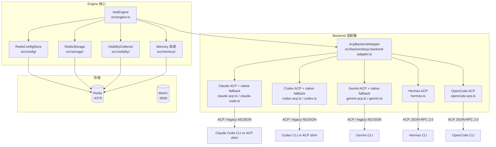
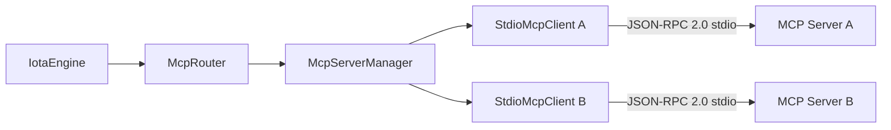

# Engine 引擎指南

**版本：** 1.1
**最后更新：** 2026 年 4 月

## 目录

1. [简介](#1-简介)
2. [架构概览](#2-架构概览)
3. [前置要求](#3-前置要求)
4. [安装与设置](#4-安装与设置)
5. [核心功能 — Backend 适配器](#5-核心功能--backend-适配器)
6. [核心功能 — Memory 记忆系统](#6-核心功能--memory-记忆系统)
7. [核心功能 — Visibility 可见性平面](#7-核心功能--visibility-可见性平面)
8. [核心功能 — 配置管理](#8-核心功能--配置管理)
9. [核心功能 — Redis 数据结构](#9-核心功能--redis-数据结构)
10. [核心功能 — MCP 支持](#10-核心功能--mcp-支持)
11. [核心功能 — 指标采集](#11-核心功能--指标采集)
12. [核心功能 — 审计日志](#12-核心功能--审计日志)
13. [核心功能 — Workspace 快照](#13-核心功能--workspace-快照)
14. [核心功能 — Token 估算](#14-核心功能--token-估算)
15. [分布式特性](#15-分布式特性)
16. [手动验证方法](#16-手动验证方法)
17. [故障排查](#17-故障排查)
18. [清理](#18-清理)
19. [端到端验证：Memory 与 Session 流程](#19-端到端验证memory-与-session-流程)
20. [可观测性验证参考](#20-可观测性验证参考)
21. [参考资料](#21-参考资料)

---

## 1. 简介

### 目的与范围

本指南涵盖 Iota Engine（`@iota/engine`）——核心运行时库。内容包括 Backend 适配器实现、Memory 记忆系统流程、Visibility 可见性平面数据结构、用于分布式配置的 RedisConfigStore，以及完整的 Redis 数据结构文档。

### 目标受众

- 了解 Engine 内部机制的开发者
- 调试 Backend 适配器的贡献者
- 需要检查 Redis 数据结构的任何人

---

## 2. 架构概览

### 组件图



### 依赖项

| 依赖项 | 用途 | 连接方式 |
|--------|------|---------|
| Redis | 主存储 | Redis 协议/TCP :6379 |
| MinIO | 对象存储（可选） | S3 API :9000 |
| Backend 可执行文件 | AI 编码助手；ACP 模式还可能需要 adapter shim | 子进程 stdio |

### 通信协议

- **Engine → Redis**：TCP 上的 Redis 协议
- **Engine → Backend**：子进程 stdio — 首选 ACP JSON-RPC 2.0；Claude/Codex/Gemini 保留 legacy NDJSON fallback
- **Engine → MinIO**：S3 兼容 HTTP API

**参考**：见 [00-architecture-overview.md](./00-architecture-overview.md)

---

## 3. 前置要求

### 必需软件

| 软件 | 用途 |
|------|------|
| Bun | TypeScript 运行时 |
| Redis | 主存储 |
| Backend 可执行文件 | AI 编码助手；ACP 模式还可能需要 adapter shim |

### Backend 可执行文件

```bash
bash deployment/scripts/ensure-backends.sh --check-only
# 统一检查 claude / codex / gemini / hermes / opencode
```

### 环境变量

```bash
# Redis
export REDIS_HOST="127.0.0.1"
export REDIS_PORT="6379"

# 可选：MinIO
export MINIO_ENDPOINT="127.0.0.1:9000"
export MINIO_ACCESS_KEY="..."
export MINIO_SECRET_KEY="..."
```

Backend 认证凭证从 Redis 分布式配置读取，例如 `iota config set env.ANTHROPIC_AUTH_TOKEN "sk-ant-..." --scope backend --scope-id claude-code`。

同样地，MCP server 与 skill 根目录也来自解析后的配置。像 `pet-generator` 这类结构化 skill，若要通过 engine 直接编排 `iota-fun`，必须先把 `mcp.servers` 写入配置；`skill.roots` 若未显式设置，engine 只会回退到仓库相邻的默认 `iota-skill` 目录。

---

## 4. 安装与设置

### 步骤 1：启动 Redis

```bash
cd deployment/scripts
bash start-storage.sh
redis-cli ping
# 预期：PONG
```

### 步骤 2：构建 Engine 和 CLI

```bash
# 构建 Engine
cd iota-engine
bun install
bun run build

# 构建 CLI（Engine 测试通过 CLI 调用命令）
cd ../iota-cli
bun install
bun run build
```

**验证**：
```bash
ls iota-engine/dist/index.js   # Engine 包存在
ls iota-cli/dist/index.js       # CLI 包存在
```

> **CLI PATH 设置**：`iota` 命令可能尚未加入 PATH。见 [01-cli-guide.md](./01-cli-guide.md) 第 4 节步骤 3 的设置方法（选项 A：`node iota-cli/dist/index.js`，选项 B：`npm link`，选项 C：export PATH）。下面所有示例为简洁起见均使用裸 `iota`。

### 步骤 3：配置 Backend

Backend 凭证、模型名称和端点存储在 Redis 分布式配置中：

```bash
iota config set env.ANTHROPIC_AUTH_TOKEN "<redacted>" --scope backend --scope-id claude-code
iota config set env.ANTHROPIC_BASE_URL "https://api.minimaxi.com/anthropic" --scope backend --scope-id claude-code
iota config set env.ANTHROPIC_MODEL "MiniMax-M2.7" --scope backend --scope-id claude-code
iota config set env.OPENAI_MODEL "gpt-5.5" --scope backend --scope-id codex
iota config set env.GEMINI_MODEL "auto-gemini-3" --scope backend --scope-id gemini
iota config set env.HERMES_API_KEY "<redacted>" --scope backend --scope-id hermes
iota config set env.HERMES_BASE_URL "https://api.minimaxi.com/anthropic" --scope backend --scope-id hermes
iota config set env.HERMES_MODEL "MiniMax-M2.7" --scope backend --scope-id hermes
iota config set env.HERMES_PROVIDER "minimax-cn" --scope backend --scope-id hermes
```

已验证的 Hermes 配置与 Claude Code 使用相同的 provider 值，但使用 Hermes 专属的 Redis 键。Iota 在启动 `hermes acp` 前将 Redis 中的值转换为隔离的 Hermes 运行时目录和进程环境变量；当前实现不再写临时 `.env` 文件。

**Hermes Agent**：
```bash
hermes config show
# 验证 model provider 有效
```

---

## 5. 核心功能 — Backend 适配器

### Backend 适配器概览

所有 Backend 适配器均实现 `RuntimeBackend` 接口（`src/backend/interface.ts`）。当前首选路径是 `AcpBackendAdapter`：统一 `initialize -> session/new -> session/prompt` 生命周期、ACP notification 到 `RuntimeEvent` 的映射，以及 approval/tool result 回写。Claude Code、Codex、Gemini 的旧 native adapter 已标记 deprecated，仅作为 `protocol: native` 或 ACP 早期失败 fallback 保留。

---

### ACP 统一接入层

**核心文件**：
- `src/backend/acp-backend-adapter.ts` — ACP 生命周期、session 映射、双向 response 写回
- `src/backend/acp-event-mapper.ts` — `session/update`、`session/complete`、`session/request_permission`、`session/memory`、`session/file_delta` 到 `RuntimeEvent`；permission request 同时发出 `state: waiting_approval` 和 `extension: approval_request` 以兼容核心状态与现有 approval 扩展路径
- `src/protocol/acp.ts` — ACP 方法常量与消息类型

**配置字段**（backend scope）：
```bash
iota config set protocol acp --scope backend --scope-id gemini
iota config set protocol native --scope backend --scope-id gemini
iota config set acpAdapter "@anthropic-ai/claude-code-acp" --scope backend --scope-id claude-code
iota config set acpAdapterArgs "--verbose" --scope backend --scope-id claude-code
```

`BackendPool` 在 `protocol: acp` 时优先创建 ACP adapter。Claude/Codex/Gemini 若 ACP adapter 在发出任何事件前失败，会自动回退到 legacy native adapter；默认不打印降级提醒，只有 `IOTA_DEBUG_ACP=true` 时输出 legacy native 使用日志。`AcpBackendAdapter` 负责 `initialize -> session/new -> session/prompt`，并在 `interrupt()` / `destroy()` 时发送 `session/interrupt` / `session/destroy`，同时清理 session 映射和 deferred prompt 状态。

实现差异与验证状态：Hermes 没有新增 `hermes-acp.ts`，而是在 `hermes.ts` 原地重构为继承/复用 `AcpBackendAdapter`，Hermes 配置生成拆到 `hermes-config.ts`。默认配置仍保守：Hermes/OpenCode 默认 `protocol: acp`，Claude/Codex/Gemini 默认 native，只有显式设置 `protocol=acp` 才启用 ACP adapter。Gemini `--acp`、Claude/Codex adapter shim 包、OpenCode `opencode acp` 都需要在目标机器上跑真实 traced request 后才算验证完成。

| Backend | ACP 命令 | Legacy fallback |
|---|---|---|
| Claude Code | `npx @anthropic-ai/claude-code-acp` | `claude --print --output-format stream-json ...` |
| Codex | `npx @openai/codex-acp` | `codex exec --json ...` |
| Gemini CLI | `gemini --acp` | `gemini --output-format stream-json ...` |
| Hermes Agent | `hermes acp` | n/a |
| OpenCode | `opencode acp` | n/a |

### Claude Code 适配器

**文件**：`src/backend/claude-acp.ts`（首选 ACP），`src/backend/claude-code.ts`（deprecated native fallback）

**子进程命令**：
```
claude --print --output-format stream-json --verbose --permission-mode auto <prompt>
```

**协议**：ACP JSON-RPC 2.0；native fallback 为 stdout 上的 NDJSON（每行一个 JSON 对象）

**事件类型映射**：
| 原生事件 | RuntimeEvent 类型 |
|---------|------------------|
| `extension` | `extension`（thinking/anthropicthink） |
| `output` | `output`（响应文本） |
| `state` | `state`（状态更新） |

**事件映射**（来自 `src/event/types.ts`）：
```typescript
// Extension 事件映射为 'extension' 类型
{ type: "extension", data: { ... } }

// Output 事件映射为 'output' 类型
{ type: "output", data: { content: "..." } }

// State 事件映射为 'state' 类型
{ type: "state", data: { state: "running" | "completed" | "waiting_approval" } }
```

**配置**（`iota:config:backend:claude-code`）：
```bash
iota config set env.ANTHROPIC_AUTH_TOKEN "<redacted>" --scope backend --scope-id claude-code
iota config set env.ANTHROPIC_BASE_URL "https://api.minimaxi.com/anthropic" --scope backend --scope-id claude-code
iota config set env.ANTHROPIC_MODEL "MiniMax-M2.7" --scope backend --scope-id claude-code
```

**验证步骤**：

1. **准备**：
   ```bash
   redis-cli FLUSHALL
   which claude
   ```

2. **带 trace 执行**：
   ```bash
   iota run --backend claude-code --trace "What is 2+2?"
   ```

3. **验证子进程**：
   ```bash
   ps aux | grep claude
   # 预期：执行期间 claude 进程可见
   ```

4. **验证事件**：
   ```bash
   EXEC_ID=$(redis-cli KEYS "iota:exec:*" | head -1 | cut -d: -f3)
   redis-cli XRANGE "iota:events:$EXEC_ID" - + | jq '.[].type'
   # 预期：显示 state、output、extension 类型
   ```

5. **验证可见性**：
   ```bash
   redis-cli KEYS "iota:visibility:*"
   # 预期：tokens、spans、link、context、memory 键
   ```

---

### Codex 适配器

**文件**：`src/backend/codex-acp.ts`（首选 ACP），`src/backend/codex.ts`（deprecated native fallback）

**子进程命令**：
```
codex exec <prompt>
```

**协议**：ACP JSON-RPC 2.0；native fallback 为 stdout 上的 NDJSON

**事件类型映射**：
| 原生事件 | RuntimeEvent 类型 |
|---------|------------------|
| `output` | `output` |
| `state` | `state` |

**配置**（`iota:config:backend:codex`）：
```bash
iota config set env.OPENAI_MODEL "gpt-5.5" --scope backend --scope-id codex
```

已验证配置使用本地 Codex ChatGPT 认证，无需 Redis API key。仅在所选 Codex provider 需要时添加 `env.OPENAI_API_KEY`、`env.OPENAI_BASE_URL` 或 `env.CODEX_MODEL_PROVIDER`。

**验证步骤**：

1. **带 trace 执行**：
   ```bash
   iota run --backend codex --trace "Hello"
   ```

2. **验证事件**：
   ```bash
   EXEC_ID=$(redis-cli KEYS "iota:exec:*" | head -1 | cut -d: -f3)
   redis-cli XRANGE "iota:events:$EXEC_ID" - + | jq '.[].type'
   ```

---

### Gemini CLI 适配器

**文件**：`src/backend/gemini-acp.ts`（首选 ACP），`src/backend/gemini.ts`（deprecated native fallback）

**子进程命令**：
```
gemini --output-format stream-json --skip-trust --prompt <prompt>
```

**协议**：ACP JSON-RPC 2.0；native fallback 为 stdout 上的 NDJSON

**事件类型映射**：
| 原生事件 | RuntimeEvent 类型 |
|---------|------------------|
| `extension` | `extension` |
| `output` | `output` |
| `state` | `state` |
| `multimodal` | `extension` |

**配置**（`iota:config:backend:gemini`）：
```bash
iota config set env.GEMINI_MODEL "auto-gemini-3" --scope backend --scope-id gemini
```

已验证配置使用 Gemini OAuth（`oauth-personal`）。仅在使用真实 Google 兼容端点时添加 API key 或 base-url 字段；不要存储无效的本地网关 URL。

**验证步骤**：

1. **带 trace 执行**：
   ```bash
   iota run --backend gemini --trace "Hello"
   ```

2. **验证事件**：
   ```bash
   EXEC_ID=$(redis-cli KEYS "iota:exec:*" | head -1 | cut -d: -f3)
   redis-cli XRANGE "iota:events:$EXEC_ID" - + | jq '.[].type'
   ```

3. **测试多模态**（如支持）：
   ```bash
   iota run --backend gemini "Describe this image" -- attachment
   ```

---

### Hermes Agent 适配器

**文件**：`src/backend/hermes.ts`；Hermes 配置生成在 `src/backend/hermes-config.ts`

**子进程命令**：
```
hermes acp
```

**协议**：stdio 上的 ACP JSON-RPC 2.0；复用 `AcpBackendAdapter` 通用生命周期

**消息格式（请求）**：
```json
{"jsonrpc":"2.0","method":"execute","params":{"prompt":"...","..."},"id":1}
```

**消息格式（响应）**：
```json
{"jsonrpc":"2.0","result":{"..."},"id":1}
```

**关键特性**：
- 长驻子进程（跨多次执行保持存活）
- JSON-RPC 2.0 请求/响应对
- 基于 ID 的请求-响应关联

**配置**（`iota:config:backend:hermes`）：
```bash
iota config set env.HERMES_API_KEY "<redacted>" --scope backend --scope-id hermes
iota config set env.HERMES_BASE_URL "https://api.minimaxi.com/anthropic" --scope backend --scope-id hermes
iota config set env.HERMES_MODEL "MiniMax-M2.7" --scope backend --scope-id hermes
iota config set env.HERMES_PROVIDER "minimax-cn" --scope backend --scope-id hermes
```

当这些 Redis 字段存在时，Iota 不依赖用户的全局 Hermes 配置进行 Backend 认证或模型选择。适配器会创建隔离的 `HERMES_HOME`，写入 Hermes 原生的 `config.yaml`，并把 `HERMES_API_KEY`/`HERMES_BASE_URL` 映射为 provider 专属进程环境变量（如 `MINIMAX_CN_API_KEY`/`MINIMAX_CN_BASE_URL`）。

**Hermes 配置验证**（关键步骤）：

1. **检查 Hermes 配置**：
   ```bash
   set PYTHONIOENCODING=utf-8
   set PYTHONUTF8=1
   hermes config show
   ```

   在 Windows GBK 控制台下，`hermes config show` 可能因 Unicode 输出触发 `UnicodeEncodeError`。遇到该情况时，先设置 UTF-8 相关环境变量，或改用 UTF-8 终端后再执行。

2. **验证 model provider**：
   - 若 `model.provider: custom` → 需要本地网关正在运行
   - 若 `model.provider: minimax-cn` → 需要有效的 MiniMax CN 配置
   - 若 `model.provider: openai` → 需要有效的 OpenAI 配置

3. **修复无效配置**：
   ```bash
   hermes config set model.provider minimax-cn
   hermes config set model.default MiniMax-M2.7
   hermes doctor --fix
   ```

**验证步骤**：

1. **带 trace 执行**：
   ```bash
   iota run --backend hermes --trace "Hello"
   ```

2. **验证长驻进程**：
   ```bash
   # 首次执行前
   ps aux | grep hermes
   # 预期：无 hermes 进程

   # 执行期间
   ps aux | grep hermes
   # 预期：hermes 进程运行中

   # 执行后
   ps aux | grep hermes
   # 预期：hermes 进程仍在运行（长驻）
   ```

3. **验证事件**：
   ```bash
   EXEC_ID=$(redis-cli KEYS "iota:exec:*" | head -1 | cut -d: -f3)
   redis-cli XRANGE "iota:events:$EXEC_ID" - + | jq '.[].type'
   ```

4. **验证 JSON-RPC 协议**：
   ```bash
   iota run --backend hermes --trace "test"
   ```

---

### 协议解析细节

**Legacy NDJSON 解析**（Claude、Codex、Gemini native fallback）：
```typescript
// 按换行符分割 stdout
// 将每行解析为 JSON
// 处理不完整行（缓冲）
// 处理格式错误的 JSON（错误处理）
```

**ACP JSON-RPC 2.0 解析**（Gemini ACP、Hermes、OpenCode、Claude/Codex adapter-backed）：
```typescript
// session/complete.usage 会映射 input/output/cache/reasoning/total tokens
// session/request_permission 会映射 waiting_approval state + approval_request extension
```

```typescript
// 从 stdout 读取完整 JSON 对象
// 将请求 ID 与响应 ID 匹配
// 处理批量请求（数组）
// 处理通知（无 ID）
```

**错误处理**：
- JSON 格式错误 → 发送 `error` 事件
- 未知事件类型 → 以原始数据发送 `extension` 事件
- Backend 崩溃 → 带退出码发送 `error` 事件

---

### Backend 分布式配置

| Backend | Redis 哈希 | 已验证的 Redis 字段 |
|---------|-----------|-------------------|
| Claude Code | `iota:config:backend:claude-code` | `env.ANTHROPIC_AUTH_TOKEN`、`env.ANTHROPIC_BASE_URL`、`env.ANTHROPIC_MODEL` |
| Codex | `iota:config:backend:codex` | `env.OPENAI_MODEL=gpt-5.5` |
| Gemini CLI | `iota:config:backend:gemini` | `env.GEMINI_MODEL=auto-gemini-3` |
| Hermes Agent | `iota:config:backend:hermes` | `protocol=acp`、`env.HERMES_API_KEY`、`env.HERMES_BASE_URL`、`env.HERMES_MODEL`、`env.HERMES_PROVIDER` |
| OpenCode | `iota:config:backend:opencode` | `protocol=acp`，以及 OpenCode 所需模型/凭证字段 |

**验证分布式配置**：
```bash
iota config get --scope backend --scope-id claude-code
redis-cli HGET "iota:config:backend:claude-code" "env.ANTHROPIC_AUTH_TOKEN"
iota run --backend claude-code --trace "test"
```

---

## 6. 核心功能 — Memory 记忆系统

### Memory 系统概览

Memory 系统包含三个层次：

1. **对话历史**（`DialogueMemory`）：进程内存中的多轮对话 `Map<sessionId, Message[]>`。**不持久化**——进程重启后丢失。仅用于同一进程中连续执行的上下文传递。
2. **工作记忆**（`WorkingMemory`）：进程内存中的活跃文件集 `Map<sessionId, Map<path, ActiveFile>>`。**不持久化**——进程重启后丢失。
3. **统一记忆**（Unified Memory）：持久化到 Redis 的三类长期记忆（semantic/episodic/procedural），其中 semantic 通过 facet 区分 identity/preference/strategic/domain，跨进程重启存活。

> **⚠️ 重要**：Session 记录（`iota:session:{id}`）和统一记忆（`iota:memory:*`）持久化在 Redis 中，但对话历史和工作记忆仅存在于进程内存。Agent/CLI 进程重启后，对话上下文清零，需要依赖统一记忆恢复部分语境。

Memory 系统实现自动记忆循环：

```
对话 → 提取 → 存储 → 检索 → 注入 → 未来上下文
```

### Memory 提取

**文件**：
- `src/memory/mapper.ts`
- `src/memory/storage.ts`
- `src/memory/extractor.ts`
- `src/engine.ts`

**触发方式**：
1. 优先路径：Backend 发出原生 `memory` 运行时事件
2. 回退路径：Engine 从 prompt 加最终输出合成记忆

**流程**：
1. 将 Backend 原生记忆类型映射为统一 type（`semantic`、`episodic`、`procedural`）和可选 facet（`identity`、`preference`、`strategic`、`domain`）
2. 解析作用域（`session`、`project`、`user`）和 TTL
3. 执行置信度阈值检验
4. 按类型和作用域索引写入 Redis

**Redis 键**：
- `iota:memory:{type}:{memoryId}`
- `iota:memories:{type}:{scopeId}`（episodic/procedural）
- `iota:memories:semantic:{scopeId}:{facet}`（semantic facets）
- `iota:memory:hashes:{type}:{scopeId}[:facet]:{contentHash}`
- `iota:memory:history:{memoryId}`
- `iota:memory:by-backend:{backend}`
- `iota:memory:by-tag:{tag}`

**验证**：
```bash
iota run --backend claude-code "Explain binary search with code examples"

SESSION_ID=$(redis-cli KEYS "iota:session:*" | head -1 | cut -d: -f3)
redis-cli ZCARD "iota:memories:episodic:$SESSION_ID"
redis-cli ZREVRANGE "iota:memories:episodic:$SESSION_ID" 0 -1
```

---

### Memory 存储

**文件**：
- `src/memory/storage.ts` — 统一存储门面
- `src/storage/redis.ts` — Redis 实现

**主存储**：Redis 哈希 + 有序集合索引

**存储结构**：
```typescript
interface StoredMemory {
  id: string;
  type: "semantic" | "episodic" | "procedural";
  facet?: "identity" | "preference" | "strategic" | "domain";
  scope: "session" | "project" | "user";
  scopeId: string;
  content: string;
  contentHash: string;
  embeddingJson?: string;
  source: { backend: BackendName; nativeType: string; executionId: string };
  metadata: Record<string, unknown>;
  confidence: number;
  timestamp: number;
  ttlDays: number;
  createdAt: number;
  lastAccessedAt: number;
  accessCount: number;
  expiresAt: number;
}
```

---

### Memory 检索

**文件**：`src/memory/injector.ts`

**流程**：
1. 执行开始时从六个召回桶加载记忆
2. 从 session 作用域取情节记忆（episodic）
3. 从 project 作用域取程序记忆（procedural）、战略语义记忆（semantic+strategic）和领域语义记忆（semantic+domain）
4. 从 user 作用域取身份/偏好语义记忆（semantic+identity / semantic+preference）
5. 注入时执行置信度和 token 预算约束

---

### Memory 注入

**文件**：`src/memory/injector.ts`

**流程**：
1. 从 session / project / user 作用域构建结构化记忆上下文
2. 按 identity / preference / strategic / domain / procedural / episodic 顺序选择并注入结构化记忆
3. 在调用 Backend 前注入 prompt 上下文

**验证**：
```bash
EXEC_ID=$(redis-cli KEYS "iota:exec:*" | head -1 | cut -d: -f3)
redis-cli GET "iota:visibility:memory:$EXEC_ID"
# 预期：包含 candidates、selected、excluded 计数的 JSON
```

---

### MemoryVisibilityRecord

**文件**：`src/visibility/types.ts`

```typescript
interface MemoryVisibilityRecord {
  sessionId: string;
  executionId: string;
  candidates: MemoryCandidateVisibility[];
  selected: MemorySelectedVisibility[];
  excluded: MemoryExcludedVisibility[];
  extractionReason?: string;  // 例如 "substantial_output"
}
```

---

## 7. 核心功能 — Visibility 可见性平面

### Visibility 平面概览

Visibility 平面记录每次执行的完整数据：

- **Token 跟踪**：输入/输出 token 计数
- **Span 记录**：执行阶段的时间与层次
- **Context 清单**：Prompt 组成详情
- **Memory 可见性**：记忆选择过程
- **Link 可见性**：子进程协议详情

### TokenLedger

**文件**：`src/visibility/types.ts`

**Redis 键**：`iota:visibility:tokens:{executionId}`（String/JSON）

```typescript
interface TokenLedger {
  inputTokens: number;
  outputTokens: number;
  totalTokens: number;
  confidence: "native" | "mixed" | "estimated";
  breakdown?: {
    native: { input: number; output: number; };
    estimated: { input: number; output: number; };
  };
}
```

**验证**：
```bash
EXEC_ID=$(redis-cli KEYS "iota:exec:*" | head -1 | cut -d: -f3)
redis-cli GET "iota:visibility:tokens:$EXEC_ID"
# 预期：包含 token 计数的 JSON
```

---

### TraceSpan

**文件**：`src/visibility/types.ts`

**Redis 键**：`iota:visibility:spans:{executionId}`（JSON 列表）

```typescript
interface TraceSpan {
  traceId: string;
  spanId: string;
  parentSpanId: string | null;  // 根 span 为 null
  sessionId: string;
  executionId: string;
  backend: string;
  kind: TraceSpanKind;
  startedAt: number;
  endedAt: number;
  status: "ok" | "error";
  attributes: Record<string, unknown>;
  redaction?: { rule: string; paths: string[]; };
}
```

**Span 类型**：
| 类型 | 描述 |
|------|------|
| `engine.request` | 顶层执行 span |
| `engine.context.build` | 上下文组成 |
| `memory.search` | 记忆检索 |
| `memory.inject` | 记忆注入到 prompt |
| `backend.resolve` | Backend 选择 |
| `backend.spawn` | 子进程创建 |
| `backend.stdin.write` | 向 stdin 写入 prompt |
| `backend.stdout.read` | 从 stdout 读取输出 |
| `adapter.parse` | 协议解析 |
| `event.persist` | 事件存储到 Redis |
| `approval.wait` | 等待审批 |
| `mcp.proxy` | MCP 工具代理 |
| `workspace.scan` | 目录扫描 |
| `memory.extract` | 记忆提取 |

**Span 层次重建**：
```typescript
function buildSpanTree(spans: TraceSpan[]): TraceSpanNode {
  const root = spans.find(s => s.parentSpanId === null);
  const children = spans.filter(s => s.parentSpanId === root.spanId);
  return { span: root, children: children.map(c => buildSpanTree(spans)) };
}
```

**验证**：
```bash
EXEC_ID=$(redis-cli KEYS "iota:exec:*" | head -1 | cut -d: -f3)
redis-cli LRANGE "iota:visibility:spans:$EXEC_ID" 0 -1 | jq '.[].kind'
redis-cli LRANGE "iota:visibility:spans:$EXEC_ID" 0 -1 | jq '[.[] | {spanId, parentSpanId, kind}]'
```

---

### ContextManifest

**文件**：`src/visibility/types.ts`

**Redis 键**：`iota:visibility:context:{executionId}`（String/JSON）

```typescript
interface ContextManifest {
  sessionId: string;
  executionId: string;
  segments: ContextSegment[];
  totalTokens: number;
  budgetUsedRatio: number;
}

interface ContextSegment {
  kind: ContextSegmentKind;  // "system" | "user" | "memory" | "mcp" | "workspace"
  contentHash: string;
  tokenCount: number;
  source?: string;  // workspace 的文件路径
}
```

**验证**：
```bash
EXEC_ID=$(redis-cli KEYS "iota:exec:*" | head -1 | cut -d: -f3)
redis-cli GET "iota:visibility:context:$EXEC_ID"
```

---

### LinkVisibilityRecord

**文件**：`src/visibility/types.ts`

**Redis 键**：`iota:visibility:link:{executionId}`（String/JSON）

```typescript
interface LinkVisibilityRecord {
  executionId: string;
  backend: string;
  pid: number;
  exitCode: number | null;
  protocol: "ndjson" | "json-rpc";
  stdinBytes: number;
  stdoutBytes: number;
  stderrBytes: number;
  durationMs: number;
}
```

**验证**：
```bash
EXEC_ID=$(redis-cli KEYS "iota:exec:*" | head -1 | cut -d: -f3)
redis-cli GET "iota:visibility:link:$EXEC_ID"
```

---

### EventMappingVisibility

**文件**：`src/visibility/types.ts`

**Redis 键**：`iota:visibility:mapping:{executionId}`（JSON 列表）

跟踪原生 Backend 事件如何映射为 RuntimeEvent。

**验证**：
```bash
EXEC_ID=$(redis-cli KEYS "iota:exec:*" | head -1 | cut -d: -f3)
redis-cli LRANGE "iota:visibility:mapping:$EXEC_ID" 0 -1
```

---

## 8. 核心功能 — 配置管理

### RedisConfigStore

**文件**：`src/config/redis-store.ts`

**用途**：Redis 中基于作用域隔离的分布式配置存储。

**作用域**：
| 作用域 | Redis 键模式 | 用途 |
|--------|-------------|------|
| `global` | `iota:config:global` | 系统级设置 |
| `backend` | `iota:config:backend:{backendName}` | Backend 专属设置 |
| `session` | `iota:config:session:{sessionId}` | Session 级覆盖 |
| `user` | `iota:config:user:{userId}` | 用户偏好设置 |

**解析优先级**（从高到低）：
```
user > session > backend > global > 默认值
```

**方法**：
```typescript
class RedisConfigStore {
  get(scope: ConfigScope, scopeId?: string): Promise<Record<string, string>>;
  set(scope: ConfigScope, key: string, value: string, scopeId?: string): Promise<void>;
  del(scope: ConfigScope, key: string, scopeId?: string): Promise<void>;
  getKey(scope: ConfigScope, key: string, scopeId?: string): Promise<string | null>;
  getResolved(): Promise<ResolvedConfig>;
  listScopes(scope: ConfigScope): Promise<string[]>;
}
```

**验证**：
```bash
redis-cli HGETALL "iota:config:global"
redis-cli HGETALL "iota:config:backend:claude-code"
redis-cli KEYS "iota:config:backend:*"
```

---

### 配置 Schema

**文件**：`src/config/schema.ts`

**键类型**：点号分隔的键，如 `approval.shell`、`backend.claude-code.timeout`

**值类型**：从字符串自动解析：
- `"true"` → 布尔 `true`
- `"false"` → 布尔 `false`
- `"null"` → null
- 数字字符串 → 数字
- JSON 对象/数组 → 解析后的 JSON

**默认值**：见 `src/config/schema.ts`

---

## 9. 核心功能 — Redis 数据结构

### Session 键

**模式**：`iota:session:{sessionId}`  **类型**：Hash

| 字段 | 类型 | 描述 |
|------|------|------|
| `id` | String | Session UUID |
| `workingDirectory` | String | 绝对路径 |
| `activeBackend` | String | 当前 Backend 名称 |
| `createdAt` | String | 时间戳（ms） |
| `updatedAt` | String | 时间戳（ms） |
| `status` | String | `active` 或 `archived` |

**验证**：
```bash
redis-cli HGETALL "iota:session:{sessionId}"
```

---

### Execution 键

**模式**：`iota:exec:{executionId}`  **类型**：Hash

| 字段 | 类型 | 描述 |
|------|------|------|
| `id` | String | Execution UUID |
| `sessionId` | String | 父 Session UUID |
| `prompt` | String | 用户 prompt |
| `output` | String | 最终输出文本 |
| `status` | String | `queued`、`running`、`completed`、`failed`、`interrupted` |
| `backend` | String | 使用的 Backend |
| `createdAt` | String | 时间戳（ms） |
| `completedAt` | String | 时间戳（ms） |
| `errorJson` | String | 错误详情（失败时） |

**验证**：
```bash
redis-cli HGETALL "iota:exec:{executionId}"
```

---

### Event 流

**模式**：`iota:events:{executionId}`  **类型**：List

**内容**：JSON 序列化的 RuntimeEvent 对象（每个列表元素一个）

**事件类型**：`output`、`state`、`tool_call`、`tool_result`、`file_delta`、`error`、`extension`

**验证**：
```bash
redis-cli XRANGE "iota:events:{execId}" - +
redis-cli XRANGE "iota:events:{execId}" - + | jq '.[].type'
```

---

### Visibility 键汇总

- `iota:visibility:tokens:{executionId}` — Token 账本（String/JSON）
- `iota:visibility:link:{executionId}` — Link 记录（String/JSON）
- `iota:visibility:spans:{executionId}` — Trace span（JSON 列表）
- `iota:visibility:mapping:{executionId}` — 事件映射（JSON 列表）
- `iota:visibility:session:{sessionId}` — Session 索引（Sorted Set，按时间戳）
- `iota:visibility:context:{executionId}` — Context 清单（String/JSON）
- `iota:visibility:memory:{executionId}` — Memory 记录（String/JSON）

**验证**：
```bash
EXEC_ID=$(redis-cli KEYS "iota:exec:*" | head -1 | cut -d: -f3)
redis-cli KEYS "iota:visibility:*:$EXEC_ID"
```

---

### Memory 键

**模式**：
- `iota:memory:{type}:{memoryId}` — 单条记忆（Hash）
- `iota:memories:{type}:{scopeId}`（episodic/procedural）
- `iota:memories:semantic:{scopeId}:{facet}`（semantic facets）
- `iota:memory:hashes:{type}:{scopeId}[:facet]:{contentHash}`
- `iota:memory:history:{memoryId}` — 按类型/作用域索引（Sorted Set）
- `iota:memory:by-backend:{backend}` — 按 Backend 索引（Set）
- `iota:memory:by-tag:{tag}` — 按标签索引（Set）

**验证**：
```bash
SESSION_ID=$(redis-cli KEYS "iota:session:*" | head -1 | cut -d: -f3)
redis-cli ZCARD "iota:memories:episodic:$SESSION_ID"
MEMORY_ID=$(redis-cli ZRANGE "iota:memories:episodic:$SESSION_ID" 0 0)
redis-cli HGETALL "iota:memory:episodic:$MEMORY_ID"
```

---

### Config 键

- `iota:config:global` — 全局配置（Hash）
- `iota:config:backend:{backendName}` — Backend 配置（Hash）
- `iota:config:session:{sessionId}` — Session 配置（Hash）
- `iota:config:user:{userId}` — User 配置（Hash）

**验证**：
```bash
redis-cli HGETALL "iota:config:global"
redis-cli KEYS "iota:config:backend:*"
```

---

### Audit 键

**模式**：`iota:audit`  **类型**：List 或 Stream（取决于实现）

**验证**：
```bash
redis-cli LRANGE "iota:audit" 0 -1
# 或
redis-cli XRANGE "iota:audit" - + COUNT 10
```

---

### Redis 键模式汇总

| 模式 | 类型 | 描述 |
|------|------|------|
| `iota:session:{id}` | Hash | Session 元数据 |
| `iota:exec:{executionId}` | Hash | Execution 记录 |
| `iota:session-execs:{sessionId}` | Set | Session → Execution 映射 |
| `iota:executions` | Sorted Set | 全局 Execution 索引 |
| `iota:events:{executionId}` | Stream | 事件流 |
| `iota:visibility:tokens:{executionId}` | String | Token 计数 |
| `iota:visibility:spans:{executionId}` | List | Trace span |
| `iota:visibility:context:{executionId}` | String | Context 清单 |
| `iota:visibility:memory:{executionId}` | String | Memory 可见性 |
| `iota:visibility:link:{executionId}` | String | 协议链路数据 |
| `iota:visibility:{executionId}:chain` | Hash | Visibility chain（spanId -> TraceSpan） |
| `iota:visibility:mapping:{executionId}` | List | 事件映射 |
| `iota:visibility:session:{sessionId}` | Sorted Set | Session visibility 索引 |
| `iota:fencing:execution:{executionId}` | String | 分布式执行锁 |
| `iota:memory:{type}:{memoryId}` | Hash | 统一记忆对象 |
| `iota:memories:{type}:{scopeId}[:facet]` | Sorted Set | 按 type+scope+facet 的记忆索引 |
| `iota:memory:by-backend:{backend}` | Set | 按 Backend 的记忆 ID |
| `iota:memory:by-tag:{tag}` | Set | 按标签的记忆 ID |
| `iota:config:global` | Hash | 全局配置 |
| `iota:config:backend:{name}` | Hash | Backend 配置 |
| `iota:config:session:{id}` | Hash | Session 配置 |
| `iota:config:user:{id}` | Hash | User 配置 |
| `iota:audit` | Sorted Set | 审计日志（时间戳为分数，双写：JSONL 文件 + Redis） |

---

## 10. 核心功能 — MCP 支持

### 概览

Engine 内置 Model Context Protocol（MCP）支持，允许 Session 连接外部 MCP 工具服务器。MCP 服务器作为子进程管理，通过 stdio 使用 JSON-RPC 2.0 通信。

**源文件**：
- `src/mcp/client.ts` — `McpClient` 接口和 `StdioMcpClient` 实现
- `src/mcp/manager.ts` — `McpServerManager` 生命周期管理
- `src/mcp/router.ts` — `McpRouter` 编排层

### 架构



### 关键类型

```typescript
interface McpClient {
  request(method: string, params?: unknown): Promise<unknown>;
  close?(): Promise<void>;
}

interface McpServerDescriptor {
  name: string;
  command: string;
  args?: string[];
  env?: Record<string, string>;
}

interface McpToolCall {
  serverName: string;
  toolName: string;
  arguments: Record<string, unknown>;
}

interface McpServerStatus {
  name: string;
  connected: boolean;
  tools: string[];
  lastHealthCheck?: number;
  error?: string;
}
```

### McpRouter API

| 方法 | 描述 |
|------|------|
| `listServers()` | 返回已注册的 MCP 服务器描述符 |
| `status()` | 所有服务器的连接状态 |
| `listTools()` | 所有已连接服务器的可用工具 |
| `addServer(server)` | 运行时注册新 MCP 服务器 |
| `removeServer(name)` | 移除并断开 MCP 服务器 |
| `callTool(call)` | 在指定服务器上调用工具 |
| `startHealthChecks(intervalMs?)` | 启动基于 ping 的定期健康检查（默认 30s） |
| `close()` | 关闭所有连接 |

### 协议详情

- **传输**：子进程 stdio（stdin/stdout）
- **协议**：JSON-RPC 2.0
- **初始化**：发送 `initialize`，`protocolVersion: "2024-11-05"`
- **工具发现**：连接时执行 `tools/list`，每个服务器缓存结果
- **工具调用**：`tools/call`，参数 `{ name, arguments }`
- **健康检查**：`ping` — 失败服务器断开连接，下次 `getClient()` 时重连
- **超时**：每个请求 30 秒（可配置）

### 配置

```typescript
// 配置 schema（src/config/schema.ts）
mcp: {
  servers: McpServerDescriptor[];  // 默认：[]
}
```

```bash
iota config set mcp.servers '[{"name":"my-server","command":"npx","args":["-y","my-mcp-server"]}]'
```

### 审批策略

```typescript
approval: {
  mcpExternal: "ask"  // "ask" | "allow" | "deny"
}
```

### 验证

```typescript
const engine = new IotaEngine({ workingDirectory: "/tmp" });
await engine.init();
const servers = engine.getMcpServers();   // McpServerStatus[]
```

```bash
curl http://localhost:9666/api/v1/status | jq '.backends[].capabilities.mcp'
```

---

## 11. 核心功能 — 指标采集

### 概览

Engine 通过 `MetricsCollector` 采集进程内运行时指标，跟踪执行计数、延迟百分位、工具调用量、审批统计以及基于 Visibility 的质量指标。

**源文件**：`src/metrics/collector.ts`

### MetricsSnapshot 结构

```typescript
interface MetricsSnapshot {
  executions: number;
  success: number;
  failure: number;
  interrupted: number;
  byBackend: Partial<Record<BackendName, number>>;
  backendCrashes: Partial<Record<BackendName, number>>;
  eventCount: number;
  toolCallCount: number;
  approvalCount: number;
  approvalDenied: number;
  approvalTimeout: number;
  latencyMs: LatencyStats;
  contextBudgetUsed: number[];   // 上下文预算消耗比例
  memoryHitRatio: number[];      // 选中 / 候选比例
  nativeTokenTotal: number[];    // 每次执行的原生 token 数
  parseLossRatio: number[];      // 有损映射 / 总引用比例
}

interface LatencyStats {
  samples: number[];
  p50: number;
  p95: number;
  p99: number;
}
```

### MetricsCollector 方法

| 方法 | 描述 |
|------|------|
| `recordExecution(response)` | 按 Backend 跟踪执行状态和工具调用计数 |
| `recordBackendCrash(backend)` | 递增 Backend 崩溃计数器 |
| `recordApproval(denied, timeout)` | 跟踪审批请求、拒绝、超时 |
| `recordLatency(ms)` | 记录执行延迟样本 |
| `recordEvent(event)` | 递增全局事件计数器 |
| `recordVisibility(visibility)` | 从 visibility 束提取上下文预算、记忆命中率、token 计数、解析损失 |
| `getSnapshot()` | 返回当前时刻的 `MetricsSnapshot` |

### 采样机制

- 延迟和基于 Visibility 的数组保留**最近 1000 个样本**，超出后自动裁剪。
- 百分位（P50、P95、P99）按需从排序后的样本数组计算。

### 验证

```bash
curl http://localhost:9666/api/v1/metrics
```

---

## 12. 核心功能 — 审计日志

### 概览

Engine 写入防篡改审计跟踪，记录每个重要操作——执行生命周期、工具调用、审批决策、Backend 切换和错误。条目以 JSONL 格式写入本地文件系统，可选远端 sink 用于集中采集。

**源文件**：`src/audit/logger.ts`

### AuditEntry 结构

```typescript
interface AuditEntry {
  timestamp: number;         // epoch ms
  sessionId: string;
  executionId: string;
  backend: BackendName;
  action:
    | "execution_start"
    | "execution_finish"
    | "tool_call"
    | "approval_request"
    | "approval_decision"
    | "backend_switch"
    | "error";
  result: "success" | "failure" | "denied";
  details: Record<string, unknown>;
}
```

### 操作类型

| 操作 | 记录时机 |
|------|---------|
| `execution_start` | 执行开始 |
| `execution_finish` | 执行完成（成功/失败/中断） |
| `tool_call` | Backend 调用工具 |
| `approval_request` | 请求用户审批 |
| `approval_decision` | 用户批准或拒绝 |
| `backend_switch` | 活动 Backend 切换 |
| `error` | 运行时错误发生 |

### 存储

- **文件路径**：`${IOTA_HOME}/logs/audit.jsonl`
- **格式**：JSONL — 每行一个 JSON 对象
- **目录**：首次写入时懒创建
- **Redis 双写**：同时写入 Redis Sorted Set `iota:audit`（时间戳为分数），通过 `storage.appendAuditEntry()` 实现
- **远端转发**：可选 sink 用于集中采集

### AuditLogger API

```typescript
class AuditLogger {
  constructor(
    auditPath: string,
    sink?: { appendAuditEntry(entry: AuditEntry): Promise<void> }
  )
  async append(entry: AuditEntry): Promise<void>
}
```

### 查询审计日志

```bash
tail -10 ~/.iota/audit.jsonl | jq .
cat ~/.iota/audit.jsonl | jq 'select(.action == "tool_call")'
cat ~/.iota/audit.jsonl | jq 'select(.sessionId == "SESSION_ID")'
cat ~/.iota/audit.jsonl | jq 'select(.action == "approval_decision" and .result == "denied")' | wc -l
```

> **安全提示**：写入前会自动脱敏 `details` 中的 API key、token 和类似密钥的值。

---

## 13. 核心功能 — Workspace 快照

### 概览

Engine 捕获 Workspace 快照——Session 完整状态的时间点记录，包括对话历史、活动工具、MCP 服务器和文件清单。快照支持 Session 恢复和 Workspace 检查。

**源文件**：`src/workspace/snapshot.ts`

### WorkspaceSnapshot 结构

```typescript
interface WorkspaceSnapshot {
  snapshotId: string;           // "snap_{random}_{timestamp}"
  sessionId: string;
  createdAt: number;            // epoch ms
  workingDirectory: string;
  activeBackend: BackendName;
  conversationHistory: Message[];
  activeTools: string[];
  mcpServers: McpServerDescriptor[];
  fileManifest: FileManifestEntry[];
  metadata: Record<string, unknown>;
  manifestPath?: string;        // 写入后设置
}
```

### 存储结构

```
${IOTA_HOME}/workspaces/${sessionId}/
├── manifest.json
├── snapshots/
│   ├── snap_abc123_lmno456.manifest.json
│   └── snap_def789_pqrs012.manifest.json
└── deltas/
    ├── exec_001.jsonl
    └── exec_002.jsonl
```

### API

| 函数 | 描述 |
|------|------|
| `createWorkspaceSnapshot(input)` | 创建快照对象，生成 `snapshotId` 和 `createdAt` |
| `writeWorkspaceSnapshot(iotaHome, snapshot, manifest)` | 写入快照和清单到磁盘，裁剪旧快照 |
| `appendDeltaJournal(iotaHome, sessionId, executionId, deltas)` | 为指定执行追加 JSONL delta |

每个 Session 只保留**最近 5 个快照**。每次写入时自动删除更早的清单文件。

### 验证

```bash
ls ~/.iota/workspaces/$SESSION_ID/snapshots/
cat ~/.iota/workspaces/$SESSION_ID/manifest.json | jq .
cat ~/.iota/workspaces/$SESSION_ID/deltas/$EXEC_ID.jsonl | jq .
```

---

## 14. 核心功能 — Token 估算

### 概览

Visibility 平面使用可插拔的 Token 估算器将文本转换为近似 token 计数。默认实现使用简单的字符数启发式算法；可替换为逐模型分词器以提高精度。

**源文件**：`src/visibility/token-estimator.ts`

### TokenEstimator 接口

```typescript
interface TokenEstimator {
  estimate(text: string, backend: BackendName, model?: string): number;
}
```

### 默认实现

```typescript
// ceil(字符数 / 4) — 简单启发式，英文文本准确率约 75%
const CHARS_PER_TOKEN = 4;

class DefaultTokenEstimator implements TokenEstimator {
  estimate(text: string, _backend: BackendName, _model?: string): number {
    return Math.ceil(text.length / CHARS_PER_TOKEN);
  }
}
```

### 公共 API

| 函数 | 描述 |
|------|------|
| `getTokenEstimator()` | 获取当前估算器实例（单例，懒初始化） |
| `setTokenEstimator(estimator)` | 替换全局估算器为自定义实现 |
| `estimateTokens(text, backend?, model?)` | 便捷函数 — 估算字符串的 token 数 |

### 自定义估算器示例

```typescript
import { setTokenEstimator, type TokenEstimator } from "@iota/engine";
import { encode } from "gpt-tokenizer";

const tikTokenEstimator: TokenEstimator = {
  estimate(text: string, _backend, _model) {
    return encode(text).length;
  },
};

setTokenEstimator(tikTokenEstimator);
```

**集成点**：
- `VisibilityCollector`（`src/visibility/collector.ts`）— Token 账本计算
- `MemoryInjector`（`src/memory/injector.ts`）— 记忆预算计算

---

## 15. 分布式特性

### Backend Pool 管理

**文件**：`src/backend/pool.ts`

管理多个 Backend 实例，实现隔离和性能优化。

**验证**：
```bash
iota status
# 显示所有 Backend 及其状态
```

---

### 分布式事件流

**文件**：`src/storage/pubsub.ts`

**Redis 频道**：
- `iota:execution:events` — 执行事件通知
- `iota:session:updates` — Session 状态变更
- `iota:config:changes` — 配置变更通知

**验证**：
```bash
redis-cli SUBSCRIBE iota:execution:events
# 然后执行一个 prompt，观察实时事件通知
```

---

### 跨 Backend 数据隔离

**验证**：
```bash
iota run --backend claude-code "test A"
iota run --backend gemini "test B"
curl http://localhost:9666/api/v1/backend-isolation
# 预期：各 Backend 独立计数，无数据泄漏
```

---

## 16. 手动验证方法

### 验证清单：Backend 适配器（Claude Code）

**目标**：验证 Claude Code 适配器正常工作。

- [ ] **准备**：Redis 运行中，claude 可用
  ```bash
  redis-cli ping && which claude
  ```

- [ ] **带 trace 执行**：
  ```bash
  redis-cli FLUSHALL
  iota run --backend claude-code --trace "What is 2+2?"
  ```

- [ ] **验证子进程**（执行期间）：
  ```bash
  ps aux | grep claude
  # 预期：claude 进程可见
  ```

- [ ] **验证事件**：
  ```bash
  EXEC_ID=$(redis-cli KEYS "iota:exec:*" | head -1 | cut -d: -f3)
  redis-cli XRANGE "iota:events:$EXEC_ID" - + | jq '.[].type'
  # 预期：包含 state、output 类型
  ```

- [ ] **验证可见性**：
  ```bash
  redis-cli KEYS "iota:visibility:*:$EXEC_ID"
  # 预期：tokens、spans、link、context、memory
  ```

- [ ] **清理**：`redis-cli FLUSHALL`

**成功标准**：✅ 子进程已启动 ✅ NDJSON 正确解析 ✅ RuntimeEvent 已持久化 ✅ Visibility 数据完整 ✅ Token 计数准确

---

### 验证清单：Backend 适配器（Hermes）

**目标**：验证 Hermes 适配器使用 JSON-RPC 协议正常工作。

- [ ] **准备**：
  ```bash
  redis-cli ping && which hermes
  hermes config show
  # 验证 model.provider 不是指向不可达网关的 "custom"
  ```

- [ ] **带 trace 执行**：
  ```bash
  redis-cli FLUSHALL
  iota run --backend hermes --trace "Hello"
  ```

- [ ] **验证长驻进程**：
  ```bash
  ps aux | grep hermes
  # 预期：hermes 仍在运行（执行后保持存活）
  ```

- [ ] **再次执行并验证复用**：
  ```bash
  iota run --backend hermes "Second prompt"
  ps aux | grep hermes
  # 预期：同一进程，未重新启动
  ```

- [ ] **清理**：`redis-cli FLUSHALL`

**成功标准**：✅ JSON-RPC 请求/响应正常 ✅ 子进程跨执行保持存活 ✅ 事件正确解析 ✅ Visibility 已记录

---

### 验证清单：Memory 系统

**目标**：验证记忆提取、存储、检索和注入。

- [ ] **准备并执行**：
  ```bash
  redis-cli FLUSHALL
  iota run --backend claude-code "Explain binary search with code examples"
  ```

- [ ] **验证提取**：
  ```bash
  SESSION_ID=$(redis-cli KEYS "iota:session:*" | head -1 | cut -d: -f3)
  redis-cli ZCARD "iota:memories:episodic:$SESSION_ID"
  # 预期：>= 1
  ```

- [ ] **查看记忆内容**：
  ```bash
  MEMORY_ID=$(redis-cli ZREVRANGE "iota:memories:episodic:$SESSION_ID" 0 0)
  redis-cli HGETALL "iota:memory:episodic:$MEMORY_ID"
  ```

- [ ] **验证 Memory Visibility**：
  ```bash
  EXEC_ID=$(redis-cli KEYS "iota:exec:*" | head -1 | cut -d: -f3)
  redis-cli GET "iota:visibility:memory:$EXEC_ID" | jq '.selected'
  ```

- [ ] **清理**：`redis-cli FLUSHALL`

---

### 验证清单：TraceSpan 层次

**目标**：验证 span 构成正确的层次结构。

- [ ] **执行并获取 span**：
  ```bash
  redis-cli FLUSHALL
  iota run --backend claude-code "test"
  EXEC_ID=$(redis-cli KEYS "iota:exec:*" | head -1 | cut -d: -f3)
  redis-cli LRANGE "iota:visibility:spans:$EXEC_ID" 0 -1 > /tmp/spans.json
  ```

- [ ] **找到根 span**：
  ```bash
  cat /tmp/spans.json | jq '[.[] | select(.parentSpanId == null)]'
  # 预期：1 个根 span，类型为 "engine.request"
  ```

- [ ] **验证层次完整性**：
  ```bash
  cat /tmp/spans.json | jq '[.[] | select(.parentSpanId != null)] | length'
  # 应等于总 span 数 - 1
  ```

- [ ] **验证关键类型存在**：
  ```bash
  cat /tmp/spans.json | jq '[.[] | .kind] | unique'
  # 预期：包含 backend.spawn、backend.stdout.read、adapter.parse 等
  ```

- [ ] **清理**：`redis-cli FLUSHALL`

---

### 验证清单：配置解析

**目标**：验证配置正确存储和解析。

- [ ] **设置全局配置**：
  ```bash
  redis-cli FLUSHALL
  iota config set approval.shell "ask"
  redis-cli HGET "iota:config:global" "approval.shell"
  # 预期："ask"
  ```

- [ ] **设置 Backend 配置**：
  ```bash
  iota config set timeout 60000 --scope backend --scope-id claude-code
  redis-cli HGET "iota:config:backend:claude-code" "timeout"
  # 预期："60000"
  ```

- [ ] **验证解析**：
  ```bash
  iota config get approval.shell
  iota config get timeout --scope backend --scope-id claude-code
  curl http://localhost:9666/api/v1/config?backend=claude-code | jq '."approval.shell"'
  ```

- [ ] **清理**：`redis-cli FLUSHALL`

---

## 17. 故障排查

### 问题：Backend 启动失败

**症状**：`Backend 'xxx' not found` 或子进程未启动

**诊断**：
```bash
which <backend>
iota status
ps aux | grep <backend>
```

**解决方案**：安装 Backend CLI，添加到 PATH，检查配置文件。

---

### 问题：协议解析错误

**症状**：`adapter.parse` span 显示错误

**诊断**：
```bash
iota run --backend claude-code --trace "test"
# 检查 adapter.parse span 的错误
```

**解决方案**：检查 Backend 版本是否受支持，验证 stdio 管道是否正常。

---

### 问题：Memory 未提取

**症状**：`redis-cli ZCARD "iota:memories:episodic:..."` 返回 0

**诊断**：
```bash
redis-cli HGET "iota:exec:{executionId}" "output" | wc -c
# 如果较短：低于提取阈值（通常 >500 字符）
```

**解决方案**：检查 `iota:visibility:memory:{execId}` 获取提取原因。

---

### 问题：Visibility 数据缺失

**症状**：某些 visibility 键未创建

**诊断**：
```bash
EXEC_ID=$(redis-cli KEYS "iota:exec:*" | head -1 | cut -d: -f3)
redis-cli KEYS "iota:visibility:*:$EXEC_ID"
```

**解决方案**：确认 Redis 可访问，检查 `--trace` 输出中的错误。

---

## 18. 清理

### 重置 Redis

```bash
redis-cli FLUSHALL
```

### 停止服务

```bash
cd deployment/scripts && bash stop-storage.sh
```

---

## 19. 端到端验证：Memory 与 Session 流程

### 14.1 Session 创建与执行

```bash
SESSION_ID=$(curl -s -X POST http://localhost:9666/api/v1/sessions \
  -H "Content-Type: application/json" \
  -d '{"workingDirectory": "/tmp"}' | jq -r '.sessionId')

redis-cli HGETALL "iota:session:$SESSION_ID"
```

**预期字段**：`id`、`workingDirectory`、`activeBackend`、`createdAt`。

### 14.2 对话记忆积累

```bash
iota run --session $SESSION_ID "My favorite color is blue."
iota run --session $SESSION_ID "What is my favorite color?"

EXEC_ID=$(redis-cli KEYS "iota:exec:*" | tail -1 | cut -d: -f3)
redis-cli XRANGE "iota:events:$EXEC_ID" - + | grep -c '"role":"user"'
# 预期：2（前一个 prompt 作为历史携带）
```

### 14.3 Memory 提取

```bash
iota run --session $SESSION_ID "Explain binary search in Python with code blocks."

redis-cli ZCARD "iota:memories:episodic:$SESSION_ID"
# 预期：>= 1

MEMORY_ID=$(redis-cli ZREVRANGE "iota:memories:episodic:$SESSION_ID" 0 0)
redis-cli HGET "iota:memory:episodic:$MEMORY_ID" type
```

### 14.4 Memory 注入

```bash
iota run --session $SESSION_ID "Now implement the search function."

EXEC_ID=$(redis-cli KEYS "iota:exec:*" | tail -1 | cut -d: -f3)
iota vis --execution $EXEC_ID --memory
# 预期：populated "candidates" 和 "selected" 字段
```

### 14.5 安全：Workspace 边界守卫

```bash
iota run --session $SESSION_ID "Read /etc/passwd"
# 预期：触发 fileOutside 审批或直接拒绝
```

### 14.6 审批策略

```bash
iota config set approval.shell ask
iota interactive
# 输入：run "rm -rf /tmp/test"
# 预期：⏳ Waiting for approval...
```

### 14.7 垃圾回收

```bash
iota gc
# 清理过期的 Execution 记录和 Visibility 数据
```

### 14.8 Session 清理

```bash
curl -X DELETE http://localhost:9666/api/v1/sessions/$SESSION_ID
```

### 14.9 命令快速参考

| 功能 | 命令 |
|------|------|
| 状态检查 | `iota status` |
| 交互模式 | `iota interactive` |
| Visibility 检查 | `iota vis --execution <id>` |
| Session 日志搜索 | `iota vis search --session <id> --prompt "keyword"` |
| Backend 切换 | `iota switch <backend>` |
| 数据导出 | `iota vis --session <id> --export data.json` |

---

## 20. 可观测性验证参考

### 15.1 通过 Redis 检查 Session

```bash
SESSION_ID=$(redis-cli KEYS "iota:session:*" | head -1 | cut -d: -f3)
redis-cli HGETALL "iota:session:$SESSION_ID"
```

### 15.2 Execution 事件类型分布

```bash
EXEC_ID=$(redis-cli KEYS "iota:exec:*" | head -1 | cut -d: -f3)
redis-cli XRANGE "iota:events:$EXEC_ID" - + | jq '.[].type'
# 预期：包含 "state"、"output"、"extension" 类型
```

### 15.3 通过 CLI 完整 Trace

```bash
node iota-cli/dist/index.js run --backend claude-code --trace "Hello"
# 预期 span 链：engine.request → workspace.scan → backend.spawn
#   → backend.stdin.write → backend.stdout.read → adapter.parse → event.persist

node iota-cli/dist/index.js run --backend claude-code --trace-json "Hello"
```

### 15.4 Agent HTTP API Visibility

```bash
SESSION_ID=$(redis-cli KEYS "iota:session:*" | head -1 | cut -d: -f3)
curl -s "http://localhost:9666/api/v1/sessions/$SESSION_ID/snapshot" | jq '{tokens: .tokens, memory: .memory}'
```

**预期**：
```json
{
  "tokens": { "inputTokens": 33819, "outputTokens": 81, "confidence": "estimated" },
  "memory": { "hitCount": 0, "selectedCount": 0, "trimmedCount": 0 }
}
```

### 15.5 通过 Redis 查看 Token Visibility

```bash
EXEC_ID=$(redis-cli KEYS "iota:exec:*" | head -1 | cut -d: -f3)
redis-cli GET "iota:visibility:tokens:$EXEC_ID"
# 预期：JSON 包含 input、output、total、confidence 字段
```

### 15.6 多 Backend 执行分布

```bash
iota run --backend claude-code "Hello"
iota run --backend codex "Hello"
SESSION_ID=$(redis-cli KEYS "iota:session:*" | tail -1 | cut -d: -f3)
iota vis --session "$SESSION_ID"
```

### 15.7 延迟百分位

```bash
for i in {1..3}; do iota run --backend claude-code "Count to $i"; done

EXEC_ID=$(redis-cli KEYS "iota:exec:*" | tail -1 | cut -d: -f3)
curl -s "http://localhost:9666/api/v1/executions/$EXEC_ID/app-snapshot" | jq '.tracing.tabs.performance.latencyMs'
# 预期：{ "p50": 150, "p95": 320, "p99": 450 }
```

### 15.8 导出 Visibility 数据

```bash
EXEC_ID=$(redis-cli KEYS "iota:exec:*" | head -1 | cut -d: -f3)
iota vis "$EXEC_ID" --json > /tmp/visibility.json
iota vis --session "$SESSION_ID" --format csv > /tmp/session.csv
```

### 15.9 Redis Pub/Sub 实时监控

```bash
# 终端 1：订阅
redis-cli SUBSCRIBE iota:execution:events

# 终端 2：执行
iota run --backend claude-code "test"
# 终端 1 实时观察事件通知
```

### 15.10 可观测性数据清理

```bash
SESSION_ID=$(redis-cli KEYS "iota:session:*" | tail -1 | cut -d: -f3)
EXEC_IDS=$(redis-cli SMEMBERS "iota:session-execs:$SESSION_ID")

for EID in $EXEC_IDS; do
  redis-cli DEL "iota:events:$EID" \
    "iota:visibility:tokens:$EID" \
    "iota:visibility:memory:$EID" \
    "iota:visibility:$EID:chain" \
    "iota:exec:$EID"
done

redis-cli DEL "iota:session:$SESSION_ID" "iota:memories:$SESSION_ID" "iota:session-execs:$SESSION_ID"
```

---

## 21. 参考资料

### 相关指南

- [00-architecture-overview.md](./00-architecture-overview.md)
- [01-cli-guide.md](./01-cli-guide.md)
- [02-tui-guide.md](./02-tui-guide.md)
- [03-agent-guide.md](./03-agent-guide.md)
- [04-app-guide.md](./04-app-guide.md)

### 源文件位置

| 组件 | 文件 |
|------|------|
| Engine 核心 | `iota-engine/src/engine.ts` |
| Backend 接口 | `iota-engine/src/backend/interface.ts` |
| Claude ACP 适配器 | `iota-engine/src/backend/claude-acp.ts` |
| Claude native fallback | `iota-engine/src/backend/claude-code.ts` |
| Codex ACP 适配器 | `iota-engine/src/backend/codex-acp.ts` |
| Codex native fallback | `iota-engine/src/backend/codex.ts` |
| Gemini ACP 适配器 | `iota-engine/src/backend/gemini-acp.ts` |
| Gemini native fallback | `iota-engine/src/backend/gemini.ts` |
| Hermes ACP 适配器（原地重构） | `iota-engine/src/backend/hermes.ts` |
| OpenCode ACP 适配器 | `iota-engine/src/backend/opencode-acp.ts` |
| ACP 基类与事件映射 | `iota-engine/src/backend/acp-backend-adapter.ts`、`iota-engine/src/backend/acp-event-mapper.ts` |
| RedisConfigStore | `iota-engine/src/config/redis-store.ts` |
| Memory mapper | `iota-engine/src/memory/mapper.ts` |
| Memory storage | `iota-engine/src/memory/storage.ts` |
| Memory injector | `iota-engine/src/memory/injector.ts` |
| VisibilityCollector | `iota-engine/src/visibility/collector.ts` |
| RedisVisibilityStore | `iota-engine/src/visibility/redis-store.ts` |
| Visibility 类型 | `iota-engine/src/visibility/types.ts` |
| Token estimator | `iota-engine/src/visibility/token-estimator.ts` |
| MCP client | `iota-engine/src/mcp/client.ts` |
| MCP router | `iota-engine/src/mcp/router.ts` |
| MCP manager | `iota-engine/src/mcp/manager.ts` |
| Metrics collector | `iota-engine/src/metrics/collector.ts` |
| Audit logger | `iota-engine/src/audit/logger.ts` |
| Workspace snapshot | `iota-engine/src/workspace/snapshot.ts` |
| Approval hook 接口 | `iota-engine/src/approval/hook.ts` |
| CLI approval hook | `iota-engine/src/approval/cli-hook.ts` |
| Deferred approval hook | `iota-engine/src/approval/deferred-hook.ts` |
| Approval helpers | `iota-engine/src/approval/helpers.ts` |
| Approval guard（**未使用**） | `iota-engine/src/approval/guard.ts` |

> **关于 `approval/guard.ts`**：`ApprovalGuard` 类是重构进行中的产物，**未接入主执行路径**。审批逻辑目前通过 `guardEvent` 异步生成器内联在 `engine.ts` 中。该文件保留供未来提取使用，不应作为活跃模块引用。详见 `approval/CONSOLIDATION.md`。

---

## 版本历史

| 版本 | 日期 | 变更 |
|------|------|------|
| 1.0 | 2026 年 4 月 | 初始版本 |
| 1.1 | 2026 年 4 月 | 新增 MCP 支持、指标采集、审计日志、Workspace 快照、Token 估算章节 |
