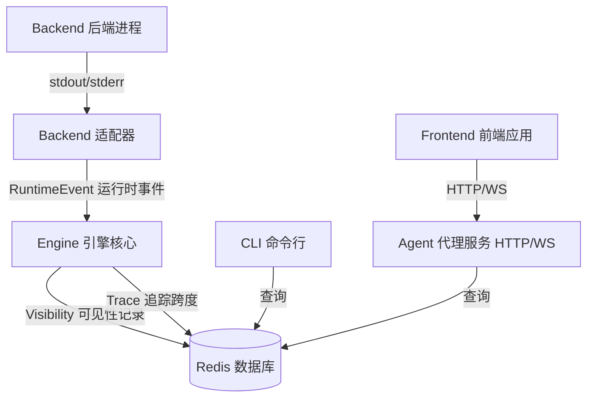

# Visibility 可见性 & Trace 追踪指南

**版本**: 1.0
**最后更新**: 2026-04-27
**状态**: 活动

---

## 1. 概述

### 目的

本指南为 Iota 的可见性和追踪系统提供全面的文档，该系统记录所有组件（Engine 引擎、CLI 命令行界面、Agent 代理服务、App Web 应用）的执行遥测、跨度、Token 令牌使用、Memory 记忆提取和 Event 事件映射。

### 什么是 Visibility 可见性？

**Visibility 可见性**是 Iota 的可观测性层，用于捕获：
- **执行元数据**：Session 会话 ID、执行 ID、Backend 后端、状态、时间戳
- **Trace 追踪跨度**：操作的分层时间分解
- **Token 令牌使用**：输入/输出/缓存令牌，具有原生后端置信度
- **Memory 记忆提取**：从执行输出中检测到的记忆记录
- **Event 事件映射**：原生后端事件如何映射到运行时事件
- **原生事件**：带有哈希和预览的原始后端协议消息

### 什么是 Trace 追踪？

**Trace 追踪**指在执行期间显示操作之间的时间和关系的分层 Span 跨度树。每个跨度具有：
- 唯一跨度 ID
- 父跨度 ID（用于层次结构）
- 操作名称（例如 `engine.request`、`backend.spawn`、`adapter.parse`）
- 状态（`ok`、`error`）
- 持续时间（毫秒）
- 元数据（例如 `exitCode`、`lineCount`、`byteLength`）

---

## 2. 架构

### 数据流



### 存储模式

所有可见性数据存储在 Redis 中，使用以下键模式：

| 键模式 | 类型 | 用途 |
|-------------|------|---------|
| `iota:visibility:context:<executionId>` | String (JSON) | Context 清单（ContextManifest） |
| `iota:visibility:memory:<executionId>` | String (JSON) | Memory 记忆可见性（MemoryVisibilityRecord） |
| `iota:visibility:tokens:<executionId>` | String (JSON) | Token 令牌账本（TokenLedger） |
| `iota:visibility:link:<executionId>` | String (JSON) | 协议链路数据（LinkVisibilityRecord） |
| `iota:visibility:spans:<executionId>` | List | Trace 追踪跨度（JSON 列表） |
| `iota:visibility:<executionId>:chain` | Hash | spanId → TraceSpan 索引 |
| `iota:visibility:mapping:<executionId>` | List | Event 事件映射记录 |
| `iota:visibility:session:<sessionId>` | Sorted Set | 按时间戳排序的 execution 索引 |

---

## 3. Visibility 可见性记录结构

### 完整可见性记录

```typescript
interface VisibilityRecord {
  executionId: string;
  sessionId: string;
  backend: BackendName;
  status: "completed" | "failed" | "interrupted";
  startTime: number;
  endTime: number;
  durationMs: number;
  
  // Prompt and output
  prompt: string;
  promptPreview: string;  // First 200 chars
  outputPreview: string;  // First 500 chars
  
  // Token usage
  tokens: {
    input: number;
    output: number;
    cached: number;
    total: number;
    confidence: "native" | "mixed" | "estimated";
  };
  
  // Trace spans
  spans: TraceSpan[];
  rootSpanId: string;
  
  // Memory extraction
  memory: MemoryVisibilityRecord[];
  
  // Native events
  nativeEvents: NativeEventRecord[];
  
  // Event mappings
  eventMappings: EventMappingVisibility[];
  
  // Metadata
  workingDirectory: string;
  traceId: string;
}
```

### TraceSpan 追踪跨度

```typescript
interface TraceSpan {
  spanId: string;
  parentSpanId?: string;
  name: string;  // e.g., "engine.request", "backend.spawn"
  status: "ok" | "error";
  startTime: number;
  endTime: number;
  durationMs: number;
  metadata: Record<string, unknown>;
}
```

### Token 令牌使用

```typescript
interface TokenUsage {
  input: number;           // Input tokens
  output: number;          // Output tokens
  cached: number;          // Cache read tokens
  total: number;           // Total tokens
  confidence: "native" | "mixed" | "estimated";
}
```

### Memory 记忆可见性记录

```typescript
interface MemoryVisibilityRecord {
  type: "user" | "feedback" | "project" | "reference";
  name: string;
  description: string;
  content: string;
  extractedAt: number;
  confidence: number;  // 0.0 - 1.0
}
```

### 原生 Event 事件记录

```typescript
interface NativeEventRecord {
  eventId: string;
  type: "stdin" | "stdout" | "stderr";
  parsed: boolean;
  sequence?: number;
  hash: string;          // First 12 chars of SHA-256
  preview: string;       // First 200 chars
  timestamp: number;
}
```

### Event 事件映射可见性

```typescript
interface EventMappingVisibility {
  nativeEventId: string;
  runtimeEventType: RuntimeEventType;
  sequence: number;
  mappingRule: string;   // e.g., "gemini_native_mapper" or "hermes_native_mapper"; ACP adapters share the ACP event mapper
  lossy: boolean;        // Whether information was lost in mapping
}
```

---

## 4. CLI 使用

### `iota trace` — 查询 Trace 追踪跨度

显示执行的分层追踪树：

```bash
iota trace <executionId>
```

**示例输出**：
```
Trace: 48524ae7-1e59-4235-a621-791374e2f301
Execution: fe43a03e-b344-4504-a922-8dc1832cfca9
Backend: claude-code
Command: legacy native example: claude --print --output-format stream-json --verbose --bare --permission-mode auto; ACP examples use gemini --acp / hermes acp / opencode acp or adapter-backed npx shims
Protocol: stream-json (legacy native fallback; ACP executions show protocol=acp)
Process: pid=38172 exit=0
Tokens: input=4,220 output=39 total=4,259 confidence=native

Spans:
  d41f6cfb-cbb engine.request ok 2,861ms prompt="ping" status="completed" eventCount=8 outputChars=6
  7edc0692-079 parent=d41f6cfb-cbb engine.context.build ok 1ms
  3977b4b9-170 parent=d41f6cfb-cbb workspace.scan ok 10ms directory="D:\\coding\\creative\\iota\\iota-cli" fileCount=18
  112bc121-e85 parent=d41f6cfb-cbb event.persist ok 2,839ms count=8 lastSequence=8
  b76d1346-d00 parent=d41f6cfb-cbb backend.spawn ok 2,658ms executable="C:\\Users\\feuye\\.local\\bin\\claude.EXE" args=["--print","--output-format","stream-json","--verbose","--bare","--permission-mode","auto"] exitCode=0 signal=null
  afe8f53b-c46 parent=d41f6cfb-cbb backend.stdin.write ok 0ms byteLength=5
  5dcbb52a-863 parent=d41f6cfb-cbb backend.stderr.read ok 2,657ms byteLength=0
  49a5ece4-33e parent=d41f6cfb-cbb backend.stdout.read ok 2,657ms lineCount=4
  f918dae2-10e parent=d41f6cfb-cbb adapter.parse ok 0ms lineLength=780 mappingRule="claude-code_native_mapper" eventType="extension"
  63f0417b-651 parent=d41f6cfb-cbb adapter.parse ok 0ms lineLength=676 mappingRule="claude-code_native_mapper" eventType="extension"
  8466ed8d-90c parent=d41f6cfb-cbb adapter.parse ok 0ms lineLength=438 mappingRule="claude-code_native_mapper" eventType="extension"
  05be2c65-d4b parent=d41f6cfb-cbb adapter.parse ok 0ms lineLength=927 mappingRule="claude-code_native_mapper" eventType="output"
  6104d16f-91e parent=d41f6cfb-cbb memory.extract ok 0ms extracted=false

Native Events:
  stdin-fe43a0 stdin hash=1146a4c81194 preview="ping\n"
  4217bc34-cbc stdout parsed=extension seq=4 hash=6490ab9b6df2 preview="{\"type\":\"system\",\"subtype\":\"init\",\"cwd\":\"D:\\\\coding\\\\creative\\\\iota\\\\iota-cli\",\"session_id\":\"6b743276-0a89-469b-a8f2-c922e6d5fe91\",\"tools\":[\"Bash\",\"Edit\",\"Read\"],\"mcp_servers\":[],\"model\":\"MiniMax-M2.7\",\"permissionMode\":\"default\",\"slash_comm…"
  cac90737-5b6 stdout parsed=extension seq=5 hash=471ac96d0633 preview="{\"type\":\"assistant\",\"message\":{\"id\":\"063e3d0cf9f660e84cc72c1a9bc1041a\",\"type\":\"message\",\"role\":\"assistant\",\"content\":[{\"type\":\"thinking\",\"thinking\":\"The user is sending a simple \\\"ping\\\" message. This is a basic check to see if I'm responsi…"
  aa7743c6-01b stdout parsed=extension seq=6 hash=c1076e532c7a preview="{\"type\":\"assistant\",\"message\":{\"id\":\"063e3d0cf9f660e84cc72c1a9bc1041a\",\"type\":\"message\",\"role\":\"assistant\",\"content\":[{\"type\":\"text\",\"text\":\"\\n\\npong\"}],\"model\":\"MiniMax-M2.7\",\"stop_reason\":null,\"stop_sequence\":null,\"usage\":{\"input_tokens\":…"
  ce5a8308-363 stdout parsed=output seq=7 hash=60ff0889f0f0 preview="{\"type\":\"result\",\"subtype\":\"success\",\"is_error\":false,\"api_error_status\":null,\"duration_ms\":2273,\"duration_api_ms\":2253,\"num_turns\":1,\"result\":\"\\n\\npong\",\"stop_reason\":\"end_turn\",\"session_id\":\"6b743276-0a89-469b-a8f2-c922e6d5fe91\",\"total_co…"

Runtime Mappings:
  4217bc34-cbc -> extension seq=4 rule=claude-code_native_mapper lossy=false
  cac90737-5b6 -> extension seq=5 rule=claude-code_native_mapper lossy=false
  aa7743c6-01b -> extension seq=6 rule=claude-code_native_mapper lossy=false
  ce5a8308-363 -> output seq=7 rule=claude-code_native_mapper lossy=false
```

### `iota visibility` — Visibility 可见性数据检查

#### 列出最近的执行

```bash
iota visibility list [--limit 10]
```

**输出**：
```
Recent Executions:
  fe43a03e-b344-4504-a922-8dc1832cfca9  claude-code  completed  2,861ms  4,259 tokens  "ping"
  bd5755f2-8753-473e-bf2c-2bad83be7172  hermes       completed  9,294ms  6,970 tokens  "ping"
  3b532ada-a8ad-46e0-8c74-e8dc56997a50  gemini       completed  650,325ms  162,750 tokens  "ping"
```

#### 按 Prompt 提示词搜索

```bash
iota visibility search "2+2"
```

#### 交互式实时视图

```bash
iota visibility interactive
```

每 2 秒轮询 Redis 并实时显示新执行。

---

## 5. Agent HTTP 协议 API

### 获取完整可见性包

```http
GET /api/v1/executions/:executionId/visibility
```

**响应**：
```json
{
  "executionId": "fe43a03e-b344-4504-a922-8dc1832cfca9",
  "sessionId": "b9867840-7f6a-421d-b2fd-980375895094",
  "backend": "claude-code",
  "status": "completed",
  "startTime": 1745750394000,
  "endTime": 1745750396861,
  "durationMs": 2861,
  "prompt": "ping",
  "promptPreview": "ping",
  "outputPreview": "\n\npong",
  "tokens": {
    "input": 4220,
    "output": 39,
    "cached": 0,
    "total": 4259,
    "confidence": "native"
  },
  "spans": [...],
  "nativeEvents": [...],
  "eventMappings": [...]
}
```

### 仅获取 Token 令牌使用

```http
GET /api/v1/executions/:executionId/visibility/tokens
```

**响应**：
```json
{
  "executionId": "fe43a03e-b344-4504-a922-8dc1832cfca9",
  "tokens": {
    "input": 4220,
    "output": 39,
    "cached": 0,
    "total": 4259,
    "confidence": "native"
  }
}
```

### 获取 Memory 记忆提取

```http
GET /api/v1/executions/:executionId/visibility/memory
```

**响应**：
```json
{
  "executionId": "fe43a03e-b344-4504-a922-8dc1832cfca9",
  "memory": [
    {
      "type": "user",
      "name": "user_role",
      "description": "User is a senior backend engineer",
      "content": "...",
      "extractedAt": 1745750396000,
      "confidence": 0.95
    }
  ]
}
```

### 获取 Trace 追踪链

```http
GET /api/v1/executions/:executionId/visibility/chain
```

返回按执行顺序排列的跨度平面列表。

### 获取分层 Trace 追踪树

```http
GET /api/v1/executions/:executionId/trace
```

返回具有父子关系的嵌套树结构。

### 会话级可见性

```http
GET /api/v1/sessions/:sessionId/visibility
```

返回会话中所有执行的聚合可见性。

---

## 6. Agent WebSocket 协议 API

### 订阅 Visibility 可见性更新

**客户端 → 服务器**：
```json
{
  "type": "subscribe_visibility",
  "executionId": "fe43a03e-b344-4504-a922-8dc1832cfca9"
}
```

**服务器 → 客户端**（确认）：
```json
{
  "type": "subscribed_visibility",
  "executionId": "fe43a03e-b344-4504-a922-8dc1832cfca9"
}
```

**服务器 → 客户端**（更新）：
```json
{
  "type": "visibility_snapshot",
  "executionId": "fe43a03e-b344-4504-a922-8dc1832cfca9",
  "data": {
    "tokens": { "input": 4220, "output": 39, "total": 4259 },
    "spans": [...],
    "status": "completed"
  }
}
```

---

## 7. App 应用集成

### 在前端消费可见性数据

App 应用通过 Agent 代理的 HTTP 和 WebSocket API 消费可见性数据：

1. **初始加载**：通过 HTTP 获取完整可见性包
2. **实时更新**：通过 WebSocket 订阅可见性更新
3. **显示**：渲染 Token 令牌使用、追踪时间线、Memory 记忆提取

**React Hook 示例**：
```typescript
function useExecutionVisibility(executionId: string) {
  const [visibility, setVisibility] = useState<VisibilityRecord | null>(null);
  
  useEffect(() => {
    // Initial fetch
    fetch(`/api/v1/executions/${executionId}/visibility`)
      .then(r => r.json())
      .then(setVisibility);
    
    // Subscribe to updates
    const ws = new WebSocket('/api/v1/stream');
    ws.onopen = () => {
      ws.send(JSON.stringify({
        type: 'subscribe_visibility',
        executionId
      }));
    };
    ws.onmessage = (event) => {
      const msg = JSON.parse(event.data);
      if (msg.type === 'visibility_snapshot') {
        setVisibility(prev => ({ ...prev, ...msg.data }));
      }
    };
    
    return () => ws.close();
  }, [executionId]);
  
  return visibility;
}
```

---

## 8. Engine 引擎实现

### 记录可见性

可见性在 `src/visibility/redis-store.ts` 中记录。实际代码将各组件拆分存储到独立 Redis 键：

```typescript
class RedisVisibilityStore {
  // Context 清单
  async saveContext(manifest: ContextManifest): Promise<void> {
    const key = `iota:visibility:context:${manifest.executionId}`;
    await this.client.set(key, JSON.stringify(manifest));
  }

  // Memory 可见性
  async saveMemory(record: MemoryVisibilityRecord): Promise<void> {
    const key = `iota:visibility:memory:${record.executionId}`;
    await this.client.set(key, JSON.stringify(record));
  }

  // Token 账本
  async saveTokens(ledger: TokenLedger): Promise<void> {
    const key = `iota:visibility:tokens:${ledger.executionId}`;
    await this.client.set(key, JSON.stringify(ledger));
  }

  // Link 记录
  async saveLink(record: LinkVisibilityRecord): Promise<void> {
    const key = `iota:visibility:link:${record.executionId}`;
    await this.client.set(key, JSON.stringify(record));
  }

  // Trace span
  async saveSpan(span: TraceSpan): Promise<void> {
    const spansKey = `iota:visibility:spans:${span.executionId}`;
    const chainKey = `iota:visibility:${span.executionId}:chain`;
    await this.client.rpush(spansKey, JSON.stringify(span));
    await this.client.hset(chainKey, span.spanId, JSON.stringify(span));
  }

  // Event 映射
  async saveMapping(mapping: EventMappingVisibility): Promise<void> {
    const key = `iota:visibility:mapping:${mapping.executionId}`;
    await this.client.rpush(key, JSON.stringify(mapping));
  }

  // Session 索引
  async indexExecution(sessionId: string, executionId: string, timestamp: number): Promise<void> {
    const key = `iota:visibility:session:${sessionId}`;
    await this.client.zadd(key, timestamp, executionId);
  }
}
```

### Span 跨度记录

跨度使用 `src/visibility/trace.ts` 中的 `TraceRecorder` 追踪记录器记录：

```typescript
class TraceRecorder {
  startSpan(name: string, parentSpanId?: string): string {
    const spanId = generateSpanId();
    const span: TraceSpan = {
      spanId,
      parentSpanId,
      name,
      status: 'ok',
      startTime: Date.now(),
      endTime: 0,
      durationMs: 0,
      metadata: {}
    };
    this.activeSpans.set(spanId, span);
    return spanId;
  }
  
  endSpan(spanId: string, status: 'ok' | 'error', metadata?: Record<string, unknown>): void {
    const span = this.activeSpans.get(spanId);
    if (!span) return;
    
    span.endTime = Date.now();
    span.durationMs = span.endTime - span.startTime;
    span.status = status;
    if (metadata) {
      span.metadata = { ...span.metadata, ...metadata };
    }
    
    this.completedSpans.push(span);
    this.activeSpans.delete(spanId);
  }
}
```

---

## 9. 常见 Span 跨度名称

| Span 跨度名称 | 描述 | 父节点 |
|-----------|-------------|--------|
| `engine.request` | 顶层执行请求 | （根） |
| `engine.context.build` | 构建执行上下文 | `engine.request` |
| `workspace.scan` | 扫描工作目录 | `engine.request` |
| `backend.spawn` | 生成 per-execution 后端子进程（legacy native） | `engine.request` |
| `backend.stdin.write` | 写入提示词到标准输入 | `engine.request` |
| `backend.stdout.read` | 从后端读取标准输出 | `engine.request` |
| `backend.stderr.read` | 从后端读取标准错误 | `engine.request` |
| `adapter.parse` | 解析原生事件到运行时事件 | `engine.request` |
| `memory.extract` | 从输出提取记忆 | `engine.request` |
| `event.persist` | 持久化事件到 Redis | `engine.request` |
| `backend.resolve` | 从池中解析后端；长运行 ACP 进程也使用该 span 标记 warm process 状态 | `engine.request` |

---

## 10. Token 令牌置信度级别

| 置信度 | 含义 |
|------------|---------|
| `native` | 后端通过原生协议提供精确令牌计数 |
| `mixed` | 部分后端提供原生计数，部分由引擎估算 |
| `estimated` | 引擎使用启发式方法估算令牌（例如字符数 / 4） |

**Backend 后端 Token 令牌支持**：
- **ACP 后端**：优先读取 `session/complete.usage` 或 ACP response usage 字段，包括 `reasoningTokens`
- **Claude Code native fallback**：`native`（在 `result` 事件中的 usage）
- **Codex native fallback**：`native`（在 `turn.completed` / result usage）
- **Gemini native fallback**：`native`（在 result/stats usage）
- **Hermes/OpenCode ACP**：通过 ACP usage 字段或启发式估算补齐

---

## 11. 故障排除

### 问题：Trace 追踪数据缺失

**症状**：`iota trace <executionId>` 返回空或不完整的数据。

**原因**：
1. 执行在可见性记录之前失败
2. 执行期间 Redis 连接丢失
3. 执行 ID 不正确

**解决方案**：
1. 检查执行状态：`iota logs <executionId>`
2. 验证 Redis 连接：`redis-cli ping`
3. 列出最近的执行：`iota visibility list`

### 问题：Token 令牌计数显示为零

**症状**：令牌使用所有字段显示 `0`。

**原因**：
1. 后端不支持原生令牌报告
2. 后端响应不包含使用字段
3. 适配器未能从原生事件解析使用情况

**解决方案**：
1. 检查后端适配器实现的令牌提取
2. 检查原生事件：`iota trace <executionId>` → Native Events 部分
3. 验证后端协议包含使用信息

### 问题：Span 跨度缺少父关系

**症状**：Trace 追踪树显示平面列表而不是层次结构。

**原因**：
1. 父跨度 ID 未正确设置
2. 跨度记录顺序问题
3. Redis 持久化失败

**解决方案**：
1. 检查 `TraceRecorder.startSpan()` 调用包含 `parentSpanId`
2. 验证跨度按正确顺序记录
3. 检查 Redis 日志的持久化错误

---

## 12. 最佳实践

### 对于 Engine 引擎开发者

1. **始终为重要操作记录跨度**（>10ms 或 I/O 操作）
2. **在跨度上设置有意义的元数据**（例如 `exitCode`、`lineCount`、`byteLength`）
3. **使用一致的跨度命名**（遵循常见跨度名称表）
4. **记录带哈希的原生事件**用于调试和重放
5. **从原生后端响应提取令牌**（当可用时）

### 对于 Agent 代理开发者

1. **缓存可见性数据**以减少 Redis 查询
2. **使用 WebSocket 订阅**进行实时更新而不是轮询
3. **在 UI 中分页大型追踪树**（>100 个跨度）
4. **聚合会话级可见性**用于多执行视图
5. **在可见性预览中编辑敏感数据**

### 对于 App 应用开发者

1. **增量获取可见性**（首先令牌，然后跨度，然后事件）
2. **可视化渲染追踪时间线**（甘特图或火焰图）
3. **突出显示令牌成本**以提高用户意识
4. **突出显示记忆提取**（当可用时）
5. **提供追踪导出功能**（JSON、CSV）

---

## 13. 未来增强

### 计划功能

- **跨 Agent → Engine → Backend 的分布式追踪**
- **Trace 追踪采样**用于高容量生产环境
- **Trace 追踪聚合**和分析（P50/P95/P99 延迟）
- **成本跟踪**基于令牌使用和模型定价
- **Trace 追踪比较工具**用于 A/B 测试后端
- **重放功能**使用原生事件和哈希

### 考虑中

- **OpenTelemetry 集成**用于外部可观测性平台
- **Trace 追踪可视化 UI**在 App 中（火焰图、瀑布图）
- **异常检测**用于异常令牌使用或延迟
- **Trace 追踪保留策略**（自动过期旧追踪）

---

## 14. 相关文档

- [CLI 指南](./01-cli-guide.md) — 追踪和可见性的 CLI 命令
- [Agent 指南](./03-agent-guide.md) — HTTP 和 WebSocket API
- [Engine 指南](./05-engine-guide.md) — 实现详情
- [架构概述](./00-architecture-overview.md) — 系统级可见性流程

---

## 15. 附录：示例 Trace 追踪文件

以下追踪文件展示了当前已验证后端的真实执行追踪；ACP OpenCode 需要安装后补充：

- `iota-cli/claude-code.trace` — Claude Code 执行，使用 MiniMax-M2.7
- `iota-cli/codex.trace` — Codex 执行，使用 9Router
- `iota-cli/gemini.trace` — Gemini 执行，具有广泛的工具使用
- `iota-cli/hermes.trace` — Hermes 执行，使用 MiniMax 提供者
- `iota-cli/opencode.trace` — OpenCode ACP 执行（待真实后端验证）

这些文件使用以下命令生成：
```bash
iota run --backend <name> --trace "2+2等于几？" > <name>.trace 2>&1
```

每个追踪文件包含完整的可见性记录，包括跨度、原生事件和运行时映射。
