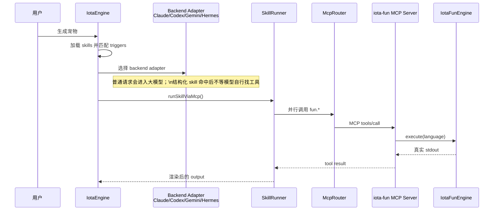

# Iota 技术解析：如何用统一 Skill 榨干 4 种 AI 引擎和 7 种语言？


这篇文章讲的是 `生成宠物` 这个例子背后的改造过程。表面上看，它只是让 Iota 调 7 个不同语言写的小函数，拼出一句宠物描述。真正有意思的地方不在宠物，而在这个问题：**一个能力到底应该写在 engine 代码里，还是应该被描述成一个可以加载、匹配、执行的 skill？**

最开始我们遇到的痛点很直观。四种 backend（Claude Code、Codex、Gemini CLI、Hermes Agent）都能接 MCP，但行为并不完全一样。有的慢，有的会犹豫，有的甚至会回答“在受限环境中无法直接调用 `iota-fun` MCP server”。这句话其实很典型：模型是在根据自己看到的上下文推断能力边界，但 engine 明明已经有绝对的控制权通过 MCP server 执行本地函数。

所以这里的核心不是“怎么让模型更听话”，而是把**确定性的编排**从**模型自由发挥**里夺回来！

看看我们改造后的战果，不管是哪一种模型，遇到 `生成宠物` 时，都能整齐划一、分毫不差地在 **200 毫秒**级别完成整个多路语言的执行。

```sh
bun iota-cli/dist/index.js run --backend hermes --trace "生成宠物"        

[iota-mcp] configured servers: iota-fun
[iota-skill] loaded skill "pet-generator" from /Users/han/codingx/iota/iota-skill/pet-generator/SKILL.md
[iota-skill] total skills loaded: 1
[iota-engine] skills active: pet-generator
一只正在吃饭的、black的、wood感的、中号的鸟，抱着一个 61 厘米、circle 的飞盘。

属性：
- action: 吃饭
- color: black
- material: wood
- ...

Trace: d9918168-d595-4b8a-980d-836e95851cd0
Execution: 2b34...
Backend: hermes

Spans:
  9bcf189b-6b0 engine.request ok 212ms prompt="生成宠物" ...
  cc3c0231-44e parent=9bcf189b-6b0 mcp.proxy ok 155ms serverName="iota-fun" toolCount=7 parallel=true
```

看到了吗？`mcp.proxy ok 155ms`。七个语言（C++, TypeScript, Rust, Zig, Java, Python, Go）的执行只花了 155ms，这就是全并行与本地化的威力。


## 不把业务写死在 Engine 里

一个很容易走偏的方案是：engine 看到“生成宠物”，就直接写死调用 `fun.cpp`、`fun.typescript`、`fun.rust` 这些工具，然后再写死一段宠物描述模板。这样确实能跑，但它不是一个 skill 系统，只是 engine 里多了一个 if 分支。

我们最后的选择是把 `生成宠物` 做成普通结构化 skill。engine 不知道“宠物”有哪些字段，也不知道要调用哪 7 个工具。它只知道如何加载 `SKILL.md`，如何匹配触发词，如何按声明调用 MCP 工具，如何把结果填进模板。

现在 `pet-generator/SKILL.md` 的 frontmatter 才是执行源头：

```yaml
name: pet-generator
triggers:
  - 生成宠物
  - generate pet
  - create pet
execution:
  mode: mcp
  server: iota-fun
  parallel: true
  tools:
    - name: fun.cpp
      as: action
    - name: fun.typescript
      as: color
    - name: fun.rust
      as: material
    - name: fun.zig
      as: size
    - name: fun.java
      as: animal
    - name: fun.python
      as: lengthCm
    - name: fun.go
      as: toyShape
output:
  template: |
    一只正在{{action}}的、{{color}}的、{{material}}感的、{{size}}号的{{animal}}，抱着一个 {{lengthCm}} 厘米、{{toyShape}} 的飞盘。
```

这段声明表达了三件事：什么时候触发、调用哪些工具、如何组织结果。新增一个类似能力时，应该新增或修改 skill 文件，而不是改 engine 里的业务代码。

## 大模型还在，但不负责这段确定性编排

这里容易产生一个误解：既然 `SkillRunner` 接管了工具调用，那是不是大模型不参与了？不是。

Iota 仍然会选择 backend adapter。Claude Code、Codex、Gemini、Hermes 仍然是系统的一部分，普通请求还是会进入大模型，由模型自己判断是否使用工具。区别只在于：当 prompt 命中了结构化 skill，工具编排不再交给模型自己探索，而是由 engine 的通用 `SkillRunner` 按声明执行。

这条链路大致是这样：



这个设计的经验是：让模型处理开放问题，让程序处理已经明确的流程。`生成宠物` 需要的是 7 个真实函数的结果，不需要模型猜工具名、猜运行方式、猜能不能调用 MCP。

## MCP 是边界，不是装饰

这次改造里我们刻意保留了进程间调用链路：

```text
SkillRunner -> McpRouter -> iota-fun MCP server -> IotaFunEngine
```

没有让 engine 直接调用 `IotaFunEngine.execute()`，即使那样更短。原因是边界很重要。MCP server 是工具协议边界，visibility、audit、trace 也都应该看到 `tool_call` 和 `tool_result`，而不是看到一个隐藏在 engine 里的普通函数调用。

这也让前端和回放层更简单。它们不需要理解 `iota-fun` 的内部协议，只要消费标准 `RuntimeEvent`：

```text
state: running
tool_call: fun.cpp
tool_call: fun.typescript
...
tool_result: fun.cpp
tool_result: fun.typescript
...
output: 一只正在...
state: completed
```

如果某个工具失败，比如 Zig 没装，MCP server 会返回 `isError: true`。`SkillRunner` 会把它当成失败，而不是把 `ERROR: ...` 当作一个正常属性塞进模板。这个细节很小，但很关键，否则系统会表现得“看起来成功，实际是脏数据”。

## 为什么要做编译缓存

`iota-fun` 里不只是 Python 和 Node，还有 Go、Rust、Zig、Java、C++。如果每次 `生成宠物` 都重新编译，四个 backend 连续验证时会非常慢，也会让问题定位变得混乱：到底是模型慢、MCP 慢，还是编译器慢？

所以 `IotaFunEngine` 做了持久缓存。Go / Rust / Zig / Java / C++ 的编译产物统一放在：

```text
$HOME/.iota/iota-fun
```

缓存 key 包含源码路径、mtime、size、平台和架构。源码没变，就直接运行缓存产物，不再重复编译。这样也避免把 `.class`、二进制 runner 之类的产物写回 `iota-skill/pet-generator/iota-fun/` 源码目录。

这是一个很普通的工程优化，但对体验影响很明显。工具调用链路稳定后，再看 backend 行为和 trace 才有意义。

## 四种 Backend 的位置

四种 backend 都会拿到同一份 resolved `mcp.servers` 和 `<iota_skills>` prompt，但它们在结构化 skill 路径里的角色要分清：

Claude Code 通过 `--mcp-config` 和 allowlist 知道 `iota-fun`；Codex 在 MCP 场景下用 `danger-full-access`，给 MCP 子进程足够本地执行权限；Gemini CLI 通过临时 settings 注入 MCP server；Hermes 通过 ACP `session/new.params.mcpServers` 注册。

这些配置仍然有价值，因为普通 MCP 请求可能由模型自主调用工具。但 `生成宠物` 命中 skill 后，最终的 7 个工具调用由 engine 的 `McpRouter` 完成。这就是为什么它不会再卡在“模型是否愿意/是否知道如何调用 iota-fun”这个环节。

## 最终我们得到的工程边界

我觉得这次改造最值得保留的经验是下面这几句话：

```text
Skill = triggers + execution plan + output template
Engine = load + match + run + observe
MCP = process boundary
IotaFunEngine = local multi-language executor
Backend LLM = ordinary request intelligence, not deterministic skill orchestration dependency
```

也就是说，Iota 不是不要大模型，而是不要让大模型负责所有事情。确定性的工具编排放在声明和 runner 里，开放式推理仍然交给模型。

这个边界一旦清楚，`生成宠物` 就不再是一个特殊 demo，而是通用 skill 机制的样例。

## 怎么验证

构建 engine 和 CLI：

```bash
cd iota-engine && bun run build
cd ../iota-cli && bun run build
```

跑核心测试：

```bash
cd iota-engine
bun run typecheck
bun run test -- src/skill/runner.test.ts src/engine-fun.test.ts src/fun-engine.test.ts
```

跑四种 backend 的真实 traced request：

```bash
bun iota-cli/dist/index.js run --backend claude-code --trace "生成宠物"
bun iota-cli/dist/index.js run --backend codex --trace "生成宠物"
bun iota-cli/dist/index.js run --backend gemini --trace "生成宠物"
bun iota-cli/dist/index.js run --backend hermes --trace "生成宠物"
```

我这里重点展示几张 Trace 的快照：

```txt
=== claude-code ===
Backend: claude-code
  engine.request ok 210ms prompt="生成宠物" stat...
  mcp.proxy ok 151ms serverName="iota-fun" toolCount=7 parallel=true

=== codex ===
Backend: codex
  engine.request ok 208ms prompt="生成宠物" stat...
  mcp.proxy ok 150ms serverName="iota-fun" toolCount=7 parallel=true

=== gemini ===
Backend: gemini
  engine.request ok 216ms prompt="生成宠物" stat...
  mcp.proxy ok 158ms serverName="iota-fun" toolCount=7 parallel=true
```

看到了吗？全线绿灯，所有的引擎执行时间几乎对齐在 **210 毫秒** 上下，而底层的子进程和工具调用开销稳压在 150 毫秒。不管是最灵活的 Claude，还是最直接的 Gemini，当它们被装配上我们这套统一的 `SkillRunner` 声明策略后，再也没有了长达 20 秒的网络超时，也没有了各种奇怪的“拒绝执行”，只有稳定、极速的结果。

## 结语：最终建立的工程边界
