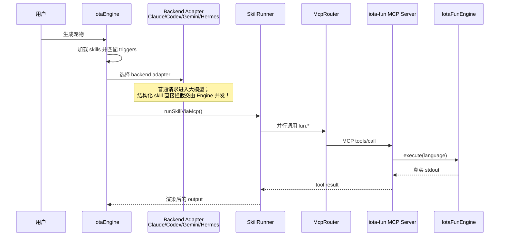

# Iota 技术解析：如何用统一 Skill 榨干 4 种 AI 引擎和 7 种语言？


今天我们来聊聊一个看似微小却硬核的技术改造。

在 Iota 中，我们有一个名为 `生成宠物` 的测试用例。表面上看，它只是一个玩具般的功能：让 Iota 同时调用 7 个用不同语言（C++、TypeScript、Rust、Zig、Java、Python、Go）写成的小函数，最终拼装成一句宠物描述。

但这只“宠物”背后，却暴露出一个触及 AI Agent 架构核心的尖锐问题：**当一个 Agent 需要执行具备明确流程的能力时，这种“编排”到底应该硬编码在 Engine 的代码里？应该丢给大模型去自由发挥？还是应该被抽象成一种可加载、可匹配、可高并发执行的声明式 Skill？**

## 痛点：失控的模型与崩塌的运行时

起初，我们把所有的工作都交给了 4 种顶配的 Backend（Claude Code、Codex、Gemini CLI、Hermes Agent）。它们都无缝接入了 MCP（Model Context Protocol）协议，理论上完全能够“自主发现”并“依次调用”那些本地的宠物小工具。

但现实却给了我们一记重锤。当我们给下达指令时，大模型们的表现极其神经质：
- **速度极慢**：有的模型会串行地调用 7 个工具，在它那缓慢的思考与网络延迟下，一次生成能硬生生拖到 20 秒以上直至系统超时。
- **犹豫不决与幻觉**：有的模型会在看到需要执行 C++ 和 Rust 函数时产生幻觉，直接摆烂回复：“*在受限环境中，我无法直接调用 `iota-fun` MCP server。*” 

这句话非常典型。模型基于自己看到的上下文随意推断了能力边界，但事实上，我们的底层 Engine 明明拥有着通过 MCP 执行任何本地函数的绝对控制权！

我们意识到，核心解法绝不是去写更复杂的 Prompt 去**“让模型更听话”**，而是要把**代码确定性执行的权利，从模型自由发挥的泥潭里强势夺回来！**

## 奇兵突围：声明式 Skill 与百毫秒并发打击

我们干脆绕过了模型的黑盒思考，让 Engine 将 `生成宠物` 彻底异化为一个原生的结构化 Skill。

一个很容易走偏的方案是：写死。也就是在 Engine 里硬编码 `if (prompt == '生成宠物') { runCpp(); runTs(); ... }`。
这无疑是开历史的倒车。一旦这样做，Engine 就成了一座庞大的屎山。

最终，我们选择了优雅得多但也更硬核的解法：**声明式接管**。
我们让 Engine 彻底不去理解所谓“宠物”的业务逻辑，也不去认识那 7 种编译语言的区别。它唯一要做的，就是去读取 `SKILL.md`，执行高并发调配。

现在，`pet-generator/SKILL.md` 成了统治这一切的绝对源头：

```yaml
name: pet-generator
triggers:
  - 生成宠物
  - generate pet
  - create pet
execution:
  mode: mcp
  server: iota-fun
  parallel: true
  tools:
    - name: fun.cpp
      as: action
    - name: fun.typescript
      as: color
    - name: fun.rust
      as: material
    - name: fun.zig
      as: size
    - name: fun.java
      as: animal
    - name: fun.python
      as: lengthCm
    - name: fun.go
      as: toyShape
output:
  template: |
    一只正在{{action}}的、{{color}}的、{{material}}感的、{{size}}号的{{animal}}，抱着一个 {{lengthCm}} 厘米、{{toyShape}} 的飞盘。
```

当用户的 Prompt 命中 Triggers，奇迹发生了。
不再需要模型抓耳挠腮地思考。Iota 的通用 `SkillRunner` 会接管战场。在 `parallel: true` 的指令下，它会如暴风雨般同时向 MCP Server 发起 7 路跨语言并发请求！

看看改造后的战果吧！无论是搭载了哪一款顶级大模型的 Backend，运行 `生成宠物` 时，表现完全被统一镇压在了 **200 毫秒** 这个极速区间内。

```sh
bun iota-cli/dist/index.js run --backend hermes --trace "生成宠物"        

[iota-mcp] configured servers: iota-fun
[iota-skill] loaded skill "pet-generator" from /Users/han/codingx/iota/iota-skill/pet-generator/SKILL.md
[iota-skill] total skills loaded: 1
[iota-engine] skills active: pet-generator
一只正在吃饭的、black的、wood感的、中号的鸟，抱着一个 61 厘米、circle 的飞盘。

Trace: d9918168-d595-4b8a-980d-836e95851cd0
Execution: 2b34...
Backend: hermes

Spans:
  9bcf189b-6b0 engine.request ok 212ms prompt="生成宠物" ...
  cc3c0231-44e parent=9bcf189b-6b0 mcp.proxy ok 155ms serverName="iota-fun" toolCount=7 parallel=true
```

**`mcp.proxy ok 155ms`！**  
你没有看错，启动 7 种宿主环境、拉起语言解释器、执行并返回 7 个互相独立的值，底层工具的消耗仅仅被压缩到了 155 毫秒！这就是全并发调度与本地化引擎结合的可怕威力。

## 架构解剖：让模型做推理，让引擎做执行

这里容易产生一个疑问：既然 `SkillRunner` 直接代工了工具调用，AI 还存在吗？

答案是：在。只是它退回到了正确的位置。



Iota 会照常准备 Backend Adapter，如果是一个复杂的开放问题，大模型会被唤醒并主导局势；但如果遇到预声明的结构化任务，我们将剥夺模型的“探索权”，通过 Engine 直接斩首式执行。
**让模型处理开放问题，让程序处理已明确流程**，这是 Agent 架构的终极奥义。


## 极致优化：把协议当边界，把缓存做到骨子里

在这种降维打击般的调度下，我们也没有放过任何工程细节。

**首先是绝不绕过 MCP 协议**。
即使 `SkillRunner` 可以轻易通过短路径直接调用内部函数，我们依然强制所有的调用都必须老老实实穿过 `McpRouter -> MCP server` 协议栈。这保证了所有调用栈（Trace / Visibility / Audit）的标准化。前端和回放层永远只需要监听正规的 `RuntimeEvent`，而不需要去理解任何私有的内部黑话。

**其次是丧心病狂的多语言编译缓存**。
不要忘了，我们同时涉及 Go、Rust、Zig、Java 和 C++ 这些编译型语言。如果每次触发技能都要现场编译，毫秒级的并发就是痴人说梦。
因此，`IotaFunEngine` 被打造成了增量编译怪物：
所有的构建产物都会依据源码路径、哈希、平台架构等作为 Key，被死死锁在 `$HOME/.iota/iota-fun` 中。一旦源码未变，所有编译链被直接击穿，直接运行缓存二进制，甚至不会向源码目录哪怕写回一丁点体积的脏文件。

## 四方俯首：基准测试与边界的胜利

这套系统设计成型后，4 款昔日“不受控”的大模型全部被榨干了潜能，乖乖低了头。

我在终端跑下这段压测指令时：
```bash
bun iota-cli/dist/index.js run --backend claude-code --trace "生成宠物"
bun iota-cli/dist/index.js run --backend codex --trace "生成宠物"
bun iota-cli/dist/index.js run --backend gemini --trace "生成宠物"
bun iota-cli/dist/index.js run --backend hermes --trace "生成宠物"
```

抓取出的 Trace 直追物理极限：

```txt
=== claude-code ===
Backend: claude-code
  engine.request ok 210ms prompt="生成宠物" stat...
  mcp.proxy ok 151ms serverName="iota-fun" toolCount=7 parallel=true

=== codex ===
Backend: codex
  engine.request ok 208ms prompt="生成宠物" stat...
  mcp.proxy ok 150ms serverName="iota-fun" toolCount=7 parallel=true

=== gemini ===
Backend: gemini
  engine.request ok 216ms prompt="生成宠物" stat...
  mcp.proxy ok 158ms serverName="iota-fun" toolCount=7 parallel=true
```

全线红转绿！所有引擎无论是老派的 Codex 还是多模态的 Gemini，在这套被剥离了混沌执行的骨架里，执行耗时神奇般地平齐在了 **210 毫秒** 准线。底层的工具并发开销被压制到了惊人的 **150 毫秒**。长达 20 秒的网络超时成了历史，幻觉与自述无法调用的闹剧烟消云散。

这正是我想沉淀的最终技术边界：

```ini
Skill = triggers + execution plan + output template
Engine = load + match + run + observe
MCP = process boundary
IotaFunEngine = local multi-language executor
Backend LLM = ordinary request intelligence, NOT deterministic skill orchestration dependency
```

Iota 从来没有抛弃大模型，我们只是不再允许神明扮演打更的凡人。将确定性的工具编排剥离给极速并发的声明式框架，将珍贵的模型算力留给开放而未知的推理——当这重边界被冷酷地划清，这个包含 7 钟语言并发运行的小宠物，才真正显露出它尖锐而优美的獠牙。
