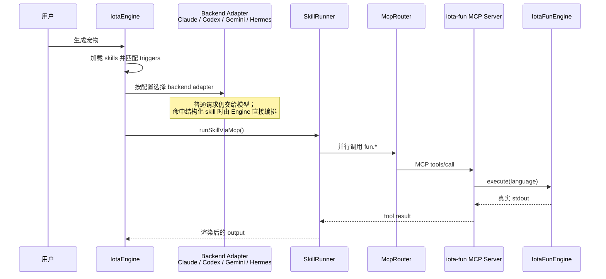

# 把 Skill 从内核里抽出来：一个关于 Iota 的思考笔记


我一直在想一个问题：什么样的 AI 编程助手运行时，才算得上是“可以长期演进”的？

不是某个具体功能做得多花哨，也不是接入了哪个最新的模型，而是它能不能让两件事真正解耦：

1. **底下跑的内核可以换**——今天用 Claude Code，明天换 Codex、Gemini CLI 或 Hermes Agent，整套上层逻辑不需要重写；
2. **上面挂的能力可以用任何语言写**——同一个 skill 里，工具开发者用 C++ 也好，用 Rust、Go、Zig、Java、Python、TypeScript 也罢，都能被同一种方式调用、同一种方式观测。

`生成宠物` 这个 skill 是我用来检验这条思路的最小用例：让 Iota 同时调用 7 个不同语言写的小函数，把结果拼成一句宠物描述。东西很小，但它一次性把上面那两件事都摆到了台面上。

这篇文章是我把这段思考过程整理下来的笔记。

## 1. 让我停下来想一想的现象

最初我把 `生成宠物` 直接交给四种 backend 自己处理：把 7 个工具通过 MCP 暴露出去，让模型自己读说明、自己决定调用顺序，期待它把结果拼起来。

这条路看起来很自然，但跑起来会发现几个问题：

- 不同 backend 速度差异很大，有时一次请求会拖到 20 秒以上才超时返回；
- 有的模型会犹豫，不太确定要不要并行调用；
- 个别模型甚至会回复一句类似“在受限环境中无法直接调用 `iota-fun` MCP server”这样的自述——它其实是从上下文里推断出一个并不存在的能力边界。

我意识到一个关键的事实：**这件事并不需要模型来思考**。
7 个工具该不该调、调多少个、怎么拼接结果，这些早就是确定的；让模型每次重新推理一遍，既慢，又不稳。

真正该追问的，是更上一层的问题：

> 如果同一个能力，跑在不同的 backend 上行为差别这么大，那 skill 这一层就还没真正独立。
> 它仍然依赖模型的“好心情”，而不是依赖 Iota 自己的契约。

换 backend、换语言这两件事，本质上是同一件事——**让能力的定义和执行，独立于具体内核与具体语言**。

## 2. 把 skill 写成声明，而不是写进内核

我做的第一个决定是：不要在 engine 里写任何 `if (prompt === "生成宠物")` 这样的分支。一旦那样做，engine 就重新开始记业务，新增能力时也要回去改它，这是退回老路。

于是 `pet-generator/SKILL.md` 的 frontmatter 就成了这件事的全部源头：

```yaml
name: pet-generator
triggers:
  - 生成宠物
  - generate pet
  - create pet
execution:
  mode: mcp
  server: iota-fun
  parallel: true
  tools:
    - name: fun.cpp
      as: action
    - name: fun.typescript
      as: color
    - name: fun.rust
      as: material
    - name: fun.zig
      as: size
    - name: fun.java
      as: animal
    - name: fun.python
      as: lengthCm
    - name: fun.go
      as: toyShape
output:
  template: |
    一只正在{{action}}的、{{color}}的、{{material}}感的、{{size}}号的{{animal}}，抱着一个 {{lengthCm}} 厘米、{{toyShape}} 的飞盘。
```

这段声明只表达三件事：

- **什么时候该触发我**（triggers）；
- **触发以后要执行什么**（execution.tools，以及是否并行）；
- **结果怎么交付给用户**（output.template）。

engine 不需要知道“宠物有哪些字段”，更不需要知道这 7 个工具背后是 C++ 还是 Java。它的职责被收得很窄：加载 skill、匹配触发词、按声明执行 MCP 工具、把结果填进模板、记录可观测信息。

未来再加一个 skill，比如生成简历、生成测试数据、生成提交说明，工作量都落在新增一个 `SKILL.md` 上，而不是修改 engine。

## 3. 内核可换：四种 backend 跑的是同一个 skill

这是我最在意的部分。

Iota 的设计是：上层的能力定义和编排逻辑，不应该绑定在某一个具体的 backend 上。所以四种 backend 在结构化 skill 路径里，走的是同一条流程：



四种 backend 对 MCP 的接入方式各有不同：Claude Code 通过 `--mcp-config` + allowlist；Codex 通过 `-c mcp_servers.*`；Gemini 通过临时 settings；Hermes 通过 ACP `session/new.params.mcpServers`。这些细节在各自的 adapter 里收住，不外溢。

在 skill 路径下，这些差异从用户和上层应用看不到。SKILL.md 是一份，匹配是一套，执行编排是一套，输出模板是一套——backend 是可替换的内核，但 skill 的形状不会因为换了内核而变形。

落到实测上，四种 backend 跑同一句 `生成宠物` 时表现是这样的：

```txt
=== claude-code ===
  engine.request ok 210ms prompt="生成宠物" status="completed"
  mcp.proxy     ok 151ms serverName="iota-fun" toolCount=7 parallel=true

=== codex ===
  engine.request ok 208ms prompt="生成宠物" status="completed"
  mcp.proxy     ok 150ms serverName="iota-fun" toolCount=7 parallel=true

=== gemini ===
  engine.request ok 216ms prompt="生成宠物" status="completed"
  mcp.proxy     ok 158ms serverName="iota-fun" toolCount=7 parallel=true

=== hermes ===
  engine.request ok 212ms prompt="生成宠物" status="completed"
  mcp.proxy     ok 155ms serverName="iota-fun" toolCount=7 parallel=true
```

四个 backend 都稳定收敛在 200ms 量级，七个工具并行调用部分基本在 150ms 上下。这不是某个 backend 的胜利，而是 skill 这一层不再被 backend 决定行为之后的自然结果。

## 4. 语言无关：工具开发者用什么写都可以

第二件我反复确认的事情是：写工具的人，不应该被某种语言绑死。

`iota-fun` 这一组工具刻意覆盖了七种生态：

| 工具             | 输出字段   | 真实来源               |
| ---------------- | ---------- | ---------------------- |
| `fun.cpp`        | `action`   | `iota-fun/cpp/`        |
| `fun.typescript` | `color`    | `iota-fun/typescript/` |
| `fun.rust`       | `material` | `iota-fun/rust/`       |
| `fun.zig`        | `size`     | `iota-fun/zig/`        |
| `fun.java`       | `animal`   | `iota-fun/java/`       |
| `fun.python`     | `lengthCm` | `iota-fun/python/`     |
| `fun.go`         | `toyShape` | `iota-fun/go/`         |

它们之间唯一的契约是：**通过 MCP 协议被调用，把结果写到标准输出**。除此之外，源码用什么语言写、是脚本还是要编译，对上层没有任何影响。

这条边界落到实现里，体现为下面这条调用链被显式保留下来：

```text
SkillRunner -> McpRouter -> iota-fun MCP server -> IotaFunEngine
```

我没有让 engine 直接去调 `IotaFunEngine.execute()`，即便那样代码更短。MCP server 是工具协议边界——保留它意味着：

- visibility / audit / trace 看到的是标准的 `tool_call` 和 `tool_result`，不是某段隐藏的内部函数调用；
- 前端、回放层、远程调试只需要消费标准 `RuntimeEvent`；
- 哪天我想把某个工具换成远程服务、换成另一个进程，都不需要改 skill，也不需要改 engine。

为了让“多语言工具”不只是好听，`IotaFunEngine` 还做了一层持久编译缓存：Go / Rust / Zig / Java / C++ 的产物统一放在 `$HOME/.iota/iota-fun`，缓存 key 包含源码路径、mtime、size、平台和架构。源码没变就直接复用产物，也不会把 `.class` 或二进制写回源码目录。

这件事看起来很普通，但它让“工具可以用任何语言写”从一句口号变成日常体验：第二次跑 `生成宠物`，没有人会再去想编译时间。


## 5. 模型还在，只是回到了它该在的位置

可能有人会问：既然 SkillRunner 已经接管了工具调用，那 backend 大模型还有意义吗？

我的答案是：当然有，只是我不再依赖它去做确定性的事。

- 普通对话、代码理解、开放式问题，依然走 backend 的模型，它擅长的是这些；
- 一旦 prompt 命中结构化 skill，编排就由 engine 完成，模型不再是这次执行能否成功的瓶颈。

换一种说法：**模型负责处理我没办法提前定义的部分；skill 负责处理我可以提前定义的部分**。这两者并不互相争夺位置，反而互为补充。当我把这条线划清楚之后，整个系统的可预期性、可观测性、可演进性都跟着上来了一截。

## 6. 写在最后

回头看，这一连串改造里我真正想沉淀下来的，其实只有几句话：

```text
Skill   = triggers + execution plan + output template
Engine  = load + match + run + observe
MCP     = process boundary
IotaFun = local multi-language executor
Backend = replaceable kernel, not the source of skill behavior
```

把这几行翻译成中文，就是我对 Iota 这一层架构的核心期待：

- 内核可以换，skill 不变；
- 工具可以用任何语言写，调用方式不变；
- 模型负责开放问题，engine 负责确定流程。

`生成宠物` 只是一个最小的检验。当同一个 SKILL.md 在四种 backend 上跑出几乎一样的 200ms，当七种语言的工具被同一条链路串起来，我才相信：这条思路是站得住的，可以继续走下去。

接下来要做的，不是再加一个更花哨的 demo，而是用同样的方式，去把更多真正有用的能力沉淀成 skill。
