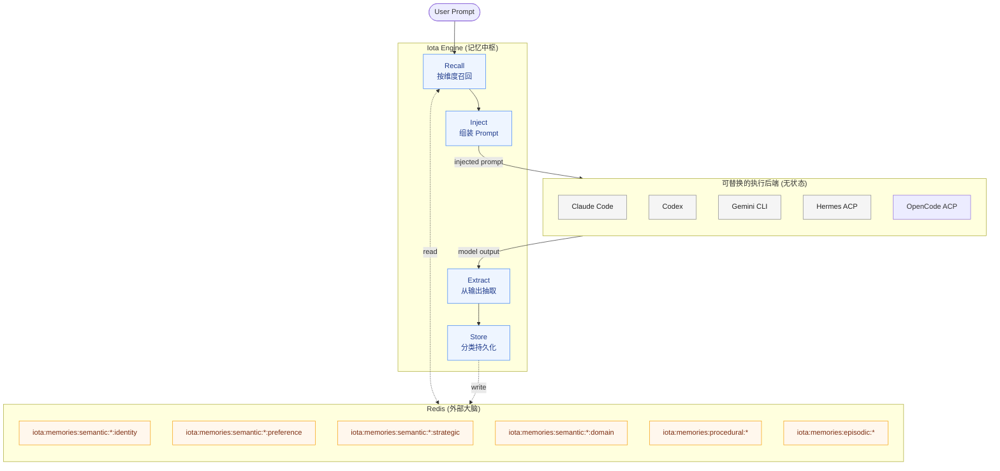
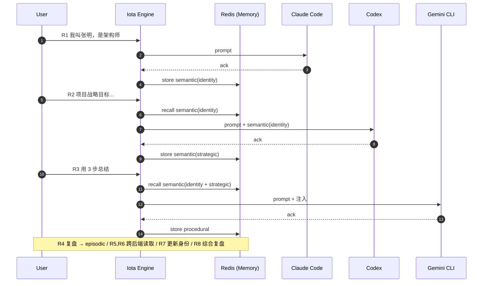

# Iota Memory 技术分享：跨后端上下文流转与持久化验证

> **当我们在多个 AI 后端（Claude Code / Codex / Gemini CLI / Hermes / OpenCode）之间任意切换时，用户上下文还能不能延续？**

这是一个看似简单、但落地非常棘手的工程问题。本次分享通过一组可复现的 8 轮接力实验，证明 Iota 的 Memory 模块可以把"记忆"从模型内部抽离到 Engine 层，使后端变成可热插拔的"执行器"。

本文要解决三件事：

1. 我们要解决的真实问题是什么
2. 我们的思考路径：从问题 → 抽象 → 实验设计
3. 实验原理图、跑通的数据，以及由此推出的架构判断

## 问题陈述

在 Agent 工程实践中，主流 CLI（Claude Code / Codex / Gemini CLI / Hermes / OpenCode 等）有一个共同特征：

- **每个后端进程维护自己的会话状态**：上下文随进程生命周期生灭。
- **不同厂商上下文格式互不兼容**：一旦切换，原始历史无法直接复用。
- **长上下文成本高、易超限**：把全量历史塞进 prompt 既贵又脆弱。

这导致一个典型的"撞墙时刻"：

> 用 Claude Code 写了半天需求，因为额度/能力/网络等原因切到 Codex，新的会话像失忆一样从零开始。

通常的应对方式只有两种：要么由用户手动复述，要么由前端把整个聊天历史塞回 prompt。这两种都不是工程意义上的"记忆"。

我们想要的是：**让记忆与后端解耦，由 Engine 统一管理，按语义分类后注入到任何后端的下一次执行中。**

## 思考路径：把"会话历史"升级为"结构化记忆"

我们的设计沿着三个层次推进：

### 第一步：分清"日志"和"记忆"

聊天历史只是流水日志，记忆则是从日志中**经过抽取、去噪、归类后的可复用知识**。所以 Memory 模块必须包含 Extract（抽取）这一步，而不是简单存一份 transcript。

### 第二步：给记忆分维度

如果只有一个 "memory bag"，召回时会很快变成噪声池。参考认知心理学和 mem0 的三类模型，Iota 现在使用 `type + facet` 二级分类：一级 type 对齐 `semantic / episodic / procedural`，semantic 下用 facet 保留 Iota 原有的业务分桶能力。

| type | facet | 含义 | 例子 |
| --- | --- | --- | --- |
| `semantic` | `identity` | 用户身份、角色、长期画像 | "我叫张明，是架构师" |
| `semantic` | `preference` | 用户偏好、习惯、个性化设置 | "我偏好中文、回答要简洁" |
| `semantic` | `strategic` | 项目目标、决策、长期方向 | "项目战略目标是云原生迁移" |
| `semantic` | `domain` | 其他稳定事实和领域知识 | "该项目使用 Redis Sentinel" |
| `procedural` | - | 操作步骤与流程 | "3 步骤：A -> B -> C" |
| `episodic` | - | 经历叙事与复盘 | "上一轮我们讨论了 X，结论是 Y" |

旧的 `factual` 映射为 `semantic + domain`，旧的 `strategic` 映射为 `semantic + strategic`。不同 facet 独立召回，identity / preference 有独立 token 保底，避免用户画像被长会话挤出 prompt。

### 第三步：让 Engine 而不是 Backend 持有记忆

只要把 Extract / Store / Recall / Inject 这四个动作放到 Engine 层，并且持久化到 Redis，那么后端用什么、换什么都不影响记忆延续——后端只负责"这一次推理"。

这就把架构从「Backend 持有上下文」翻转成了「Engine 持有上下文，Backend 是可替换的执行器」。

## 实验原理图

下面这张图是本次实验也是 Memory 模块运行时的核心原理图。它展示了一次请求从进入 Engine 到完成记忆闭环的完整链路，以及后端为何可以被任意替换。



要点：

- **后端是无状态执行器**：所有后端都连到同一个 Engine，看不到彼此的会话。
- **Engine 是记忆中枢**：所有跨后端的连续性靠 Engine 的 Recall / Inject / Extract / Store 闭环。
- **Redis 是外部大脑**：按 type + facet 的 key 前缀分桶存储，方便观察、可清理、可迁移。


## 存储后端演进路径

Memory 存储的业务边界是 `MemoryStorageBackend`。Engine、Injector、Agent 和 App 不直接拼 Redis key，也不依赖某个向量库协议；后续切换后端时只替换 storage 实现和部署配置。

| 档位 | 后端 | 适用规模 | 触发条件 | 切换成本 |
| --- | --- | --- | --- | --- |
| L1 | Redis hash + zset + 客户端 cosine | 单 scope <= 1k | 默认 | 无新依赖 |
| L2 | Redis Stack RediSearch HNSW | 单租户 <= 100k | 召回 P95 > 50ms 或 scope > 1k | 切 Redis image，增加 FT.CREATE 索引脚本，业务代码不变 |
| L3 | Milvus / Qdrant / Weaviate 适配器 | 单租户 > 1M 或多区域部署 | 召回 P95 > 200ms，或需要多副本 / 混合稀疏稠密检索 | 新增 `storage/milvus.ts` 等适配器，配置切换，业务代码不变 |

当前默认选择 L1：写入时保存 `contentHash` 和 `embeddingJson`，召回时可在 Redis 取回候选后做客户端 cosine 排序。`searchUnifiedMemories()` 仍是词法扫描 fallback，仅用于低规模 L1 过渡和调试路径；高规模部署应切换到 RediSearch HNSW 或外部向量后端。这样不引入 Milvus 的运维面积，同时保留向量检索接口。Milvus 只在记忆量和部署形态真正需要时作为 L3 适配器引入。


### Memory v2 迁移

旧版本 Redis 中可能存在 `iota:memory:factual:*` 和 `iota:memory:strategic:*`。升级到 `semantic + facet` 后，运行迁移脚本为旧记录补写新索引和 hash 去重索引；`--write` 模式会删除旧 hash key 和旧 zset 成员：

```bash
bun deployment/scripts/migrate-memory-v2.ts          # dry-run
bun deployment/scripts/migrate-memory-v2.ts --write  # apply
```

迁移不会删除旧 key；运行时读取 `semantic` 时仍兼容旧 key。新写入的 `iota:memory:hashes:*` 去重索引会跟随 memory TTL 过期，GC 和显式删除也会清理对应 set member。

## 实验设计：为什么是 8 轮接力

如果都用同一个后端跑完 8 轮，我们没法排除"是模型自身缓存了上下文"。所以实验刻意做成**接力赛**：每一轮换一个后端，让"写"的后端和"读"的后端不同，强制把记忆压力交给 Engine。



每轮的设计都是为了正交地验证一个能力：写、读、混合读、更新、综合复盘。

## 验证矩阵

在 2026-04-29 的 Windows 环境下（Hermes/OpenCode 支持受本机环境限制，R4/R8 由 Claude Code 与 Codex 替代），8 轮全部跑通：

| 轮次 | 负责后端 | 操作与结果摘要 | 验证目标 | 状态 |
| ---- | -------- | -------------- | -------- | ---- |
| R1 | `claude-code` | 「我叫张明…架构师」 | 写入 semantic+identity | ✓ `semantic(identity)=1` |
| R2 | `codex` | 「项目战略目标…」 | 跨后端读 semantic+identity + 写 semantic+strategic | ✓ `semantic(strategic)=1` |
| R3 | `gemini` | 「请用 3 步总结…」 | 注入 R1+R2 + 写 procedural | ✓ `procedural=1` |
| R4 | `claude-code` | 「请回顾…复盘」 | 读取前 3 轮 + 写 episodic | ✓ `episodic=1` |
| R5 | `claude-code` | 「我是谁？战略是什么？」| 跨后端读 semantic+identity + semantic+strategic | ✓ |
| R6 | `codex` | 「3 步骤分别是什么？」 | 跨后端读 procedural | ✓ |
| R7 | `gemini` | 「兼任产品经理…」 | 更新 semantic+identity/preference（hash 去重后 touch/history） | ✓ hash 去重 / history 记录 |
| R8 | `codex` | 「综合复盘…」 | 多维度混合召回 | ✓ 输出含「架构师+产品经理/战略/3 步」 |

最终 Redis 中各维度计数：

```text
semantic(identity/preference/domain): 3
semantic(strategic)          : 1
procedural                   : 2
episodic                     : 2
```

## 通过判据

| 判据 | 现象 | 结论 |
| --- | --- | --- |
| 跨后端读 | R2–R8 trace 中持续看到 `memory.inject selectedCount > 0` | 外部召回真实生效，不是后端缓存 |
| 跨后端写 | 不同 type/facet 由不同后端触发写入 | Extract 与后端无关 |
| 类型隔离 | `semantic/episodic/procedural` 与 semantic facet 索引共存且互不污染 | 维度切分成立 |
| 可更新 | R7 追加身份后 R8 输出仍能完整体现 | 记忆是可演化的状态而非快照 |

## 可以带走的几个判断

1. **后端无状态化是值得的**：把上下文从后端剥离到 Engine 之后，"换模型"才真的变成低成本动作。
2. **type + facet 记忆比一锅炖更稳**：召回时按维度选择，能显著降低 prompt 噪声和 token 消耗。
3. **记忆 = Extract + Store + Recall + Inject 四件套**：缺一个都不是真正的记忆系统，只是聊天历史。
4. **Redis 作为外部大脑足够用**：key 前缀分桶已经能撑住四维度检索；后续可平滑替换为向量存储。

一句话总结：

> Iota Memory 让大模型成为可替换的"嘴和手"，把"脑"留在 Engine 里。
