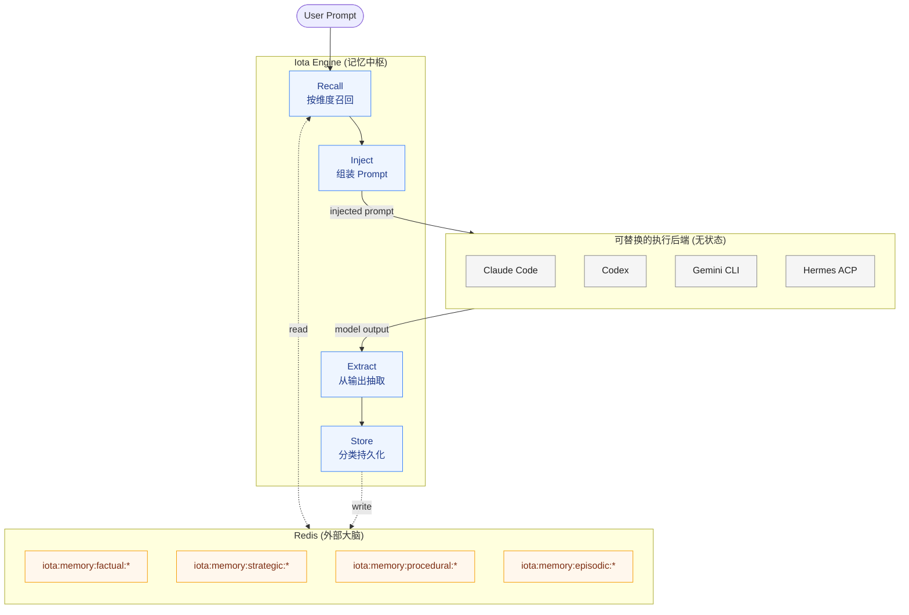
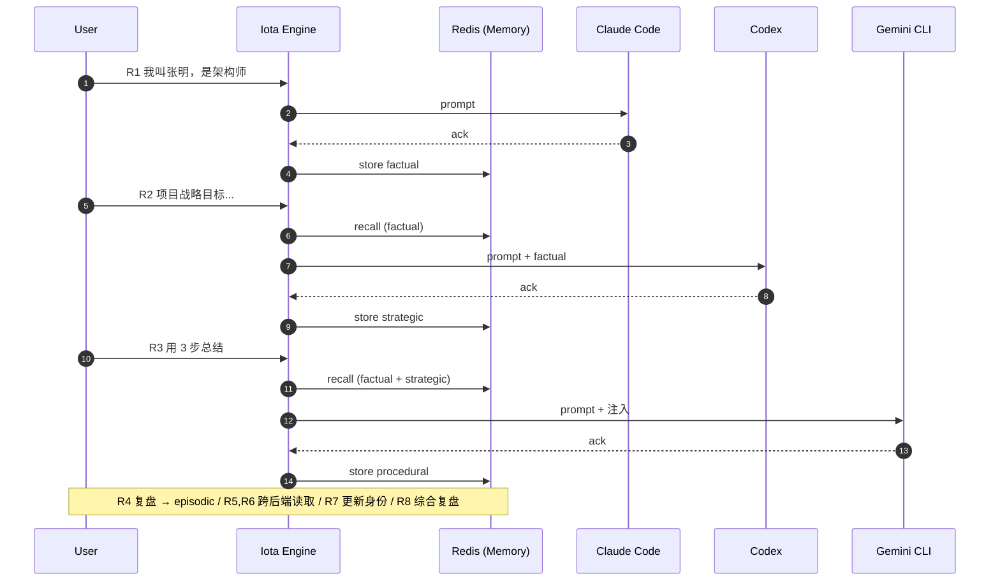

# Iota Memory 技术分享：跨后端上下文流转与持久化验证

> **当我们在多个 AI 后端（Claude Code / Codex / Gemini CLI / Hermes）之间任意切换时，用户上下文还能不能延续？**

这是一个看似简单、但落地非常棘手的工程问题。本次分享通过一组可复现的 8 轮接力实验，证明 Iota 的 Memory 模块可以把"记忆"从模型内部抽离到 Engine 层，使后端变成可热插拔的"执行器"。

本文要解决三件事：

1. 我们要解决的真实问题是什么
2. 我们的思考路径：从问题 → 抽象 → 实验设计
3. 实验原理图、跑通的数据，以及由此推出的架构判断

## 问题陈述

在 Agent 工程实践中，主流 CLI（Claude Code / Codex / Gemini CLI / Hermes 等）有一个共同特征：

- **每个后端进程维护自己的会话状态**：上下文随进程生命周期生灭。
- **不同厂商上下文格式互不兼容**：一旦切换，原始历史无法直接复用。
- **长上下文成本高、易超限**：把全量历史塞进 prompt 既贵又脆弱。

这导致一个典型的"撞墙时刻"：

> 用 Claude Code 写了半天需求，因为额度/能力/网络等原因切到 Codex，新的会话像失忆一样从零开始。

通常的应对方式只有两种：要么由用户手动复述，要么由前端把整个聊天历史塞回 prompt。这两种都不是工程意义上的"记忆"。

我们想要的是：**让记忆与后端解耦，由 Engine 统一管理，按语义分类后注入到任何后端的下一次执行中。**

## 思考路径：把"会话历史"升级为"结构化记忆"

我们的设计沿着三个层次推进：

### 第一步：分清"日志"和"记忆"

聊天历史只是流水日志，记忆则是从日志中**经过抽取、去噪、归类后的可复用知识**。所以 Memory 模块必须包含 Extract（抽取）这一步，而不是简单存一份 transcript。

### 第二步：给记忆分维度

如果只有一个 "memory bag"，召回时会很快变成噪声池。参考认知心理学和已有 Agent 研究，我们把记忆切成四个正交维度：

| 维度 | 含义 | 例子 |
| --- | --- | --- |
| `factual` 事实 | 用户/环境的客观事实 | "我叫张明，是架构师" |
| `strategic` 战略 | 高层目标与方向 | "项目战略目标是云原生迁移" |
| `procedural` 程序 | 操作步骤与流程 | "3 步骤：A → B → C" |
| `episodic` 情景 | 经历叙事与复盘 | "上一轮我们讨论了 X，结论是 Y" |

不同维度独立存储、独立召回，避免战略目标淹没在闲聊里。

### 第三步：让 Engine 而不是 Backend 持有记忆

只要把 Extract / Store / Recall / Inject 这四个动作放到 Engine 层，并且持久化到 Redis，那么后端用什么、换什么都不影响记忆延续——后端只负责"这一次推理"。

这就把架构从「Backend 持有上下文」翻转成了「Engine 持有上下文，Backend 是可替换的执行器」。

## 实验原理图

下面这张图是本次实验也是 Memory 模块运行时的核心原理图。它展示了一次请求从进入 Engine 到完成记忆闭环的完整链路，以及后端为何可以被任意替换。



要点：

- **后端是无状态执行器**：四个后端都连到同一个 Engine，看不到彼此的会话。
- **Engine 是记忆中枢**：所有跨后端的连续性靠 Engine 的 Recall / Inject / Extract / Store 闭环。
- **Redis 是外部大脑**：按四个维度的 key 前缀分桶存储，方便观察、可清理、可迁移。

## 实验设计：为什么是 8 轮接力

如果都用同一个后端跑完 8 轮，我们没法排除"是模型自身缓存了上下文"。所以实验刻意做成**接力赛**：每一轮换一个后端，让"写"的后端和"读"的后端不同，强制把记忆压力交给 Engine。



每轮的设计都是为了正交地验证一个能力：写、读、混合读、更新、综合复盘。

## 验证矩阵

在 2026-04-29 的 Windows 环境下（Hermes 支持受限，R4/R8 由 Claude Code 与 Codex 替代），8 轮全部跑通：

| 轮次 | 负责后端 | 操作与结果摘要 | 验证目标 | 状态 |
| ---- | -------- | -------------- | -------- | ---- |
| R1 | `claude-code` | 「我叫张明…架构师」 | 写入 factual | ✓ `factual=1` |
| R2 | `codex` | 「项目战略目标…」 | 跨后端读 factual + 写 strategic | ✓ `strategic=1` |
| R3 | `gemini` | 「请用 3 步总结…」 | 注入 R1+R2 + 写 procedural | ✓ `procedural=1` |
| R4 | `claude-code` | 「请回顾…复盘」 | 读取前 3 轮 + 写 episodic | ✓ `episodic=1` |
| R5 | `claude-code` | 「我是谁？战略是什么？」| 跨后端读 factual + strategic | ✓ |
| R6 | `codex` | 「3 步骤分别是什么？」 | 跨后端读 procedural | ✓ |
| R7 | `gemini` | 「兼任产品经理…」 | 更新 factual（追加，不覆盖） | ✓ `factual: 2 → 3` |
| R8 | `codex` | 「综合复盘…」 | 多维度混合召回 | ✓ 输出含「架构师+产品经理/战略/3 步」 |

最终 Redis 中各维度计数：

```text
factual    : 3
strategic  : 1
procedural : 2
episodic   : 2
```

## 通过判据

| 判据 | 现象 | 结论 |
| --- | --- | --- |
| 跨后端读 | R2–R8 trace 中持续看到 `memory.inject selectedCount > 0` | 外部召回真实生效，不是后端缓存 |
| 跨后端写 | 四个维度由不同后端触发写入 | Extract 与后端无关 |
| 类型隔离 | 四类 `iota:memory:*:*` key 共存且互不污染 | 维度切分成立 |
| 可更新 | R7 追加身份后 R8 输出仍能完整体现 | 记忆是可演化的状态而非快照 |

## 可以带走的几个判断

1. **后端无状态化是值得的**：把上下文从后端剥离到 Engine 之后，"换模型"才真的变成低成本动作。
2. **维度化记忆比一锅炖更稳**：召回时按维度选择，能显著降低 prompt 噪声和 token 消耗。
3. **记忆 = Extract + Store + Recall + Inject 四件套**：缺一个都不是真正的记忆系统，只是聊天历史。
4. **Redis 作为外部大脑足够用**：key 前缀分桶已经能撑住四维度检索；后续可平滑替换为向量存储。

一句话总结：

> Iota Memory 让大模型成为可替换的"嘴和手"，把"脑"留在 Engine 里。
