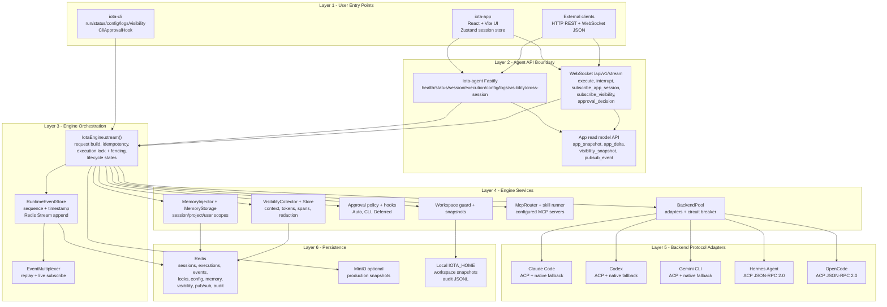
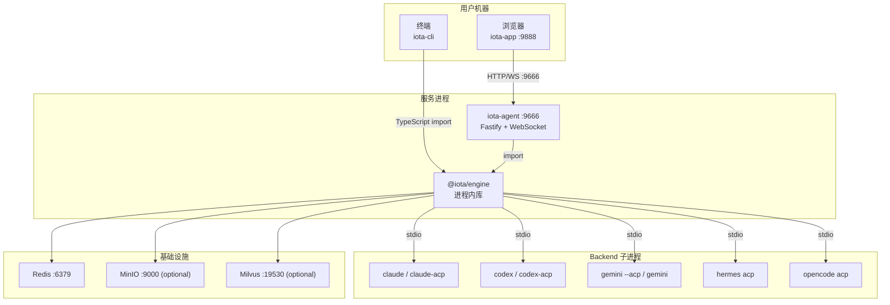

# iota 架构概览

**版本:** 2.1  
**最后更新:** 2026-04-30

## 1. 架构总览

iota 是一个可插拔 AI coding assistant runtime。CLI/TUI 和 Agent 都直接导入 `@iota/engine`，Engine 统一负责后端适配、执行生命周期、事件规范化、Redis 持久化、可见性采集、记忆注入和审批策略。

核心约束：

- Backend 协议逻辑只存在于 `iota-engine/src/backend/`
- Backend 首选 ACP JSON-RPC 2.0；Claude Code、Codex、Gemini 的 legacy native 输出作为降级路径保留
- App 不消费 backend 原生 payload，只消费 Agent 输出的 App snapshot / delta 读取模型
- Redis 是当前主存储；backend 凭证、模型、端点通过 defaults、用户配置、项目 `iota.config.yaml`、环境覆盖和 Redis 分布式配置 overlay 解析
- MinIO 只在 production snapshot/artifact 场景中作为可选对象存储

---

## 2. 分层架构图



---

## 3. 系统拓扑



---

## 4. 组件边界

| 包 | 职责 | 不负责 |
|---|---|---|
| `iota-engine` | Runtime API、backend pool、adapter、RuntimeEvent、storage、visibility、memory、approval、audit、metrics、workspace、MCP、skill | HTTP server、React UI |
| `iota-cli` | CLI 命令、交互式 TUI（与 CLI 平级的完整能力）、CLI approval hook、调用 Engine | 远程 Agent API |
| `iota-agent` | Fastify REST/WS、请求校验、App snapshot/delta 推送、跨实例 pub/sub bridge | Backend 协议解析 |
| `iota-app` | React UI、Zustand session store、WebSocket 连接、snapshot/delta 合并 | 直接访问 Redis |
| `iota-skill` | 结构化 skill 声明 + iota-fun 函数源码 | 运行时编排逻辑 |

---

## 5. 通信协议

### App / Agent

| 方向 | 协议 | 路径 |
|---|---|---|
| App → Agent | HTTP REST | `/api/v1/sessions/*`, `/api/v1/execute`, `/api/v1/executions/*`, `/api/v1/config/*`, `/api/v1/traces/aggregate` |
| App → Agent | WebSocket | `/api/v1/stream` |
| Agent → App | WebSocket | `event`, `complete`, `error`, `app_snapshot`, `app_delta`, `visibility_snapshot`, `pubsub_event` |

WebSocket 入站消息：

```json
{ "type": "execute", "sessionId": "...", "prompt": "..." }
{ "type": "interrupt", "executionId": "..." }
{ "type": "subscribe_app_session", "sessionId": "..." }
{ "type": "subscribe_visibility", "executionId": "..." }
{ "type": "approval_decision", "requestId": "...", "decision": "approve|deny", "approved?": true }
```

### Engine / Backend

所有 adapter 最终输出统一为 `RuntimeEvent`：

```typescript
type RuntimeEvent =
  | OutputEvent
  | StateEvent
  | ToolCallEvent
  | ToolResultEvent
  | FileDeltaEvent
  | ErrorEvent
  | ExtensionEvent
  | MemoryEvent;
```

---

## 6. 执行与读取模型

### 执行路径

1. 调用方提交 `RuntimeRequest`（sessionId, executionId, prompt, workingDirectory）
2. Engine 计算 `requestHash` 实现幂等（相同 executionId + hash → replay 或 join）
3. Redis 获取 `iota:lock:execution:{executionId}`，fencing token 防过期锁写入
4. Engine 扫描 workspace，写入 snapshot，创建 `iota:exec:{executionId}`
5. 持久化 `queued → starting → running` 状态事件
6. `BackendPool` 选择 adapter，启动或复用后端进程
7. Adapter 将原生事件映射为 `RuntimeEvent`
8. Engine 处理 memory、approval、MCP、workspace guard、visibility、audit
9. 事件写入 Redis Stream 并发布到 multiplexer
10. 执行结束后更新状态为 `completed`/`failed`/`interrupted`，释放锁

### App 读取模型

```text
RuntimeEvent + ExecutionRecord + ExecutionVisibility
  → buildAppExecutionSnapshot()
  → buildAppSessionSnapshot()
  → app_snapshot / app_delta
  → iota-app/src/store/useSessionStore.ts
```

| 类型 | 来源 | 用途 |
|---|---|---|
| `app_snapshot` | `GET /api/v1/sessions/:sessionId/app-snapshot` 或 WS 订阅 | 完整 session 状态同步 |
| `app_delta` | RuntimeEvent 映射 + visibility store 回填 | 低延迟增量更新 |
| `visibility_snapshot` | `subscribe_visibility` 后读取 visibility store | Inspector 初始数据 |

---

## 7. 数据与存储

### Redis key 布局

| 数据 | Redis key | 类型 |
|---|---|---|
| Session | `iota:session:{sessionId}` | Hash |
| Execution | `iota:exec:{executionId}` | Hash |
| Session executions | `iota:session-execs:{sessionId}` | Set |
| All executions | `iota:executions` | Sorted Set |
| Events | `iota:events:{executionId}` | Redis Stream |
| Config global | `iota:config:global` | Hash |
| Config backend | `iota:config:backend:{name}` | Hash |
| Config session | `iota:config:session:{id}` | Hash |
| Config user | `iota:config:user:{id}` | Hash |
| Locks | `iota:lock:execution:{executionId}` | String PX |
| Fencing | `iota:fencing:execution:{executionId}` | String counter |
| Memory | `iota:memory:{type}:{memoryId}` | Hash |
| Memory index | `iota:memories:{type}:{scopeId}[:facet]` | Sorted Set |
| Memory hash | `iota:memory:hashes:{type}:{scopeId}[:facet]:{contentHash}` | Set |
| Memory history | `iota:memory:history:{memoryId}` | Sorted Set |
| Audit | `iota:audit` | Sorted Set |

### Visibility key 布局

| 数据 | Redis key | 类型 |
|---|---|---|
| Context manifest | `iota:visibility:context:{executionId}` | String JSON |
| Memory visibility | `iota:visibility:memory:{executionId}` | String JSON |
| Token ledger | `iota:visibility:tokens:{executionId}` | String JSON |
| Link visibility | `iota:visibility:link:{executionId}` | String JSON |
| Trace spans | `iota:visibility:spans:{executionId}` | List JSON |
| Chain span hash | `iota:visibility:{executionId}:chain` | Hash |
| Event mapping | `iota:visibility:mapping:{executionId}` | List JSON |
| Session visibility | `iota:visibility:session:{sessionId}` | Sorted Set |

---

## 8. 审批与安全边界

审批分两层：

1. **Engine policy/hook**：`shell`、`fileOutside`、`network`、`container`、`mcpExternal`、`privilegeEscalation` 策略
2. **Hook 实现**：CLI 使用 `CliApprovalHook`；Agent 使用 `DeferredApprovalHook`

当前状态：

- CLI/TUI 审批路径完全可用
- Agent WebSocket 已路由 `approval_decision` 到 `engine.resolveApproval()`；App-to-Agent-to-Engine 审批环路完整实现并有测试覆盖
- 文档、日志、visibility、snapshot 都必须保持 secret redaction

---

## 9. 实现成熟度

| 能力 | 状态 |
|---|---|
| ACP backend layer | 已接入，需按 backend 跑真实 traced request 验收 |
| Claude/Codex/Gemini native fallback | 稳定但 deprecated |
| Hermes/OpenCode ACP adapter | 已接入 ACP-only 路径，需本机安装和真实 traced request 验收 |
| Redis storage | 稳定 |
| Distributed config | 稳定 |
| RuntimeEvent replay/join | 稳定 |
| Visibility store | 稳定 |
| App snapshot/delta | 稳定 |
| CLI approval | 稳定 |
| Memory system | 核心路径已接入；LLM merge/entity/vector backend 仍待完善 |
| MCP / skill runner | 已接入，runtime 语言需按 iota-fun 指南逐项验证 |
| Redis pub/sub bridge | 已接入，跨实例行为仍需部署环境验证 |

---

## 10. 源码索引

| 主题 | 主要文件 |
|---|---|
| Engine 主执行流 | `iota-engine/src/engine.ts` |
| RuntimeEvent 类型 | `iota-engine/src/event/types.ts` |
| Event store/multiplexer | `iota-engine/src/event/store.ts`, `iota-engine/src/event/multiplexer.ts` |
| Redis storage | `iota-engine/src/storage/redis.ts` |
| Distributed config | `iota-engine/src/config/redis-store.ts`, `iota-engine/src/config/loader.ts` |
| Visibility | `iota-engine/src/visibility/redis-store.ts`, `iota-engine/src/visibility/snapshot-builder.ts` |
| Memory | `iota-engine/src/memory/injector.ts`, `iota-engine/src/memory/storage.ts` |
| Approval | `iota-engine/src/approval/*.ts` |
| Agent WebSocket | `iota-agent/src/routes/websocket.ts` |
| App session store | `iota-app/src/store/useSessionStore.ts` |
