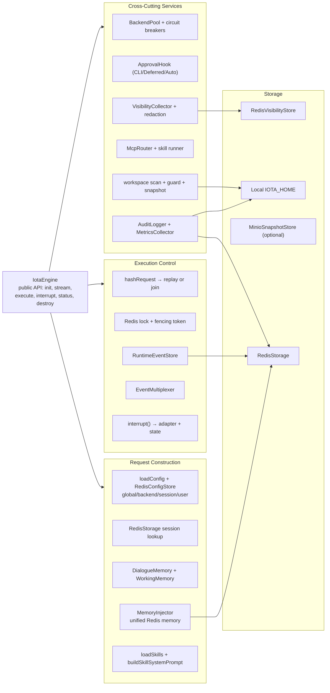

# Engine 引擎指南

**版本:** 2.1  
**最后更新:** 2026-04-30

## 1. 简介

`@iota/engine` 是 Iota 的核心运行时库，负责 backend 适配、执行生命周期、事件规范化、Redis 持久化、可见性采集、记忆注入、审批策略、MCP 路由和 workspace 管理。CLI 和 Agent 都通过 TypeScript 直接导入 Engine。

---

## 2. 内部结构图



---

## 3. 关键内部对象

| 对象 | 职责 |
|---|---|
| `IotaEngine` | 公共 API、初始化配置、执行编排、锁续租、backend 切换、interrupt、GC |
| `BackendPool` | 初始化 adapter、状态探测、circuit breaker、capabilities、按名称获取 backend |
| `RuntimeEventStore` | 为事件补 sequence/timestamp，追加到 Redis Stream |
| `EventMultiplexer` | 持久化事件后 fan-out 给 live subscriber；支持 replay + live subscribe |
| `RedisStorage` | session/execution/event/log/memory/lock/audit 主存储 |
| `RedisConfigStore` | global/backend/session/user 分布式配置；变更通过 pub/sub 发布 |
| `VisibilityCollector` | 记录 context、tokens、trace spans、mapping、memory selection |
| `MemoryInjector` | 从 Redis 统一记忆检索并注入 prompt，产生 memory visibility |
| `DialogueMemory` | 每会话最近 50 turn 对话历史（进程内，不持久化） |
| `WorkingMemory` | 活跃文件集（进程内，不持久化） |
| `McpRouter` | MCP tool 代理路由到配置的 MCP server；iota-fun 也通过该边界运行 |

---

## 4. 配置系统

### 配置层次

```text
defaults → ~/.iota/config.yaml → project iota.config.yaml → selected env overrides → Redis scopes
```

### IotaConfig 结构

```typescript
interface IotaConfig {
  engine: { mode, workingDirectory, defaultBackend, eventRetentionHours }
  routing: { defaultBackend, disabledBackends[] }
  backend: { claudeCode, codex, gemini, hermes, opencode }
  approval: ApprovalPolicy
  visibility: VisibilityPolicy
  storage: { development, production }
  mcp: { servers[] }
  skill: { roots[] }
}
```

### Redis 分布式配置

| Scope | Redis key | 用途 |
|---|---|---|
| global | `iota:config:global` | 全局设置 |
| backend | `iota:config:backend:{name}` | backend 凭证、模型、endpoint |
| session | `iota:config:session:{id}` | session override |
| user | `iota:config:user:{id}` | user preference |

配置操作：

```bash
iota config set env.ANTHROPIC_AUTH_TOKEN "<redacted>" --scope backend --scope-id claude-code
iota config set env.ANTHROPIC_MODEL "MiniMax-M2.7" --scope backend --scope-id claude-code
iota config set protocol acp --scope backend --scope-id gemini
```

---

## 5. Redis 数据结构

### Session / Execution

| 数据 | Redis key | 类型 | 说明 |
|---|---|---|---|
| Session | `iota:session:{sessionId}` | Hash | TTL 7 天；workingDirectory, activeBackend, metadata |
| Execution | `iota:exec:{executionId}` | Hash | backend, status, requestHash, prompt, output, timestamps |
| Session execs | `iota:session-execs:{sessionId}` | Set | session → executionId 索引 |
| All executions | `iota:executions` | Sorted Set | startedAt → executionId |
| Events | `iota:events:{executionId}` | Stream | field `event` 存 RuntimeEvent JSON |

### Locks

| 数据 | Redis key | 类型 |
|---|---|---|
| Execution lock | `iota:lock:execution:{executionId}` | String PX (TTL) |
| Fencing token | `iota:fencing:execution:{executionId}` | String counter |

---

## 6. 持久化边界

| 数据 | 持久化 | 说明 |
|---|---|---|
| Session / Execution / RuntimeEvent | Redis | 跨进程存活，可 replay |
| Unified Memory | Redis | semantic/episodic/procedural，带 TTL/index/hash |
| Distributed Config | Redis | backend 凭证、模型、端点 |
| Visibility | Redis | 默认 TTL 7 天 |
| DialogueMemory | 进程内 | 重启后丢失 |
| WorkingMemory | 进程内 | 重启后丢失 |
| Workspace snapshots | 本地 `${IOTA_HOME}/workspaces/{sessionId}` | 最近 5 个 snapshot |
| Audit | Redis sorted set + 本地 JSONL | 写入前脱敏 |

---

## 7. MCP 与 Skill

Engine 从 resolved config 的 `skill.roots` 加载 `SKILL.md` frontmatter；如果未配置 `skill.roots`，回退到仓库相邻的 `iota-skill` 目录。匹配 prompt triggers 后通过 `McpRouter` 执行。

执行路径：

```text
loadSkills(skill.roots) → matchExecutableSkill(prompt) → runSkillViaMcp()
  → McpRouter → MCP server (e.g. iota-fun) → tool results → output template
```

MCP server 配置格式：

```typescript
interface McpServerDescriptor {
  name: string;
  command: string;
  args: string[];
  env: Record<string, string> | string[];
}
```

---

## 8. 指标采集

`MetricsCollector` 记录每次执行的：

- 执行时长、backend 名称、最终状态
- Token 使用（input/output/cached）
- 事件数量按类型统计

---

## 9. 构建与测试

```bash
cd iota-engine
bun install
bun run build        # tsc -b --force
bun run typecheck    # tsc --noEmit
bun run test         # vitest run
bun run lint         # eslint
bun run format       # prettier
```
