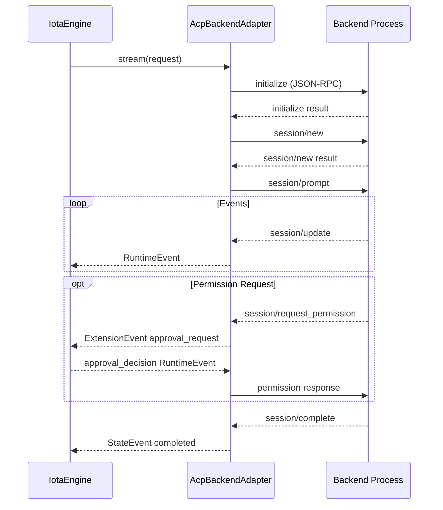

# Backend 适配器

**版本:** 2.1  
**最后更新:** 2026-04-30

## 1. 概述

iota 通过 `BackendPool` 管理 backend adapter。当前代码只保留 ACP 路径：

- Claude Code / Codex / Gemini / Hermes / OpenCode：全部通过 ACP adapter 对接。
- `protocol: native` 被视为无效配置，初始化时直接拒绝。
- 所有 backend 事件最终规范化为 `RuntimeEvent`。

Backend 协议逻辑必须留在 `iota-engine/src/backend/`，不要引入 vendor 内部 SDK 或额外协议转换可执行程序。

---

## 2. Backend 矩阵

| Backend | ACP 文件 | 默认协议 | 进程模型 |
|---|---|---|---|
| Claude Code | `claude-acp.ts` | ACP-only | long-lived subprocess |
| Codex | `codex-acp.ts` | ACP-only | long-lived subprocess |
| Gemini CLI | `gemini-acp.ts` | ACP-only | long-lived subprocess |
| Hermes Agent | `hermes.ts` | ACP-only | long-lived subprocess |
| OpenCode | `opencode-acp.ts` | ACP-only | long-lived subprocess |

默认配置见 `iota-engine/src/config/schema.ts`。

---

## 3. BackendPool 选择逻辑

`iota-engine/src/backend/pool.ts` 当前行为：

- 全部 backend 通过 `requireAcpBackend()` 强制 ACP。
- `claude-code`、`codex` 使用 adapter-backed ACP 命令；`gemini`、`hermes`、`opencode` 使用后端原生 ACP 命令。
- `routing.disabledBackends` 中的 backend 不初始化、不返回。
- Circuit breaker 包裹 backend 执行，失败后打开断路器。

---

## 4. ACP adapter 默认命令参数

| Backend | 默认 ACP command args | 说明 |
|---|---|---|
| Claude Code | `@zed-industries/claude-code-acp` | 可通过 backend config 覆盖 adapter args |
| Codex | `@zed-industries/codex-acp` | 可通过 backend config 覆盖 adapter args |
| Gemini CLI | `--acp` | 使用 Gemini 原生 ACP 模式 |
| Hermes | `acp` | `hermes acp` |
| OpenCode | `acp` | `opencode acp` |

文档不要假设一定通过 `npx` 启动；实际 executable 和 args 由 backend config、adapter 默认值和 `SubprocessBackendAdapter` 组合决定。

---

## 5. ACP 协议流程



---

## 6. 类结构

```text
RuntimeBackend (interface)
  ├── SubprocessBackendAdapter (abstract)
  └── AcpBackendAdapter
        ├── ClaudeCodeAcpAdapter
        ├── CodexAcpAdapter
        ├── GeminiAcpAdapter
        ├── HermesAdapter
        └── OpenCodeAcpAdapter
```

---

## 7. BackendCapabilities

代码定义在 `iota-engine/src/backend/interface.ts`：

```typescript
interface BackendCapabilities {
  sandbox: boolean;
  mcp: boolean;
  mcpResponseChannel: boolean;
  acp: boolean;
  acpMode?: "native" | "adapter";
  streaming: boolean;
  thinking: boolean;
  multimodal: boolean;
  maxContextTokens: number;
  promptOnlyInput?: boolean;
}
```

---

## 8. 事件映射

ACP 统一映射器：`iota-engine/src/backend/acp-event-mapper.ts`。

职责：

- `session/update` → output/thinking/tool_call/tool_result/file_delta 等 RuntimeEvent
- `session/complete` → state event
- `session/request_permission` → extension `approval_request`
- memory/file/native extension 事件映射到标准 RuntimeEvent 或 extension event

---

## 9. 配置

Backend 凭证、模型、endpoint 通过 layered config + Redis distributed config overlay 解析。共享部署中建议把敏感配置放 Redis scope，不提交 `.env` 或 backend-local env 文件。

全部 5 后端的 Redis 配置命令见 [00-setup.md](./00-setup.md#4-后端-redis-配置)。

---

## 10. 验收状态

| 能力 | 代码状态 | 验收要求 |
|---|---|---|
| ACP adapter 基类 | 已接入 | adapter 单测 + traced request |
| Claude/Codex/Gemini ACP path | 已接入，ACP-only | 每个 backend 跑真实 traced request |
| Hermes/OpenCode ACP-only | 已接入 | 检查本机安装、配置和真实 traced request |
| Approval response 回写 | 已接入 | backend permission request + Agent/CLI 决策测试 |
| MCP tool result 回写 | 已接入基础通道 | 需要按 backend 能力验证 `mcpResponseChannel` |

不能只靠 `ensure-backends.sh --check-only` 或 `iota status` 判定后端切换成功。

---

## 11. 验证

```bash
bash deployment/scripts/ensure-backends.sh --check-only

cd iota-cli
node dist/index.js run --backend claude-code --trace "ping"
node dist/index.js run --backend codex --trace "ping"
node dist/index.js run --backend gemini --trace "ping"
node dist/index.js run --backend hermes --trace "ping"
node dist/index.js run --backend opencode --trace "ping"
```

Hermes 特别检查：

- `hermes config show`
- 拒绝死配置 `model.provider: custom`
- 如果 `model.base_url` 指向本地网关，必须确认网关正在运行
