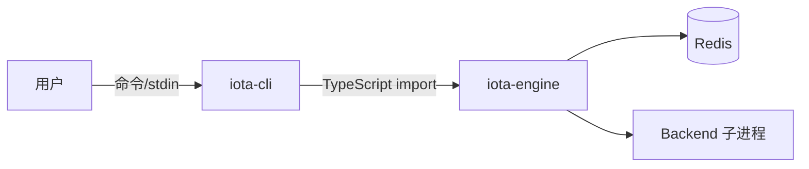

# CLI 与 TUI 指南

**版本:** 2.1  
**最后更新:** 2026-04-30

## 1. 概述

`iota-cli` 提供命令行接口和交互式 TUI 模式。CLI 直接导入 `@iota/engine`，不经过 Agent 服务。



---

## 2. 安装与设置

```bash
cd iota-engine && bun install && bun run build
cd ../iota-cli && bun install && bun run build

node iota-cli/dist/index.js <command>
```

`package.json` 的 bin 指向 `iota-cli/dist/index.js`，也可以通过包管理器 link 后使用 `iota` 命令。

---

## 3. CLI 命令

### 默认入口 / `iota run`

```bash
iota --backend claude-code --trace "解释这段代码"
iota run --backend gemini --cwd /path/to/project "重构 main.ts"
iota run --backend codex --trace-json "ping"
```

选项：

- `--backend <name>`: 指定 backend（`claude-code`、`codex`、`gemini`、`hermes`、`opencode`）
- `--cwd <dir>`: 工作目录，默认当前目录
- `--trace`: 执行后打印 visibility/trace 摘要
- `--trace-json`: 执行后以 JSON 输出 visibility

### `iota status`

```bash
iota status
```

输出各 backend 的健康状态 JSON。

### `iota switch`

```bash
iota switch codex --cwd /path/to/project
```

更新项目 `iota.config.yaml` 中的默认 backend。

### `iota config`

```bash
iota config get --scope backend --scope-id claude-code
iota config get env.ANTHROPIC_MODEL --scope backend --scope-id claude-code
iota config set env.ANTHROPIC_MODEL "MiniMax-M2.7" --scope backend --scope-id claude-code
iota config list --scope global
```

### `iota gc`

```bash
iota gc
```

运行本地 GC，清理过期 memory、events、visibility/audit 数据。

### `iota logs`

```bash
iota logs --limit 20
iota logs --session <sessionId>
iota logs --execution <executionId>
iota logs --backend claude-code --since 1710000000000
iota logs --aggregate --json
```

### `iota trace`

```bash
iota trace --execution <executionId>
iota trace --execution <executionId> --json
iota trace --session <sessionId> --aggregate
```

`trace` 的 execution ID 通过 `--execution` 传入，不是位置参数。

### `iota visibility` / `iota vis`

```bash
iota visibility --execution <executionId>
iota visibility --execution <executionId> --memory
iota visibility --execution <executionId> --tokens
iota visibility --execution <executionId> --chain
iota visibility --execution <executionId> --trace
iota visibility list --session <sessionId>
iota visibility search --session <sessionId> --prompt "keyword"
iota visibility interactive --execution <executionId> --interval 1000
```

`visibility` 使用 `--memory/--tokens/--chain/--trace` 选择视图；当前代码没有 `--kind` 参数。

---

## 4. TUI 交互模式

### 启动

```bash
iota interactive
iota i
```

### 功能

- REPL 风格多轮对话
- 同一 Engine session 内共享 context/memory
- 流式输出
- CLI 审批工作流（`CliApprovalHook`）
- 运行中输入 `switch <backend>` 切换后端
- 输入 `status` 查看 backend 状态
- 输入 `exit` 或 `quit` 退出

当前交互命令是 `switch <backend>` 和 `status`，不是 slash command。

---

## 5. 审批工作流（CLI）

当 Engine policy 为 `ask`，或 backend 请求权限时，CLI 使用 `CliApprovalHook` 交互式询问。

支持的 operation type：

- `shell`
- `fileOutside`
- `network`
- `container`
- `mcpExternal`
- `privilegeEscalation`

---

## 6. 分布式特性

- Session、execution、event、logs、visibility、memory 数据持久化到 Redis
- 多个 CLI 实例可共享同一 Redis，查询彼此的 logs/traces
- 后端凭证、模型、endpoint 通过 layered config + Redis overlay 解析

---

## 7. 故障排查

| 现象 | 修复 |
|------|------|
| `Cannot find module` | `cd iota-engine && bun run build`，再 `cd iota-cli && bun run build` |
| `ECONNREFUSED :6379` | 启动 Redis: `bash deployment/scripts/start-storage.sh` |
| Backend not found | `bash deployment/scripts/ensure-backends.sh --check-only` |
| 401/认证失败 | 检查配置: `iota config get --scope backend --scope-id <name>` |
