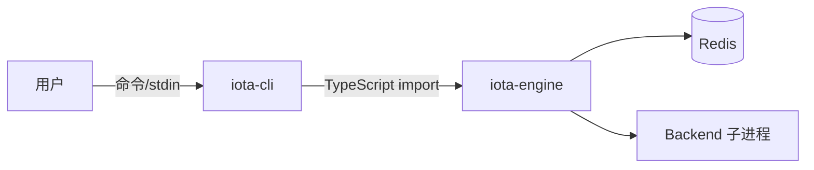

# CLI 与 TUI 指南

**版本:** 3.0
**最后更新:** 2026-04-30

## 1. 概述

`iota-cli` 提供两种平级的一等接口，均直接导入 `@iota/engine`，不经过 Agent 服务：

- **CLI 模式**：单次命令执行（`iota run`、`iota status`、`iota logs` 等）
- **TUI 模式**：持久交互式 REPL 会话，CLI 全部能力均可作为会话内命令使用



---

## 2. 安装与设置

```bash
cd iota-engine && bun install && bun run build
cd ../iota-cli && bun install && bun run build
```

CLI 的实际入口是 `iota-cli/dist/index.js`，通过 Node.js 直接调用：

```bash
node iota-cli/dist/index.js <command>
```

若希望使用短命令 `iota`，可通过 `bun link` 或 `npm link` 在 `iota-cli/` 目录下注册全局 bin：

```bash
cd iota-cli && bun link
```

> **注意：** 系统中可能存在同名的 Python 包 `iota`（`pip install iota`）。如果执行 `iota` 时出现 `ModuleNotFoundError: No module named 'iota'`，说明 shell 解析到了 Python 版本而非本项目 CLI。请用 `pip uninstall iota` 移除冲突包，或确认 `which iota` / `where iota` 指向 `iota-cli/dist/index.js`。

本文档后续示例中的 `iota` 命令均指 `node iota-cli/dist/index.js`（或 link 后的等价全局命令）。

---

## 3. CLI 命令

### 默认入口 / `iota run`

```bash
iota --backend claude-code --trace "解释这段代码"
iota run --backend gemini --cwd /path/to/project "重构 main.ts"
iota run --backend codex --trace-json "ping"
```

选项：

- `--backend <name>`：指定 backend（`claude-code`、`codex`、`gemini`、`hermes`、`opencode`）
- `--cwd <dir>`：工作目录，默认当前目录
- `--trace`：执行后打印 visibility/trace 摘要
- `--trace-json`：执行后以 JSON 输出 visibility

### `iota status`

```bash
iota status
```

输出各 backend 的健康状态 JSON。

### `iota switch`

```bash
iota switch codex --cwd /path/to/project
```

更新项目 `iota.config.yaml` 中的默认 backend。

### `iota config`

```bash
iota config get --scope backend --scope-id claude-code
iota config get env.ANTHROPIC_MODEL --scope backend --scope-id claude-code
iota config set env.ANTHROPIC_MODEL "MiniMax-M2.7" --scope backend --scope-id claude-code
iota config list --scope global
```

全部 5 后端的完整配置值参考见 [00-setup.md](./00-setup.md#3-后端-redis-配置)。

### `iota gc`

```bash
iota gc
```

运行本地 GC，清理过期 memory、events、visibility/audit 数据。

### `iota logs`

```bash
iota logs --limit 20
iota logs --session <sessionId>
iota logs --execution <executionId>
iota logs --backend claude-code --since 1710000000000
iota logs --aggregate --json
```

### `iota trace`

```bash
iota trace --execution <executionId>
iota trace --execution <executionId> --json
iota trace --session <sessionId> --aggregate
```

`trace` 的 execution ID 通过 `--execution` 传入，不是位置参数。

### `iota visibility` / `iota vis`

```bash
iota visibility --execution <executionId>
iota visibility --execution <executionId> --memory
iota visibility --execution <executionId> --tokens
iota visibility --execution <executionId> --chain
iota visibility --execution <executionId> --trace
iota visibility list --session <sessionId>
iota visibility search --session <sessionId> --prompt "keyword"
iota visibility interactive --execution <executionId> --interval 1000
```

`visibility` 使用 `--memory/--tokens/--chain/--trace` 选择视图。

---

## 4. TUI 交互模式

### 启动

```bash
node iota-cli/dist/index.js interactive
node iota-cli/dist/index.js i
```

启动后 TUI 显示当前接入的 backend 名称与大模型：

```
      o
   .--|--. 
o-- IOTA --o
   '--|--'
      o
iota TUI session a1b2c3d4
Backend: claude-code / claude-sonnet-4-20250514
Type "help" for commands, "exit" to quit.

claude-code>
```

提示符格式为 `<backend名称>`，切换 backend 后提示符自动更新。

### 能力

TUI 是 CLI 的完全平级接口。CLI 命令的所有能力均可在持久 Engine session 内作为会话命令使用：

| TUI 命令 | CLI 等价命令 | 说明 |
|---|---|---|
| `<prompt>` | `iota run "<prompt>"` | 执行 prompt |
| `run <prompt>` | `iota run "<prompt>"` | 显式执行 prompt |
| `switch <backend>` | `iota switch <backend>` | 切换 backend |
| `status` | `iota status` | backend 健康状态 |
| `metrics` | （Engine 内部） | Engine 指标 |
| `session` | （TUI 独有） | 当前 session 信息 |
| `logs [--limit N]` | `iota logs --limit N` | 执行日志 |
| `trace [execId]` | `iota trace --execution <id>` | 执行 trace |
| `visibility [execId]` | `iota visibility --execution <id>` | 执行 visibility |
| `gc` | `iota gc` | Memory GC |
| `config list` | `iota config get` | 显示完整解析配置 |
| `config get <key>` | `iota config get <path>` | 按路径查询配置值 |
| `help` | `iota --help` | 显示 TUI 命令 |
| `clear` | — | 清屏 |
| `exit` / `quit` | — | 退出 TUI |

### 会话持久化

- 所有执行共享同一 Engine session（上下文/记忆跨轮次保持）
- 默认启用 visibility（chain: full, rawProtocol: preview）
- `trace` 和 `visibility` 省略 ID 时默认使用最后一次执行
- 单条命令错误不会中断 session

### 审批工作流

当 Engine policy 为 `ask` 或 backend 请求权限时，TUI 使用 `CliApprovalHook` 交互式询问，与 CLI 模式一致。

支持的 operation type：`shell`、`fileOutside`、`network`、`container`、`mcpExternal`、`privilegeEscalation`。

---

## 5. 分布式特性

- Session、execution、event、logs、visibility、memory 数据持久化到 Redis
- 多个 CLI/TUI 实例可共享同一 Redis，查询彼此的 logs/traces
- 后端凭证、模型、endpoint 通过 layered config + Redis overlay 解析

---

## 6. 故障排查

| 现象 | 修复 |
|------|------|
| `Cannot find module` | `cd iota-engine && bun run build`，再 `cd iota-cli && bun run build` |
| `ECONNREFUSED :6379` | 启动 Redis：`bash deployment/scripts/start-storage.sh` |
| Backend not found | `bash deployment/scripts/ensure-backends.sh --check-only` |
| 401/认证失败 | 检查配置：`iota config get --scope backend --scope-id <name>` |
