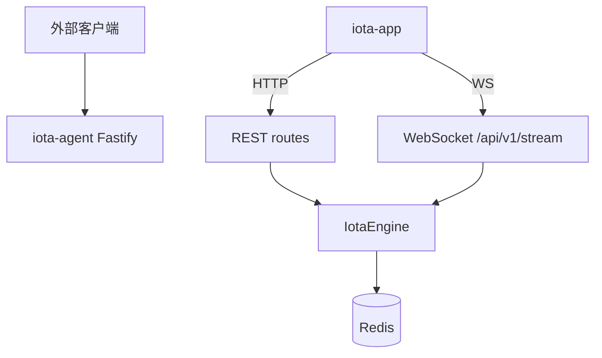

# Agent 服务指南

**版本:** 2.1  
**最后更新:** 2026-04-30

## 1. 概述

`iota-agent` 是基于 Fastify 的 HTTP/WebSocket 服务，默认运行在 9666 端口。它在进程内导入 `@iota/engine`，使用 `DeferredApprovalHook`，并向 App 推送 snapshot/delta 读取模型。



---

## 2. 安装与启动

```bash
cd iota-agent
bun install
bun run build
bun run dev    # 监听 0.0.0.0:9666
```

验证：

```bash
curl http://localhost:9666/health
curl http://localhost:9666/healthz
```

---

## 3. REST API

### Session

| 方法 | 路径 | 说明 |
|---|---|---|
| POST | `/api/v1/sessions` | 创建 session |
| GET | `/api/v1/sessions/:sessionId` | 获取 session 详情 |
| DELETE | `/api/v1/sessions/:sessionId` | 删除 session |
| PUT | `/api/v1/sessions/:sessionId/backend` | 切换 session backend |
| GET | `/api/v1/sessions/:sessionId/app-snapshot` | 获取完整 App snapshot |
| PUT | `/api/v1/sessions/:sessionId/files` | 更新活跃文件 |
| GET | `/api/v1/sessions/:sessionId/files/:path` | 读取工作区文件 |
| POST | `/api/v1/sessions/:sessionId/files` | 写入工作区文件 |

### Execution

| 方法 | 路径 | 说明 |
|---|---|---|
| POST | `/api/v1/execute` | 创建并执行 |
| GET | `/api/v1/executions/:executionId` | 获取执行详情 |
| GET | `/api/v1/executions/:executionId/events` | 获取执行事件 |
| POST | `/api/v1/executions/:executionId/interrupt` | 中断执行 |

### Config

| 方法 | 路径 | 说明 |
|---|---|---|
| GET | `/api/v1/config` | 获取 resolved config，可带 backend/sessionId/userId query |
| GET | `/api/v1/config/:scope` | 获取 global 配置或列出 scope IDs |
| GET | `/api/v1/config/:scope/:scopeId` | 获取 scoped config |
| POST | `/api/v1/config` | 写 global key/value |
| POST | `/api/v1/config/:scope/:scopeId` | 写 scoped key/value |
| DELETE | `/api/v1/config/global/:key` | 删除 global key |
| DELETE | `/api/v1/config/:scope/:scopeId/:key` | 删除 scoped key |

`scope` 取值：`global`、`backend`、`session`、`user`。

### Visibility / Trace

| 方法 | 路径 | 说明 |
|---|---|---|
| GET | `/api/v1/executions/:executionId/visibility` | 获取完整 `ExecutionVisibility` |
| GET | `/api/v1/executions/:executionId/visibility/memory` | 获取 memory visibility |
| GET | `/api/v1/executions/:executionId/visibility/tokens` | 获取 token ledger |
| GET | `/api/v1/executions/:executionId/visibility/chain` | 获取 link/spans/mappings |
| GET | `/api/v1/executions/:executionId/trace` | 获取 trace tree |
| GET | `/api/v1/sessions/:sessionId/visibility` | 列出 session visibility summaries |
| GET | `/api/v1/traces/aggregate` | 聚合 trace 查询 |

### Logs / Cross-session

| 方法 | 路径 | 说明 |
|---|---|---|
| GET | `/api/v1/logs` | 分布式日志查询 |
| GET | `/api/v1/logs/aggregate` | 日志聚合 |
| GET | `/api/v1/logs/replay/:executionId` | 执行 replay |
| GET | `/api/v1/cross-session/logs` | 跨 session 日志 |
| GET | `/api/v1/cross-session/logs/aggregate` | 跨 session 日志聚合 |
| GET | `/api/v1/cross-session/sessions` | session 列表 |
| GET | `/api/v1/cross-session/memories/search` | 跨 session memory 搜索 |

---

## 4. WebSocket 协议

连接: `ws://localhost:9666/api/v1/stream`

### 入站消息

```typescript
{ type: "execute", sessionId, executionId?, prompt, workingDirectory?, backend?, approvals? }
{ type: "subscribe_app_session", sessionId, include? }
{ type: "subscribe_visibility", executionId, kinds? }
{ type: "interrupt", executionId }
{ type: "approval_decision", requestId, executionId?, decision?: "approve"|"deny", approved?: boolean, reason? }
```

`approved` 是兼容旧 App payload 的字段；新客户端应发送 `decision`。

### 出站消息

```typescript
{ type: "event", executionId, event }
{ type: "complete", executionId }
{ type: "error", executionId?, error }
{ type: "app_snapshot", sessionId, snapshot }
{ type: "app_delta", sessionId, delta, revision? }
{ type: "visibility_snapshot", executionId, sessionId?, visibility }
{ type: "approval_result", requestId, resolved }
{ type: "subscribed", sessionId, include }
{ type: "subscribed_visibility", executionId, kinds }
{ type: "pubsub_event", channel, message }
```

### Deferred approval 流程

1. Engine policy 进入 `ask` 时，`DeferredApprovalHook` 生成 `requestId`。
2. Agent 通过 `engine.onDeferredApprovalRequest()` 监听 request。
3. Agent 向已订阅该 session 的 App 推送 `app_delta`，其中 `item.metadata.approval.id` 是真实 `requestId`。
4. App 发送 `approval_decision`。
5. Agent 调用 `engine.resolveApproval(requestId, decision)` 并返回 `approval_result`。

---

## 5. App 读取模型

Agent 将 RuntimeEvent + Visibility Store 整形为 App 消费的读取模型：

Backend status 的 `capabilities` 包含 `streaming`、`mcp`、`mcpResponseChannel`、`memoryVisibility`、`tokenVisibility`、`chainVisibility`。`mcp` 表示 backend 可使用 MCP，`mcpResponseChannel` 表示 Engine 可在执行中向 backend 回写 MCP tool result。

- `app_snapshot`: 完整 session 状态
- `app_delta`: 低延迟增量，包括 conversation、trace step、memory、tokens、summary

执行期间从 live RuntimeEvent 映射 delta；后台每 1 秒轮询 Visibility Store；执行结束后做一次 store-driven delta 回填。

---

## 6. 分布式特性

Agent 可多实例运行，共享 Redis：

- Redis pub/sub channels: `iota:execution:events`, `iota:session:updates`, `iota:config:changes`
- Agent 将 pub/sub 桥接为 WS `pubsub_event`
- App 对 `pubsub_event` 触发 session snapshot 重新同步

---

## 7. 构建与测试

```bash
cd iota-agent
bun install
bun run build        # tsc -b --force
bun run typecheck    # tsc --noEmit
bun run test         # vitest run --passWithNoTests
bun run lint
bun run format
```
