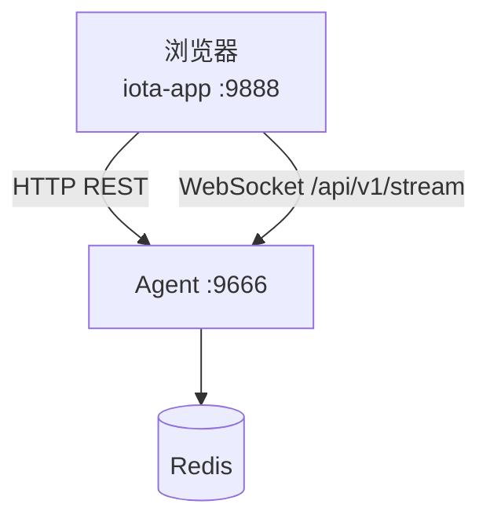

# App 应用指南

**版本:** 2.1  
**最后更新:** 2026-04-30

## 1. 概述

`iota-app` 是 Vite + React 前端，开发态默认运行在 9888 端口。它通过 HTTP REST 和 WebSocket 与 Agent 服务（默认 :9666）通信，只消费 Agent 输出的 App snapshot / delta 读取模型，不直接访问 Redis，也不消费 backend 原生协议 payload。

### 架构



---

## 2. 技术栈

| 技术 | 用途 |
|---|---|
| React 19 | UI 框架 |
| Zustand | session、execution、WebSocket 状态管理 |
| TanStack Query | HTTP 服务端状态 |
| TanStack Virtual | 对话长列表虚拟化 |
| Tailwind CSS 4 | 样式 |
| Recharts | 图表 |
| react-markdown | Markdown 渲染 |
| lucide-react | 图标 |

---

## 3. 安装与启动

```bash
# 前提: Agent 必须运行在 :9666
cd iota-app
bun install
bun run dev    # 监听 :9888
```

构建：

```bash
bun run build  # tsc -b && vite build
```

---

## 4. 核心组件

| 区域 | 文件 | 功能 |
|---|---|---|
| Layout | `src/components/layout/` | 页面布局、Sidebar |
| Sidebar | `src/components/layout/Sidebar.tsx` | Session 列表、切换 |
| ChatTimeline | `src/components/chat/ChatTimeline.tsx` | 对话历史、流式输出、审批卡片 |
| InspectorPanel | `src/components/inspector/InspectorPanel.tsx` | Visibility 数据展示 |
| ExecutionReplayModal | `src/components/inspector/ExecutionReplayModal.tsx` | 执行回放 |
| OperationsDrawer | `src/components/admin/OperationsDrawer.tsx` | 运维操作面板 |

---

## 5. 状态管理

### `useSessionStore`

`src/store/useSessionStore.ts` 管理当前前端 session 读取模型：

- `sessionId`: 当前 session ID
- `activeBackend`: 当前选择的 backend
- `workingDirectory`: 当前工作目录
- `backends`: Agent 映射后的 backend 状态
- `activeFiles`: 活跃文件列表
- `conversations`: 会话列表项
- `mcpServers`: MCP server 描述
- `sessionSnapshot`: 最近一次完整 App snapshot
- `activeExecution`: 当前聚焦 execution snapshot（单槽位）
- `wsConnected`: WebSocket 连接状态
- `sessionRevision`: delta revision，用于检测丢包后触发 snapshot resync

限制：当前 UI 只有一个 `activeExecution` 槽位，多并发执行时需要切换焦点或重新同步 snapshot。

### `useWebSocket`

`src/hooks/useWebSocket.ts` 负责：

- 建立 `/api/v1/stream` WebSocket 连接
- 连接后发送 `subscribe_app_session`
- 有 active execution 时发送 `subscribe_visibility`
- 处理 `app_snapshot`、`app_delta`、`event`、`complete`、`error`、`pubsub_event`
- revision 不连续时拉取 session snapshot 重新同步

---

## 6. 数据流

```text
WebSocket connect → subscribe_app_session(sessionId)
  → Agent 推送 app_snapshot → useSessionStore.updateSnapshot()
  → 用户输入 → execute message → Agent 推送 event/app_delta
  → useSessionStore.mergeDelta() → React re-render
  → revision gap/pubsub/complete → GET app-snapshot resync
```

### AppVisibilityDelta 类型

代码定义在 `iota-engine/src/visibility/app-read-model.ts`：

| Delta type | 用途 |
|---|---|
| `conversation_delta` | 追加对话消息、thinking、tool、approval 卡片 |
| `trace_step_delta` | 更新 trace 步骤状态 |
| `memory_delta` | 更新 memory 面板 |
| `token_delta` | 更新 token 统计 |
| `summary_delta` | 更新执行摘要 |

---

## 7. 审批 UI

`ChatTimeline` 中的审批卡片读取 conversation item metadata：

```typescript
metadata: {
  approval: {
    id: string;
    type: "shell" | "fileOutside" | "network" | "container" | "mcpExternal" | "privilegeEscalation";
    command?: string;
    path?: string;
    reason?: string;
    status?: "approved" | "denied";
  }
}
```

用户点击 approve/deny 后发送：

```json
{ "type": "approval_decision", "executionId": "...", "requestId": "...", "decision": "approve" }
```

当前 App 也保留 `approved: boolean` 兼容字段；Agent 会兼容旧字段并规范化为 Engine 的 `ApprovalDecision`。

---

## 8. Vite 代理配置

开发态 Vite 将 `/api/v1` 和 WebSocket 代理到 Agent :9666：

```typescript
server: {
  port: 9888,
  proxy: {
    '/api/v1/stream': { target: 'http://localhost:9666', ws: true, changeOrigin: true },
    '/api/v1': { target: 'http://localhost:9666', changeOrigin: true }
  }
}
```

---

## 9. 浏览器要求

- WebSocket 支持
- ES2020+ JavaScript
- CSS Grid/Flexbox
- 支持: Chrome, Firefox, Safari, Edge
