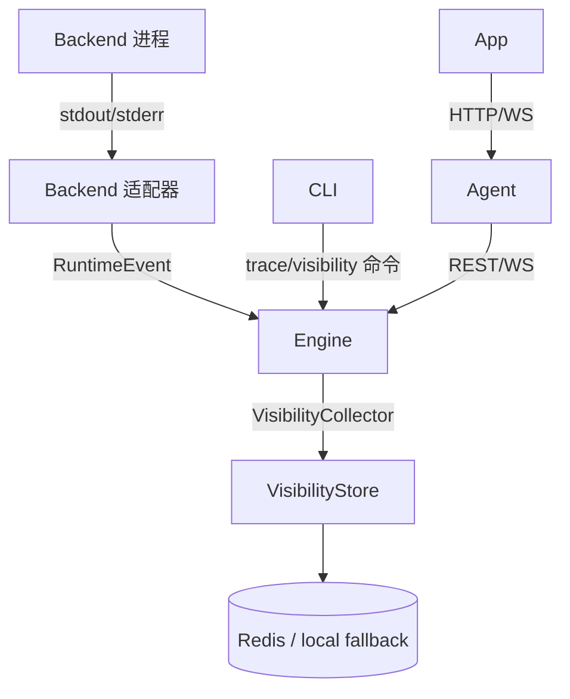

# Visibility 可观测性与 Trace 追踪

**版本:** 2.1  
**最后更新:** 2026-04-30

## 1. 概述

Visibility 是 Iota 的可观测性层，捕获执行上下文、memory 注入/抽取、token 估算或原生用量、backend link、native event 映射和 trace spans。Trace 是基于 `TraceSpan` 构建的执行树。

---

## 2. 数据流



---

## 3. ExecutionVisibility

代码定义在 `iota-engine/src/visibility/types.ts`：

```typescript
interface ExecutionVisibility {
  context?: ContextManifest;
  memory?: MemoryVisibilityRecord;
  tokens?: TokenLedger;
  link?: LinkVisibilityRecord;
  mappings?: EventMappingVisibility[];
  spans?: TraceSpan[];
}
```

### ContextManifest

```typescript
interface ContextManifest {
  sessionId: string;
  executionId: string;
  backend: BackendName;
  createdAt: number;
  policy: VisibilityPolicy;
  segments: ContextSegment[];
  totals: {
    estimatedInputTokens: number;
    maxContextTokens: number;
    budgetUsedRatio: number;
  };
}
```

`ContextSegment.kind` 当前包括：`system_prompt`、`user_prompt`、`conversation`、`injected_memory`、`active_files`、`workspace_summary`、`mcp_server_manifest`、`tool_result`、`switch_context`。

### TokenLedger

```typescript
interface TokenLedger {
  sessionId: string;
  executionId: string;
  backend: BackendName;
  input: TokenUsageBreakdown;
  output: TokenUsageBreakdown;
  total: { nativeTokens?: number; estimatedTokens: number; billableTokens?: number };
  confidence: "native" | "mixed" | "estimated";
}
```

### TraceSpan

```typescript
interface TraceSpan {
  traceId: string;
  spanId: string;
  parentSpanId?: string;
  sessionId: string;
  executionId: string;
  backend?: BackendName;
  kind: TraceSpanKind;
  startedAt: number;
  endedAt?: number;
  status: "ok" | "error" | "cancelled";
  attributes: Record<string, unknown>;
  redaction: RedactionSummary;
}
```

`TraceSpanKind` 当前包括：`engine.request`、`engine.context.build`、`memory.search`、`memory.inject`、`backend.resolve`、`backend.spawn`、`backend.stdin.write`、`backend.stdout.read`、`backend.stderr.read`、`adapter.parse`、`event.persist`、`approval.wait`、`mcp.proxy`、`workspace.scan`、`memory.extract`。

---

## 4. Redis 存储

| 数据 | Key | 类型 | TTL |
|---|---|---|---|
| Context manifest | `iota:visibility:context:{executionId}` | String JSON | policy/config |
| Memory visibility | `iota:visibility:memory:{executionId}` | String JSON | policy/config |
| Token ledger | `iota:visibility:tokens:{executionId}` | String JSON | policy/config |
| Link visibility | `iota:visibility:link:{executionId}` | String JSON | policy/config |
| Trace spans | `iota:visibility:spans:{executionId}` | List JSON | policy/config |
| Chain span hash | `iota:visibility:{executionId}:chain` | Hash | policy/config |
| Event mapping | `iota:visibility:mapping:{executionId}` | List JSON | policy/config |
| Session index | `iota:visibility:session:{sessionId}` | Sorted Set | policy/config |

---

## 5. VisibilityPolicy

```typescript
type VisibilityLevel = "off" | "summary" | "preview" | "full";

interface VisibilityPolicy {
  memory: VisibilityLevel;
  tokens: VisibilityLevel;
  chain: VisibilityLevel;
  rawProtocol: VisibilityLevel;
  previewChars: number;
  persistFullContent: boolean;
  redactSecrets: boolean;
}
```

默认策略：memory `preview`，tokens/chain `summary`，rawProtocol `off`，`redactSecrets: true`。

---

## 6. 访问方式

### CLI

```bash
iota trace --execution <executionId>
iota trace --execution <executionId> --json
iota trace --session <sessionId> --aggregate

iota visibility --execution <executionId>
iota visibility --execution <executionId> --memory
iota visibility --execution <executionId> --tokens
iota visibility --execution <executionId> --chain
iota visibility --execution <executionId> --trace
iota visibility list --session <sessionId>
iota visibility search --session <sessionId> --prompt "keyword"
```

### Agent REST

```bash
GET /api/v1/executions/:executionId/visibility
GET /api/v1/executions/:executionId/visibility/memory
GET /api/v1/executions/:executionId/visibility/tokens
GET /api/v1/executions/:executionId/visibility/chain
GET /api/v1/executions/:executionId/trace
GET /api/v1/sessions/:sessionId/visibility
GET /api/v1/traces/aggregate
```

### WebSocket

```json
{ "type": "subscribe_visibility", "executionId": "...", "kinds": ["memory", "tokens", "chain", "summary"] }
```

Agent 初始推送：

```json
{ "type": "visibility_snapshot", "executionId": "...", "sessionId": "...", "visibility": { } }
```

后续通过 `app_delta` 推送 `memory_delta`、`token_delta`、`trace_step_delta`、`summary_delta`。

---

## 7. Redaction

Visibility、audit、snapshot、replay、logs 和 App fixtures 都必须保持 secret redaction。Engine 在持久化 visibility 前使用 `redactStructuredData`、`redactText`、`redactArgs` 等工具处理敏感值。

---

## 8. Agent Visibility 推送机制

Agent 的 `subscribe_visibility` 是混合机制：

1. 订阅后读取 visibility store 推送 `visibility_snapshot`
2. 执行期间从 live RuntimeEvent 映射 App delta
3. 后台每 1 秒轮询 Visibility Store，发现 hash 变化后回填 delta
4. 执行结束后再做一次 store-driven delta 回填
