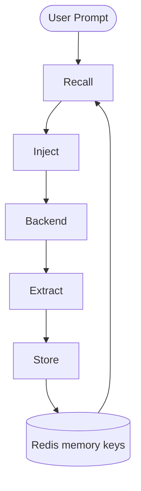

# Memory 记忆系统

**版本:** 2.1  
**最后更新:** 2026-04-30

## 1. 核心理念

Iota 的 Memory 模块将“记忆”从 backend 内部抽离到 Engine 层，使后端变成可热插拔的执行器。Memory 生命周期由 Engine 管理：Extract → Store → Recall → Inject。



---

## 2. 分类模型

```typescript
type MemoryType = "semantic" | "episodic" | "procedural";
type SemanticFacet = "identity" | "preference" | "strategic" | "domain";
type MemoryScope = "session" | "project" | "user";
```

| type | facet | 含义 | 默认 scope | 典型 TTL |
|---|---|---|---|---|
| semantic | identity | 用户身份、角色 | user | 长期 |
| semantic | preference | 偏好、习惯 | user | 长期 |
| semantic | strategic | 项目目标、决策 | project | 中期 |
| semantic | domain | 领域事实 | project/user | 中期 |
| procedural | — | 操作步骤、命令 | project | 短中期 |
| episodic | — | 经历叙事、复盘 | session | 短期 |

---

## 3. StoredMemory Schema

```typescript
interface StoredMemory {
  id: string;
  type: MemoryType;
  facet?: SemanticFacet;
  scope: MemoryScope;
  scopeId: string;
  content: string;
  contentHash: string;
  embeddingJson?: string;
  source: { backend, nativeType, executionId };
  metadata: Record<string, unknown>;
  confidence: number;
  timestamp: number;
  ttlDays: number;
  createdAt: number;
  lastAccessedAt: number;
  accessCount: number;
  expiresAt: number;
}
```

---

## 4. Redis 存储布局

当前实现主要在 `iota-engine/src/storage/redis.ts`：

| 数据 | Key | 类型 |
|---|---|---|
| Memory entity | `iota:memory:{type}:{memoryId}` | Hash |
| Type/scope/facet index | `iota:memories:{type}:{scopeId}[:facet]` | Sorted Set |
| Backend index | `iota:memory:by-backend:{backend}` | Set |
| Tag index | `iota:memory:by-tag:{tag}` | Set |
| Hash dedup | `iota:memory:hashes:{type}:{scopeId}[:facet]:{contentHash}` | Set |
| History | `iota:memory:history:{memoryId}` | Sorted Set |

---

## 5. 写入：Store / Extract

`MemoryStorage.store()` 当前行为：

1. 计算 `contentHash = md5(trimmed content)`。
2. 通过 `findUnifiedMemoryByHash()` 查重。
3. 如果命中，调用 `touchUnifiedMemories()` 增加访问计数，并写入 `history` 的 `UPDATE` 记录。
4. 如果未命中，调用 `EmbeddingProviderChain.embed()` 生成 embedding，存入 `embeddingJson`。
5. 写入 Redis Hash、type/scope/facet index、hash dedup set、backend/tag index，并写入 `history` 的 `ADD` 记录。

执行完成后的 memory extraction 由 Engine 调用 `MemoryExtractor` 和存储层完成；当前抽取仍以启发式/结构化信号为主，不是完整 LLM merge pipeline。

---

## 6. 读取：Recall + Inject

`MemoryInjector.buildContext()` 当前固定查询 6 个桶，并为每个查询生成 prompt embedding：

| 桶 | Query | limit | minConfidence |
|---|---|---|---|
| identity | semantic/user/default-or-userId | 20 | 0.85 |
| preference | semantic/user/default-or-userId | 30 | 0.8 |
| strategic | semantic/project/projectId-or-workingDirectory | 30 | 0.8 |
| domain | semantic/project/projectId-or-workingDirectory | 50 | 0.8 |
| procedural | procedural/project/projectId-or-workingDirectory | 10 | 0.75 |
| episodic | episodic/session/sessionId | 20 | 0.7 |

`MemoryStorage.retrieve()` 行为：

- 如果 query 带 vector 且 storage 支持 `searchByVector()`，按 cosine similarity 排序。
- 否则调用 `loadUnifiedMemories()`，按 index score 读取。
- 读取后调用 `touchUnifiedMemories()` 更新访问计数。

`injectMemoryWithVisibility()` 负责 token budget：默认 4096，identity 预留 256，preference 预留 512，其余共享；超预算时可截断并记录 visibility。

---

## 7. Embedding 支持

| Provider | 文件 | 说明 |
|---|---|---|
| HashEmbeddingProvider | `memory/embedding.ts` | 默认低依赖向量 |
| OllamaEmbeddingProvider | `memory/embedding.ts` | 本地 Ollama |
| OpenAIEmbeddingProvider | `memory/embedding.ts` | OpenAI-compatible embedding API |
| EmbeddingProviderChain | `memory/embedding.ts` | 按优先级链式调用 |

当前 vector 搜索是 scope 内加载候选后计算 cosine similarity，不是 Milvus/RediSearch 原生索引。

---

## 8. Memory Visibility

每次记忆注入都产生 visibility 记录，存储在 `iota:visibility:memory:{executionId}`：

- candidates：参与候选的记忆
- selected：注入 backend 的记忆及 segmentId
- excluded：被排除的记忆和原因
- extraction：执行结束后的抽取结果

---

## 9. 已实现与待完善

### 已实现

- type + facet + scope memory schema
- Redis Hash + Sorted Set 索引
- contentHash 去重与 touch
- memory history (`ADD` / `UPDATE`)
- embeddingJson 存储
- scope 内 vector scoring fallback
- `getUserProfile()` 便捷 API
- Memory visibility 记录与 App memory delta

### 待完善

- LLM Extractor 的 ADD/UPDATE/NONE 合并决策
- Entity extraction 与实体关联召回增强
- Milvus 或其他大规模向量后端
- Session close episodic compaction
- 更明确的软过期策略：identity/preference 衰减而非硬删
- 召回综合公式参数化：confidence、recency、accessCount、vectorScore 的统一权重

---

## 10. 跨后端延续验证

```bash
cd iota-cli
node dist/index.js run --backend claude-code --trace "我叫张明，是架构师"
node dist/index.js run --backend codex --trace "我是谁？"
node dist/index.js run --backend gemini --trace "我偏好中文回答"
node dist/index.js run --backend hermes --trace "总结你对我的了解"
node dist/index.js run --backend opencode --trace "回顾我之前的对话"
```

关键判断：只要 Extract/Store/Recall/Inject 在 Engine 层，后端可替换而 memory 不应丢失。实际验收要结合 visibility memory 面板和 Redis memory keys 检查。
