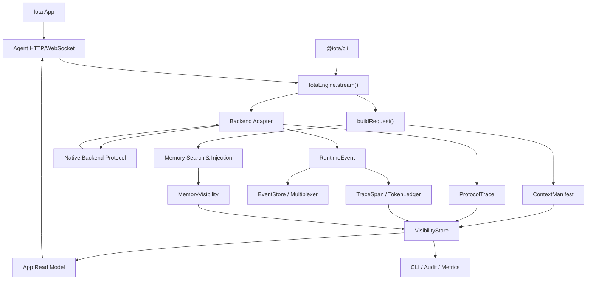
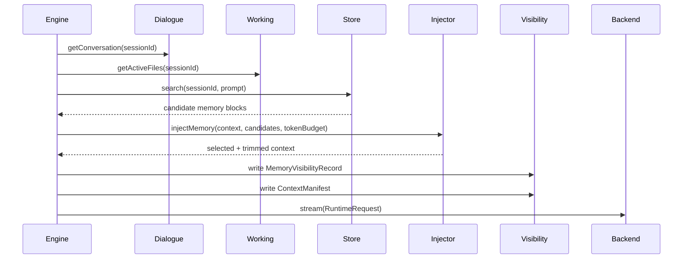

# Iota Engine 可见性机制增量设计

> 日期：2026-04-25
> 范围：在当前 Iota Engine MVP 架构上，面向 Iota App 增量补齐 **记忆体内容可见性**、**Token 可见性**、**Iota 与基座引擎链路可见性**。
> 约束：继续保持 Engine 内部 adapter 适配原生协议；不引入额外协议转换可执行文件；四个底座 Claude Code、Codex、Gemini CLI、Hermes Agent 都必须接入同一套机制。

## 实现状态说明

**当前实现状态（2026-04-25，本轮按当前代码重新核查）：**

✅ **已实现或基本可用：**
- Engine API：`getExecutionVisibility()`, `listSessionVisibility()`
- CLI visibility 命令：execution/session 查询、列表、搜索、交互式轮询、JSON/YAML/CSV 导出
- Agent HTTP API：execution visibility、session visibility、execution-level app snapshot、session-level app snapshot
- Visibility 基础设施：Collector, Store (Redis/Local), Token Estimator, Redaction, App Read Model Builder
- 配置入口：`visibility` 配置段已进入 `IotaConfig` 和默认配置
- Redis visibility key 可跟随 `eventRetentionHours`，LocalVisibilityStore 已有 GC，Metrics 已开始接入 visibility 派生指标
- 链路可见性已覆盖 command/process/native event/mapping，以及 `backend.spawn`、`backend.resolve`、`stdin/stdout/stderr`、`adapter.parse`、`event.persist`、`approval.wait`、`mcp.proxy` 等关键 span
- App Snapshot 已包含用户 prompt、动态 backend status/capability 映射和 active files
- Agent WebSocket 已支持 `subscribe_visibility`，并在 execution 完成后或订阅轮询中从 VisibilityStore 推送 memory/token/chain/summary delta

🔄 **部分实现但未达到设计验收：**
- Hermes 长驻进程链路：warm process 已记录 `LinkVisibilityRecord`，并通过 `scope=process|execution` 区分进程级与 execution 级 trace；仍需补充多 execution 串线集成测试。
- Native usage：Claude/Gemini/Hermes 已提取部分 usage，Codex 仍依赖通用映射；仍需用真实 CLI 输出扩充四后端集成样本。
- WebSocket App delta：已支持 VisibilityStore 驱动的订阅轮询和执行完成后的 delta 推送；仍需补充去重、断线重连和跨连接压力测试。

❌ **仍未实现：**
- 独立的 CLI 架构组件拆分：VisibilityClient, VisibilityFormatter, VisibilityMonitor, VisibilityExporter 仍以内聚命令模块形式存在，尚未拆为独立服务类
- Visibility full-content 引用的短 TTL 策略尚未实现
- Agent WebSocket、Hermes 长驻进程真实子进程、CLI visibility 全命令矩阵仍缺少集成测试

本轮详细待修复问题记录在本文档末尾。

本文档描述完整的设计目标，包括已实现和计划实现的功能。

---

## 1. 文档定位

当前 Iota Engine 已具备统一执行、事件归一化、记忆注入、Workspace 快照、审批、审计和 Metrics 能力。本文档不是替换既有架构，而是在既有 RuntimeEvent、Memory、Audit、Metrics、Storage 之上增加一层 **Visibility Plane（可见性平面）**。

Iota Engine 的最终服务对象是 **Iota App**。参考 `docs/iota_design.png`，App 首屏包含四底座切换、对话主区、Session Tracing、记忆面板、Token 使用统计和当前会话摘要。因此 Visibility Plane 不只服务后端调试，还要形成稳定的 App Read Model，让前端无需理解四个基座的原生协议差异，也无需从 raw events 自行拼装业务视图。

Visibility Plane 的目标是回答三类问题：

1. **模型看到了什么记忆内容？**
   哪些对话记忆、活跃文件、经验记忆被检索、筛选、裁剪并注入给基座；哪些记忆被排除；最终注入内容占用多少上下文预算。

2. **Token 如何被使用？**
   请求构建、系统提示词、用户输入、历史对话、注入记忆、工具结果、基座输出分别消耗多少 token；其中哪些是基座原生上报，哪些是 Iota 估算。

3. **Iota 到基座的链路发生了什么？**
   Iota 如何选择 backend、如何启动或复用 subprocess、发送了什么归一化请求、收到哪些原生事件、如何转换为 RuntimeEvent、审批和 MCP 代理如何穿过链路。

---

## 2. 设计目标

### 2.1 必须达成

- 四个 backend 通过统一 Visibility API 暴露可见性数据。
- 不改变当前的执行主路径：`IotaEngine.stream()` 仍然产出 `RuntimeEvent`。
- 可见性数据可被 App、CLI、HTTP API、WebSocket、审计日志和调试工具消费。
- `@iota/agent` 作为 App 的服务边界，必须提供查询型 snapshot 和实时 delta 两类接口。
- 记忆可见性必须覆盖候选、选中、裁剪、注入、提取、持久化和 GC 生命周期。
- Token 可见性必须同时支持原生 usage 和 Iota fallback 估算。
- 链路可见性必须覆盖 Iota 层、adapter 层和基座原生协议层。
- 所有敏感字段必须脱敏，尤其是 API key、auth token、环境变量、审批 payload 中的秘密值。

### 2.2 不在本次范围

- 不实现新的容器沙箱或 syscall 级拦截。
- 不引入 OpenTelemetry exporter 作为强依赖；可以预留导出接口。
- 不修改四个基座的原生协议，不 fork vendor CLI。
- 不把完整 prompt 默认写入审计日志；完整内容可见性必须受配置控制。

---

## 3. 核心概念

### 3.1 Visibility Plane

**Visibility Plane** 是 Iota Engine 内部的横向观测层，位于请求构建、后端 adapter、事件存储、记忆系统、审计和 Metrics 之间。



Visibility Plane 不替代 RuntimeEvent，而是补充 RuntimeEvent 中缺少的上下文解释信息。

### 3.2 App Read Model

**App Read Model** 是 `@iota/agent` 面向 App 输出的聚合视图。Engine 负责生成事实，Agent 负责把事实整理成前端稳定消费的数据结构，App 只负责展示和交互。

参考 App 设计图，Read Model 至少包含六个区域：

| App 区域 | 数据来源 | Engine/Agent 输出 |
|---|---|---|
| 顶部底座切换 | Session activeBackend、backend status | `BackendStatusView` |
| 对话主区 | RuntimeEvent output、state、tool call | `ConversationTimelineView` |
| Session Tracing | TraceSpan、LinkVisibilityRecord、EventMappingVisibility | `SessionTracingView` |
| 记忆面板 | MemoryVisibilityRecord、MemoryStore | `MemoryPanelView` |
| Token 使用统计 | TokenLedger、ContextManifest | `TokenStatsView` |
| 当前会话摘要 | SessionRecord、execution summary、memory summary | `SessionSummaryView` |

Agent 不应把 raw visibility 直接原样暴露给 App 主界面，而应提供两个层次：

- `snapshot`：页面初始加载或刷新时使用，返回当前 session/execution 的完整聚合状态。
- `delta`：WebSocket 实时推送，返回局部变化，例如新增输出、trace step 完成、token 更新、记忆命中。

```ts
interface AppExecutionSnapshot {
  sessionId: string;
  executionId: string;
  backend: BackendName;
  conversation: ConversationTimelineView;
  tracing: SessionTracingView;
  memory: MemoryPanelView;
  tokens: TokenStatsView;
  summary: SessionSummaryView;
}

type AppVisibilityDelta =
  | { type: 'conversation_delta'; executionId: string; item: ConversationTimelineItem }
  | { type: 'trace_step_delta'; executionId: string; step: TraceStepView }
  | { type: 'memory_delta'; executionId: string; memory: MemoryPanelDelta }
  | { type: 'token_delta'; executionId: string; tokens: TokenStatsView }
  | { type: 'summary_delta'; executionId: string; summary: SessionSummaryView };
```

### 3.3 Context Manifest

**ContextManifest** 描述一次执行前 Iota 构造给基座的上下文组成。它不一定保存完整内容，默认保存摘要、长度、hash、token 估算和裁剪原因。

```ts
interface ContextManifest {
  sessionId: string;
  executionId: string;
  backend: BackendName;
  createdAt: number;
  policy: VisibilityPolicy;
  segments: ContextSegment[];
  totals: {
    estimatedInputTokens: number;
    maxContextTokens: number;
    budgetUsedRatio: number;
  };
}

type ContextSegmentKind =
  | 'system_prompt'
  | 'user_prompt'
  | 'conversation'
  | 'injected_memory'
  | 'active_files'
  | 'workspace_summary'
  | 'mcp_server_manifest'
  | 'tool_result'
  | 'switch_context';

interface ContextSegment {
  id: string;
  kind: ContextSegmentKind;
  source: 'iota' | 'user' | 'memory_store' | 'workspace' | 'mcp' | 'backend';
  visibleToBackend: boolean;
  contentHash: string;
  preview?: string;
  fullContentRef?: string;
  charCount: number;
  estimatedTokens: number;
  nativeTokens?: number;
  redaction: RedactionSummary;
  metadata?: Record<string, unknown>;
}
```

### 3.4 Token Ledger

**TokenLedger** 是一次 execution 的 token 分账单。它区分两类来源：

- `native`：基座原生协议直接上报。
- `estimated`：Iota 使用统一估算器计算。

```ts
interface TokenLedger {
  sessionId: string;
  executionId: string;
  backend: BackendName;
  input: TokenUsageBreakdown;
  output: TokenUsageBreakdown;
  total: {
    nativeTokens?: number;
    estimatedTokens: number;
    billableTokens?: number;
  };
  confidence: 'native' | 'mixed' | 'estimated';
}

interface TokenUsageBreakdown {
  nativeTokens?: number;
  estimatedTokens: number;
  bySegment: Array<{
    segmentId: string;
    kind: ContextSegmentKind | 'assistant_output' | 'tool_output' | 'native_thinking';
    estimatedTokens: number;
    nativeTokens?: number;
  }>;
}
```

这里的 token 指模型上下文和输出 token。认证 token、API key、Bearer token 永远不进入 TokenLedger，只记录脱敏后的配置来源，例如 `env:IOTA_AUTH_TOKEN present=true`。

### 3.5 Trace Span

**TraceSpan** 记录 Iota 到基座的链路节点。它是轻量级 span，不要求立即接入 OpenTelemetry。

```ts
type TraceSpanKind =
  | 'engine.request'
  | 'engine.context.build'
  | 'memory.search'
  | 'memory.inject'
  | 'backend.resolve'
  | 'backend.spawn'
  | 'backend.stdin.write'
  | 'backend.stdout.read'
  | 'backend.stderr.read'
  | 'adapter.parse'
  | 'event.persist'
  | 'approval.wait'
  | 'mcp.proxy'
  | 'workspace.scan'
  | 'memory.extract';

interface TraceSpan {
  traceId: string;
  spanId: string;
  parentSpanId?: string;
  sessionId: string;
  executionId: string;
  backend?: BackendName;
  kind: TraceSpanKind;
  startedAt: number;
  endedAt?: number;
  status: 'ok' | 'error' | 'cancelled';
  attributes: Record<string, unknown>;
  redaction: RedactionSummary;
}
```

---

## 4. 记忆体内容可见性

### 4.1 当前记忆结构对齐

当前 Iota 已有三类记忆结构：

| 结构 | 生命周期 | 是否持久化 | 当前作用 | 可见性补充 |
|---|---:|---:|---|---|
| DialogueMemory | 进程内 | 否 | 历史对话注入 `context.conversation` | 记录注入的轮次、角色、hash、token、是否被裁剪 |
| WorkingMemory | 进程内 | 否 | 活跃文件路径注入 `context.activeFiles` | 记录文件路径列表、来源 execution、是否真实读取内容 |
| MemoryStore | 跨执行 | 是 | 经验记忆检索并注入 `context.injectedMemory` | 记录候选、排序、得分、选中、裁剪、排除原因 |

新增机制不改变三者职责，只增加可见性记录。

### 4.2 MemoryVisibilityRecord

```ts
interface MemoryVisibilityRecord {
  sessionId: string;
  executionId: string;
  backend: BackendName;
  createdAt: number;
  query: {
    promptHash: string;
    preview?: string;
    searchTextTokens: number;
  };
  candidates: MemoryCandidateVisibility[];
  selected: MemorySelectedVisibility[];
  excluded: MemoryExcludedVisibility[];
  extraction?: MemoryExtractionVisibility;
}

interface MemoryCandidateVisibility {
  memoryId: string;
  type?: MemoryKind;
  source: 'dialogue' | 'working' | 'store' | 'milvus' | 'redis' | 'in_memory';
  score?: number;
  contentHash: string;
  preview?: string;
  charCount: number;
  estimatedTokens: number;
  metadata?: Record<string, unknown>;
}

interface MemorySelectedVisibility extends MemoryCandidateVisibility {
  injectedSegmentId: string;
  trimmed: boolean;
  trimmedFromTokens?: number;
  trimmedToTokens?: number;
  visibleToBackend: true;
}

interface MemoryExcludedVisibility extends MemoryCandidateVisibility {
  reason:
    | 'low_score'
    | 'duplicate'
    | 'token_budget_exceeded'
    | 'visibility_policy'
    | 'session_scope_mismatch'
    | 'redacted'
    | 'backend_context_limit';
}

interface MemoryExtractionVisibility {
  extracted: boolean;
  reason?: 'output_too_short' | 'policy_disabled' | 'backend_failed' | 'no_signal';
  memoryId?: string;
  type?: MemoryKind;
  contentHash?: string;
  estimatedTokens?: number;
  persistedTo?: Array<'memory_map' | 'redis' | 'milvus'>;
}
```

### 4.3 记忆可见性流程



### 4.4 可见性级别

```ts
type VisibilityLevel = 'off' | 'summary' | 'preview' | 'full';

interface VisibilityPolicy {
  memory: VisibilityLevel;
  tokens: VisibilityLevel;
  chain: VisibilityLevel;
  rawProtocol: VisibilityLevel;
  previewChars: number;
  persistFullContent: boolean;
  redactSecrets: boolean;
}
```

推荐默认值：

```yaml
visibility:
  memory: preview
  tokens: summary
  chain: summary
  rawProtocol: off
  previewChars: 240
  persistFullContent: false
  redactSecrets: true
```

含义：

- `off`：不记录该类可见性数据。
- `summary`：只记录 hash、长度、token 和状态。
- `preview`：记录短 preview，便于调试。
- `full`：记录完整内容引用，仅允许本地开发或显式开启。

---

## 5. Token 可见性

### 5.1 Token 来源分层

| 来源 | 描述 | 计算方式 |
|---|---|---|
| System Prompt | Iota 或用户传入的系统提示词 | Iota 估算 |
| User Prompt | 当前请求 prompt | Iota 估算 |
| Conversation | DialogueMemory 注入内容 | Iota 估算 |
| Injected Memory | MemoryStore 检索并注入内容 | Iota 估算 |
| Active Files | 活跃文件路径和摘要 | Iota 估算 |
| Workspace Summary | switch/snapshot 上下文摘要 | Iota 估算 |
| Tool Result | MCP 或 backend native tool 的结果 | Iota 估算，部分后端可原生上报 |
| Assistant Output | 模型输出 | Iota 估算 + backend 原生 usage |
| Native Thinking | 基座若暴露 thinking/reasoning usage | 仅在原生协议可见时记录 |

### 5.2 估算策略

MVP 阶段使用统一轻量估算器：

```ts
interface TokenEstimator {
  estimate(text: string, backend: BackendName, model?: string): number;
}
```

默认实现沿用 `ceil(charCount / 4)` 的近似策略；后续可以按模型接入 tokenizer，但不能阻塞四后端统一落地。

### 5.3 原生 usage 合并

四个底座的 usage 可见性不一致，因此采用合并策略：

1. Adapter 从原生事件中提取 usage，写入 `extension` 事件或 response `usage`。
2. Engine 总是计算 estimated usage。
3. 如果原生 usage 存在，TokenLedger 的 `confidence` 为 `native` 或 `mixed`。
4. 如果原生 usage 不存在，TokenLedger 的 `confidence` 为 `estimated`。

```ts
interface NativeUsageVisibility {
  backend: BackendName;
  sourceEventRef?: string;
  inputTokens?: number;
  outputTokens?: number;
  totalTokens?: number;
  reasoningTokens?: number;
  cacheReadTokens?: number;
  cacheWriteTokens?: number;
  raw?: Record<string, unknown>;
}
```

### 5.4 四后端 token 能力矩阵

| Backend | 原生协议 | Token 原生可见性 | Iota fallback | 备注 |
|---|---|---:|---:|---|
| Claude Code | `stream-json` NDJSON | 取决于 CLI 输出字段 | 必须支持 | adapter 解析 message/result usage；无字段时估算 |
| Codex | `codex exec` NDJSON | 取决于 Codex CLI 事件 | 必须支持 | adapter 保留 usage extension；无字段时估算 |
| Gemini CLI | `stream-json` NDJSON | 取决于 Gemini CLI 输出字段 | 必须支持 | prompt 经 stdin，仍可按 segments 估算输入 |
| Hermes Agent | ACP JSON-RPC 2.0 | 可通过 ACP message/result 扩展 | 必须支持 | 长驻进程需按 executionId 聚合 |

---

## 6. Iota 与基座引擎链路可见性

### 6.1 链路边界

链路可见性分三层：

| 层 | 责任 | 示例 |
|---|---|---|
| Engine Layer | session、execution、路由、锁、fencing、审批、MCP、事件持久化 | `backend.resolve`、`event.persist` |
| Adapter Layer | request 映射、subprocess 管理、stdout/stderr 解析、原生事件转换 | `backend.spawn`、`adapter.parse` |
| Native Layer | vendor CLI 原生协议片段 | Claude stream-json、Codex NDJSON、Gemini stream-json、Hermes ACP |

默认只暴露 Engine + Adapter summary。Native raw protocol 必须显式开启。

### 6.2 LinkVisibilityRecord

```ts
interface LinkVisibilityRecord {
  traceId: string;
  sessionId: string;
  executionId: string;
  backend: BackendName;
  command: {
    executable: string;
    args: string[];
    envSummary: Record<string, 'present' | 'absent' | 'redacted'>;
    workingDirectory: string;
  };
  process?: {
    pid?: number;
    startedAt: number;
    exitedAt?: number;
    exitCode?: number | null;
    signal?: string | null;
  };
  protocol: {
    name: 'ndjson' | 'stream-json' | 'json-rpc-2.0' | 'acp';
    stdinMode: 'prompt' | 'json_rpc' | 'none';
    stdoutMode: 'ndjson' | 'json_rpc' | 'text';
    stderrCaptured: boolean;
  };
  spans: TraceSpan[];
  nativeEventRefs: NativeEventRef[];
}

interface NativeEventRef {
  refId: string;
  direction: 'stdin' | 'stdout' | 'stderr';
  timestamp: number;
  rawHash: string;
  preview?: string;
  parsedAs?: RuntimeEvent['type'] | 'ignored' | 'parse_error';
  runtimeSequence?: number;
  redaction: RedactionSummary;
}
```

### 6.3 事件映射可见性

每个 adapter 在把原生事件转换为 `RuntimeEvent` 时，附加映射说明：

```ts
interface EventMappingVisibility {
  sessionId: string;
  executionId: string;
  backend: BackendName;
  nativeRefId: string;
  runtimeEventType: RuntimeEvent['type'];
  runtimeSequence?: number;
  mappingRule: string;
  lossy: boolean;
  droppedFields?: string[];
  preservedInExtension?: string[];
}
```

使用原则：

- 能映射到标准事件的字段进入标准 RuntimeEvent。
- 无法稳定标准化但对调试有价值的字段进入 `extension`。
- 敏感字段只保存 hash 或脱敏 preview。
- 解析失败也要产生可见性记录，避免“静默丢事件”。

---

## 7. 四个底座适配方案

### 7.1 Claude Code

当前基线：

```text
claude --print --output-format stream-json --verbose --permission-mode auto
```

增量要求：

- 在 `ClaudeCodeAdapter` 内创建 `LinkVisibilityRecord`。
- 对每行 stream-json 生成 `NativeEventRef`。
- 对 `assistant`/`result`/`tool_use`/`tool_result`/approval 事件建立 `EventMappingVisibility`。
- 从原生 usage 字段提取 `NativeUsageVisibility`；没有 usage 时使用估算。
- 记录 `--permission-mode auto` 和 Iota approval policy 的实际交互结果。

注意：

- Claude Code 是 per-execution subprocess，链路 trace 与 execution 一一对应。
- 不记录完整环境变量；只记录 `ANTHROPIC_AUTH_TOKEN` 或统一 `IOTA_AUTH_TOKEN` 是否存在。

### 7.2 Codex

当前基线：

```text
codex exec [-c model=...] [-c model_provider=...] [-c openai_api_key=...]
```

增量要求：

- 在 `CodexAdapter` 内记录 CLI 配置映射，包括 Iota 统一配置到 Codex `-c` 参数的映射。
- 对 Codex NDJSON 输出生成 `NativeEventRef`。
- 对 command approval、tool call、output delta、usage 类事件建立映射记录。
- 记录 MCP tool_result 是否通过 native response channel 写回成功。
- 认证 token 只记录来源，不记录值；`openai_api_key` 参数必须在 visibility 和 audit 中脱敏。

注意：

- 如果 Codex 当前实现为 per-execution 进程，trace 仍按 execution 聚合。
- 如果后续改为 warm process，必须通过 executionId 区分并发链路。

### 7.3 Gemini CLI

当前基线：

```text
gemini --output-format stream-json --skip-trust --prompt <prompt>
# headless prompt mode; current Gemini CLI defaults to interactive mode without --prompt
```

增量要求：

- 记录 prompt 参数写入 span：只保存 ContextManifest，不默认保存完整 prompt。
- 对 Gemini stream-json 输出建立 `NativeEventRef`。
- 对 output、tool_call、error 和 unknown event 建立映射记录。
- Gemini 原生 MCP 若由自身配置直接连接，不经过 Iota MCP Router，则可见性中标注 `mcp_path: native_backend`。
- usage 不存在时由 Iota 按 ContextManifest + output 估算。

注意：

- prompt 经 stdin 传入，必须把 stdin 写入与 ContextManifest 关联起来，否则无法复盘模型实际可见上下文。

### 7.4 Hermes Agent

当前基线：

```text
hermes acp
```

增量要求：

- Hermes 是长驻 ACP JSON-RPC 2.0 进程，`LinkVisibilityRecord` 需要区分 process-level trace 和 execution-level trace。
- 对每个 JSON-RPC request/response/notification 生成 `NativeEventRef`。
- 用 ACP request id 与 Iota executionId 建立关联。
- 对 permission request、tool call、message delta、result、error 建立映射记录。
- 对 warm process 的状态变化记录 span：`ready`、`busy`、`degraded`、`crashed`。

注意：

- 长驻进程必须避免不同 execution 的 visibility 串线。
- ACP 原始 payload 默认只保存 hash 和 preview。

### 7.5 统一能力矩阵

| 能力 | Claude Code | Codex | Gemini CLI | Hermes |
|---|---:|---:|---:|---:|
| ContextManifest | 必须 | 必须 | 必须 | 必须 |
| MemoryVisibilityRecord | 必须 | 必须 | 必须 | 必须 |
| TokenLedger estimated | 必须 | 必须 | 必须 | 必须 |
| NativeUsageVisibility | 尽力 | 尽力 | 尽力 | 尽力 |
| LinkVisibilityRecord | 必须 | 必须 | 必须 | 必须 |
| NativeEventRef | preview 可选 | preview 可选 | preview 可选 | preview 可选 |
| Raw protocol full capture | 显式开启 | 显式开启 | 显式开启 | 显式开启 |
| MCP path visibility | native/none | iota router | native/none | iota router |
| Approval path visibility | native + iota | native + iota | iota guard | native + iota |

---

## 8. 存储模型

### 8.1 VisibilityStore 接口

```ts
interface VisibilityStore {
  saveContextManifest(manifest: ContextManifest): Promise<void>;
  saveMemoryVisibility(record: MemoryVisibilityRecord): Promise<void>;
  saveTokenLedger(ledger: TokenLedger): Promise<void>;
  saveLinkVisibility(record: LinkVisibilityRecord): Promise<void>;
  appendTraceSpan(span: TraceSpan): Promise<void>;
  appendEventMapping(mapping: EventMappingVisibility): Promise<void>;

  getExecutionVisibility(executionId: string): Promise<ExecutionVisibility | null>;
  listSessionVisibility(sessionId: string, options?: VisibilityListOptions): Promise<ExecutionVisibilitySummary[]>;
}

interface ExecutionVisibility {
  context?: ContextManifest;
  memory?: MemoryVisibilityRecord;
  tokens?: TokenLedger;
  link?: LinkVisibilityRecord;
  mappings?: EventMappingVisibility[];
}
```

### 8.2 Redis key 设计

沿用现有 Redis 存储风格，新增 key：

```text
iota:visibility:context:<executionId>       JSON
iota:visibility:memory:<executionId>        JSON
iota:visibility:tokens:<executionId>        JSON
iota:visibility:link:<executionId>          JSON
iota:visibility:mapping:<executionId>       Redis Stream / List
iota:visibility:session:<sessionId>         Sorted Set executionId by timestamp
```

Retention 跟随现有 GC 配置：

- 默认与 event retention 一致。
- full content 引用必须有更短 TTL。
- raw protocol full capture 默认不进入生产环境持久化。

### 8.3 本地文件 fallback

开发模式可将 visibility 写入：

```text
~/.iota/visibility/<sessionId>/<executionId>/
  context.json
  memory.json
  tokens.json
  link.json
  mappings.jsonl
```

该 fallback 仅用于开发调试，生产仍以 Redis 为主。

---

## 9. API、CLI 与 App 服务契约

### 9.1 Engine API

新增只读方法：

```ts
class IotaEngine {
  getExecutionVisibility(executionId: string): Promise<ExecutionVisibility | null>;
  listSessionVisibility(sessionId: string, options?: VisibilityListOptions): Promise<ExecutionVisibilitySummary[]>;
}
```

`stream()` 不改变返回类型；可选地通过 `extension` 事件实时发送 visibility 摘要：

```ts
{
  type: 'extension',
  data: {
    name: 'visibility_update',
    payload: {
      kind: 'context' | 'memory' | 'tokens' | 'link',
      ref: 'iota:visibility:context:<executionId>'
    }
  }
}
```

### 9.2 CLI

**实现状态：**
- ✅ 基础查询命令已实现
- ❌ 会话级查询、交互式监控、列表搜索、导出功能为设计目标，尚未实现

新增命令：

```bash
# 基础查询（✅ 已实现）
iota visibility <executionId>
iota visibility <executionId> --memory
iota visibility <executionId> --tokens
iota visibility <executionId> --chain
iota visibility <executionId> --json

# 会话级查询（❌ 未实现）
iota visibility --session <sessionId>
iota visibility --session <sessionId> --summary

# 交互式实时监控（❌ 未实现）
iota visibility interactive [--session <sessionId>]

# 过滤与导出（❌ 未实现）
iota visibility <executionId> --backend <name>
iota visibility <executionId> --export <file>
iota visibility --session <sessionId> --export <file> --format json|yaml|csv

# 列表与搜索（❌ 未实现）
iota visibility list [--session <sessionId>] [--backend <name>] [--limit N]
iota visibility search --prompt <text> [--session <sessionId>]
```

#### 9.2.1 基础查询输出示例（✅ 已实现）

```text
Execution: exec-123
Backend: codex

Context:
  system_prompt       420 tokens estimated
  user_prompt         38 tokens estimated
  conversation        1,204 tokens estimated
  injected_memory     2,011 tokens estimated, 4 selected, 2 trimmed

Tokens:
  input               3,673 estimated
  output              914 estimated
  total               4,587 estimated
  confidence          estimated

Chain:
  backend.resolve     codex
  backend.spawn       codex exec -c model=...
  adapter.parse       42 native events -> 39 runtime events
  event.persist       last sequence 46
```

#### 9.2.2 会话级汇总输出示例（❌ 未实现）

```bash
iota visibility --session session-456 --summary
```

```text
Session: session-456
Active Backend: claude-code
Duration: 45m 23s
Executions: 12

Token Summary:
  total input         48,392 estimated
  total output        12,847 estimated
  total               61,239 estimated
  avg per execution   5,103 tokens

Memory Summary:
  dialogue turns      24
  working files       8
  store hits          47
  selected blocks     18
  trimmed blocks      6

Backend Distribution:
  claude-code         8 executions (66.7%)
  codex               3 executions (25.0%)
  gemini              1 execution  (8.3%)

Top Memory Sources:
  store/redis         28 hits
  dialogue            24 hits
  working             8 hits
```

#### 9.2.3 交互式监控输出示例（❌ 未实现）

```bash
iota visibility interactive --session session-789
```

```text
[Live] Session: session-789 | Backend: hermes | Execution: exec-890

Context Building...
  ✓ system_prompt       420 tokens
  ✓ user_prompt         38 tokens
  ✓ conversation        1,204 tokens
  ⟳ memory.search       searching...

Memory Search...
  ✓ candidates          12 found
  ✓ selected            4 blocks (2,011 tokens)
  ✓ trimmed             2 blocks

Backend Execution...
  ✓ backend.spawn       hermes acp (pid 12345)
  ⟳ adapter.parse       18 events parsed...

Tokens (live):
  input                3,673 estimated
  output               421 estimated (streaming...)

[Press Ctrl+C to exit, 'r' to refresh, 's' to save snapshot]
```

#### 9.2.4 导出格式（❌ 未实现）

JSON 导出：

```bash
iota visibility exec-123 --export visibility-exec-123.json
```

```json
{
  "executionId": "exec-123",
  "backend": "codex",
  "timestamp": "2026-04-25T08:40:21.908Z",
  "context": {
    "segments": [...],
    "totals": {...}
  },
  "memory": {
    "candidates": [...],
    "selected": [...],
    "excluded": [...]
  },
  "tokens": {
    "input": {...},
    "output": {...},
    "total": {...}
  },
  "chain": {
    "spans": [...],
    "nativeEventRefs": [...]
  }
}
```

CSV 导出（会话级汇总）：

```bash
iota visibility --session session-456 --export session-456.csv --format csv
```

```csv
executionId,backend,timestamp,inputTokens,outputTokens,totalTokens,memorySelected,memoryTrimmed,durationMs
exec-101,claude-code,2026-04-25T08:00:00Z,3420,892,4312,3,1,4200
exec-102,claude-code,2026-04-25T08:05:00Z,4102,1024,5126,5,2,5800
exec-103,codex,2026-04-25T08:12:00Z,2890,756,3646,2,0,3200
...
```

#### 9.2.5 搜索功能（❌ 未实现）

按 prompt 内容搜索历史执行：

```bash
iota visibility search --prompt "refactor authentication" --session session-456
```

```text
Found 3 executions matching "refactor authentication":

1. exec-234 | 2026-04-25 08:15:32 | claude-code
   Prompt: "refactor authentication middleware to use JWT"
   Tokens: 4,892 total | Memory: 6 selected

2. exec-267 | 2026-04-25 09:22:18 | codex
   Prompt: "continue refactoring authentication tests"
   Tokens: 3,421 total | Memory: 4 selected

3. exec-289 | 2026-04-25 10:05:44 | claude-code
   Prompt: "fix authentication token expiry logic"
   Tokens: 2,156 total | Memory: 3 selected
```

#### 9.2.6 列表与过滤（❌ 未实现）

列出最近的可见性记录：

```bash
iota visibility list --limit 10
```

```text
Recent Executions (10):

exec-345 | 2026-04-25 10:30:12 | hermes      | 5,234 tokens | 8 memory
exec-344 | 2026-04-25 10:25:08 | claude-code | 4,102 tokens | 5 memory
exec-343 | 2026-04-25 10:18:45 | codex       | 3,890 tokens | 4 memory
exec-342 | 2026-04-25 10:12:33 | claude-code | 6,721 tokens | 9 memory
exec-341 | 2026-04-25 10:05:21 | gemini      | 2,456 tokens | 3 memory
...
```

按 backend 过滤：

```bash
iota visibility list --backend claude-code --limit 5
```

```text
Recent Claude Code Executions (5):

exec-344 | 2026-04-25 10:25:08 | 4,102 tokens | 5 memory
exec-342 | 2026-04-25 10:12:33 | 6,721 tokens | 9 memory
exec-338 | 2026-04-25 09:58:17 | 3,234 tokens | 4 memory
...
```

### 9.3 HTTP API

**实现状态：**
- ✅ 所有 execution 和 session visibility 端点已实现
- ✅ Execution-level app-snapshot 已实现
- ✅ Session-level app-snapshot 已实现
- ⚠️ Session-level app-snapshot 当前仍是基础聚合：依赖 visibility summary 列表，backend capabilities 为静态填充，conversation timeline 未包含用户 prompt。

`@iota/agent` 新增：

```http
GET /executions/:executionId/visibility
GET /executions/:executionId/visibility/memory
GET /executions/:executionId/visibility/tokens
GET /executions/:executionId/visibility/chain
GET /sessions/:sessionId/visibility
GET /sessions/:sessionId/app-snapshot          # ✅ 已实现（基础聚合）
GET /executions/:executionId/app-snapshot      # ✅ 已实现
```

WebSocket 可订阅：

```json
{
  "type": "subscribe_visibility",
  "executionId": "exec-123",
  "kinds": ["memory", "tokens", "chain"]
}
```

实现状态：

- ❌ `subscribe_visibility` execution 级订阅尚未实现。
- ⚠️ `subscribe_app_session` 已有基础实现，但只在同一连接执行任务时从 RuntimeEvent 派生少量 delta，尚未订阅 visibility store 的真实增量。

### 9.4 App Snapshot API

App 不直接消费底层 `ContextManifest`、`MemoryVisibilityRecord`、`TokenLedger` 和 `LinkVisibilityRecord` 的原始组合，而是消费 Agent 聚合后的 snapshot。

```http
GET /sessions/:sessionId/app-snapshot
GET /executions/:executionId/app-snapshot
```

```ts
interface ConversationListItem {
  sessionId: string;
  title: string;
  updatedAt: number;
  lastMessagePreview?: string;
  activeBackend?: BackendName;
}

interface ConversationTimelineView {
  items: ConversationTimelineItem[];
  state: 'idle' | 'queued' | 'running' | 'waiting_approval' | 'completed' | 'failed' | 'interrupted';
}

interface ConversationTimelineItem {
  id: string;
  role: 'user' | 'assistant' | 'system' | 'tool';
  content: string;
  timestamp: number;
  executionId?: string;
  eventSequence?: number;
}

interface AppSessionSnapshot {
  session: {
    id: string;
    title?: string;
    activeBackend: BackendName;
    workingDirectory: string;
    createdAt: number;
    updatedAt: number;
  };
  backends: BackendStatusView[];
  conversations: ConversationListItem[];
  activeExecution?: AppExecutionSnapshot;
  memory: MemoryPanelView;
  tokens: TokenStatsView;
  tracing: SessionTracingView;
  summary: SessionSummaryView;
}

interface BackendStatusView {
  backend: BackendName;
  label: string;
  status: 'online' | 'offline' | 'busy' | 'degraded';
  active: boolean;
  capabilities: {
    streaming: boolean;
    mcp: boolean;
    memoryVisibility: boolean;
    tokenVisibility: boolean;
    chainVisibility: boolean;
  };
}

interface SessionTracingView {
  live: boolean;
  totalDurationMs?: number;
  steps: TraceStepView[];
  tabs: {
    overview: TraceOverviewView;
    detail: TraceDetailView;
    performance: TracePerformanceView;
  };
}

interface TraceOverviewView {
  requestMs?: number;
  backendMs?: number;
  responseMs?: number;
  completedMs?: number;
}

interface TraceDetailView {
  command?: string;
  protocol?: string;
  nativeEventCount: number;
  runtimeEventCount: number;
  parseErrorCount: number;
  approvalCount: number;
  mcpProxyCount: number;
}

interface TracePerformanceView {
  latencyMs: { p50: number; p95: number; p99: number };
  memoryHitRatio?: number;
  contextBudgetUsedRatio?: number;
  parseLossRatio?: number;
}

interface TraceStepView {
  key: 'request' | 'base_engine' | 'response' | 'complete' | 'approval' | 'mcp' | 'workspace' | 'memory';
  label: string;
  status: 'pending' | 'running' | 'completed' | 'failed' | 'skipped';
  durationMs?: number;
  count?: number;
  error?: string;
}

interface MemoryPanelView {
  tabs: {
    longTerm: MemoryCardView[];
    session: MemoryCardView[];
    knowledge: MemoryCardView[];
  };
  hitCount: number;
  selectedCount: number;
  trimmedCount: number;
}

interface MemoryPanelDelta {
  added?: MemoryCardView[];
  updated?: MemoryCardView[];
  removedIds?: string[];
  selectedCount?: number;
  trimmedCount?: number;
}

interface MemoryCardView {
  id: string;
  title: string;
  preview: string;
  tags: string[];
  updatedAt?: number;
  source: 'dialogue' | 'working' | 'store' | 'milvus' | 'redis' | 'in_memory';
  visibleToBackend: boolean;
  tokenEstimate?: number;
}

interface TokenStatsView {
  inputTokens: number;
  cacheTokens?: number;
  outputTokens: number;
  totalTokens: number;
  confidence: 'native' | 'mixed' | 'estimated';
  byBackend?: Partial<Record<BackendName, number>>;
  bySegment?: Array<{ label: string; tokens: number; kind: string }>;
}

interface SessionSummaryView {
  text: string;
  createdAt: number;
  messageCount: number;
  totalDurationMs?: number;
  lastExecutionId?: string;
}
```

### 9.5 App WebSocket Delta

现有 `/stream` WebSocket 继续发送 RuntimeEvent。为 App 增加可选订阅消息：

```json
{
  "type": "subscribe_app_session",
  "sessionId": "session-123",
  "include": ["conversation", "tracing", "memory", "tokens", "summary"]
}
```

服务端推送：

```json
{
  "type": "app_delta",
  "sessionId": "session-123",
  "executionId": "exec-123",
  "delta": {
    "type": "trace_step_delta",
    "step": {
      "key": "base_engine",
      "label": "底座引擎",
      "status": "completed",
      "durationMs": 3800,
      "count": 4
    }
  }
}
```

推送原则：

- 对话主区仍以 RuntimeEvent 为实时事实来源。
- 右侧 tracing、memory、tokens 和 summary 使用 App delta。
- App delta 可以丢弃后重拉 snapshot；因此 delta 是体验优化，不是唯一事实源。
- Agent 需要为每个 delta 带上 `sessionId`、`executionId` 和单调 `revision`，方便前端去重。

### 9.6 App 视图与底层数据映射

| App 组件 | 显示内容 | 后端聚合规则 |
|---|---|---|
| 底座切换按钮 | Claude Code、Codex、Gemini CLI、Hermes Agent 在线/忙碌/降级状态 | `engine.status()` + session `activeBackend` |
| Session Tracing 概览 | 请求处理、底座引擎、响应处理、完成 | TraceSpan 按阶段聚合 duration 和 count |
| Session Tracing 详情 | subprocess 命令、协议、事件映射、审批、MCP | LinkVisibilityRecord + EventMappingVisibility |
| Session Tracing 性能 | p50/p95、token、parse loss、memory hit ratio | Metrics + TokenLedger |
| 记忆长期记忆 | 跨执行 MemoryStore 命中和选中项 | MemoryVisibilityRecord selected/candidates |
| 记忆会话记忆 | DialogueMemory 最近消息摘要 | ContextManifest conversation segments |
| 记忆知识库 | factual/procedural/strategic blocks | MemoryStore type + metadata |
| Token 使用统计 | 输入、缓存、输出、总计 | TokenLedger，cache 无原生字段时为空或 0 |
| 当前会话摘要 | 本轮目标、消息数、耗时 | RuntimeEvent + SessionRecord + TraceSpan |

---

## 10. 安全与脱敏

### 10.1 默认脱敏规则

必须脱敏：

- `IOTA_AUTH_TOKEN`
- `OPENAI_API_KEY`
- `ANTHROPIC_API_KEY`
- `GOOGLE_API_KEY`
- `Authorization`
- `Cookie`
- `Set-Cookie`
- 任何匹配 `*_TOKEN`、`*_KEY`、`*_SECRET`、`PASSWORD` 的环境变量
- shell 命令中的常见 secret 参数，例如 `--api-key`、`--token`、`--password`

### 10.2 RedactionSummary

```ts
interface RedactionSummary {
  applied: boolean;
  fields: string[];
  patterns: string[];
  contentHashBefore?: string;
  contentHashAfter?: string;
}
```

### 10.3 内容存储策略

| 内容类型 | 默认存储 | full 模式 |
|---|---|---|
| prompt | hash + preview | encrypted/fullContentRef |
| injected memory | hash + preview | encrypted/fullContentRef |
| native raw stdout | hash only | preview/fullContentRef |
| stderr | hash + preview | fullContentRef |
| auth token/API key | 不存 | 不存 |

full 模式仍然不能保存认证 token。

---

## 11. 与现有模块的增量改造点

| 模块 | 改造点 |
|---|---|
| `event/types.ts` | 可先通过 `extension` 承载 visibility update；后续可增加显式类型 |
| `engine.ts` | `buildRequest()` 生成 ContextManifest；`runExecution()` 追加 TraceSpan 和 TokenLedger |
| `memory/injector.ts` | 返回 selected/excluded/trimmed 说明，或增加 `injectMemoryWithVisibility()` |
| `memory/store.ts` | search 返回来源、得分和候选元数据 |
| `backend/*.ts` | adapter 生成 NativeEventRef、NativeUsageVisibility、EventMappingVisibility |
| `backend/subprocess.ts` | 捕获 spawn/stdin/stdout/stderr span；统一命令脱敏 |
| `audit/logger.ts` | 增加 visibility ref，不默认写完整内容 |
| `metrics/collector.ts` | 增加 token、context budget、native parse loss 指标 |
| `storage/interface.ts` | 增加 VisibilityStore 可选接口 |
| `storage/redis.ts` | 实现 visibility key 持久化与查询 |
| `iota-cli` | 增加 `visibility` 命令及子命令：基础查询、会话汇总、交互式监控、列表、搜索、导出 |
| `iota-agent` | 增加 visibility HTTP/WebSocket 路由，并聚合 App Snapshot / App Delta |
| App 前端 | 只消费 App Read Model，不直接解析四底座 raw protocol |

推荐第一阶段不改动 `RuntimeEvent` union，先复用 `extension` 事件，降低破坏面。

---

## 11.1 CLI 实现架构

**实现状态：本节描述的架构组件为设计目标，当前仅实现了基础查询功能。**

### 11.1.1 命令结构（❌ 未实现完整接口）

`@iota/cli` 的 visibility 命令采用子命令模式：

```ts
// iota-cli/src/commands/visibility.ts

interface VisibilityCommand {
  // 基础查询
  query(executionId: string, options: QueryOptions): Promise<void>;

  // 会话级查询
  session(sessionId: string, options: SessionOptions): Promise<void>;

  // 交互式监控
  interactive(options: InteractiveOptions): Promise<void>;

  // 列表
  list(options: ListOptions): Promise<void>;

  // 搜索
  search(options: SearchOptions): Promise<void>;

  // 导出
  export(target: string, options: ExportOptions): Promise<void>;
}

interface QueryOptions {
  memory?: boolean;
  tokens?: boolean;
  chain?: boolean;
  json?: boolean;
}

interface SessionOptions {
  summary?: boolean;
  json?: boolean;
}

interface InteractiveOptions {
  sessionId?: string;
  executionId?: string;
  refreshInterval?: number; // ms, default 500
}

interface ListOptions {
  sessionId?: string;
  backend?: BackendName;
  limit?: number; // default 10
  offset?: number;
  json?: boolean;
}

interface SearchOptions {
  prompt: string;
  sessionId?: string;
  backend?: BackendName;
  limit?: number;
  json?: boolean;
}

interface ExportOptions {
  format?: 'json' | 'yaml' | 'csv';
  output?: string; // file path
  pretty?: boolean;
}
```

### 11.1.2 数据获取层（❌ 未实现）

CLI 通过 Engine API 或 Agent HTTP API 获取 visibility 数据：

```ts
// iota-cli/src/services/visibility-client.ts

class VisibilityClient {
  constructor(
    private engine?: IotaEngine,
    private agentUrl?: string
  ) {}

  async getExecutionVisibility(executionId: string): Promise<ExecutionVisibility | null> {
    if (this.engine) {
      return this.engine.getExecutionVisibility(executionId);
    }
    if (this.agentUrl) {
      const res = await fetch(`${this.agentUrl}/executions/${executionId}/visibility`);
      return res.json();
    }
    throw new Error('No visibility source available');
  }

  async listSessionVisibility(
    sessionId: string,
    options?: VisibilityListOptions
  ): Promise<ExecutionVisibilitySummary[]> {
    if (this.engine) {
      return this.engine.listSessionVisibility(sessionId, options);
    }
    if (this.agentUrl) {
      const params = new URLSearchParams(options as any);
      const res = await fetch(`${this.agentUrl}/sessions/${sessionId}/visibility?${params}`);
      return res.json();
    }
    throw new Error('No visibility source available');
  }

  async subscribeInteractive(
    target: { sessionId?: string; executionId?: string },
    callback: (delta: AppVisibilityDelta) => void
  ): Promise<() => void> {
    if (!this.agentUrl) {
      throw new Error('Interactive mode requires agent WebSocket');
    }

    const ws = new WebSocket(`${this.agentUrl.replace('http', 'ws')}/stream`);

    ws.on('open', () => {
      ws.send(JSON.stringify({
        type: 'subscribe_visibility',
        ...target,
        kinds: ['memory', 'tokens', 'chain']
      }));
    });

    ws.on('message', (data) => {
      const delta = JSON.parse(data.toString());
      callback(delta);
    });

    return () => ws.close();
  }
}
```

### 11.1.3 格式化输出层（❌ 未实现）

CLI 输出采用统一的格式化器：

```ts
// iota-cli/src/formatters/visibility-formatter.ts

class VisibilityFormatter {
  formatExecution(visibility: ExecutionVisibility, options: QueryOptions): string {
    if (options.json) {
      return JSON.stringify(visibility, null, 2);
    }

    const lines: string[] = [];

    lines.push(`Execution: ${visibility.context?.executionId}`);
    lines.push(`Backend: ${visibility.context?.backend}`);
    lines.push('');

    if (!options.memory && !options.tokens && !options.chain) {
      // 显示综合视图
      lines.push(...this.formatContext(visibility.context));
      lines.push('');
      lines.push(...this.formatTokens(visibility.tokens));
      lines.push('');
      lines.push(...this.formatChain(visibility.link));
    } else {
      if (options.memory) lines.push(...this.formatMemory(visibility.memory));
      if (options.tokens) lines.push(...this.formatTokens(visibility.tokens));
      if (options.chain) lines.push(...this.formatChain(visibility.link));
    }

    return lines.join('\n');
  }

  private formatContext(context?: ContextManifest): string[] {
    if (!context) return ['Context: (not available)'];

    const lines = ['Context:'];
    for (const seg of context.segments) {
      const tokens = this.formatNumber(seg.estimatedTokens);
      const extra = seg.kind === 'injected_memory'
        ? `, ${context.segments.filter(s => s.kind === 'injected_memory').length} selected`
        : '';
      lines.push(`  ${seg.kind.padEnd(20)} ${tokens} tokens estimated${extra}`);
    }
    return lines;
  }

  private formatTokens(ledger?: TokenLedger): string[] {
    if (!ledger) return ['Tokens: (not available)'];

    return [
      'Tokens:',
      `  input               ${this.formatNumber(ledger.input.estimatedTokens)} estimated`,
      `  output              ${this.formatNumber(ledger.output.estimatedTokens)} estimated`,
      `  total               ${this.formatNumber(ledger.total.estimatedTokens)} estimated`,
      `  confidence          ${ledger.confidence}`
    ];
  }

  private formatChain(link?: LinkVisibilityRecord): string[] {
    if (!link) return ['Chain: (not available)'];

    const lines = ['Chain:'];
    for (const span of link.spans) {
      const duration = span.endedAt ? `${span.endedAt - span.startedAt}ms` : 'running';
      lines.push(`  ${span.kind.padEnd(20)} ${duration}`);
    }
    return lines;
  }

  private formatNumber(n: number): string {
    return n.toLocaleString('en-US');
  }

  formatSessionSummary(
    sessionId: string,
    summaries: ExecutionVisibilitySummary[]
  ): string {
    const lines: string[] = [];

    lines.push(`Session: ${sessionId}`);
    lines.push(`Executions: ${summaries.length}`);
    lines.push('');

    const totalTokens = summaries.reduce((sum, s) => sum + (s.tokens?.total || 0), 0);
    const avgTokens = summaries.length > 0 ? Math.round(totalTokens / summaries.length) : 0;

    lines.push('Token Summary:');
    lines.push(`  total               ${this.formatNumber(totalTokens)} estimated`);
    lines.push(`  avg per execution   ${this.formatNumber(avgTokens)} tokens`);
    lines.push('');

    const backendCounts = new Map<BackendName, number>();
    for (const s of summaries) {
      backendCounts.set(s.backend, (backendCounts.get(s.backend) || 0) + 1);
    }

    lines.push('Backend Distribution:');
    for (const [backend, count] of backendCounts) {
      const pct = ((count / summaries.length) * 100).toFixed(1);
      lines.push(`  ${backend.padEnd(20)} ${count} executions (${pct}%)`);
    }

    return lines.join('\n');
  }
}
```

### 11.1.4 交互式模式实现（❌ 未实现）

```ts
// iota-cli/src/interactive/visibility-monitor.ts

class VisibilityMonitor {
  private unsubscribe?: () => void;
  private currentState: Partial<ExecutionVisibility> = {};

  async start(client: VisibilityClient, target: InteractiveOptions): Promise<void> {
    console.clear();
    this.renderHeader(target);

    this.unsubscribe = await client.subscribeInteractive(target, (delta) => {
      this.handleDelta(delta);
      this.render();
    });

    // 键盘监听
    process.stdin.setRawMode(true);
    process.stdin.on('data', (key) => {
      if (key.toString() === '\u0003') { // Ctrl+C
        this.stop();
        process.exit(0);
      } else if (key.toString() === 'r') {
        this.refresh();
      } else if (key.toString() === 's') {
        this.saveSnapshot();
      }
    });
  }

  private handleDelta(delta: AppVisibilityDelta): void {
    switch (delta.type) {
      case 'trace_step_delta':
        // 更新 trace step
        break;
      case 'token_delta':
        this.currentState.tokens = delta.tokens;
        break;
      case 'memory_delta':
        // 更新 memory
        break;
    }
  }

  private render(): void {
    console.clear();
    this.renderHeader();
    this.renderContext();
    this.renderMemory();
    this.renderTokens();
    this.renderFooter();
  }

  private renderHeader(target?: InteractiveOptions): void {
    console.log('[Live] Visibility Monitor');
    if (target?.sessionId) console.log(`Session: ${target.sessionId}`);
    if (target?.executionId) console.log(`Execution: ${target.executionId}`);
    console.log('');
  }

  private renderFooter(): void {
    console.log('');
    console.log('[Press Ctrl+C to exit, \'r\' to refresh, \'s\' to save snapshot]');
  }

  stop(): void {
    if (this.unsubscribe) {
      this.unsubscribe();
    }
    process.stdin.setRawMode(false);
  }
}
```

### 11.1.5 导出实现（❌ 未实现）

```ts
// iota-cli/src/exporters/visibility-exporter.ts

class VisibilityExporter {
  async export(
    data: ExecutionVisibility | ExecutionVisibilitySummary[],
    options: ExportOptions
  ): Promise<void> {
    const format = options.format || 'json';
    const output = options.output || this.getDefaultOutput(format);

    let content: string;

    switch (format) {
      case 'json':
        content = JSON.stringify(data, null, options.pretty ? 2 : 0);
        break;
      case 'yaml':
        content = this.toYAML(data);
        break;
      case 'csv':
        content = this.toCSV(data as ExecutionVisibilitySummary[]);
        break;
      default:
        throw new Error(`Unsupported format: ${format}`);
    }

    await fs.writeFile(output, content, 'utf-8');
    console.log(`Exported to ${output}`);
  }

  private toCSV(summaries: ExecutionVisibilitySummary[]): string {
    const headers = [
      'executionId',
      'backend',
      'timestamp',
      'inputTokens',
      'outputTokens',
      'totalTokens',
      'memorySelected',
      'memoryTrimmed',
      'durationMs'
    ];

    const rows = summaries.map(s => [
      s.executionId,
      s.backend,
      s.timestamp,
      s.tokens?.input || 0,
      s.tokens?.output || 0,
      s.tokens?.total || 0,
      s.memory?.selectedCount || 0,
      s.memory?.trimmedCount || 0,
      s.durationMs || 0
    ]);

    return [
      headers.join(','),
      ...rows.map(r => r.join(','))
    ].join('\n');
  }

  private getDefaultOutput(format: string): string {
    const timestamp = new Date().toISOString().replace(/[:.]/g, '-');
    return `visibility-${timestamp}.${format}`;
  }
}
```

---

## 12. 实施阶段

### 12.1 Phase 1：最小可用可见性（🔄 基本完成，仍需修正验收缺口）

目标：四个后端都能回答”模型看到了哪些上下文”和”token 大概花在哪里”。

任务：

- 增加 `ContextManifest`。
- 增加 `TokenLedger` estimated 模式。
- `buildRequest()` 记录 context segments。
- `injectMemory()` 增加选中、裁剪、排除说明。
- Redis 或本地文件保存 visibility。
- `@iota/agent` 增加最小 App Snapshot：tracing overview、memory selected、token stats。
- CLI 增加基础查询命令：
  - `iota visibility <executionId>` 显示综合视图
  - `iota visibility <executionId> --memory` 显示记忆详情
  - `iota visibility <executionId> --tokens` 显示 token 详情
  - `iota visibility <executionId> --chain` 显示链路详情
  - `iota visibility <executionId> --json` 输出 JSON 格式

验收：

- Claude、Codex、Gemini、Hermes 任一 execution 后都能查询 ContextManifest。
- injected memory 的 selected/excluded 可见。
- 即使后端无原生 usage，也能看到 estimated token breakdown。
- App 刷新页面时能通过 snapshot 恢复右侧 tracing、memory、token、summary 面板。

当前差距：

- Hermes execution 已有长驻进程 link record；仍需真实 Hermes 子进程集成测试验证多 execution 不串线。
- App snapshot 能返回降级视图，并已包含用户 prompt、动态 backend status/capability 与 active files；仍需 Agent App Snapshot 聚合测试覆盖缺失 visibility 的降级路径。
- Phase 1 的核心单元测试已覆盖 Collector、Store、Injector、Snapshot Builder 和 Adapter mapping；仍需端到端集成测试。

### 12.2 Phase 2：链路与原生事件映射（🔄 进行中，基础记录已接入）

目标：能复盘 Iota 到基座的关键链路。

任务：

- `subprocess.ts` 增加 spawn/stdin/stdout/stderr span。
- 四个 adapter 生成 `NativeEventRef`。
- 四个 adapter 生成 `EventMappingVisibility`。
- HTTP API 暴露 chain visibility。
- WebSocket 推送 App delta：trace step、token delta、memory delta。
- CLI 增加会话级和交互式命令：
  - `iota visibility --session <sessionId>` 显示会话汇总
  - `iota visibility --session <sessionId> --summary` 显示统计摘要
  - `iota visibility interactive` 实时监控当前执行
  - `iota visibility list` 列出最近的可见性记录
  - `iota visibility list --backend <name>` 按底座过滤
- CLI 输出 chain summary。

验收：

- 能看到 backend 命令、参数脱敏摘要、进程退出状态。
- 能看到原生事件到 RuntimeEvent 的映射数量、丢弃字段和 parse error。
- Hermes 长驻进程能按 executionId 区分链路。
- App 的 Session Tracing 概览、详情、性能三个 tab 都能由 Agent 聚合数据驱动。

当前差距：

- per-execution backend 已有 command/process/native event/mapping，`runtimeSequence`、`parsedAs` 和 parse error 语义已补齐；仍需真实四后端样本验证 `lossy` 规则。
- `TraceSpan` 已覆盖 engine、context、memory、workspace、backend stdio/parse、persist、approval、MCP 等关键链路；仍需补充性能分位统计和异常路径样本。
- WebSocket App delta 已在 execution 完成后和 `subscribe_visibility` 轮询中由 VisibilityStore 驱动；仍需补充跨连接、断线重连和 revision 去重测试。
- CLI 会话级、交互式、列表、搜索和导出命令已实现；仍需拆分为独立 client/formatter/monitor/exporter 组件并补充命令级测试。

### 12.3 Phase 3：原生 usage 与高级观测（🔄 部分启动）

目标：尽可能利用基座原生 usage，并为生产监控准备。

任务：

- 四个 adapter 尝试提取 native usage。
- TokenLedger 支持 `native`、`mixed`、`estimated` confidence。
- Metrics 增加 context budget、token、parse loss、memory hit ratio。
- 预留 OpenTelemetry exporter。
- 增加 GC 与 retention 策略。
- CLI 增加高级功能：
  - `iota visibility search --prompt <text>` 按内容搜索历史执行
  - `iota visibility <executionId> --export <file>` 导出单次执行数据
  - `iota visibility --session <sessionId> --export <file> --format json|yaml|csv` 导出会话数据
  - `iota visibility list --limit N` 限制列表数量
- App 增加跨会话记忆管理和 token 成本趋势视图所需的查询接口。

验收：

- 有原生 usage 的 backend 能在 TokenLedger 中展示 native 字段。
- 无原生 usage 的 backend 不阻塞，仍展示 estimated。
- production 不保存 raw full protocol，除非显式开启。

当前差距：

- Metrics 已接入部分 visibility 派生指标，但缺少持久化/导出契约。
- Redis TTL 已可跟随 `eventRetentionHours`，LocalVisibilityStore 已有 GC；full content 引用的更短 TTL 仍未单独实现。
- Native usage 提取和 TokenLedger confidence 已有 Collector 单元测试；仍需按四后端真实输出样本扩充集成测试。

---

## 13. 验收标准

### 13.1 功能验收

- 每次 execution 都能生成 executionId 维度的 visibility bundle。
- memory visibility 能显示候选、选中、裁剪、排除、提取和持久化结果。
- token visibility 能显示 input/output/total 和分段 breakdown。
- chain visibility 能显示 backend resolve、spawn、parse、persist、approval、MCP proxy 的关键 span。
- 四个 backend 的 visibility 数据结构一致，差异只体现在能力字段和 confidence。
- App 能通过 `app-snapshot` 一次性渲染对话、Session Tracing、记忆、Token 使用统计和会话摘要。
- App 能通过 WebSocket delta 实时更新右侧面板，不需要轮询完整 execution events。
- CLI 基础功能验收：
  - `iota visibility <executionId>` 能显示 context、tokens、chain 综合视图
  - `iota visibility <executionId> --memory` 能显示候选、选中、裁剪、排除的详细记忆信息
  - `iota visibility <executionId> --tokens` 能显示按 segment 分解的 token 使用
  - `iota visibility <executionId> --chain` 能显示完整链路 span 和事件映射
  - `iota visibility <executionId> --json` 能输出结构化 JSON 供脚本消费
- CLI 会话级功能验收：
  - `iota visibility --session <sessionId>` 能汇总会话内所有 execution 的统计
  - `iota visibility --session <sessionId> --summary` 能显示 token、memory、backend 分布
  - 会话汇总能正确计算总 token、平均 token、执行次数、时长
- CLI 交互式功能验收：
  - `iota visibility interactive` 能实时显示当前执行的可见性更新
  - 交互式模式能正确显示进度指示器（✓ 完成、⟳ 进行中）
  - 交互式模式支持键盘快捷键（r 刷新、s 保存快照、Ctrl+C 退出）
- CLI 列表与搜索功能验收：
  - `iota visibility list` 能按时间倒序列出最近的 execution
  - `iota visibility list --backend <name>` 能正确过滤指定底座的 execution
  - `iota visibility list --limit N` 能限制返回数量
  - `iota visibility search --prompt <text>` 能按 prompt 内容模糊匹配
- CLI 导出功能验收：
  - `iota visibility <executionId> --export <file>` 能导出完整 visibility 数据为 JSON
  - `iota visibility --session <sessionId> --export <file> --format csv` 能导出会话汇总为 CSV
  - 导出的 JSON 格式能被 `jq` 等工具正确解析
  - 导出的 CSV 格式能被 Excel/Google Sheets 正确打开

### 13.2 安全验收

- visibility 输出中不得出现 API key、Bearer token、Cookie、password。
- 默认配置不保存完整 prompt、完整 memory、完整 raw protocol。
- 开启 full visibility 时仍必须执行 secret redaction。
- 审计日志只保存 visibility ref、hash、summary，不保存敏感内容。

### 13.3 测试验收

新增测试重点：

- `ContextManifest` segment 生成和 token 估算。
- `injectMemoryWithVisibility()` 的去重、排序、裁剪、排除原因。
- 四个 adapter 的 native event mapping。
- secret redaction 覆盖命令参数、环境变量、payload。
- Redis visibility store 的写入、查询、GC。
- Hermes 长驻进程多 execution visibility 不串线。
- Agent App Snapshot 聚合测试：缺少某类 visibility 时返回降级视图，而不是 500。
- App Delta 去重测试：同一 revision 重放时前端状态保持幂等。
- CLI 命令测试：
  - `iota visibility <executionId>` 基础查询输出格式正确
  - `iota visibility --session <sessionId>` 会话汇总计算准确
  - `iota visibility interactive` 实时监控能正确订阅和显示更新
  - `iota visibility list` 列表分页和过滤功能正常
  - `iota visibility search` 搜索能匹配 prompt 内容
  - `iota visibility --export` 导出 JSON/YAML/CSV 格式正确
  - CLI 在 executionId 不存在时返回友好错误信息
  - CLI 在 Redis 连接失败时能 fallback 到本地文件
  - CLI 输出的 token 数字格式化（千位分隔符）
  - CLI 交互式模式的键盘快捷键（r 刷新、s 保存、Ctrl+C 退出）

---

## 14. 关键设计取舍

### 14.1 为什么不直接把所有内容塞进 RuntimeEvent

RuntimeEvent 是执行流事件，面向实时消费；Visibility 是复盘和解释数据，可能体积较大。直接塞入 RuntimeEvent 会增加流式执行成本，也会让默认事件流泄漏更多上下文。因此采用 `VisibilityStore + extension ref` 模式。

### 14.2 为什么 token 必须支持估算

四个底座的原生 usage 暴露能力不一致，且 CLI 版本变化可能导致字段变化。如果 Token 可见性依赖原生 usage，会造成能力不齐。Iota 估算提供统一下限，原生 usage 作为增强。

### 14.3 为什么 raw protocol 默认关闭

原生协议可能包含完整 prompt、工具参数、文件片段或凭据痕迹。默认只保存 hash 和短 preview，足以定位映射问题；需要深度排查时再显式开启。

### 14.4 为什么不新增协议转换进程

Iota 的架构原则是 Engine 内 adapter 直接适配原生 subprocess 协议。Visibility Plane 只增强 adapter 的记录能力，不改变基座连接方式，也不引入新的外部协议转换层。

---

## 15. 最终形态

完成后，Iota Engine 与 `@iota/agent` 对任意一次执行都能向 App 提供如下可解释视图：

```text
用户请求
  -> Iota 构建上下文
     -> 哪些对话、记忆、文件摘要被放入上下文
     -> 每一段占多少 token，是否被裁剪
  -> Iota 选择 backend
     -> 启动或复用哪个基座进程
     -> 使用何种原生协议
  -> 基座执行
     -> 原生事件如何映射为 RuntimeEvent
     -> 审批、MCP、工具调用如何穿过链路
  -> Iota 收尾
     -> 输出 token、错误、文件 delta
     -> 新记忆如何被提取和持久化
  -> Agent 聚合 App Read Model
     -> 对话主区展示 RuntimeEvent
     -> Session Tracing 展示链路阶段和耗时
     -> 记忆面板展示命中、选中、裁剪和知识块
     -> Token 面板展示输入、缓存、输出和总计
```

这套机制使 Claude Code、Codex、Gemini CLI、Hermes Agent 在协议差异存在的前提下，仍能共享同一套记忆体可见性、token 可见性和链路可见性能力，并通过 `@iota/agent` 形成稳定的 App 服务契约。
