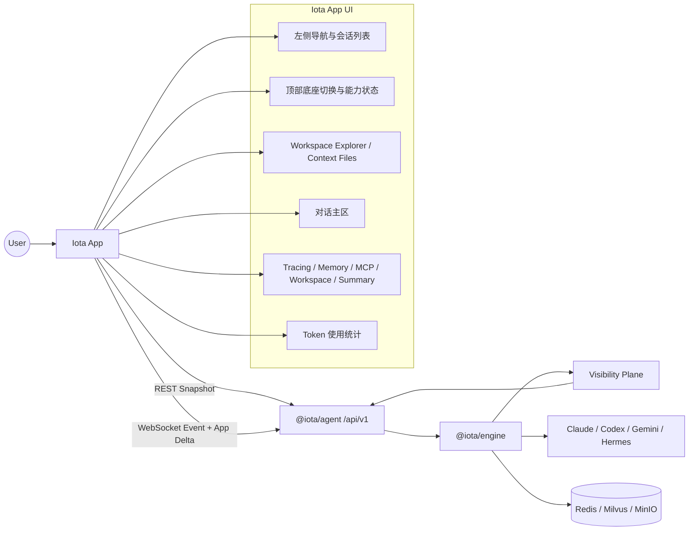

# Iota App 实现方案设计

> 日期：2026-04-25
> 状态：设计参考 / 基础已实现（更新于 2026-04-28）
> 参考文档：[4.iota_engine_design_0425.md](4.iota_engine_design_0425.md)、[iota_design.png](iota_design.png)

## 实现状态说明（2026-04-28）

**详细实现状态对比见：** `docs/requirement/IMPLEMENTATION_STATUS.md`

**核心完成度：** ~75% | **验收完成度：** ~60%

✅ **已实现核心功能：**
- 页面结构（左侧导航/顶部底座栏/对话主区/右侧面板）
- Backend capability 自适应 UI
- TanStack Query + Zustand 状态管理
- WebSocket 连接和基础消息处理
- Tracing/Memory/Context/MCP/Summary 五个 Tab
- Token 使用统计显示
- Workspace Explorer 基础视图

🔄 **部分实现：**
- Workspace Context Files 操作（前端 UI 存在，后端持久化未完全对接）
- WebSocket App Delta（基础实现，未订阅 VisibilityStore 真实增量）
- Session-level app-snapshot（基础聚合，backend capabilities 静态填充）

❌ **未实现：**
- Phase 3: Tracing drill-down/Raw visibility 调试页/MCP 完整视图/导出功能
- Phase 4: 人工审批卡片/跨会话记忆管理/Token 成本趋势
- 性能优化：虚拟列表完整应用/分页/折叠

## 1. 文档目标

本文档定义 **Iota App** 的前端实现方案。Iota App 是 Iota 面向开发者的图形化交互终端，负责展示跨底座对话、Workspace 上下文、Session Tracing、记忆可见性、MCP 工具链路、Token 使用统计和当前会话摘要。

App 只消费 `@iota/agent` 聚合后的 **App Read Model**，不直接解析 Claude Code、Codex、Gemini CLI、Hermes Agent 的原生协议。

---

## 2. 设计原则

1. **Read Model 驱动**：主界面只使用 `AppSessionSnapshot`、`AppExecutionSnapshot` 和 `AppVisibilityDelta`。
2. **Snapshot 优先**：页面初始化、刷新、断线重连后先拉取 snapshot，再接收 WebSocket delta。
3. **Delta 可丢弃**：delta 只优化实时体验，任何状态都必须能通过重新拉取 snapshot 恢复。
4. **安全默认值**：App 不展示未脱敏的 API key、Bearer token、Cookie、password 或完整 raw protocol。
5. **能力自适应**：UI 根据 `BackendStatusView.capabilities` 动态启用、置灰、降级或解释功能。
6. **底座无关 UI**：前端按统一事件和可见性模型渲染，不为单个底座写协议分支。

---

## 3. 技术栈建议

- **框架**：React 18+、TypeScript、Vite。
- **状态管理**：TanStack Query 管理 REST snapshot；Zustand 管理当前 session、WebSocket 状态、revision 和 delta 合并。
- **UI**：Tailwind CSS + shadcn/ui；图标使用 Lucide React。
- **可视化**：Recharts 用于 Token 图表；Tracing 使用自定义瀑布/步骤组件。
- **长列表性能**：TanStack Virtual 或同类虚拟列表，用于长对话、TraceSpan、NativeEventRef、EventMappingVisibility。
- **文本渲染**：Markdown 渲染 + 代码高亮；需要大文件或 diff 视图时再引入 Monaco Editor。

---

## 4. 页面结构

App 首屏按 `requirement/iota_design.png` 对齐，采用“左导航 + 会话列表 + 顶部底座栏 + 对话主区 + 右侧可见性面板 + Token 区域”的工作台布局。

### 4.1 左侧导航与会话列表

- 一级导航：对话、会话、记忆、工具、Workspace、设置。
- 最近会话列表：展示标题、更新时间、最后一条消息摘要和活跃底座。
- 新建会话：调用 `POST /api/v1/sessions`，成功后跳转到新 session。

### 4.2 顶部底座栏

- 展示 Claude Code、Codex、Gemini CLI、Hermes Agent。
- 数据来源：`GET /api/v1/status` 与 `AppSessionSnapshot.backends`。
- 状态包括 online、busy、degraded、offline、circuit_open。
- 切换底座时更新本地 active backend，并在下一次 `execute` 消息中携带 `backend`。
- 如果某底座熔断或 degraded，按钮保留但显示原因、最近错误和建议操作。

### 4.3 Workspace Explorer / Context Files

Workspace 是对话上下文的一等视图，默认放在左侧栏下半区或主区可折叠面板。

- **Workspace 状态**：展示 `workingDirectory`、最近 snapshot 时间、文件变更数量和 ignore 规则摘要。
- **Active Files**：展示当前 `ContextSegment.kind === "active_files"` 中的文件列表。
- **Context Files 操作**：支持添加、移除、固定、清空活跃文件；每次修改通过 `PUT /api/v1/sessions/:sessionId/context` 实时同步后端，避免跨终端或刷新丢失。
- **Delta 视图**：展示最近 execution 的 file_delta，区分 added、modified、deleted；支持点击查看简易的 Diff 预览。
- **上下文预算提示**：显示 active files 估算 token，并在超过预算时提示将被裁剪。

### 4.4 对话主区

- 数据来源：`AppSessionSnapshot.activeExecution.conversation` 和 `conversation_delta`。
- 支持用户消息、assistant 输出、tool/system 项。
- RuntimeEvent 的 `output` 可作为流式显示来源；最终一致状态以 snapshot 为准。
- 工具调用、审批等待、错误、熔断提示应作为对话流中的结构化卡片展示。
- 长会话使用虚拟列表，并按 execution 边界分组。

### 4.5 输入区

- 多行 prompt 输入。
- 可选择 backend、workingDirectory、approval policy 和 pending context files。
- 发送后通过 WebSocket `/api/v1/stream` 发送 `execute` 消息。
- 执行中展示 interrupt 入口，对应 `POST /api/v1/executions/:executionId/interrupt`。

### 4.6 右侧可见性面板

右侧面板包含五个主要区域：

- **Session Tracing**：展示请求处理、底座引擎、响应处理、完成，以及 approval、MCP、workspace、memory 等附加步骤。
- **记忆**：展示 longTerm、session、knowledge 三类记忆卡片（映射自底层 episodic/procedural/factual/strategic 统一类型：factual+strategic→knowledge，dialogue 来源→session，其余→longTerm），标明命中数、选中数、裁剪数。
- **MCP**：展示 MCP servers、工具调用、代理结果和穿透链路状态。
- **Workspace Context**：展示 active files、workspace summary、file delta 与上下文预算。
- **当前会话摘要**：展示消息数、总耗时、最后执行 ID 和摘要文本。

### 4.7 Token 使用统计

- 展示 input、cache、output、total。
- 展示 `confidence`：native、mixed、estimated。
- 支持按 ContextSegment 分段展示 system prompt、user prompt、conversation、injected memory、active files、workspace summary 等来源。
- 如果当前 backend 不支持 native usage，仍显示 Iota estimated，并标记为 estimated。

---

## 5. Backend Capability 自适应

App 必须以 `BackendStatusView.capabilities` 驱动功能状态，而不是硬编码底座名称。

| Capability | UI 行为 |
|---|---|
| `streaming=false` | 对话流显示为批量返回模式，隐藏逐 token/逐 chunk 动效 |
| `mcp=false` | MCP Tab 置灰，工具调用入口隐藏或提示当前底座不支持 MCP |
| `memoryVisibility=false` | Memory Tab 显示“当前底座无记忆可见性”，不显示空错误 |
| `tokenVisibility=false` | Tokens Tab 显示 estimated 模式；若连估算也无数据，则置灰 |
| `chainVisibility=false` | Tracing Detail 降级为 RuntimeEvent timeline |
| backend `busy` | 底座按钮显示忙碌，不阻止用户排队但给出提示 |
| backend `degraded` | 底座按钮显示降级，详情弹层展示 lastError |
| backend `circuit_open` | 底座按钮显示熔断中，禁止新执行，提供查看错误和重试/重置入口 |

如果后端状态缺少某字段，App 默认选择“可展示但标记 unknown”，避免把 unknown 误判为 unsupported。

---

## 6. Agent API 契约

所有 HTTP API 均位于 `/api/v1` 前缀下。

| 场景 | 方法与路径 | 用途 |
|---|---|---|
| 创建会话 | `POST /api/v1/sessions` | 创建 session，返回 `sessionId` |
| 查询会话 | `GET /api/v1/sessions/:sessionId` | 获取 workingDirectory、createdAt、updatedAt |
| 删除会话 | `DELETE /api/v1/sessions/:sessionId` | 删除 session |
| 更新会话上下文 | `PUT /api/v1/sessions/:sessionId/context` | 更新 active_files 和固定状态，持久化 pending context |
| 后端状态 | `GET /api/v1/status` | 获取各底座健康和忙碌状态 |
| 异步执行 | `POST /api/v1/execute` | 非 WebSocket 执行入口 |
| 查询执行 | `GET /api/v1/executions/:executionId` | 获取 execution record |
| 查询事件 | `GET /api/v1/executions/:executionId/events` | 获取 RuntimeEvent 列表 |
| 中断执行 | `POST /api/v1/executions/:executionId/interrupt` | 中断运行中 execution |
| 执行可见性 | `GET /api/v1/executions/:executionId/visibility` | 获取原始 visibility bundle |
| 会话可见性列表 | `GET /api/v1/sessions/:sessionId/visibility` | 获取 session 下 visibility summary |
| 执行快照 | `GET /api/v1/executions/:executionId/app-snapshot` | 获取单次执行 App Read Model |
| 会话快照 | `GET /api/v1/sessions/:sessionId/app-snapshot` | 获取整页初始状态 |

App 主界面优先使用 `app-snapshot`。`visibility/*` 原始接口只用于调试页、导出页或高级详情页。

### 6.1 大规模数据分页约定

当前 snapshot 是完整聚合视图，但 App 实现必须预留分页接口适配层：

- 对话历史优先按 `executionId` 分组懒加载；初始只渲染 active execution 和最近 N 条 conversation items。
- RuntimeEvent 使用 `GET /api/v1/executions/:executionId/events?offset=&limit=` 分页加载。
- visibility summary 使用 `GET /api/v1/sessions/:sessionId/visibility?offset=&limit=` 分页加载。
- TraceSpan、NativeEventRef、EventMappingVisibility 在前端使用虚拟列表；后续 Agent 可补充专用分页接口。

---

## 7. WebSocket 契约

连接地址：`WS /api/v1/stream`。

### 7.1 订阅会话级 App Delta

```json
{
  "type": "subscribe_app_session",
  "sessionId": "session_xxx"
}
```

服务端确认：

```json
{
  "type": "subscribed",
  "sessionId": "session_xxx"
}
```

### 7.2 订阅执行级 Visibility Delta

```json
{
  "type": "subscribe_visibility",
  "executionId": "exec_xxx"
}
```

服务端确认：

```json
{
  "type": "subscribed_visibility",
  "executionId": "exec_xxx"
}
```

### 7.3 执行任务

```json
{
  "type": "execute",
  "sessionId": "session_xxx",
  "prompt": "分析这个项目的架构",
  "backend": "claude-code",
  "workingDirectory": "/path/to/project",
  "approvals": {
    "shell": "ask",
    "fileOutside": "ask",
    "network": "ask"
  }
}
```

服务端会同时返回：

- `event`：RuntimeEvent，用于对话流快速显示。
- `app_delta`：App Read Model 增量，用于右侧面板和汇总区。
- `complete`：execution 流结束。
- `error`：WebSocket 或执行错误。

### 7.4 App Delta Envelope

```typescript
interface AppDeltaEnvelope {
  type: "app_delta";
  sessionId: string;
  revision?: number;
  delta:
    | { type: "conversation_delta"; executionId: string; item: ConversationTimelineItem }
    | { type: "trace_step_delta"; executionId: string; step: TraceStepView }
    | { type: "memory_delta"; executionId: string; memory: MemoryPanelDelta }
    | { type: "token_delta"; executionId: string; tokens: TokenStatsView }
    | { type: "summary_delta"; executionId: string; summary: SessionSummaryView };
}
```

---

## 8. 状态同步与冲突解决

Zustand 需要维护 `revisionMap: Record<sessionId, number>` 和 `executionRevisionMap: Record<executionId, number>`。

处理规则：

1. 收到无 `revision` 的 delta：按 idempotent key 合并，但标记为 weak ordering。
2. 收到 `revision <= lastRevision`：丢弃，避免重连重放造成重复。
3. 收到 `revision === lastRevision + 1`：正常合并并更新 revision。
4. 收到 `revision > lastRevision + 1`：说明中间丢包，暂停 delta 合并，重新拉取 `GET /api/v1/sessions/:sessionId/app-snapshot`。
5. WebSocket reconnect：清空 pending optimistic state，重新发送 `subscribe_app_session`，再拉取 snapshot。
6. `complete` 后：可延迟 100-300ms 拉取 execution app-snapshot，修正最后一次 token/memory/summary。

Delta 合并规则：

| Delta | 合并目标 | 规则 |
|---|---|---|
| `conversation_delta` | `conversation.items` | 按 `id` 或 `eventSequence` 去重追加 |
| `trace_step_delta` | `tracing.steps` | 按 `step.key` 更新状态和耗时 |
| `memory_delta` | `memory.tabs` | added/updated/removedIds 增量合并 |
| `token_delta` | `tokens` | 整体替换当前 execution token view |
| `summary_delta` | `summary` | 整体替换当前 execution summary |

---

## 9. 前端状态模型

### 9.1 Query 状态

TanStack Query 负责：

- `sessionSnapshot(sessionId)`：`GET /api/v1/sessions/:sessionId/app-snapshot`
- `backendStatus()`：`GET /api/v1/status`
- `executionSnapshot(executionId)`：`GET /api/v1/executions/:executionId/app-snapshot`
- `executionEvents(executionId, offset, limit)`：分页读取 RuntimeEvent
- `sessionVisibility(sessionId, offset, limit)`：分页读取 visibility summary

### 9.2 Realtime 状态

Zustand 负责：

- 当前 `sessionId`
- 当前 active backend
- WebSocket 连接状态
- 最新 revision map
- 正在运行的 execution 列表
- pending context files
- optimistic conversation item
- backend capability UI state

### 9.3 Workspace 状态

Workspace 状态包含：

```typescript
interface WorkspaceUiState {
  workingDirectory: string;
  activeFiles: Array<{ path: string; estimatedTokens?: number; pinned?: boolean }>;
  pendingFiles: string[];
  lastSnapshotAt?: number;
  lastDeltaCount?: number;
  budgetUsedRatio?: number;
}
```

---

## 10. Tracing 深度交互

Tracing Tab 分为 Overview、Details、Performance、Raw Mapping 四层。

### 10.1 Overview

- 展示 request、base_engine、response、complete 四阶段。
- 附加展示 approval、mcp、workspace、memory 步骤。
- 支持点击任一步骤进入 Details。

### 10.2 Details

点击 TraceSpan 后展示：

- `TraceSpan.kind`、status、duration、attributes。
- 关联的 `NativeEventRef` 数量和方向。
- 关联的 `EventMappingVisibility`，包括 runtimeEventType、mappingRule、lossy、droppedFields。
- 如果 span 与 MCP 或 approval 相关，显示 tool/server/requestId。

### 10.3 Raw Mapping

Raw Mapping 用于回答“为什么原生事件被解析错了”：

- 列表展示 NativeEventRef preview、rawHash、parsedAs、runtimeSequence。
- 点击一条映射展示 EventMappingVisibility。
- `lossy=true`、`parse_error_to_text`、`ignored` 使用醒目标签。
- 原生 JSON 只展示脱敏 preview；不提供绕过 redaction 的原文查看入口。

### 10.4 Performance

- 展示 parse loss ratio、memory hit ratio、context budget used ratio。
- TraceSpan 数量超过 200 时启用虚拟列表。
- NativeEventRef 和 EventMappingVisibility 默认只渲染最近 100 条，滚动懒加载。

---

## 11. MCP 可视化

MCP 是独立的可见性视图，不只作为普通 tool_call 卡片展示。

### 11.1 MCP Servers

- 展示当前配置的 MCP servers、连接状态、可用工具数量。
- 状态包括 connected、disconnected、degraded、unknown。
- 如果 backend `mcp=false`，MCP Tab 置灰并解释原因。

### 11.2 MCP Tool Calls

- 展示 tool name、server name、arguments 摘要、结果状态、耗时。
- 显示是否经过 Iota MCP Router proxy。
- 显示 approval 状态：not_required、waiting、approved、denied。

### 11.3 MCP Trace

- MCP 调用应在 Tracing Details 中与 `mcp.proxy` span 关联。
- tool_result 返回后，卡片显示 success/error 和脱敏输出摘要。
- MCP 失败时提供 server、tool、error message 和重试建议。

---

## 12. Redaction 展示策略

App 必须清晰表达内容已脱敏，但不能提供未授权原文查看。

### 12.1 占位符规范

| 后端值 | UI 展示 |
|---|---|
| `[REDACTED]` | `SECRET REDACTED` 标签 |
| redaction.applied=true | 在卡片角标显示 `Redacted` |
| redaction.fields 非空 | 展示字段名列表，例如 `OPENAI_API_KEY` |
| redaction.patterns 非空 | 调试页展示命中的模式名或摘要 |
| contentHashBefore/After | 只在调试页显示 hash，不显示原文 |

### 12.2 用户交互

- 主界面只显示脱敏后的 preview。
- 调试页允许展开 redaction summary。
- 不提供“查看原文”按钮；如未来支持安全环境查看原文，必须由后端授权并审计。
- 导出 snapshot/visibility 时保留 redaction summary。

---

## 13. 审批交互

当前 Agent WebSocket 尚未提供独立的 `approval_response` 入站消息。App 必须按现有 RuntimeEvent 渲染审批状态：

1. 收到 `state: waiting_approval` 时，在对话流和顶部状态显示等待审批。
2. 收到 `extension` 且 `data.name === "approval_request"` 时，渲染审批卡片。
3. 当前审批决策由 Engine 的 `ApprovalHook` 处理；App 手动审批通过 WebSocket 发送 `approval_decision` 消息：

```json
{
  "type": "approval_decision",
  "executionId": "exec_xxx",
  "requestId": "approval_xxx",
  "approved": true
}
```

App 在发送决策后，乐观更新 UI 状态为已处理，并等待后端的 RuntimeEvent 或 Delta 确认最终结果。

---

## 14. 数据结构映射

前端类型应从 engine 的 App Read Model 镜像定义，保持字段名一致。

```typescript
interface AppSessionSnapshot {
  session: {
    id: string;
    title?: string;
    activeBackend: BackendName;
    workingDirectory: string;
    createdAt: number;
    updatedAt: number;
  };
  backends: BackendStatusView[];
  conversations: ConversationListItem[];
  activeExecution?: AppExecutionSnapshot;
  memory: MemoryPanelView;
  tokens: TokenStatsView;
  tracing: SessionTracingView;
  summary: SessionSummaryView;
}

interface AppExecutionSnapshot {
  sessionId: string;
  executionId: string;
  backend: BackendName;
  conversation: ConversationTimelineView;
  tracing: SessionTracingView;
  memory: MemoryPanelView;
  tokens: TokenStatsView;
  summary: SessionSummaryView;
}
```

App 不应在主界面直接展示 `ContextManifest`、`MemoryVisibilityRecord`、`TokenLedger`、`LinkVisibilityRecord` 原始对象。调试页可读取原始接口，但必须标明数据已脱敏且可能受 visibility policy 裁剪。

---

## 15. 降级与错误处理

- `app-snapshot` 返回 404：显示 session 不存在或已删除。
- visibility 缺失：显示空 tracing、空 memory、estimated token，不阻断对话。
- WebSocket 断开：显示离线状态，自动重连；重连后重新订阅并拉取 session snapshot。
- `app_delta` 丢失：以 snapshot 为准重建页面。
- 后端 degraded：底座按钮显示降级，不隐藏底座。
- 后端 circuit open：底座按钮显示熔断中，禁止新执行，提供错误详情和重试/重置入口。
- 执行失败：对话流显示错误卡片，右侧 summary 记录失败状态。

### 15.1 熔断状态 UI

当 backend 进入 circuit open：

- 顶部底座按钮显示红色 `Circuit Open` 状态。
- tooltip 展示 lastError、失败次数和最近失败时间。
- 输入区禁用该 backend 的 execute。
- 若后端提供 reset API，显示 Reset；未提供时显示“等待冷却或切换底座”。

---

## 16. 性能策略

### 16.1 对话时间线

- 初始 snapshot 只渲染最近 N 条消息，历史消息向上滚动懒加载。
- 每个 execution 作为分组边界，避免一次性重排整个长会话。
- Markdown 渲染结果缓存到 message id。

### 16.2 右侧可见性面板

- TraceSpan、NativeEventRef、EventMappingVisibility 使用虚拟列表。
- Memory cards 超过 100 条时按 tab 分页。
- Token 分段超过 50 条时默认折叠低占比 segment。

### 16.3 Snapshot 与 Delta

- Snapshot 是事实源，但不应每个 delta 后立即重拉。
- `complete` 后进行一次延迟重拉，修正最终状态。
- 网络抖动、revision 断档、解析失败时才强制重拉。

---

## 17. 安全要求

1. App 不展示 API key、auth token、Bearer token、Cookie、password。
2. raw protocol 默认不展示；只有调试模式可展示脱敏 preview。
3. full visibility 也必须经过后端脱敏结果，不允许前端绕过 Agent 直接读本地 visibility 文件。
4. 审批 payload 中的命令、路径、环境变量需要区分展示：命令和路径可展示，secret-like 字段只展示 redacted。
5. 导出 snapshot 或 visibility 时必须保留 redaction summary，方便审计。

---

## 18. 实现路径

### 18.1 Phase 1：Snapshot 驱动首屏

- 初始化 `iota-app` React + TypeScript + Vite 项目。
- 实现 `POST /api/v1/sessions`、`GET /api/v1/sessions/:sessionId/app-snapshot`。
- 按 `requirement/iota_design.png` 搭建首屏布局。
- 渲染底座状态、会话列表、对话时间线、右侧 tracing/memory/summary、Token 统计。
- 实现 Workspace Explorer / Context Files 基础视图。
- 实现 visibility 缺失时的降级视图。

### 18.2 Phase 2：WebSocket 执行与实时 Delta

- 接入 `WS /api/v1/stream`。
- 发送 `subscribe_app_session` 和 `execute`。
- 合并 `event` 到对话流，合并 `app_delta` 到右侧面板。
- 实现 revision 去重、断线重连、snapshot 重拉。
- 支持 interrupt。

### 18.3 Phase 3：可见性详情、MCP 与调试页

- 增加 execution 详情页，读取 `GET /api/v1/executions/:executionId/app-snapshot`。
- 增加 raw visibility 调试页，读取 `visibility/memory`、`visibility/tokens`、`visibility/chain`。
- 实现 Tracing span drill-down、NativeEventRef 和 EventMappingVisibility 关联展示。
- 实现 MCP Servers、MCP Tool Calls 和 MCP Trace 视图。
- 支持导出脱敏后的 snapshot/visibility。

### 18.4 Phase 4：人工审批、高级记忆和 Workspace 管理

- 在 Agent 支持入站审批决策后，实现 App 手动审批卡片。
- 增加跨会话记忆浏览、搜索、禁用、固定。
- 增加 active files 后端持久化接口后，实现完整 Context Files 管理。
- 增加 Token 成本趋势和 backend 对比。

---

## 19. 验收标准

### 19.1 功能验收

- App 首屏可通过 `GET /api/v1/sessions/:sessionId/app-snapshot` 一次性恢复。
- 用户可通过 WebSocket 执行 prompt，并看到流式对话输出。
- 右侧 tracing、memory、MCP、workspace、tokens、summary 可由 snapshot 和 delta 驱动更新。
- 底座状态、capabilities 和 active backend 可正确展示并驱动 UI 降级。
- Workspace Explorer 能展示 workingDirectory、active files、file delta 和上下文预算。
- WebSocket 断线重连后页面状态可恢复。

### 19.2 契约验收

- 所有 REST 路径使用 `/api/v1` 前缀。
- 前端不依赖底座原生协议字段。
- `app_delta` 按 `revision` 幂等合并，revision 断档会触发 snapshot 重拉。
- visibility 缺失时返回降级 UI，不出现空白页或 500 式前端错误。

### 19.3 安全验收

- UI、日志、导出文件中不得出现 API key、Bearer token、Cookie、password。
- raw protocol 只显示脱敏 preview。
- RedactionSummary 可解释但不泄漏原文。
- 审批卡片不得展示 secret-like 环境变量值。

### 19.4 性能验收

- 1000 条 conversation item 下主界面滚动保持流畅。
- 1000 条 TraceSpan / NativeEventRef 下详情页使用虚拟列表。
- WebSocket 重连和 snapshot 重拉不会造成重复消息。

---

## 20. 架构示意图



---

## 21. 结论

Iota App 的关键不是复刻底座协议，而是把 Engine 与 Agent 已聚合的 App Read Model 转化为稳定、可恢复、可审计的开发者工作台。实现上应先保证 snapshot 完整可用，再用 WebSocket delta 提升实时体验，随后补齐 Workspace、MCP、Tracing Drill-down、Redaction 展示和能力降级，最后扩展调试、人工审批和高级上下文管理。
